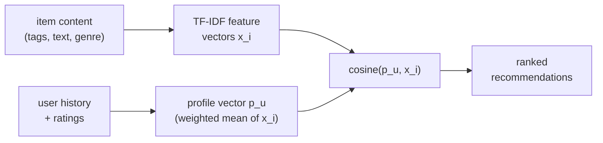

**Content-based filtering** recommends items by their own attributes: if you
liked three space operas, it offers a fourth, because the fourth *looks like*
the three in feature space. It never consults other users, which is exactly
what makes it the natural answer to the new-item cold start that breaks
collaborative filtering: a brand-new item with zero ratings still has a genre,
a description, and tags, so it can be scored from day one.

## The setup

Each item $i$ carries a **feature vector** $\mathbf{x}_i \in \mathbb{R}^d$
built from its content: one-hot genres, tag indicators, or a text embedding of
its description. A user $u$ is summarized by a **profile vector**
$\mathbf{p}_u \in \mathbb{R}^d$ in the *same* space, built from the items they
have engaged with. The predicted affinity of user $u$ for item $i$ is the
similarity of the two vectors, almost always cosine:

$$
\hat s_{ui} = \cos(\mathbf{p}_u, \mathbf{x}_i) = \frac{\mathbf{p}_u^\top \mathbf{x}_i}{\lVert \mathbf{p}_u\rVert\,\lVert \mathbf{x}_i\rVert}.
$$

Recommending for $u$ means ranking unseen items by $\hat s_{ui}$ and returning
the top few. Everything reduces to two questions: how to build $\mathbf{x}_i$,
and how to build $\mathbf{p}_u$.

## Building item features: TF-IDF

For text-like content (tags, descriptions, genres treated as a bag of terms),
the standard weighting is **TF-IDF**, which scores a term high when it is
frequent in this item but rare across the catalog<FN n="1" />. For term $t$ in
item $i$ drawn from a catalog of $N$ items,

$$
\text{tfidf}(t, i) = \underbrace{f_{t,i}}_{\text{term frequency}} \cdot \underbrace{\log \frac{N}{n_t}}_{\text{inverse document frequency}},
$$

where $f_{t,i}$ counts term $t$ in item $i$ and $n_t$ is the number of items
containing $t$. The IDF factor $\log(N/n_t)$ is the point: a tag like "drama"
that sits on half the catalog ($n_t = N/2$) gets weight $\log 2 \approx 0.69$,
while a rare tag like "cyberpunk" on 1% of items gets $\log 100 \approx 4.6$.
Common tags are nearly free; rare, discriminative tags dominate the vector.

## Building the user profile

The profile is the user's taste expressed in item-feature coordinates. The
simplest construction that works is the rating-weighted, mean-centered average
of the items the user rated:

$$
\mathbf{p}_u = \frac{\sum_{i \in I_u} (R_{ui} - \bar R_u)\,\mathbf{x}_i}{\sum_{i \in I_u} |R_{ui} - \bar R_u|},
$$

where $I_u$ is the set of items $u$ rated, $R_{ui}$ is the rating, and
$\bar R_u$ is $u$'s mean rating. Centering by $\bar R_u$ is what lets a
below-average rating push the profile *away* from an item's features: rating a
horror film a 2 when you average 4 subtracts horror-ness from your profile,
rather than adding a little of it. With implicit feedback (clicks, no ratings),
the centering term drops and $\mathbf{p}_u$ is just the average of engaged-item
vectors.



## A concrete contrast

Take five films over three genre tags (sci-fi, romance, action) with binary
feature vectors. A user rates two sci-fi-action films highly and one romance
film poorly. After centering, the profile leans positive on sci-fi and action
and negative on romance. Scoring an unseen sci-fi-action film gives a high
cosine; an unseen pure-romance film gives a low or negative one. The two unseen
films differ only in their genre coordinates, so the profile, not the rest of
the catalog, explains the gap. That is the defining trait of content-based
filtering: a fresh item with no ratings is still scored correctly, because it
is scored from its features.

The flip side is the **new-user** cold start, which content-based filtering
does *not* solve. With no history, $\mathbf{p}_u$ is undefined, and the method
has nothing to rank by. Its other ceiling is **over-specialization**: the
profile only points where the user has already been, so it rarely surfaces a
genuinely novel item, the diversity problem a later lesson takes up<FN n="2" />.

## Check it on arrays

```python
import numpy as np

# Five films over 3 genre tags: [sci-fi, romance, action]
X = np.array([
    [1, 0, 1],   # 0: sci-fi action
    [1, 0, 1],   # 1: sci-fi action
    [0, 1, 0],   # 2: romance
    [1, 0, 0],   # 3: sci-fi
    [0, 1, 1],   # 4: romance action (unseen)
], dtype=float)

# User rated films 0,1 high and film 2 low (1-5 scale)
rated = np.array([0, 1, 2])
R = np.array([5.0, 4.0, 2.0])
mean_u = R.mean()

# Mean-centered, weight-normalized profile
w = R - mean_u
p = (w[:, None] * X[rated]).sum(0) / np.abs(w).sum()

def cosine(a, b):
    den = np.linalg.norm(a) * np.linalg.norm(b)
    return float(a @ b / den) if den > 0 else 0.0

scores = np.array([cosine(p, X[i]) for i in range(len(X))])
unseen = [3, 4]
ranking = sorted(unseen, key=lambda i: -scores[i])

print("profile:", np.round(p, 3))
print("scores :", np.round(scores, 3))
print("unseen ranked:", ranking)

# The sci-fi item (3) outranks the romance-action item (4) for this user
assert scores[3] > scores[4]
```

The profile is positive on sci-fi/action and negative on romance, so among the
two unseen films the sci-fi one scores higher, with no reference to any other
user.

## Exercises

**Exercise 1.** A catalog has $N = 1000$ items. The tag "documentary" appears
on $n_t = 250$ of them and the tag "claymation" on $n_t = 5$. Compute the IDF
weight $\log(N/n_t)$ (natural log) for each, and state which tag contributes
more to distinguishing two items that share it.

<details>
<summary>Solution</summary>

**Step 1.** IDF for "documentary": $\log(1000/250) = \log 4 \approx 1.386$.

**Step 2.** IDF for "claymation": $\log(1000/5) = \log 200 \approx 5.298$.

**Step 3.** "claymation" carries the larger weight ($5.298$ vs $1.386$). Sharing
a rare tag is strong evidence two items are alike, while sharing a common tag
like "documentary" is weak evidence because a quarter of the catalog shares it.

</details>

**Exercise 2.** A user rates three items with feature vectors
$\mathbf{x}_1 = (1,0)$, $\mathbf{x}_2 = (0,1)$, $\mathbf{x}_3 = (1,1)$ and
ratings $R = (5, 1, 4)$, so $\bar R_u = 3.\overline{3}$. Compute the
mean-centered, weight-normalized profile $\mathbf{p}_u$.

<details>
<summary>Solution</summary>

**Step 1.** Center the ratings: $w = (5 - 3.333,\ 1 - 3.333,\ 4 - 3.333) =
(1.667,\ -2.333,\ 0.667)$.

**Step 2.** Weighted sum of feature vectors:
$1.667(1,0) + (-2.333)(0,1) + 0.667(1,1) = (1.667 + 0.667,\ -2.333 + 0.667) =
(2.334,\ -1.666)$.

**Step 3.** Normalize by $\sum |w| = 1.667 + 2.333 + 0.667 = 4.667$:

$$
\mathbf{p}_u = (2.334,\ -1.666)/4.667 \approx (0.500,\ -0.357).
$$

The first feature is liked, the second disliked, which matches the high rating
on the $(1,0)$ item and the low rating on the $(0,1)$ item.

</details>

**Exercise 3 (code).** Build a $6 \times 4$ binary item-feature matrix and a
user who likes items sharing feature 0. Construct an implicit-feedback profile
(plain mean of engaged-item vectors, no centering) and verify that an unseen
item carrying feature 0 outscores an unseen item without it.

<details>
<summary>Solution</summary>

```python
import numpy as np

X = np.array([
    [1, 1, 0, 0],   # 0 engaged
    [1, 0, 1, 0],   # 1 engaged
    [1, 0, 0, 1],   # 2 engaged
    [0, 1, 1, 0],   # 3 unseen, no feature 0
    [1, 0, 0, 0],   # 4 unseen, has feature 0
    [0, 1, 0, 1],   # 5 unseen, no feature 0
], dtype=float)

engaged = [0, 1, 2]
p = X[engaged].mean(0)            # implicit profile: no centering

def cosine(a, b):
    den = np.linalg.norm(a) * np.linalg.norm(b)
    return float(a @ b / den) if den > 0 else 0.0

s4 = cosine(p, X[4])              # has feature 0
s3 = cosine(p, X[3])              # lacks feature 0
assert s4 > s3
print(f"feature-0 item: {s4:.3f}   no-feature-0 item: {s3:.3f}")
```

The profile concentrates on feature 0 (present in every engaged item), so the
unseen item that carries it scores higher.

</details>

The next lesson sharpens the similarity step itself, comparing cosine, Pearson,
and Jaccard and turning them into the neighborhoods collaborative filtering
relies on.

<Footnotes>
  <FNItem n="1">**Salton, G., & Buckley, C.** (1988). "Term-weighting approaches in automatic text retrieval". *Information Processing & Management*, 24(5), 513-523. [doi:10.1016/0306-4573(88)90021-0](https://doi.org/10.1016/0306-4573(88)90021-0). The origin of TF-IDF weighting.</FNItem>
  <FNItem n="2">**Lops, P., de Gemmis, M., & Semeraro, G.** (2011). "Content-based recommender systems: state of the art and trends". In *Recommender Systems Handbook*, Springer, 73-105. [doi:10.1007/978-0-387-85820-3_3](https://doi.org/10.1007/978-0-387-85820-3_3). Profiles, item representations, and the over-specialization limit.</FNItem>
</Footnotes>
