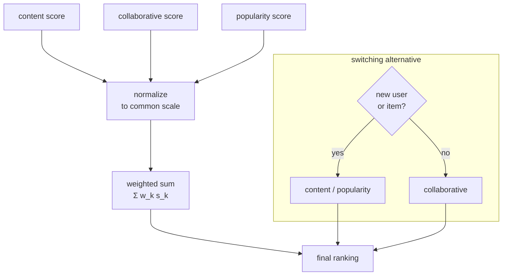

Content-based filtering scores fresh items but never escapes a user's existing
taste; collaborative filtering personalizes from the crowd but goes blind on
new items; popularity is robust but ignores the individual. Each fails exactly
where another succeeds, which is the standard argument for a **hybrid**: combine
the signals so the system has a fallback whenever any one of them is weak. The
question is how to combine them, and Burke's taxonomy names the practical
options<FN n="1" />.

## Weighted hybrids

The simplest combiner scores each candidate as a weighted sum of the component
scores. With a content score $s^{\text{cb}}_{ui}$, a collaborative score
$s^{\text{cf}}_{ui}$, and a popularity score $s^{\text{pop}}_{i}$,

$$
s_{ui} = w_1\,\tilde s^{\text{cb}}_{ui} + w_2\,\tilde s^{\text{cf}}_{ui} + w_3\,\tilde s^{\text{pop}}_{i},
\qquad w_1 + w_2 + w_3 = 1.
$$

The tildes are not decoration: the components live on different scales (a cosine
in $[-1, 1]$, a predicted rating in $[1, 5]$, a count in the thousands), so each
must be **normalized to a common range** before the weighted sum means anything.
Min-max scaling per component, or converting each to a rank or a z-score, all
work; skipping this step lets whichever component has the largest raw numbers
silently dominate. The weights $w$ can be set by hand, tuned on a validation set,
or learned by regressing observed engagement on the component scores, which is
the bridge to the learning-to-rank models of a later discipline.

## Switching hybrids

A weighted blend always mixes; a **switching** hybrid instead *picks* one
component per case based on a confidence rule. The canonical rule targets cold
start directly:

- If the user is new (history below a threshold), use popularity or content.
- If the item is new (too few ratings for a stable neighborhood), use content.
- Otherwise, use collaborative filtering, the strongest signal when its data is
  present.

Switching avoids contaminating a confident collaborative prediction with a noisy
content score, at the cost of a hard, hand-specified decision boundary. It is the
right default when the components are reliable in clearly separable regimes.

## Feature augmentation and cascade

Two more patterns appear constantly in production. **Feature augmentation** runs
one recommender to produce a feature that feeds another: content embeddings
become extra columns in the collaborative model, so an item with no ratings
still has informative inputs. **Cascade** is a staged refinement: a cheap
component produces a coarse ranking, and an expensive one re-ranks only its top
candidates, breaking ties without scoring the whole catalog. Cascade is the
conceptual seed of the retrieval-then-rank funnel that organizes every
large-scale system.



## Why the blend can beat every part

A blend is not a compromise that lands between its components; it can beat all of
them, because the components make *uncorrelated* errors. When the content score
is wrong about an item the user will actually like, the collaborative score is
often right, and vice versa. Averaging two unbiased, weakly-correlated estimates
cuts variance: this is the same mechanism that makes ensembles work<FN n="2" />. The blend
only helps to the extent the components disagree, so combining two highly
correlated recommenders buys little.

## Check it on arrays

```python
import numpy as np

rng = np.random.default_rng(0)
n_items = 200

# Hidden ground-truth affinity we are trying to rank by
true = rng.normal(size=n_items)

# Two weak, partially-independent component scores (noisy views of `true`)
cb = true + rng.normal(scale=1.2, size=n_items)     # content view
cf = true + rng.normal(scale=1.2, size=n_items)     # collaborative view

def minmax(x):
    return (x - x.min()) / (x.max() - x.min() + 1e-12)

cb_n, cf_n = minmax(cb), minmax(cf)
blend = 0.5 * cb_n + 0.5 * cf_n

def rank_corr(a, b):
    ra, rb = np.argsort(np.argsort(a)), np.argsort(np.argsort(b))
    return np.corrcoef(ra, rb)[0, 1]

c_cb = rank_corr(cb_n, true)
c_cf = rank_corr(cf_n, true)
c_bl = rank_corr(blend, true)

print(f"content : {c_cb:.3f}")
print(f"collab  : {c_cf:.3f}")
print(f"blend   : {c_bl:.3f}")
assert c_bl > max(c_cb, c_cf)     # blend beats both components
```

Each component is a noisy view of the same hidden preference; averaging their
normalized scores cancels independent noise, so the blend ranks closer to the
truth than either component alone.

## Exercises

**Exercise 1.** A content score for an item is a cosine of $0.6$ and its
collaborative score is a predicted rating of $4.5$ on a $1$-to-$5$ scale.
Min-max ranges are: content $[-1, 1]$, collaborative $[1, 5]$. Normalize each to
$[0,1]$ and compute the blended score with weights $w_{\text{cb}} = 0.3$,
$w_{\text{cf}} = 0.7$.

<details>
<summary>Solution</summary>

**Step 1.** Content: $\tilde s = \frac{0.6 - (-1)}{1 - (-1)} = \frac{1.6}{2} = 0.8$.

**Step 2.** Collaborative: $\tilde s = \frac{4.5 - 1}{5 - 1} = \frac{3.5}{4} = 0.875$.

**Step 3.** Blend: $0.3 \cdot 0.8 + 0.7 \cdot 0.875 = 0.24 + 0.6125 = 0.8525$.

Without normalization the raw collaborative value ($4.5$) would have swamped the
raw cosine ($0.6$); on the common $[0,1]$ scale both contribute in proportion to
their weights.

</details>

**Exercise 2.** Write the switching rule for a user with $40$ ratings requesting
a recommendation among items, one of which has only $2$ ratings. Which component
scores that item, and which would score a mainstream item with $5000$ ratings?

<details>
<summary>Solution</summary>

**Step 1.** The user is well-established ($40$ ratings), so user cold start does
not apply.

**Step 2.** The $2$-rating item triggers item cold start: its collaborative
neighborhood is too thin to trust, so the switching rule scores it with
**content** features.

**Step 3.** The $5000$-rating item has a stable neighborhood, so the rule scores
it with **collaborative filtering**, the stronger signal when its data is
present. The same user can thus be served by two different components within one
ranked list.

</details>

**Exercise 3 (code).** Construct two component scores that are *highly
correlated* views of the same truth (small added noise, same seed structure) and
show that, unlike the weakly-correlated case, their equal-weight blend barely
improves on the better component.

<details>
<summary>Solution</summary>

```python
import numpy as np

rng = np.random.default_rng(1)
n = 300
true = rng.normal(size=n)
shared = rng.normal(scale=1.0, size=n)        # shared noise both see

cb = true + shared + rng.normal(scale=0.1, size=n)   # nearly identical
cf = true + shared + rng.normal(scale=0.1, size=n)

def minmax(x): return (x - x.min()) / (x.max() - x.min() + 1e-12)
def rank_corr(a, b):
    ra, rb = np.argsort(np.argsort(a)), np.argsort(np.argsort(b))
    return np.corrcoef(ra, rb)[0, 1]

cb_n, cf_n = minmax(cb), minmax(cf)
blend = 0.5 * cb_n + 0.5 * cf_n
gain = rank_corr(blend, true) - max(rank_corr(cb_n, true), rank_corr(cf_n, true))
assert gain < 0.02                            # negligible improvement
print(f"blend gain over best component: {gain:.4f}")
```

The components share their noise, so averaging cannot cancel it and the blend
adds almost nothing. Hybrids pay off in proportion to component independence.

</details>

The next lesson confronts the case all of these components struggle with at
once, the cold start, and the exploration strategies that bootstrap a new user
or item.

<Footnotes>
  <FNItem n="1">**Burke, R.** (2002). "Hybrid recommender systems: survey and experiments". *User Modeling and User-Adapted Interaction*, 12(4), 331-370. [doi:10.1023/A:1021240730564](https://doi.org/10.1023/A:1021240730564). The taxonomy of weighted, switching, cascade, and feature-augmentation hybrids.</FNItem>
  <FNItem n="2">**Aggarwal, C. C.** (2016). *Recommender Systems: The Textbook*, Ch. 6. Springer. [doi:10.1007/978-3-319-29659-3](https://doi.org/10.1007/978-3-319-29659-3). Ensemble and hybrid designs and when they outperform their components.</FNItem>
</Footnotes>
