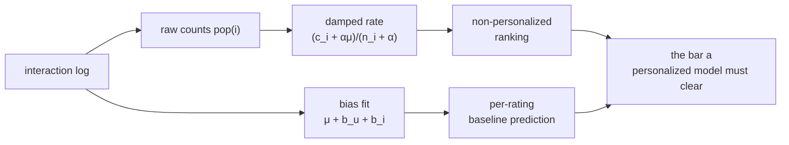

Before any model earns its complexity it has to beat a baseline, and in
recommendation the baselines are unusually hard to beat. Recommending the most
popular items to everyone ignores personalization entirely and still captures a
large share of clicks, because popularity is not noise: it is the aggregate of
everyone else's revealed preference. This lesson builds the two baselines, the
popularity ranker and the bias predictor, and shows why a damping correction
keeps them honest.

## Most-popular, and why it works

The non-personalized baseline ranks every item by a popularity count and serves
the same top list to all users:

$$
\text{pop}(i) = \big|\{\,u : u \text{ interacted with } i\,\}\big|,
$$

then recommend $\arg\max_i \text{pop}(i)$ over items the user has not seen. It
has no parameters and no per-user state. It is strong because interaction counts
concentrate: in most catalogs a small head of items absorbs the bulk of
engagement (the long-tail / power-law shape), so guessing from the head is
right more often than chance would suggest. Any personalized model that cannot
clear this bar is adding cost for nothing.

## The raw-count trap and damping

Ranking by raw counts breaks on thin evidence in the same way Pearson broke on
two co-ratings. An item shown ten times with eight clicks has an empirical rate
of $0.8$; an item shown ten thousand times with six thousand clicks has rate
$0.6$. Raw rate ranks the first above the second, even though the second's rate
is far better supported. The fix is to shrink each item's rate toward the global
mean in proportion to how little data backs it:

$$
\hat r_i = \frac{c_i + \alpha\,\mu}{n_i + \alpha},
$$

where $n_i$ is the number of impressions of item $i$, $c_i$ its clicks,
$\mu = \frac{\sum_i c_i}{\sum_i n_i}$ the global click rate, and $\alpha$ a
pseudo-count controlling the strength of the prior. This is the posterior mean
of a Beta-Bernoulli model: $\alpha$ acts like $\alpha$ prior impressions all at
the global average<FN n="1" />. A new item with $n_i = 0$ sits exactly at
$\mu$; an item with $n_i \gg \alpha$ keeps its own empirical rate. The same idea
gives a **recency** baseline when you weight each interaction by an exponential
time decay $e^{-\lambda \Delta t}$ before counting, so trending items rise and
stale ones fall.

## The bias baseline for ratings

For explicit ratings the analogous baseline is the **bias predictor**, which
explains a rating as a global average plus a per-user and per-item offset and
nothing else<FN n="2" />:

$$
\hat R_{ui} = \mu + b_u + b_i,
$$

where $\mu$ is the global mean rating, $b_u$ is how much user $u$ rates above or
below $\mu$ on average (the generous-vs-harsh offset), and $b_i$ is how much
item $i$ is rated above or below $\mu$ (its baseline quality). The offsets are
fit by least squares with regularization,

$$
\min_{b}\ \sum_{(u,i)} \big(R_{ui} - \mu - b_u - b_i\big)^2 + \lambda\Big(\sum_u b_u^2 + \sum_i b_i^2\Big),
$$

the $\lambda$ term shrinking the offset of any user or item with few ratings
toward zero. This three-number model is the baseline that matrix factorization
adds latent interaction terms *on top of*: in the Netflix Prize era the bias
baseline alone closed a large fraction of the gap to far more complex models,
which is why every serious system fits it first.



## Check it on arrays

```python
import numpy as np

# Two items: A is thin (10 impressions), B is well-supported (10k impressions)
mu = 0.5                                # global click rate prior
items = {"A": (8, 10), "B": (6000, 10000)}   # (clicks, impressions)

def damped_rate(c, n, mu, alpha=100):
    return (c + alpha * mu) / (n + alpha)

raw = {k: c / n for k, (c, n) in items.items()}
damp = {k: damped_rate(c, n, mu) for k, (c, n) in items.items()}

print("raw   :", {k: round(v, 3) for k, v in raw.items()})
print("damped:", {k: round(v, 3) for k, v in damp.items()})

# Raw ranks the thin item first; damping corrects the order
assert raw["A"] > raw["B"]
assert damp["B"] > damp["A"]

# Bias baseline on a tiny rating table
R = np.array([[5, 4, 0],
              [3, 0, 2],
              [0, 5, 4]], dtype=float)
mask = R > 0
g = R[mask].mean()                      # global mean over observed
bu = np.array([(R[u, mask[u]] - g).mean() for u in range(3)])   # user offsets
bi = np.array([(R[mask[:, i], i] - g).mean() for i in range(3)]) # item offsets
pred = g + bu[1] + bi[2]                # predict the held-out cell (1,2)
print(f"bias baseline predicts R[1,2] ~ {pred:.2f} (true 2)")
```

Damping flips the order so the well-supported item outranks the lucky thin one,
and the bias baseline reconstructs a missing rating from three offsets with no
interaction term at all.

## Exercises

**Exercise 1.** An item has $c_i = 3$ clicks over $n_i = 4$ impressions; the
global rate is $\mu = 0.2$. Compute the damped rate with pseudo-count
$\alpha = 20$, and compare it to the raw rate $3/4$.

<details>
<summary>Solution</summary>

**Step 1.** Raw rate: $3/4 = 0.75$.

**Step 2.** Damped: $\hat r_i = \frac{3 + 20 \cdot 0.2}{4 + 20} = \frac{3 + 4}{24}
= \frac{7}{24} \approx 0.292$.

**Step 3.** With only four impressions the prior ($\alpha = 20$ pseudo-impressions
at $0.2$) dominates, pulling the estimate from $0.75$ down near $0.29$. The item
must accumulate impressions comparable to $\alpha$ before its own rate is
trusted.

</details>

**Exercise 2.** In the bias model $\hat R_{ui} = \mu + b_u + b_i$ with $\mu = 3.5$,
a user has $b_u = -0.5$ and an item has $b_i = +1.0$. Predict the rating, and say
which single number you would change to encode "this user is unusually generous".

<details>
<summary>Solution</summary>

**Step 1.** $\hat R_{ui} = 3.5 - 0.5 + 1.0 = 4.0$.

**Step 2.** A generous user rates above average regardless of item, which is
exactly what a positive user offset $b_u$ encodes. Raising $b_u$ from $-0.5$
toward a positive value shifts all of that user's predictions up. The item
offset $b_i$ and global $\mu$ are shared across users and would not isolate the
one user's generosity.

</details>

**Exercise 3 (code).** Simulate 500 items with uniform true click rates, where
most items have very few impressions and a minority are well-observed. Show that
the top-10 items by *raw* click rate have a lower average true rate than the
top-10 by *damped* rate, because raw rate over-ranks lucky thin items.

<details>
<summary>Solution</summary>

```python
import numpy as np

rng = np.random.default_rng(0)
m = 500
true_rate = rng.uniform(0, 1, m)
n = rng.integers(1, 15, m)                   # most items: thin evidence
thick = rng.random(m) < 0.15                 # 15% well-observed
n[thick] = rng.integers(200, 2000, thick.sum())
clicks = rng.binomial(n, true_rate)

mu = clicks.sum() / n.sum()
raw = clicks / n
damp = (clicks + 30 * mu) / (n + 30)

K = 10
raw_top = true_rate[np.argsort(-raw)[:K]].mean()
damp_top = true_rate[np.argsort(-damp)[:K]].mean()

assert damp_top > raw_top
print(f"avg true rate of top-{K}:  raw {raw_top:.3f}   damped {damp_top:.3f}")
```

The raw top-10 is full of thin items that happened to convert on their handful
of impressions (an empirical rate near $1$ on $n = 2$), whose true rates are only
average. Damping pulls those unsupported rates back toward $\mu$, so its top-10
keeps genuinely high-rate, well-observed items.

</details>

The next lesson combines these non-personalized signals with the content and
collaborative scores into a single hybrid recommender.

<Footnotes>
  <FNItem n="1">**Gelman, A., Carlin, J. B., Stern, H. S., & Rubin, D. B.** (2013). *Bayesian Data Analysis* (3rd ed.), Ch. 2. CRC Press. [doi:10.1201/b16018](https://doi.org/10.1201/b16018). The Beta-Bernoulli posterior mean behind damped rates.</FNItem>
  <FNItem n="2">**Koren, Y.** (2009). "The BellKor solution to the Netflix Grand Prize". Netflix Prize technical report. [https://www.netflixprize.com/assets/GrandPrize2009_BPC_BellKor.pdf](https://www.netflixprize.com/assets/GrandPrize2009_BPC_BellKor.pdf). Baseline predictors $\mu + b_u + b_i$ and their share of the achievable accuracy.</FNItem>
</Footnotes>
