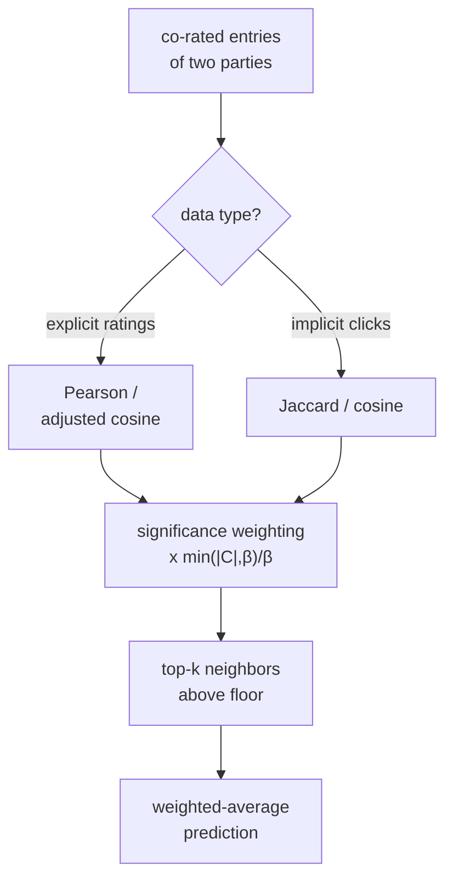

Collaborative filtering rests on one number computed many times: how similar
are two users, or two items? The previous lesson used that number without
pinning it down. The choice of similarity, and the correction applied when it
is computed from only a handful of shared ratings, often matters more than the
prediction formula wrapped around it. This lesson is about getting that number
right.

## Three similarities and what they ignore

Let $\mathbf{a}, \mathbf{b}$ be two rating vectors restricted to the entries
both parties supplied (the **co-rated** set $C$ of items two users both rated,
or users who rated two items both). The three standard similarities differ in
exactly what they normalize away.

**Cosine** measures the angle, ignoring magnitude:

$$
\text{cos}(\mathbf{a}, \mathbf{b}) = \frac{\sum_{c \in C} a_c\, b_c}{\sqrt{\sum_{c} a_c^2}\,\sqrt{\sum_{c} b_c^2}}.
$$

It treats a rater who scores $(4,5,3)$ and one who scores $(2,2.5,1.5)$ as
identical, since one is a scalar multiple of the other.

**Pearson correlation** is cosine *after centering each vector by its own
mean*, so it ignores both magnitude and offset:

$$
\text{pearson}(\mathbf{a}, \mathbf{b}) = \frac{\sum_{c}(a_c - \bar a)(b_c - \bar b)}{\sqrt{\sum_c (a_c - \bar a)^2}\,\sqrt{\sum_c (b_c - \bar b)^2}}.
$$

Centering removes the "harsh rater vs generous rater" bias: a user whose
ratings run two points low but track yours perfectly gets correlation $1$,
whereas raw cosine would be dragged down by the offset.

**Jaccard** throws away the rating values entirely and compares only *which*
items were touched, the right choice for implicit feedback (a click is a click):

$$
\text{jaccard}(u, v) = \frac{|I_u \cap I_v|}{|I_u \cup I_v|},
$$

where $I_u$ is the set of items user $u$ interacted with. It answers "how much
do these two users' catalogs overlap" with no notion of how much they liked
anything.

For item-item CF on explicit ratings, **adjusted cosine** is the common refinement:
center each rating by the *user's* mean (not the item's) before taking cosine
across users, which removes user rating-scale bias from item comparisons<FN n="2" />.

## The few-co-ratings trap

Pearson over two co-rated items always returns $\pm 1$: two points are perfectly
collinear. So the noisiest possible estimate, from the least evidence, reports
maximal confidence. Left uncorrected, the neighbors that dominate a prediction
are often pairs sharing two or three flukes.

The fix is **significance weighting** (shrinkage toward zero when evidence is
thin)<FN n="1" />. Multiply the raw similarity by a factor that grows with the
co-rating count $|C|$ and saturates at $1$:

$$
\text{sim}'(\mathbf{a}, \mathbf{b}) = \frac{\min(|C|,\, \beta)}{\beta}\,\cdot\,\text{sim}(\mathbf{a}, \mathbf{b}),
$$

with a threshold $\beta$ (commonly around $25$ to $50$). A pair sharing
$|C| = 2$ items at $\beta = 50$ keeps only $2/50 = 4\%$ of its similarity; a
pair sharing $60$ items keeps all of it. The estimate is trusted in proportion
to the data behind it.

## From similarity to a neighborhood

A prediction does not use every similar party, only a **neighborhood**: the
$k$ most similar that also rated the target item. Two design knobs control its
quality.

- **Size $k$.** Small $k$ is low bias and high variance (a few close neighbors,
  easily thrown off); large $k$ pulls in weak, noisy neighbors that regress the
  prediction toward the mean. Typical values land between $20$ and $50$.
- **A similarity floor.** Drop neighbors below a threshold (or with negative
  similarity) so a thin neighborhood does not get padded with near-strangers.



## Check it on arrays

```python
import numpy as np

# Two users, co-rated items only. v tracks u but rates 2 points lower.
u = np.array([5.0, 4.0, 3.0, 5.0])
v = np.array([3.0, 2.0, 1.0, 3.0])

def cosine(a, b):
    den = np.linalg.norm(a) * np.linalg.norm(b)
    return float(a @ b / den) if den else 0.0

def pearson(a, b):
    a, b = a - a.mean(), b - b.mean()
    den = np.linalg.norm(a) * np.linalg.norm(b)
    return float(a @ b / den) if den else 0.0

print(f"cosine : {cosine(u, v):.3f}")     # high but < 1 (offset hurts)
print(f"pearson: {pearson(u, v):.3f}")    # 1.0: perfect after centering

# Pearson over only 2 co-rated points is always +/-1, regardless of values
a2, b2 = np.array([5.0, 1.0]), np.array([2.0, 4.0])
raw = pearson(a2, b2)

# Significance weighting shrinks thin evidence toward 0
def sig_weighted(sim, n_corated, beta=50):
    return sim * min(n_corated, beta) / beta

print(f"raw pearson (2 co-rated): {raw:.3f}")
print(f"after shrinkage (beta=50): {sig_weighted(raw, 2):.3f}")
assert pearson(u, v) > cosine(u, v)            # centering beats offset bias
assert abs(sig_weighted(raw, 2)) < abs(raw)    # thin evidence discounted
```

Pearson recovers the perfect agreement that the offset hides from cosine, and
significance weighting collapses the over-confident two-point correlation to a
fraction of its raw value.

## Exercises

**Exercise 1.** Users $u = (4, 2)$ and $v = (5, 3)$ are co-rated on two items.
Compute their Pearson correlation, then explain in one line why it equals the
correlation of $u = (4, 2)$ with *any* strictly increasing $v$.

<details>
<summary>Solution</summary>

**Step 1.** Center: $u - \bar u = (1, -1)$, $v - \bar v = (1, -1)$.

**Step 2.** Pearson $= \frac{(1)(1) + (-1)(-1)}{\sqrt{2}\sqrt{2}} = \frac{2}{2} = 1$.

**Step 3.** With only two points, each centered vector is $(\delta, -\delta)$ for
some sign, so any $v$ that increases when $u$ increases centers to the same
direction as $u$ and gives correlation $+1$. Two points cannot disagree with a
monotone trend, which is why Pearson over two co-ratings is uninformative.

</details>

**Exercise 2.** User $u$ interacted with items $\{1,2,3,4\}$ and user $v$ with
$\{3,4,5\}$ (implicit feedback). Compute their Jaccard similarity. Then state
what happens to it if $v$ also interacts with items $6$ through $20$.

<details>
<summary>Solution</summary>

**Step 1.** Intersection $\{3,4\}$ has size $2$; union $\{1,2,3,4,5\}$ has size
$5$. Jaccard $= 2/5 = 0.4$.

**Step 2.** Adding $\{6,\dots,20\}$ to $v$ leaves the intersection at $2$ but
grows the union to size $20$, so Jaccard drops to $2/20 = 0.1$. A very active
user looks dissimilar to everyone, because the union in the denominator
balloons: Jaccard penalizes activity-level mismatch.

</details>

**Exercise 3 (code).** Take an item rated by exactly two users and another item
rated by forty users, both with the same raw cosine similarity $0.9$ to a target
item. Apply significance weighting with $\beta = 30$ and verify the well-supported
item ends up ranked above the thin one.

<details>
<summary>Solution</summary>

```python
import numpy as np

def sig_weighted(sim, n, beta=30):
    return sim * min(n, beta) / beta

thin = sig_weighted(0.9, n=2, beta=30)     # 0.9 * 2/30
solid = sig_weighted(0.9, n=40, beta=30)   # 0.9 * 1 (capped)

assert solid > thin
print(f"thin (2 co-rated): {thin:.3f}   solid (40 co-rated): {solid:.3f}")
```

Both started at $0.9$, but the two-co-rating item keeps only $6\%$ of it while
the forty-co-rating item keeps all of it, so the better-supported neighbor wins.

</details>

The next lesson steps back from personalized similarity to the popularity and
recency baselines that any of these neighborhood methods must outperform to
justify its cost.

<Footnotes>
  <FNItem n="1">**Herlocker, J. L., Konstan, J. A., Borchers, A., & Riedl, J.** (1999). "An algorithmic framework for performing collaborative filtering". *SIGIR*. [doi:10.1145/312624.312682](https://doi.org/10.1145/312624.312682). Introduces significance weighting and neighborhood selection for CF.</FNItem>
  <FNItem n="2">**Sarwar, B., Karypis, G., Konstan, J., & Riedl, J.** (2001). "Item-based collaborative filtering recommendation algorithms". *WWW*. [doi:10.1145/371920.372071](https://doi.org/10.1145/371920.372071). Adjusted cosine and item-neighborhood construction.</FNItem>
</Footnotes>
