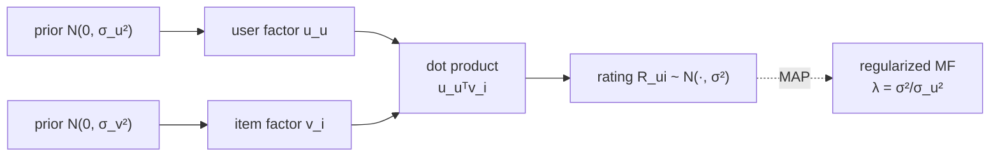

Plain matrix factorization fits user and item embeddings by minimizing a
regularized squared error, and the regularization weight $\lambda$ shows up as a
knob you tune on a validation set with no deeper justification. The Bayesian view
explains where that $\lambda$ comes from: it is a Gaussian prior on the
embeddings. Reading the model probabilistically does two things at once. It turns
the arbitrary penalty into a stated assumption, and it produces a *posterior*,
which carries uncertainty that a point estimate throws away.

## The probabilistic model

Write the prediction as $\hat R_{ui} = \mathbf{u}_u^\top \mathbf{v}_i$, where
$\mathbf{u}_u, \mathbf{v}_i \in \mathbb{R}^k$ are the latent factor vectors of
user $u$ and item $i$. Probabilistic matrix factorization assumes each observed
rating is the dot product plus Gaussian noise, and puts zero-mean Gaussian
priors on the factors<FN n="1" />:

$$
R_{ui} \mid \mathbf{u}_u, \mathbf{v}_i \sim \mathcal{N}(\mathbf{u}_u^\top \mathbf{v}_i,\ \sigma^2),
\qquad
\mathbf{u}_u \sim \mathcal{N}(\mathbf{0},\ \sigma_u^2 I),
\qquad
\mathbf{v}_i \sim \mathcal{N}(\mathbf{0},\ \sigma_v^2 I).
$$

The noise variance $\sigma^2$ says how tightly ratings cluster around the dot
product; the prior variances $\sigma_u^2, \sigma_v^2$ say how large the factors
are allowed to be before the prior pulls them back toward zero.

## MAP estimation recovers regularized MF

The maximum-a-posteriori (MAP) estimate maximizes the posterior over all factors,
equivalently minimizes its negative log. Take the log of (likelihood × prior) and
drop constants.

**Step 1 (log-likelihood).** Each Gaussian rating contributes
$-\frac{1}{2\sigma^2}(R_{ui} - \mathbf{u}_u^\top \mathbf{v}_i)^2$, so the data term is
$-\frac{1}{2\sigma^2}\sum_{(u,i)\in\Omega}(R_{ui} - \mathbf{u}_u^\top \mathbf{v}_i)^2$,
where $\Omega$ is the set of observed cells.

**Step 2 (log-prior).** Each Gaussian prior contributes
$-\frac{1}{2\sigma_u^2}\lVert \mathbf{u}_u\rVert^2$ and likewise for $\mathbf{v}_i$.

**Step 3 (combine and negate).** Minimizing the negative log posterior is

$$
\min_{U,V}\ \frac{1}{2\sigma^2}\sum_{(u,i)\in\Omega}\!\big(R_{ui} - \mathbf{u}_u^\top \mathbf{v}_i\big)^2
+ \frac{1}{2\sigma_u^2}\sum_u \lVert \mathbf{u}_u\rVert^2
+ \frac{1}{2\sigma_v^2}\sum_i \lVert \mathbf{v}_i\rVert^2.
$$

**Step 4 (rescale).** Multiply through by $\sigma^2$. The data term becomes the
plain sum of squared errors, and the prior terms become
$\lambda_u \sum_u \lVert\mathbf{u}_u\rVert^2 + \lambda_v \sum_i \lVert\mathbf{v}_i\rVert^2$ with

$$
\lambda_u = \frac{\sigma^2}{\sigma_u^2}, \qquad \lambda_v = \frac{\sigma^2}{\sigma_v^2}.
$$

This is exactly the regularized MF objective. The regularization weight is the
ratio of noise variance to prior variance: a tight prior (small $\sigma_u^2$)
means strong regularization, and a loose prior means weak regularization. The
$\lambda$ you tuned was a statement about how spread out you believe the factors
are.

## Why the posterior is worth more than the point

MAP collapses the posterior to its single mode and reports one embedding per user.
But a user with two ratings and a user with two hundred should not be reported
with equal confidence, and the posterior makes that explicit: with little data the
likelihood is weak, the prior dominates, and the posterior is wide and centered
near zero. Solving for one user's factor with the items held fixed is a ridge
regression, and its solution shows the shrinkage directly:

$$
\hat{\mathbf{u}}_u = \big(V_u^\top V_u + \lambda_u I\big)^{-1} V_u^\top \mathbf{r}_u,
$$

where $V_u$ stacks the factor rows of the items $u$ rated and $\mathbf{r}_u$ their
ratings. With few rated items, $V_u^\top V_u$ is small next to $\lambda_u I$, so
the inverse shrinks $\hat{\mathbf{u}}_u$ hard toward zero (the prior mean), which
predicts ratings near the global average. Fully Bayesian matrix factorization
(BPMF) goes further, placing hyperpriors on $\sigma_u, \sigma_v$ and integrating
over the factors with Gibbs sampling, which removes the need to tune $\lambda$ at
all and gives a predictive distribution rather than a number<FN n="2" />.



## Check it on arrays

```python
import numpy as np

rng = np.random.default_rng(0)
k = 3
n_items = 40
V = rng.normal(size=(n_items, k))          # fixed item factors
u_true = rng.normal(size=k)
sigma = 0.3                                  # rating noise

def ridge_factor(items_idx, lam):
    Vu = V[items_idx]
    r = Vu @ u_true + rng.normal(scale=sigma, size=len(items_idx))
    return np.linalg.solve(Vu.T @ Vu + lam * np.eye(k), Vu.T @ r)

# Same prior (lambda) for two users; one rated many items, one rated few
lam = 2.0
u_many = ridge_factor(rng.choice(n_items, 30, replace=False), lam)
u_few  = ridge_factor(rng.choice(n_items, 2,  replace=False), lam)

# The data-rich user recovers a norm near the truth; the sparse user is
# shrunk harder toward the prior mean (zero), so its norm is smaller.
print(f"||u_true|| = {np.linalg.norm(u_true):.3f}")
print(f"||u_many|| = {np.linalg.norm(u_many):.3f}  (30 ratings)")
print(f"||u_few||  = {np.linalg.norm(u_few):.3f}  (2 ratings)")
assert np.linalg.norm(u_few) < np.linalg.norm(u_many)
```

Under one shared Gaussian prior, the user with two ratings is pulled toward zero
far more than the user with thirty, which is the prior doing its job: less
evidence, more shrinkage.

## Exercises

**Exercise 1.** A probabilistic MF model has rating noise $\sigma = 0.5$ and a
factor prior with $\sigma_u = \sigma_v = 1$. Compute the equivalent
regularization weights $\lambda_u, \lambda_v$. Then state what happens to
regularization if you believe factors are larger and raise $\sigma_u$ to $2$.

<details>
<summary>Solution</summary>

**Step 1.** $\lambda_u = \sigma^2/\sigma_u^2 = 0.25/1 = 0.25$, and likewise
$\lambda_v = 0.25$.

**Step 2.** Raising $\sigma_u$ to $2$ gives $\lambda_u = 0.25/4 = 0.0625$, a
quarter of the previous weight. A looser prior (you allow larger factors) means
weaker regularization, so the fit leans more on the data and less on the
pull-to-zero.

</details>

**Exercise 2.** Starting from the negative log posterior in Step 3, show that the
per-user factor update with item factors held fixed is the ridge solution
$\hat{\mathbf{u}}_u = (V_u^\top V_u + \lambda_u I)^{-1} V_u^\top \mathbf{r}_u$.

<details>
<summary>Solution</summary>

**Step 1.** Collect the terms involving $\mathbf{u}_u$ only:
$\frac{1}{2\sigma^2}\lVert \mathbf{r}_u - V_u \mathbf{u}_u\rVert^2 +
\frac{1}{2\sigma_u^2}\lVert \mathbf{u}_u\rVert^2$.

**Step 2.** Differentiate with respect to $\mathbf{u}_u$ and set to zero:
$-\frac{1}{\sigma^2}V_u^\top(\mathbf{r}_u - V_u \mathbf{u}_u) + \frac{1}{\sigma_u^2}\mathbf{u}_u = 0$.

**Step 3.** Multiply by $\sigma^2$ and gather $\mathbf{u}_u$:
$(V_u^\top V_u + \lambda_u I)\mathbf{u}_u = V_u^\top \mathbf{r}_u$ with
$\lambda_u = \sigma^2/\sigma_u^2$, giving the stated ridge solution.

</details>

**Exercise 3 (code).** Empirically confirm the $\lambda = \sigma^2/\sigma_u^2$
relation: for a single user, fit the factor by ridge at a fixed $\lambda$, then
show that scaling $\sigma^2$ and $\sigma_u^2$ together by the same constant leaves
$\lambda$, and hence the estimate, unchanged.

<details>
<summary>Solution</summary>

```python
import numpy as np

rng = np.random.default_rng(0)
k, n = 3, 20
V = rng.normal(size=(n, k))
u_true = rng.normal(size=k)
r = V @ u_true + rng.normal(scale=0.3, size=n)

def fit(lam):
    return np.linalg.solve(V.T @ V + lam * np.eye(k), V.T @ r)

# Two (sigma^2, sigma_u^2) pairs with the same ratio lambda = 0.5
u_a = fit(0.5 / 1.0)        # sigma^2=0.5, sigma_u^2=1.0
u_b = fit(5.0 / 10.0)       # sigma^2=5.0, sigma_u^2=10.0 -> same lambda
assert np.allclose(u_a, u_b)
print("same lambda -> identical MAP estimate:", np.round(u_a, 4))
```

Only the ratio $\sigma^2/\sigma_u^2$ enters the MAP estimate, so the two variance
pairs with the same ratio give byte-identical factors.

</details>

The next lesson generalizes the dot-product model to arbitrary features with
factorization machines, which keep the embedding idea but score interactions
among any input fields, not just one user and one item.

<Footnotes>
  <FNItem n="1">**Mnih, A., & Salakhutdinov, R.** (2007). "Probabilistic matrix factorization". *NeurIPS*. [https://papers.nips.cc/paper/2007/hash/d7322ed717dedf1eb4e6e52a37ea7bcd-Abstract.html](https://papers.nips.cc/paper/2007/hash/d7322ed717dedf1eb4e6e52a37ea7bcd-Abstract.html). The Gaussian model whose MAP estimate is regularized MF.</FNItem>
  <FNItem n="2">**Salakhutdinov, R., & Mnih, A.** (2008). "Bayesian probabilistic matrix factorization using Markov chain Monte Carlo". *ICML*. [doi:10.1145/1390156.1390267](https://doi.org/10.1145/1390156.1390267). Full Bayesian treatment with Gibbs sampling and hyperpriors.</FNItem>
</Footnotes>
