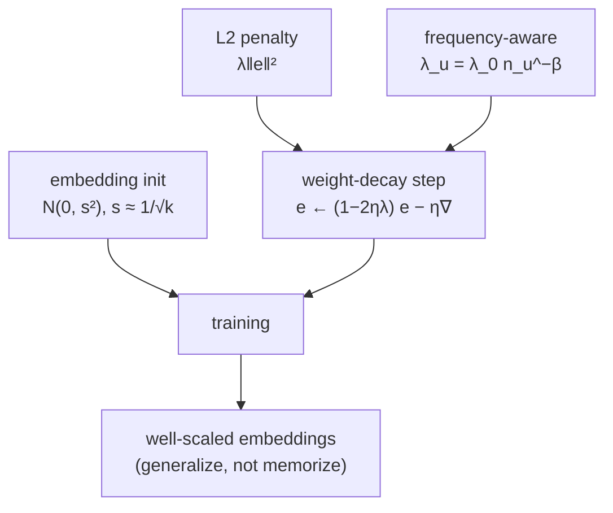

An embedding table is the bulk of the parameters in a factorization model: one
vector per user and per item, millions of them, each fit from however many
interactions that entity happens to have. Left unconstrained, the vectors for
rare entities grow large to fit their handful of observations exactly, which is
memorization, not generalization. Two controls keep the table healthy:
regularization, which limits how large the vectors can grow, and initialization,
which sets the scale they start from. Both are small choices with outsized effect.

## L2 regularization is weight decay

The standard penalty adds the squared norm of every embedding to the loss:

$$
\mathcal{L} = \sum_{(u,i)\in\Omega}\big(R_{ui} - \mathbf{u}_u^\top \mathbf{v}_i\big)^2
+ \lambda\Big(\sum_u \lVert\mathbf{u}_u\rVert^2 + \sum_i \lVert\mathbf{v}_i\rVert^2\Big).
$$

The previous lesson showed this is a Gaussian prior. Its effect on training is
cleanest in the gradient. The penalty term $\lambda\lVert\mathbf{u}_u\rVert^2$
contributes a gradient $2\lambda\mathbf{u}_u$, so a gradient-descent step with
learning rate $\eta$ updates

$$
\mathbf{u}_u \leftarrow \mathbf{u}_u - \eta\big(\nabla_{\!data} + 2\lambda\mathbf{u}_u\big)
= (1 - 2\eta\lambda)\,\mathbf{u}_u - \eta\,\nabla_{\!data}.
$$

The factor $(1 - 2\eta\lambda)$ multiplies the vector every step, shrinking it
geometrically toward zero before the data gradient pushes back. This is why L2 is
called **weight decay**: with no data signal (a feature that stops appearing), its
embedding decays to the prior mean rather than freezing at whatever value it last
held. An item seen rarely gets few data gradients and many decay steps, so its
norm stays small unless the data insists otherwise.

## A property worth relying on: norm shrinks with $\lambda$

Fitting one entity's factor with the others fixed is ridge regression, and the
norm of the ridge solution is *non-increasing* in $\lambda$: every increase in the
penalty pulls the fitted vector closer to zero. This monotonicity is what lets
$\lambda$ act as a single dial trading bias for variance. Too small, and rare
entities overfit their noise (high variance, large norms); too large, and every
entity collapses toward the global average (high bias), losing the personalization
the factors exist to provide. The right $\lambda$ sits at the bottom of that
U-shaped validation curve.

## Initialization scale

Embeddings are typically initialized from a small zero-mean Gaussian or uniform,
and the *scale* matters because the score is a dot product. With dimension $k$ and
per-component standard deviation $s$, two independent random vectors have an
expected squared dot product of order $k s^2$. Initialize too large and the
initial scores are huge, the loss starts saturated, and training is unstable;
initialize too small and the scores are nearly zero with vanishing gradients, so
learning crawls. The common compromise scales $s$ down with $k$ (for example
$s \approx 1/\sqrt{k}$), keeping the initial dot products at order one regardless
of embedding dimension, the same variance-preserving logic behind neural-network
initializers.

## Frequency-aware regularization

A single global $\lambda$ treats a user with two interactions like one with two
thousand, but their estimates have very different reliability. Frequency-aware
regularization scales the penalty per entity by how much data backs it, penalizing
rare entities more<FN n="1" />. A common form weights each entity's penalty by its
interaction count $n_u$,

$$
\lambda_u = \lambda_0 \cdot n_u^{-\beta},
$$

with $\beta \in [0, 1]$, so well-observed entities are lightly regularized and
trusted, while rare ones are pulled hard toward the prior. This directly addresses
the popularity-driven norm growth that plagues a uniform penalty.



## Check it on arrays

```python
import numpy as np

rng = np.random.default_rng(0)
k = 5

# (1) Weight decay is geometric shrinkage toward zero each step.
v = rng.normal(size=k)
lr, lam = 0.1, 0.5
n0 = np.linalg.norm(v)
for _ in range(20):
    v = v - lr * lam * v                 # pure weight-decay step (no data)
ratio = 1 - lr * lam
print(f"norm {n0:.4f} -> {np.linalg.norm(v):.4f}   factor {ratio} per step")
assert np.isclose(np.linalg.norm(v), n0 * ratio**20)

# (2) Stronger L2 yields smaller fitted embeddings: the ridge-fit factor of one
# item against fixed user factors has norm non-increasing in lambda.
n_u = 200
U = rng.normal(size=(n_u, k))
v_true = rng.normal(size=k)
obs = rng.choice(n_u, 15, replace=False)
r = U[obs] @ v_true + rng.normal(scale=0.5, size=15)

def ridge_norm(lam):
    vv = np.linalg.solve(U[obs].T @ U[obs] + lam * np.eye(k), U[obs].T @ r)
    return np.linalg.norm(vv)

lams = [0.0, 1.0, 10.0, 100.0]
norms = [ridge_norm(l) for l in lams]
print("||v|| vs lambda:", [round(x, 3) for x in norms])
assert all(norms[i] > norms[i + 1] for i in range(len(norms) - 1))
```

The decay step shrinks the norm by a fixed factor each iteration, and the ridge
fit shows the same monotone pull: larger $\lambda$, smaller embedding.

## Exercises

**Exercise 1.** A gradient-descent step on the L2 term $\lambda\lVert\mathbf{u}\rVert^2$
with learning rate $\eta = 0.05$ and $\lambda = 1$ multiplies an embedding by
$(1 - 2\eta\lambda)$ per step (ignoring the data gradient). After $10$ steps with
no data signal, what fraction of its original norm remains?

<details>
<summary>Solution</summary>

**Step 1.** The per-step factor is $1 - 2(0.05)(1) = 0.9$.

**Step 2.** After $10$ steps the norm is multiplied by $0.9^{10}$.

**Step 3.** $0.9^{10} \approx 0.349$, so about $35\%$ of the original norm
remains; a feature that stops appearing decays toward zero rather than freezing.

</details>

**Exercise 2.** Two random embeddings in dimension $k$ have components drawn iid
with mean $0$ and standard deviation $s$. Compute
$\mathbb{E}[(\mathbf{a}^\top\mathbf{b})^2]$ and explain why the initialization
scale $s$ is chosen to shrink with $k$ to keep the initial score scale stable.

<details>
<summary>Solution</summary>

**Step 1.** $\mathbf{a}^\top\mathbf{b} = \sum_{f=1}^k a_f b_f$. Since all
components are independent with mean zero, cross terms vanish in expectation:
$\mathbb{E}[(\sum_f a_f b_f)^2] = \sum_f \mathbb{E}[a_f^2]\,\mathbb{E}[b_f^2]$.

**Step 2.** Each $\mathbb{E}[a_f^2] = \mathbb{E}[b_f^2] = s^2$, so the sum is
$k\,(s^2)(s^2) = k s^4$.

**Step 3.** Setting $s = c/\sqrt{k}$ gives $k\,(c/\sqrt{k})^4 = k\cdot c^4/k^2 =
c^4/k$, which shrinks with $k$; to hold the dot-product scale fixed at order one
the common practical choice is $s \propto 1/\sqrt{k}$ (so initial scores stay
$O(1)$ rather than growing with the embedding dimension).

</details>

**Exercise 3 (code).** Implement frequency-aware regularization weights
$\lambda_u = \lambda_0\, n_u^{-\beta}$ for a set of users with interaction counts
spanning two orders of magnitude, and verify that the rare users receive a larger
penalty than the popular ones.

<details>
<summary>Solution</summary>

```python
import numpy as np

counts = np.array([2, 5, 20, 100, 500])     # interactions per user
lam0, beta = 1.0, 0.5
lam_u = lam0 * counts.astype(float) ** (-beta)

print("counts :", counts)
print("lambdas:", np.round(lam_u, 4))
# Penalty decreases as interaction count grows
assert np.all(np.diff(lam_u) < 0)
assert lam_u[0] > lam_u[-1]
```

The two-interaction user is penalized about $\sqrt{500/2} \approx 16$ times more
heavily than the five-hundred-interaction user, pulling its noisy embedding toward
the prior while leaving the well-observed user nearly free.

</details>

This completes the matrix-factorization discipline; the next discipline replaces
the linear dot product with neural encoders, where these same embedding-table and
regularization concerns reappear at much larger scale.

<Footnotes>
  <FNItem n="1">**Koren, Y., Bell, R., & Volinsky, C.** (2009). "Matrix factorization techniques for recommender systems". *IEEE Computer*, 42(8), 30-37. [doi:10.1109/MC.2009.263](https://doi.org/10.1109/MC.2009.263). Regularized latent-factor training and per-entity penalty weighting.</FNItem>
  <FNItem n="2">**Glorot, X., & Bengio, Y.** (2010). "Understanding the difficulty of training deep feedforward neural networks". *AISTATS*. [https://proceedings.mlr.press/v9/glorot10a.html](https://proceedings.mlr.press/v9/glorot10a.html). Variance-preserving initialization, the $1/\sqrt{k}$ scaling logic.</FNItem>
</Footnotes>
