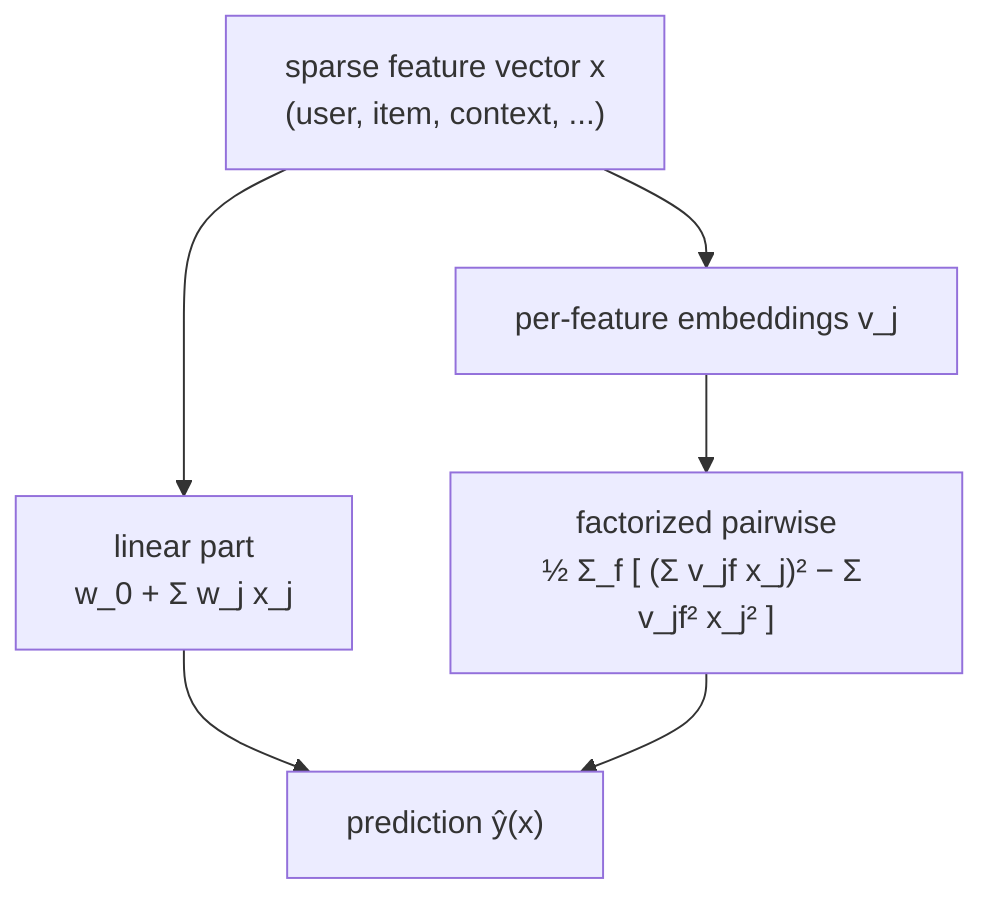

Matrix factorization scores exactly one interaction: this user with this item.
Real recommendation inputs are richer, including the day of week, the device, the
user's city, the item's category, the last item clicked. A **factorization
machine** (FM) keeps the embedding idea but applies it to *every* feature, scoring
all pairwise interactions among an arbitrary set of input fields while staying
fast enough for sparse, high-dimensional data<FN n="1" />. Matrix factorization
turns out to be the special case where the only features are a one-hot user and a
one-hot item.

## The model

A feature vector $\mathbf{x} \in \mathbb{R}^n$ is the concatenation of every field
in one-hot or numeric form (so $n$ can be huge, but $\mathbf{x}$ is mostly zero).
The degree-2 FM predicts

$$
\hat y(\mathbf{x}) = w_0 + \sum_{j=1}^n w_j x_j + \sum_{j=1}^n \sum_{j'=j+1}^n \langle \mathbf{v}_j, \mathbf{v}_{j'}\rangle\, x_j x_{j'}.
$$

The first two terms are a linear model: a global bias $w_0$ and a per-feature
weight $w_j$. The third is the FM idea: every pair of features $(j, j')$ gets an
interaction weight, but instead of storing a free parameter per pair (which would
be $O(n^2)$ parameters, unlearnable on sparse data), the pairwise weight is the
dot product $\langle \mathbf{v}_j, \mathbf{v}_{j'}\rangle$ of two $k$-dimensional
embeddings, one per feature. Each feature $j$ owns one vector
$\mathbf{v}_j \in \mathbb{R}^k$, and interactions are *factorized* through those
vectors, which is what lets the model estimate a pair's strength even if that
exact pair was never seen together, as long as each feature appears with others.

## Why it generalizes matrix factorization

Let $\mathbf{x}$ be the concatenation of a one-hot user block and a one-hot item
block, so exactly one user index $u$ and one item index $i$ are active
($x_u = x_i = 1$, all else $0$). Every product $x_j x_{j'}$ vanishes except the
single cross term $x_u x_i = 1$, so the pairwise sum collapses to
$\langle \mathbf{v}_u, \mathbf{v}_i\rangle$. The linear terms become
$w_0 + w_u + w_i$, which is the bias baseline $\mu + b_u + b_i$. The whole FM
reduces to $\mu + b_u + b_i + \mathbf{u}_u^\top \mathbf{v}_i$, biased matrix
factorization exactly. Adding more feature blocks (context, content) is then a
strict generalization, not a different model.

## The linear-time identity

The pairwise sum looks like $O(k n^2)$ work, one dot product for each of the
$\binom{n}{2}$ pairs. It collapses to $O(k n)$ with one algebraic step, which is
what makes FMs practical<FN n="1" />.

**Step 1.** Sum over all ordered pairs is the full square minus the diagonal,
halved:

$$
\sum_{j < j'} \langle \mathbf{v}_j, \mathbf{v}_{j'}\rangle x_j x_{j'}
= \frac{1}{2}\Big(\sum_{j}\sum_{j'} \langle \mathbf{v}_j, \mathbf{v}_{j'}\rangle x_j x_{j'} - \sum_{j} \langle \mathbf{v}_j, \mathbf{v}_j\rangle x_j^2\Big).
$$

**Step 2.** Write the dot product as a sum over the $k$ latent dimensions,
$\langle \mathbf{v}_j, \mathbf{v}_{j'}\rangle = \sum_{f=1}^k v_{j,f} v_{j',f}$, and
swap the order of summation so $f$ is outermost:

$$
= \frac{1}{2}\sum_{f=1}^k\Big(\sum_j\sum_{j'} v_{j,f} v_{j',f} x_j x_{j'} - \sum_j v_{j,f}^2 x_j^2\Big).
$$

**Step 3.** The double sum factors, since $\sum_j\sum_{j'} a_j a_{j'} = (\sum_j a_j)^2$
with $a_j = v_{j,f} x_j$:

$$
\sum_{j < j'} \langle \mathbf{v}_j, \mathbf{v}_{j'}\rangle x_j x_{j'}
= \frac{1}{2}\sum_{f=1}^k\Big[\Big(\sum_{j} v_{j,f}\, x_j\Big)^2 - \sum_{j} v_{j,f}^2\, x_j^2\Big].
$$

The right side touches each feature once per latent dimension, so it is $O(k n)$,
and on a sparse $\mathbf{x}$ only the nonzero entries contribute, making it
$O(k\,\lVert\mathbf{x}\rVert_0)$. The model trains by SGD on this closed form, with
gradients that are equally cheap.



## Check it on arrays

```python
import numpy as np

rng = np.random.default_rng(0)
n, k = 12, 4                                  # 12 features, rank-4 embeddings
V = rng.normal(size=(n, k))
w0 = 0.5
w = rng.normal(size=n)
x = rng.normal(size=n)
x[rng.random(n) < 0.4] = 0.0                  # make it sparse

# Naive O(k n^2): explicit sum over all pairs j < j'
pair_naive = 0.0
for j in range(n):
    for jp in range(j + 1, n):
        pair_naive += (V[j] @ V[jp]) * x[j] * x[jp]

# Fast O(k n): the factorized identity
sq_of_sum = (V * x[:, None]).sum(0) ** 2       # (Σ_j v_jf x_j)^2 per f
sum_of_sq = (V**2 * (x**2)[:, None]).sum(0)    # Σ_j v_jf^2 x_j^2 per f
pair_fast = 0.5 * (sq_of_sum - sum_of_sq).sum()

y = w0 + w @ x + pair_fast
print(f"pairwise naive: {pair_naive:.6f}")
print(f"pairwise fast : {pair_fast:.6f}")
print(f"FM prediction : {y:.4f}")
assert np.isclose(pair_naive, pair_fast)
```

The factorized form reproduces the explicit pairwise sum to numerical precision
while doing linear work instead of quadratic, which is the property that lets FMs
run on feature vectors with millions of dimensions.

## Exercises

**Exercise 1.** A feature vector has three active features with values
$x_1 = x_2 = x_3 = 1$ and rank-1 embeddings $v_1 = 2$, $v_2 = 3$, $v_3 = -1$
(so $k = 1$). Compute the pairwise term both ways and check they agree.

<details>
<summary>Solution</summary>

**Step 1.** Explicit pairs: $v_1 v_2 + v_1 v_3 + v_2 v_3 = (2)(3) + (2)(-1) + (3)(-1)
= 6 - 2 - 3 = 1$.

**Step 2.** Identity: $\frac{1}{2}\big[(\sum_j v_j)^2 - \sum_j v_j^2\big]
= \frac{1}{2}\big[(2 + 3 - 1)^2 - (4 + 9 + 1)\big] = \frac{1}{2}[16 - 14] = 1$.

**Step 3.** Both give $1$, confirming the identity at $k = 1$ with all $x_j = 1$.

</details>

**Exercise 2.** Show that with a one-hot user block and a one-hot item block (one
active feature in each), the FM pairwise term equals $\mathbf{u}_u^\top \mathbf{v}_i$,
recovering matrix factorization.

<details>
<summary>Solution</summary>

**Step 1.** Only $x_u = 1$ and $x_i = 1$ are nonzero, so any product $x_j x_{j'}$
with $j \notin \{u, i\}$ or $j' \notin \{u, i\}$ is zero.

**Step 2.** The only surviving pair with $j < j'$ is $(u, i)$ (the user index and
item index), contributing $\langle \mathbf{v}_u, \mathbf{v}_i\rangle x_u x_i =
\langle \mathbf{v}_u, \mathbf{v}_i\rangle$.

**Step 3.** Renaming the user feature's embedding $\mathbf{v}_u$ as the user factor
$\mathbf{u}_u$, the pairwise term is $\mathbf{u}_u^\top \mathbf{v}_i$, the MF dot
product. The linear terms $w_u + w_i$ supply the user and item biases.

</details>

**Exercise 3 (code).** Add a third one-hot block (a context field, say
"weekday") to a user and item, build the full $\mathbf{x}$, and verify the fast
pairwise term equals the naive sum over the three active features' three pairs.

<details>
<summary>Solution</summary>

```python
import numpy as np

rng = np.random.default_rng(1)
# Blocks: users[0:5], items[5:10], context[10:13]; n=13, k=3
n, k = 13, 3
V = rng.normal(size=(n, k))
x = np.zeros(n)
x[2] = 1.0      # user 2
x[7] = 1.0      # item 2 (global index 7)
x[11] = 1.0     # context 1 (global index 11)

active = np.where(x != 0)[0]
naive = sum((V[a] @ V[b]) for ai, a in enumerate(active) for b in active[ai+1:])

sq_of_sum = (V * x[:, None]).sum(0) ** 2
sum_of_sq = (V**2 * (x**2)[:, None]).sum(0)
fast = 0.5 * (sq_of_sum - sum_of_sq).sum()

assert np.isclose(naive, fast)
print(f"three active features, 3 pairs -> {fast:.4f}")
```

With three active fields there are three pairs (user-item, user-context,
item-context), and the linear-time form sums all of them, which is how an FM folds
context into the score for free.

</details>

The next lesson returns to the embeddings these models learn and asks how to keep
them well-behaved through regularization and initialization, the difference
between factors that generalize and factors that memorize.

<Footnotes>
  <FNItem n="1">**Rendle, S.** (2010). "Factorization machines". *IEEE ICDM*. [doi:10.1109/ICDM.2010.127](https://doi.org/10.1109/ICDM.2010.127). The FM model, the linear-time pairwise identity, and the reduction of MF to a special case.</FNItem>
  <FNItem n="2">**Rendle, S.** (2012). "Factorization machines with libFM". *ACM TIST*, 3(3). [doi:10.1145/2168752.2168771](https://doi.org/10.1145/2168752.2168771). Learning algorithms (SGD, ALS, MCMC) and feature engineering for FMs.</FNItem>
</Footnotes>
