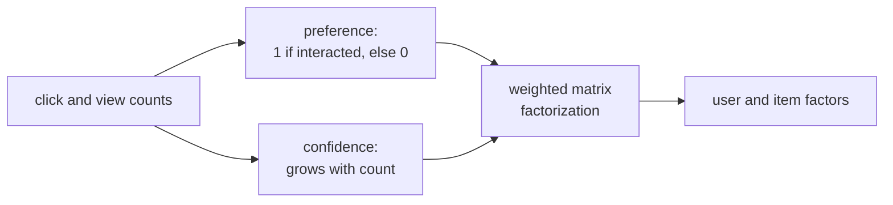

Most production recommenders do not see ratings. They see **implicit
feedback**: clicks, views, purchases, watch durations: positive evidence of
interest, but no negative ratings. Implicit feedback breaks the standard MF
loss in two ways: there are no observed negatives, and the positive signals
have varying strengths. **Weighted MF** for implicit feedback
(**Hu-Koren-Volinsky**, 2008)<FN n="1" /> addresses both.

## The implicit-feedback view

Convert the interaction count $c_{ui}$ (clicks, views) into:

- A **preference** $p_{ui} \in \{0, 1\}$: 1 if user $u$ interacted with item
  $i$, 0 otherwise.
- A **confidence** $\alpha_{ui}$: how much we trust this preference,
  typically $\alpha_{ui} = 1 + \alpha\, c_{ui}$.

Larger $c_{ui}$ means stronger evidence of liking. Zero $c_{ui}$ does not
mean disliking, just absence of evidence, with low confidence.

## Weighted loss

The MF loss becomes

$$
L = \sum_{u, i}\alpha_{ui}\,(p_{ui} - \mathbf{u}_u^\top \mathbf{v}_i)^2 + \lambda\!\left(\sum_u\lVert\mathbf{u}_u\rVert^2 + \sum_i\lVert\mathbf{v}_i\rVert^2\right).
$$

Three things change versus explicit MF:

- The sum runs over **all** $(u, i)$ pairs, including unobserved. Unobserved
  pairs have $p_{ui} = 0$ and confidence $\alpha_{ui} = 1$ (a low but
  nonzero weight).
- Observed pairs have $p_{ui} = 1$ and higher confidence proportional to
  interaction strength.
- The model now learns from negatives (unobserved pairs are weak negatives)
  in addition to positives.

## ALS with weighted updates

The per-user update has the same structure as explicit MF, but with the
confidence matrix folded in:

$$
\mathbf{u}_u = (V^\top C_u V + \lambda I)^{-1} V^\top C_u\, p_u,
$$

where $C_u = \operatorname{diag}(\alpha_{u\cdot})$. Naive computation would
involve all $n_i$ items per user; the algorithmic trick is to rewrite
$V^\top C_u V = V^\top V + V^\top (C_u - I) V$. The first term is the same
$V^\top V$ for every user (compute once); the second is sparse because
$(C_u - I)$ is nonzero only on items user $u$ interacted with. The update
cost per user is therefore $O(k^2 |I_u| + k^3)$, not $O(k^2 n_i)$.

The same trick works for $V$ updates. This is what makes implicit-feedback
ALS scale to billions of (user, item) pairs.

## BPR: an alternative formulation

**Bayesian personalized ranking (BPR)** trains MF on **triplets** $(u, i^+, i^-)$
where $i^+$ is observed and $i^-$ is sampled negative<FN n="2" />. The loss maximizes
$\sigma(\mathbf{u}_u^\top \mathbf{v}_{i^+} - \mathbf{u}_u^\top \mathbf{v}_{i^-})$,
the probability that the user prefers $i^+$ over $i^-$. BPR sidesteps the
"all unobserved pairs" issue by sampling. Conceptually cleaner; in practice
ALS often matches BPR with simpler infrastructure.

## When weighted MF works

- Plenty of implicit signals (clicks, views).
- Need fast offline batch training at scale.
- Need explainable embeddings (the latent dimensions sometimes have rough
  semantic interpretation).

When it does not: long-tail items rarely interacted with stay at near-zero
embeddings, and the cold-start problem persists for new items and users.



## Check it on arrays

```python
import numpy as np

rng = np.random.default_rng(0)

# Synthetic implicit-feedback matrix: most entries 0, some count > 0
n_u, n_i = 60, 40
k_true = 3
U_true = rng.normal(size=(n_u, k_true))
V_true = rng.normal(size=(n_i, k_true))
P_true = (U_true @ V_true.T > 0).astype(int)            # 0/1 preferences
counts = (P_true * rng.poisson(2, size=(n_u, n_i)))     # observed counts

alpha_scale = 10.0
P = (counts > 0).astype(float)                          # preference
C = 1 + alpha_scale * counts                            # confidence

def weighted_als(P, C, k=4, lam=0.1, n_iter=10):
    n_u, n_i = P.shape
    U = rng.normal(scale=0.1, size=(n_u, k))
    V = rng.normal(scale=0.1, size=(n_i, k))
    for _ in range(n_iter):
        VtV = V.T @ V
        for u in range(n_u):
            Cu_minus_I = C[u] - 1
            A = VtV + V.T @ (Cu_minus_I[:, None] * V) + lam * np.eye(k)
            b = V.T @ (C[u] * P[u])
            U[u] = np.linalg.solve(A, b)
        UtU = U.T @ U
        for i in range(n_i):
            Ci_minus_I = C[:, i] - 1
            A = UtU + U.T @ (Ci_minus_I[:, None] * U) + lam * np.eye(k)
            b = U.T @ (C[:, i] * P[:, i])
            V[i] = np.linalg.solve(A, b)
    return U, V

U_hat, V_hat = weighted_als(P, C, k=4, lam=0.1, n_iter=15)
scores = U_hat @ V_hat.T

# Ranking quality on held-out positives: for each user, are observed items ranked higher than unobserved?
hits = 0; total = 0
for u in range(n_u):
    pos = np.where(P[u] > 0)[0]
    neg = np.where(P[u] == 0)[0]
    if len(pos) == 0 or len(neg) == 0: continue
    # Pick a random pair
    for _ in range(20):
        i_pos = rng.choice(pos); i_neg = rng.choice(neg)
        hits += int(scores[u, i_pos] > scores[u, i_neg])
        total += 1
auc = hits / total
print(f"Implicit-MF pairwise AUC: {auc:.3f}  (>0.5 means observed items ranked higher than unobserved)")
```

The implicit-MF model ranks observed items above unobserved with high
probability.

## Exercises

**Exercise 1.** A user interacted with an item $4$ times. Using the standard
confidence rule $\alpha_{ui} = 1 + \alpha\, c_{ui}$ with $\alpha = 10$, compute
the preference $p_{ui}$ and confidence $\alpha_{ui}$. Then give $p$ and
$\alpha$ for a pair with zero interactions, and state in one sentence why the
zero-count weight is small but not zero.

<details>
<summary>Solution</summary>

**Step 1.** Preference is binary: any positive count gives $p_{ui} = 1$, so the
$4$-interaction pair has $p_{ui} = 1$.

**Step 2.** Confidence: $\alpha_{ui} = 1 + 10 \cdot 4 = 41$.

**Step 3.** For the unobserved pair, $c_{ui} = 0$ gives $p_{ui} = 0$ and
$\alpha_{ui} = 1 + 10 \cdot 0 = 1$. The weight is kept at $1$ rather than $0$
because absence of interaction is weak evidence of dislike, not proof of it: the
model should pull the predicted preference toward $0$ for unobserved pairs, but
only gently, so a single missed item does not dominate a confirmed positive.

</details>

**Exercise 2.** The per-user ALS update solves
$\mathbf{u}_u = (V^\top C_u V + \lambda I)^{-1} V^\top C_u\, p_u$ with
$C_u = \operatorname{diag}(\alpha_{u\cdot})$. Show that
$V^\top C_u V = V^\top V + V^\top (C_u - I) V$ and explain why this identity is
what makes the update cost $O(k^2 |I_u| + k^3)$ instead of $O(k^2 n_i)$.

<details>
<summary>Solution</summary>

**Step 1.** Split the diagonal confidence matrix as $C_u = I + (C_u - I)$.
Substituting into the quadratic form and distributing,

$$
V^\top C_u V = V^\top (I + (C_u - I)) V = V^\top V + V^\top (C_u - I) V.
$$

**Step 2.** The first term $V^\top V$ does not depend on $u$, so it is computed
once and reused for every user, costing $O(k^2 n_i)$ amortized to $O(k^2)$ per
user.

**Step 3.** For unobserved pairs $\alpha_{ui} = 1$, so the diagonal of
$C_u - I$ is zero there and nonzero only on the $|I_u|$ items the user actually
touched. The product $V^\top (C_u - I) V$ therefore sums over $|I_u|$ rank-one
terms, costing $O(k^2 |I_u|)$. Adding the $O(k^3)$ solve of the $k \times k$
system gives the stated $O(k^2 |I_u| + k^3)$, with no dependence on the full
catalog size $n_i$ per user.

</details>

**Exercise 3 (code).** Implement the rewritten Gramian
$V^\top C_u V = V^\top V + V^\top(C_u - I)V$ and verify it equals the naive
$V^\top \operatorname{diag}(C_u) V$ on a small example, then confirm the implied
$\mathbf{u}_u$ solves match.

<details>
<summary>Solution</summary>

```python
import numpy as np

rng = np.random.default_rng(2)

n_i, k = 12, 4
V = rng.normal(size=(n_i, k))
alpha = np.ones(n_i)
touched = rng.choice(n_i, size=3, replace=False)
alpha[touched] = 1 + 10 * rng.integers(1, 5, size=3)     # confidence on a few items
p = np.zeros(n_i)
p[touched] = 1.0
lam = 0.1

# Naive Gramian
Cu = np.diag(alpha)
A_naive = V.T @ Cu @ V + lam * np.eye(k)
u_naive = np.linalg.solve(A_naive, V.T @ (alpha * p))

# Rewritten: V^T V reused, plus sparse correction over touched items only
VtV = V.T @ V
correction = (V[touched] * (alpha[touched] - 1)[:, None]).T @ V[touched]
A_fast = VtV + correction + lam * np.eye(k)
u_fast = np.linalg.solve(A_fast, V.T @ (alpha * p))

assert np.allclose(A_naive, A_fast)
assert np.allclose(u_naive, u_fast)
print("max Gramian diff:", np.abs(A_naive - A_fast).max())
```

The sparse correction over only the touched items reproduces the full Gramian
exactly, so the scalable update returns the same embedding as the naive one.

</details>

The next lesson tightens the model to nonneg factors with NMF.

<Footnotes>
  <FNItem n="1">**Hu, Y., Koren, Y., & Volinsky, C.** (2008). "Collaborative filtering for implicit feedback datasets". *ICDM*. [doi:10.1109/ICDM.2008.22](https://doi.org/10.1109/ICDM.2008.22). The preference/confidence split, weighted loss, and the scalable ALS update.</FNItem>
  <FNItem n="2">**Rendle, S., Freudenthaler, C., Gantner, Z., & Schmidt-Thieme, L.** (2009). "BPR: Bayesian personalized ranking from implicit feedback". *UAI*. The pairwise-ranking alternative with sampled negatives.</FNItem>
</Footnotes>
