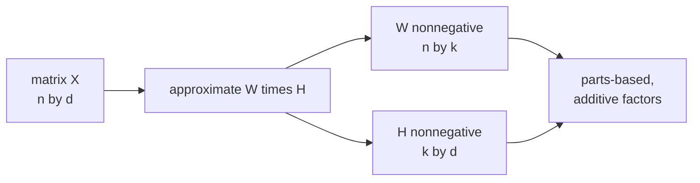

Standard matrix factorization produces latent factors that are
unconstrained<FN n="2" />: a user embedding can subtract one feature from another, and
the latent dimensions have no semantic interpretation. **Non-negative matrix
factorization (NMF)** restricts both factors to be nonnegative, and the
factors that emerge tend to be **additive parts** that combine to reconstruct
the data<FN n="1" />. The interpretability comes essentially for free.

## The setup

Given a nonnegative matrix $X \in \mathbb{R}_{\ge 0}^{n \times d}$
(documents × words, users × items, pixels × images), find nonnegative
$W \in \mathbb{R}_{\ge 0}^{n \times k}$ and $H \in \mathbb{R}_{\ge 0}^{k \times d}$
minimizing

$$
\lVert X - W H\rVert_F^2 \quad \text{s.t.}\quad W \ge 0,\ H \ge 0.
$$

The nonnegativity has a deep consequence: factors can only **add**, never
subtract. Rows of $H$ become **parts** (e.g. topics, item categories,
visual features), and rows of $W$ are nonnegative combinations of those
parts.

## Multiplicative update rules

Lee and Seung's classic algorithm<FN n="1" />: alternate two element-wise updates that
preserve nonnegativity:

$$
H_{kj} \leftarrow H_{kj}\,\frac{(W^\top X)_{kj}}{(W^\top W H)_{kj}}, \qquad W_{ik} \leftarrow W_{ik}\,\frac{(X H^\top)_{ik}}{(W H H^\top)_{ik}}.
$$

Both updates are guaranteed to **monotonically decrease** the Frobenius
error and keep entries nonnegative. The denominators are positive by
construction; division never produces a negative. Initialize with random
nonnegative entries; iterate until the loss flattens.

## What NMF buys you

- **Parts-based interpretation.** On the Olivetti faces dataset, NMF
  produces facial *features* (eyes, mouths, nose shapes); PCA on the same
  data produces *eigenfaces* that look like ghostly composite faces with
  positive and negative weights.
- **Sparsity by default.** Many entries in $W$ and $H$ tend to come out at
  exactly zero. This is desirable for compact representations.
- **Topic modeling.** Applied to a term-document matrix, NMF produces topic
  vectors (rows of $H$ are word distributions per topic, rows of $W$ are
  topic distributions per document). This is a soft topic model, related to
  but distinct from LDA.

## Limits

- Local minima: multiplicative updates converge to a local optimum,
  initialization matters. Try several random starts.
- Choice of $k$: BIC, cross-validation, or domain knowledge. Often picked
  by interpretability of the factors.
- Slower than unconstrained MF and not as accurate at pure reconstruction.

## Alternatives

- **Sparse NMF**: add explicit L1 sparsity penalties on $W$ or $H$.
- **KL-divergence NMF**: use the KL divergence between $X$ and $WH$ as the
  loss instead of squared error. Better for count data.
- **Convex NMF**: constrain the basis vectors to be convex combinations of
  the data, making the bases interpretable as prototypical data points.



## Check it on arrays

```python
import numpy as np

rng = np.random.default_rng(0)

# Synthetic "topic" data: documents are nonnegative mixtures of 3 topics
n_topics = 3; n_words = 30; n_docs = 200
H_true = rng.exponential(size=(n_topics, n_words))      # word distributions per topic
H_true /= H_true.sum(axis=1, keepdims=True)
W_true = rng.exponential(size=(n_docs, n_topics))       # topic mixtures per doc
X_clean = W_true @ H_true * 50
X = rng.poisson(X_clean).astype(float)                   # noisy counts

def nmf(X, k, n_iter=200, eps=1e-9):
    n, d = X.shape
    W = rng.uniform(0.5, 1.0, size=(n, k))
    H = rng.uniform(0.5, 1.0, size=(k, d))
    for _ in range(n_iter):
        # Update H first
        H *= (W.T @ X) / (W.T @ W @ H + eps)
        # Then W
        W *= (X @ H.T) / (W @ H @ H.T + eps)
    return W, H

W_hat, H_hat = nmf(X, k=3, n_iter=300)

# Reconstruction error vs the noisy data
recon = W_hat @ H_hat
print(f"reconstruction MSE: {np.mean((X - recon)**2):.3f}")
print(f"all W >= 0: {(W_hat >= 0).all()}, all H >= 0: {(H_hat >= 0).all()}")
print(f"sparsity in W: {(W_hat < 0.01).mean():.2f}")
print(f"sparsity in H: {(H_hat < 0.01).mean():.2f}")

# Each row of H should look like one of the original topics (up to permutation)
def best_match_corr(H_hat, H_true):
    """Find best matching of rows between two row-stochastic matrices."""
    K = len(H_true); used = set()
    matches = []
    for k1 in range(K):
        corrs = [(np.corrcoef(H_hat[k1], H_true[k2])[0, 1], k2)
                 for k2 in range(K) if k2 not in used]
        c, k2 = max(corrs)
        matches.append(c); used.add(k2)
    return matches

corrs = best_match_corr(H_hat / H_hat.sum(axis=1, keepdims=True), H_true)
print(f"\ntopic recovery correlations: {[round(c, 2) for c in corrs]}")
```

NMF recovers nonnegative factors with sparse entries, and the recovered
topic vectors correlate strongly with the true ones.

## Exercises

**Exercise 1.** Take $W = \begin{bmatrix} 2 & 0 \\ 1 & 1 \end{bmatrix}$ and
$H = \begin{bmatrix} 1 & 3 \\ 2 & 0 \end{bmatrix}$. Compute the reconstruction
$WH$ and confirm by inspection that every entry is nonnegative without any
cancellation. State why this is forced rather than coincidental.

<details>
<summary>Solution</summary>

**Step 1.** Multiply row by column:

$$
WH = \begin{bmatrix} 2\cdot 1 + 0\cdot 2 & 2\cdot 3 + 0\cdot 0 \\ 1\cdot 1 + 1\cdot 2 & 1\cdot 3 + 1\cdot 0 \end{bmatrix} = \begin{bmatrix} 2 & 6 \\ 3 & 3 \end{bmatrix}.
$$

**Step 2.** Every entry is a sum of products of nonnegative numbers. A product
of two nonnegatives is nonnegative, and a sum of nonnegatives is nonnegative, so
no entry can come out below zero. This is the structural fact behind the
parts-based interpretation: factors can only add evidence, never subtract it, so
a row of $W$ reads as a recipe of how much of each part (row of $H$) to mix in.

</details>

**Exercise 2.** Show that the multiplicative update
$H_{kj} \leftarrow H_{kj}\,\frac{(W^\top X)_{kj}}{(W^\top W H)_{kj}}$ leaves
$H_{kj}$ unchanged exactly when the gradient of $\lVert X - WH\rVert_F^2$ with
respect to $H_{kj}$ is zero, and explain why the update can never turn a positive
$H_{kj}$ negative.

<details>
<summary>Solution</summary>

**Step 1.** The gradient of $\lVert X - WH\rVert_F^2$ with respect to $H$ is
$\nabla_H = 2(W^\top W H - W^\top X)$. A stationary point has
$(W^\top W H)_{kj} = (W^\top X)_{kj}$ for the relevant entry.

**Step 2.** At such a point the ratio
$\frac{(W^\top X)_{kj}}{(W^\top W H)_{kj}} = 1$, so the multiplicative update
maps $H_{kj} \mapsto H_{kj} \cdot 1 = H_{kj}$: it is a fixed point precisely when
the gradient vanishes.

**Step 3.** $X$, $W$, and $H$ are nonnegative, so both $(W^\top X)_{kj}$ and
$(W^\top W H)_{kj}$ are nonnegative, and the denominator is strictly positive
whenever the iterate is interior. The multiplier is therefore a nonnegative
number, and multiplying a positive $H_{kj}$ by a nonnegative factor keeps it
nonnegative. Nonnegativity is preserved at every step without any clipping.

</details>

**Exercise 3 (code).** Implement the Lee-Seung multiplicative updates from
scratch on a nonnegative matrix and verify two facts: the Frobenius
reconstruction error is monotonically non-increasing across iterations, and both
factors stay nonnegative throughout.

<details>
<summary>Solution</summary>

```python
import numpy as np

rng = np.random.default_rng(0)

n, d, k = 30, 20, 4
W_true = rng.exponential(size=(n, k))
H_true = rng.exponential(size=(k, d))
X = W_true @ H_true                                  # nonnegative target

W = rng.uniform(0.5, 1.0, size=(n, k))
H = rng.uniform(0.5, 1.0, size=(k, d))
eps = 1e-9

errors = []
for _ in range(150):
    H *= (W.T @ X) / (W.T @ W @ H + eps)
    W *= (X @ H.T) / (W @ H @ H.T + eps)
    errors.append(np.linalg.norm(X - W @ H))
    assert (W >= 0).all() and (H >= 0).all()

errors = np.array(errors)
# Allow tiny float wobble from the eps stabilizer
assert np.all(np.diff(errors) <= 1e-6)
print(f"error start {errors[0]:.3f} -> end {errors[-1]:.4f}, monotone: True")
```

The reconstruction error decreases step after step and both factors remain
nonnegative, which are the two guarantees the multiplicative update provides.

</details>

The next lesson moves to neural-net factor models: two-tower retrieval.

<Footnotes>
  <FNItem n="1">**Lee, D. D., & Seung, H. S.** (1999). "Learning the parts of objects by non-negative matrix factorization". *Nature*, 401, 788-791. [doi:10.1038/44565](https://doi.org/10.1038/44565). The parts-based interpretation and the multiplicative update rules.</FNItem>
  <FNItem n="2">**Koren, Y., Bell, R., & Volinsky, C.** (2009). "Matrix factorization techniques for recommender systems". *IEEE Computer*, 42(8), 30-37. [doi:10.1109/MC.2009.263](https://doi.org/10.1109/MC.2009.263). The unconstrained latent-factor model NMF restricts.</FNItem>
</Footnotes>
