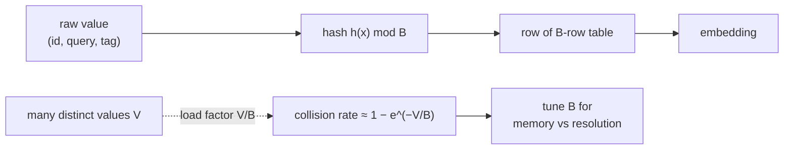

The embedding tables are where a recommender spends its memory. A model with a
hundred million users and ten million items at $32$ dimensions in float32 is over
$14$ gigabytes of parameters before a single MLP weight, and that table has to be
held in memory at serving time for fast lookup. This lesson is about the
engineering that keeps the table affordable: sizing it, shrinking it with the
hashing trick, and accepting the collisions that result.

## The memory arithmetic

A table for $V$ distinct values at dimension $d$ in a $4$-byte float costs

$$
\text{bytes} = V \cdot d \cdot 4.
$$

The number is unforgiving: $10^8$ users at $d = 64$ is $10^8 \cdot 64 \cdot 4
\approx 25.6$ GB for the user table alone. Three levers reduce it: a smaller $d$
(cheaper but less expressive), a smaller value space $V$ via hashing (the main
lever), and lower precision (float16 or int8 quantization halves or quarters the
cost). Dimension and precision are straightforward trades; hashing is the
interesting one because it changes *which values share a row*.

## The hashing trick and its collisions

Rather than one row per value, the hashing trick allocates $B$ buckets and maps
each value $x$ to bucket $h(x) \bmod B$, so the table has $B$ rows regardless of
how many distinct values appear<FN n="1" />. When $B$ is smaller than the number of
distinct values $V$, some values **collide** into the same bucket and share an
embedding, which the model cannot then tell apart.

The collision rate follows the birthday-problem logic. With $V$ values hashed
uniformly into $B$ buckets, the probability a given value lands in a bucket already
claimed by another rises as the load factor $V/B$ grows. The expected fraction of
values that share their bucket with at least one other is approximately

$$
1 - \Big(1 - \tfrac{1}{B}\Big)^{V-1} \approx 1 - e^{-V/B}
$$

for large $B$. At a load factor $V/B = 1$ roughly $63\%$ of values collide; at
$V/B = 0.1$ only about $10\%$ do. The table size $B$ is chosen to keep the load
factor low enough that collisions are tolerable noise rather than a dominant error.

## Mitigating collisions without a bigger table

Two tricks buy resolution back at fixed memory. **Multiple hashes** map each value
to $m$ buckets with $m$ independent hash functions and sum the retrieved rows, so a
collision in one hash is unlikely to coincide with a collision in all $m$; the
effective number of distinct representations is $B^m$ while storage stays $B$
rows<FN n="2" />. **Frequency splitting** gives the head (popular ids, where
resolution matters most) dedicated rows and hashes only the long tail, so the
common case never collides.

## Multi-hot fields

Some fields are sets, not single values: a user's genres, an item's tags. These
are **multi-hot**, and the lookup retrieves several rows and pools them (sum or
mean), exactly the history pooling of the previous lesson applied to a feature.
The pooled vector is the field's contribution, fixed-width regardless of set size.



## Check it on arrays

```python
import numpy as np

rng = np.random.default_rng(0)
V = 5000                                  # distinct values to hash

def collision_fraction(B):
    # Hash each value to a bucket; count values sharing a bucket with another.
    buckets = rng.integers(0, B, size=V)
    counts = np.bincount(buckets, minlength=B)
    collided = counts[buckets] > 1        # this value's bucket holds >1 value
    return collided.mean()

for B in [500, 5000, 50000]:
    frac = collision_fraction(B)
    approx = 1 - np.exp(-V / B)
    print(f"B={B:>6}  load={V/B:5.2f}  collided={frac:.3f}  (approx {approx:.3f})")

# A larger table strictly lowers the collision fraction
fracs = [collision_fraction(B) for B in [500, 5000, 50000]]
assert fracs[0] > fracs[1] > fracs[2]
```

The measured collision fraction tracks the $1 - e^{-V/B}$ estimate and falls as
the table grows, which is the quantitative knob behind every table-sizing decision.

## Exercises

**Exercise 1.** A user-id table holds $20$ million ids at dimension $48$ in
float32. Compute its size in gigabytes, then state the size after switching to
float16.

<details>
<summary>Solution</summary>

**Step 1.** float32 is $4$ bytes: $20\times10^6 \cdot 48 \cdot 4 = 3.84\times10^9$
bytes $\approx 3.84$ GB (or $3.58$ GiB).

**Step 2.** float16 is $2$ bytes, halving the cost to $\approx 1.92$ GB.

**Step 3.** Precision is a free lever on memory: halving bytes per parameter halves
the table, often with negligible quality loss for embeddings.

</details>

**Exercise 2.** Using $1 - e^{-V/B}$, find the load factor $V/B$ at which about
half of all values collide. Interpret the result as a sizing rule of thumb.

<details>
<summary>Solution</summary>

**Step 1.** Set $1 - e^{-V/B} = 0.5$, so $e^{-V/B} = 0.5$ and
$V/B = \ln 2 \approx 0.693$.

**Step 2.** At a load factor near $0.7$, roughly half the values collide. To keep
collisions to, say, $10\%$, solve $1 - e^{-V/B} = 0.1$, giving $V/B \approx 0.105$.

**Step 3.** The rule of thumb: size the table to about ten times the number of
distinct values ($B \approx 10V$) for a $\sim 10\%$ collision rate, and accept more
collisions only where the field tolerates the noise.

</details>

**Exercise 3 (code).** Implement double hashing: map each value through two
independent hash functions, sum the two retrieved rows, and verify that two values
colliding under the first hash usually still get distinct summed embeddings because
their second-hash rows differ.

<details>
<summary>Solution</summary>

```python
import numpy as np

rng = np.random.default_rng(0)
B, d = 100, 8
table1 = rng.normal(size=(B, d))
table2 = rng.normal(size=(B, d))

# Two distinct values forced to collide under hash 1 (same bucket 7)
h1_a, h1_b = 7, 7
# but independent hash 2 sends them to different buckets
h2_a, h2_b = 13, 41

emb_a = table1[h1_a] + table2[h2_a]
emb_b = table1[h1_b] + table2[h2_b]

# Despite the hash-1 collision, the summed embeddings differ
assert not np.allclose(emb_a, emb_b)
# The difference comes entirely from the second hash
assert np.allclose(emb_a - emb_b, table2[h2_a] - table2[h2_b])
print("double hashing separates a single-hash collision")
```

The two values share their first-hash row but differ in the second, so the summed
embeddings are distinct; a collision now requires colliding under both hashes at
once, which is far rarer.

</details>

The next lesson turns to how these embeddings are trained: the negative sampling
that teaches a tower to separate the items a user wants from the vast majority they
do not.

<Footnotes>
  <FNItem n="1">**Weinberger, K., Dasgupta, A., Langford, J., Smola, A., & Attenberg, J.** (2009). "Feature hashing for large scale multitask learning". *ICML*. [doi:10.1145/1553374.1553516](https://doi.org/10.1145/1553374.1553516). The hashing trick and its collision behavior.</FNItem>
  <FNItem n="2">**Shi, H.-J. M., Mudigere, D., Naumov, M., & Yang, J.** (2020). "Compositional embeddings using complementary partitions for memory-efficient recommendation systems". *KDD*. [doi:10.1145/3394486.3403059](https://doi.org/10.1145/3394486.3403059). Quotient-remainder and multi-hash tricks to cut embedding-table memory.</FNItem>
</Footnotes>
