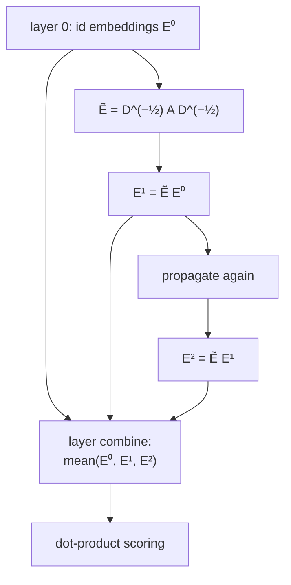

Matrix factorization treats each user-item interaction in isolation: the only path
from user $u$ to item $i$ is their own dot product. But interactions form a graph,
users connected to the items they touched, and that graph carries collaborative
signal beyond direct edges. If you and I both liked items $a$ and $b$, and you also
liked $c$, then $c$ is two hops from me through our shared taste. Graph neural
networks make that multi-hop signal explicit by propagating embeddings along the
interaction edges, and for recommendation the most influential design strips the
GNN down to almost nothing.

## The user-item graph

The interactions form a **bipartite graph**: nodes are users on one side and items
on the other, with an edge $(u, i)$ whenever $u$ interacted with $i$. There are no
user-user or item-item edges; all signal flows through the two-hop paths
user $\to$ item $\to$ user. A GNN layer updates each node's embedding by
aggregating its neighbors' embeddings, so after one layer a user embedding mixes in
the items they touched, after two layers it mixes in the users who touched those
items, and so on. Stacking layers widens the neighborhood that informs each node.

## LightGCN: propagation without the machinery

A standard graph convolution applies a learned weight matrix and a nonlinearity at
each layer. LightGCN's finding is that for collaborative filtering, both *hurt*:
the feature transformation and nonlinearity add parameters and overfitting without
improving recommendation, because the node "features" are just learnable
 id-embeddings with no semantic content to transform<FN n="1" />. LightGCN keeps
only the part that matters, neighborhood aggregation with symmetric normalization:

$$
\mathbf{e}_u^{(k+1)} = \sum_{i \in \mathcal{N}(u)} \frac{1}{\sqrt{|\mathcal{N}(u)|}\,\sqrt{|\mathcal{N}(i)|}}\, \mathbf{e}_i^{(k)},
$$

and symmetrically for items. Here $\mathcal{N}(u)$ is the set of items $u$
interacted with, and $|\mathcal{N}(u)|$ its degree. The normalization
$\frac{1}{\sqrt{d_u}\sqrt{d_i}}$ is the symmetric one from spectral graph theory: it
prevents high-degree nodes (popular items, heavy users) from dominating, dividing
each contribution by the geometric mean of the two endpoints' degrees.

In matrix form, stacking all node embeddings into $E^{(k)}$ and writing
$\tilde A = D^{-1/2} A D^{-1/2}$ for the normalized adjacency (with $A$ the
bipartite adjacency and $D$ its degree diagonal), one layer is just

$$
E^{(k+1)} = \tilde A\, E^{(k)}.
$$

## Layer combination

A node's final embedding is not the last layer but the **average of all layers**,

$$
\mathbf{e}_u = \frac{1}{K+1}\sum_{k=0}^{K} \mathbf{e}_u^{(k)},
$$

including layer $0$ (the raw id-embedding). Averaging across layers blends signal
from neighborhoods of every radius and avoids **over-smoothing**, the collapse where
too many propagation steps make every node embedding converge to the same vector.
The final user and item embeddings are scored with the familiar dot product, so
LightGCN slots into the same retrieval and ranking machinery as a two-tower model;
only the encoder changed. PinSage scales the same idea to web-scale item-item graphs
with neighborhood sampling and importance pooling so the propagation runs on billions
of nodes<FN n="2" />.



## Check it on arrays

```python
import numpy as np

# Bipartite graph: 3 users x 4 items. Users 0 and 1 share items; user 2 is disjoint.
R = np.array([
    [1, 1, 1, 0],   # user 0 -> items 0,1,2
    [1, 1, 0, 0],   # user 1 -> items 0,1   (overlaps user 0)
    [0, 0, 0, 1],   # user 2 -> item 3      (no overlap with 0 or 1)
], dtype=float)
n_u, n_i = R.shape
n = n_u + n_i

# Full adjacency A over [users; items], symmetric, bipartite
A = np.zeros((n, n))
A[:n_u, n_u:] = R
A[n_u:, :n_u] = R.T

deg = A.sum(1)
d_inv_sqrt = np.where(deg > 0, 1.0 / np.sqrt(deg), 0.0)
A_norm = d_inv_sqrt[:, None] * A * d_inv_sqrt[None, :]   # D^-1/2 A D^-1/2

rng = np.random.default_rng(0)
E0 = rng.normal(size=(n, 16))                # layer-0 id embeddings
E1 = A_norm @ E0
E2 = A_norm @ E1
E = (E0 + E1 + E2) / 3.0                      # layer combination

def cos(a, b):
    return float(a @ b / (np.linalg.norm(a) * np.linalg.norm(b)))

# Users 0 and 1 share items, so propagation makes them more similar than the
# disjoint user 2.
sim_overlap = cos(E[0], E[1])
sim_disjoint = cos(E[0], E[2])
print(f"cos(user0, user1) overlap : {sim_overlap:.3f}")
print(f"cos(user0, user2) disjoint: {sim_disjoint:.3f}")
assert sim_overlap > sim_disjoint
```

Propagating embeddings along shared items pulls users who co-interact toward each
other in embedding space, so the two overlapping users end up more similar than the
disjoint one, which is collaborative filtering expressed as graph smoothing.

## Exercises

**Exercise 1.** In LightGCN the contribution of item $i$ to user $u$ is weighted by
$\frac{1}{\sqrt{d_u}\sqrt{d_i}}$. A popular item has degree $d_i = 10{,}000$ and a
niche item has degree $d_i = 4$; the user has degree $d_u = 25$. Compute both
weights and explain what the normalization achieves.

<details>
<summary>Solution</summary>

**Step 1.** Popular item: $\frac{1}{\sqrt{25}\sqrt{10000}} = \frac{1}{5 \cdot 100}
= \frac{1}{500} = 0.002$.

**Step 2.** Niche item: $\frac{1}{\sqrt{25}\sqrt{4}} = \frac{1}{5 \cdot 2} =
\frac{1}{10} = 0.1$.

**Step 3.** The niche item contributes $50$ times more per edge than the popular
one. Symmetric normalization down-weights high-degree (popular) neighbors, so a
user's representation is not swamped by the blockbuster items almost everyone
touched, which carry little personalized signal.

</details>

**Exercise 2.** Explain why LightGCN averages embeddings across all layers
$0$ through $K$ rather than using only the final layer $K$, in terms of
over-smoothing.

<details>
<summary>Solution</summary>

**Step 1.** Each propagation step mixes a node with a wider neighborhood. After
many steps every node aggregates nearly the whole connected component, so the
layer-$K$ embeddings converge toward one another (over-smoothing) and lose the
personalization that distinguishes nodes.

**Step 2.** Layer $0$ is the pure id-embedding (no smoothing), layer $1$ adds direct
neighbors, layer $2$ adds two-hop signal, and so on, so each layer captures a
different neighborhood radius.

**Step 3.** Averaging keeps the sharp low-layer signal alongside the broader
high-layer signal, giving a representation that benefits from multi-hop propagation
without collapsing to the over-smoothed limit.

</details>

**Exercise 3 (code).** Show over-smoothing directly: propagate the same graph for
many layers without layer combination and verify that the pairwise cosine
similarity between two initially-distinct user embeddings increases toward $1$ as
the layer count grows.

<details>
<summary>Solution</summary>

```python
import numpy as np

R = np.array([[1, 1, 1, 0], [1, 1, 0, 0], [0, 0, 0, 1]], dtype=float)
n_u, n_i = R.shape
n = n_u + n_i
A = np.zeros((n, n)); A[:n_u, n_u:] = R; A[n_u:, :n_u] = R.T
# add self-loops so propagation does not bounce sign / disconnect isolated parts
A = A + np.eye(n)
deg = A.sum(1); dis = 1.0 / np.sqrt(deg)
A_norm = dis[:, None] * A * dis[None, :]

rng = np.random.default_rng(0)
E = rng.normal(size=(n, 16))
def cos(a, b): return float(a @ b / (np.linalg.norm(a) * np.linalg.norm(b)))

sims = []
for k in range(1, 31):
    E = A_norm @ E
    sims.append(cos(E[0], E[1]))

# Similarity drifts upward toward 1 as layers accumulate (over-smoothing)
assert sims[-1] > sims[0]
assert sims[-1] > 0.99
print(f"cos(user0,user1): layer1={sims[0]:.3f} -> layer30={sims[-1]:.3f}")
```

Without layer combination the repeated normalized propagation drives every node
toward the graph's dominant eigenvector, so distinct users become indistinguishable,
which is exactly the collapse the layer-averaging trick avoids.

</details>

The next lesson gives a user not one embedding but several, one per interest, so a
person who likes both cooking and motorsport is not flattened into a single
compromise vector.

<Footnotes>
  <FNItem n="1">**He, X., Deng, K., Wang, X., Li, Y., Zhang, Y., & Wang, M.** (2020). "LightGCN: simplifying and powering graph convolution network for recommendation". *SIGIR*. [arXiv:2002.02126](https://arxiv.org/abs/2002.02126). The light propagation rule, layer combination, and why transformation and nonlinearity are removed.</FNItem>
  <FNItem n="2">**Ying, R., He, R., Chen, K., Eksombatchai, P., Hamilton, W. L., & Leskovec, J.** (2018). "Graph convolutional neural networks for web-scale recommender systems" (PinSage). *KDD*. [arXiv:1806.01973](https://arxiv.org/abs/1806.01973). Neighborhood sampling and importance pooling for billion-node item graphs.</FNItem>
</Footnotes>
