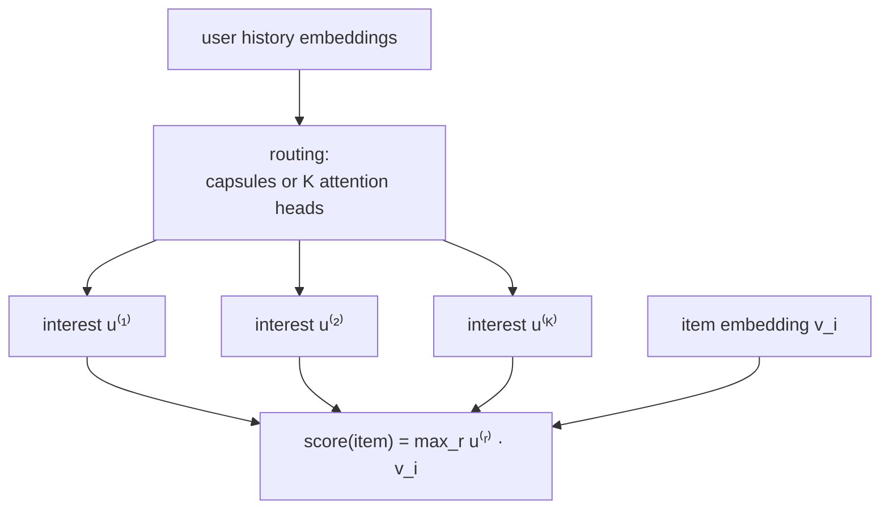

A single user embedding has to summarize everything a person likes in one vector,
which fails the moment their tastes are genuinely different. Someone who follows
both competitive chess and electronic music has two interests that point in
unrelated directions; averaging them into one vector lands in the empty space
between, recommending neither well. **Multi-interest** models give each user several
embeddings, one per interest, so the diversity is represented rather than averaged
away.

## Why one vector under-serves diverse users

Retrieval scores a candidate by $\mathbf{u}_u^\top \mathbf{v}_i$. If the user's true
tastes are two clusters with centroids $\mathbf{c}_1$ and $\mathbf{c}_2$ pointing in
different directions, the single best summary vector is roughly their average
$\frac{1}{2}(\mathbf{c}_1 + \mathbf{c}_2)$, which has *smaller* dot product with a
$\mathbf{c}_1$-aligned item than $\mathbf{c}_1$ itself would. The averaging dilutes
each interest by mixing in the others. The more distinct a user's interests, the
worse a single vector serves them, and active users are exactly the ones with many
interests.

## Multiple interest vectors and max scoring

The fix is to extract $K$ interest vectors $\{\mathbf{u}_u^{(1)}, \dots,
\mathbf{u}_u^{(K)}\}$ from the user's behavior, each capturing one cluster of taste,
and score a candidate by the **best-matching** interest<FN n="1" />:

$$
s_{u,i} = \max_{1 \le r \le K}\ \big(\mathbf{u}_u^{(r)}\big)^\top \mathbf{v}_i.
$$

The max means an item only has to align with *one* of the user's interests to score
high, so a chess item is retrieved by the chess interest without the music interest
dragging it down. At serving time each interest vector issues its own
nearest-neighbor query against the item index, and the results are merged, so a
multi-interest user simply runs $K$ retrievals instead of one.

## Extracting the interests

The interest vectors are produced from the user's history embeddings by a routing
mechanism. Two common choices:

- **Dynamic routing (capsules).** MIND clusters the history embeddings into $K$
  capsules with an iterative routing-by-agreement, each capsule converging to one
  interest<FN n="1" />.
- **Self-attention.** ComiRec-SA applies $K$ attention heads over the history,
  where head $r$ learns an attention pattern that pools the history into interest
  $r$<FN n="2" />. Each head is a learned weighted average,
  $\mathbf{u}_u^{(r)} = \sum_t a^{(r)}_t \mathbf{h}_t$, with attention weights
  $a^{(r)}_t$ over the history items $\mathbf{h}_t$. This reuses the attention
  machinery of the transformer block, pointed at extracting diverse pooled views of
  one sequence rather than one.

A **controllability** knob trades accuracy against diversity: scoring by the max
alone maximizes relevance, but a recommendation list built from all $K$ interests
can be re-balanced to cover more of them, the diversity concern of a later
discipline.

## Cross-attention towers

Multi-interest still keeps the towers separable (each interest is precomputed
user-side). A different richness axis gives up that separability: a **cross-attention**
tower lets the item attend to the user's history directly, computing a score that
depends on both sides jointly. This is strictly more expressive (it can model
"this item matches the user's third-most-recent click") but cannot be precomputed,
so it is too expensive for first-stage retrieval and is reserved for the ranking
stage, where the candidate set is already small.



## Check it on arrays

```python
import numpy as np

rng = np.random.default_rng(0)
d = 16

# Two distinct interest directions and a user whose history splits between them
c1 = np.zeros(d); c1[0] = 1.0          # interest A: axis 0
c2 = np.zeros(d); c2[1] = 1.0          # interest B: axis 1
hist = np.vstack([c1 + 0.1 * rng.normal(size=d) for _ in range(5)] +
                 [c2 + 0.1 * rng.normal(size=d) for _ in range(5)])

# Single-interest summary: the mean of the history (points between A and B)
single = hist.mean(0)

# Multi-interest: cluster the history into two interest vectors (2-means)
def two_means(X, iters=10):
    cents = X[[0, -1]].copy()
    for _ in range(iters):
        assign = np.argmin(((X[:, None] - cents[None]) ** 2).sum(-1), axis=1)
        for k in range(2):
            if (assign == k).any():
                cents[k] = X[assign == k].mean(0)
    return cents

interests = two_means(hist)

# Score a candidate aligned with interest A under both schemes
item = c1.copy()
single_score = single @ item
multi_score = max(interests[0] @ item, interests[1] @ item)
print(f"single-interest score: {single_score:.3f}")
print(f"multi-interest  score: {multi_score:.3f}")
# Max over interests recovers the A-aligned item better than the diluted mean
assert multi_score > single_score
```

The single mean vector sits between the two interests, so its dot product with an
A-aligned item is diluted; the multi-interest scheme keeps a dedicated A vector and
recovers the full alignment through the max.

## Exercises

**Exercise 1.** A user has two unit interest vectors $\mathbf{c}_1 = (1, 0)$ and
$\mathbf{c}_2 = (0, 1)$. Compute the single-vector summary $\frac{1}{2}(\mathbf{c}_1
+ \mathbf{c}_2)$ and its dot product with a $\mathbf{c}_1$-aligned item $(1, 0)$,
then compare to the multi-interest max score.

<details>
<summary>Solution</summary>

**Step 1.** Summary: $\frac{1}{2}((1,0) + (0,1)) = (0.5, 0.5)$.

**Step 2.** Single-vector score with item $(1, 0)$: $(0.5)(1) + (0.5)(0) = 0.5$.

**Step 3.** Multi-interest score: $\max(\mathbf{c}_1^\top(1,0),\ \mathbf{c}_2^\top(1,0))
= \max(1, 0) = 1$. The averaged vector halves the score; the max over interests
recovers the full alignment, a factor of two here.

</details>

**Exercise 2.** With $K$ interest vectors and an item index of $M$ items, how many
nearest-neighbor queries does a multi-interest retrieval issue per request, and what
is the cost relative to a single-interest tower? Name one downside of large $K$.

<details>
<summary>Solution</summary>

**Step 1.** Each interest vector issues one nearest-neighbor query, so $K$ queries
per request.

**Step 2.** That is $K$ times the retrieval cost of a single-interest tower (the
item index is shared; only the number of queries grows).

**Step 3.** A downside of large $K$: with too many interest slots, some capture
noise rather than real interests, and the candidate set grows with redundant or
spurious interests, raising serving cost without improving relevance.

</details>

**Exercise 3 (code).** Show the dilution scales with how different the interests
are: build histories where the two clusters are nearly identical versus nearly
orthogonal, and verify the multi-interest advantage over the single mean is larger
when the interests are more orthogonal.

<details>
<summary>Solution</summary>

```python
import numpy as np

rng = np.random.default_rng(1)
d = 16
def gap(angle_axis_apart):
    c1 = np.zeros(d); c1[0] = 1.0
    c2 = np.zeros(d)
    c2[0] = np.cos(angle_axis_apart); c2[1] = np.sin(angle_axis_apart)
    single = 0.5 * (c1 + c2)
    item = c1                                  # aligned with interest A
    multi = max(c1 @ item, c2 @ item)
    return multi - single @ item               # multi-interest advantage

near = gap(np.deg2rad(10))                      # interests almost identical
ortho = gap(np.deg2rad(90))                     # interests orthogonal
print(f"advantage  near-identical: {near:.3f}   orthogonal: {ortho:.3f}")
assert ortho > near
```

When the two interests nearly coincide the mean loses little, so multi-interest
barely helps; when they are orthogonal the mean is diluted most and the max-over-
interests advantage is largest.

</details>

This closes deep retrieval. Retrieval hands a few hundred candidates to the next
discipline, ranking, which scores them precisely with models that are allowed to
read cross features the towers could not.

<Footnotes>
  <FNItem n="1">**Li, C., Liu, Z., Wu, M., et al.** (2019). "Multi-interest network with dynamic routing for recommendation at Tmall" (MIND). *CIKM*. [arXiv:1904.08030](https://arxiv.org/abs/1904.08030). Capsule routing to extract multiple user interests and max-interest retrieval.</FNItem>
  <FNItem n="2">**Cen, Y., Zhang, J., Zou, X., Zhou, C., Yang, H., & Tang, J.** (2020). "Controllable multi-interest framework for recommendation" (ComiRec). *KDD*. [arXiv:2005.09347](https://arxiv.org/abs/2005.09347). Self-attentive multi-interest extraction and the accuracy/diversity controllability knob.</FNItem>
</Footnotes>
