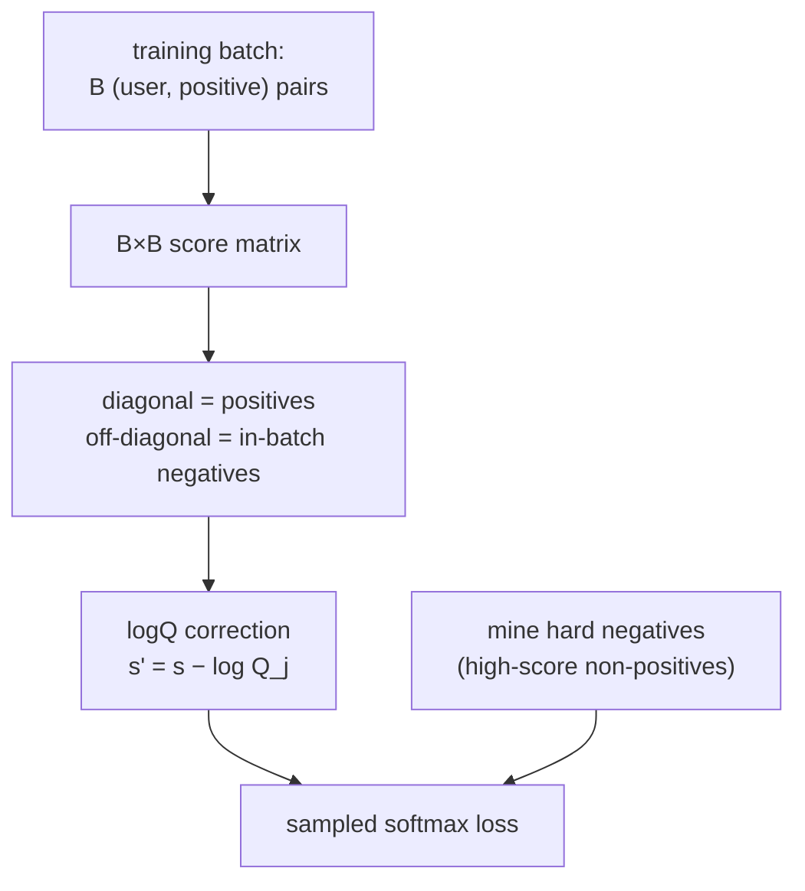

A retrieval tower learns by contrast: pull the user's embedding toward items they
engaged with, push it away from items they did not. The catch is that "items they
did not" is essentially the whole catalog, millions of items, and computing a
softmax over all of them per step is impossible. The training trick is to score
against a small sample of negatives instead, and the quality of that sample, random
versus hard, in-batch versus dedicated, is what separates a tower that barely
learns from one that retrieves well.

## Sampled softmax and in-batch negatives

The ideal objective is a softmax over the full catalog: for a user $u$ with a
positive item $i^+$, maximize

$$
P(i^+ \mid u) = \frac{\exp(s_{u, i^+})}{\sum_{j \in \text{catalog}} \exp(s_{u, j})},
\qquad s_{u,j} = \mathbf{u}_u^\top \mathbf{v}_j.
$$

The denominator is intractable, so it is approximated over a sampled set of
negatives. The cheapest source of negatives is already in hand: a training **batch**
pairs $B$ users with their $B$ positive items, and for any one user, the *other*
users' positives serve as negatives, since a random other item is almost certainly
something this user did not pick<FN n="1" />. This **in-batch** scheme computes a
$B \times B$ score matrix and treats its diagonal as positives, getting $B - 1$
negatives per user for free, with no extra lookups.

## The popularity bias and logQ correction

In-batch negatives are not uniform: a popular item appears as a positive in many
batches, so it shows up as a negative far more often than a rare item. The softmax
then over-penalizes popular items, suppressing them in retrieval even when they are
good. The fix is the **logQ correction**: subtract the log sampling probability of
each negative from its score before the softmax<FN n="2" />,

$$
s'_{u,j} = s_{u,j} - \log Q_j,
$$

where $Q_j$ is the probability item $j$ was sampled as a negative (estimated from
its frequency). Down-weighting frequent negatives by $\log Q_j$ removes the
popularity bias, restoring the uniform-negative objective the math assumed.

## Why random negatives plateau, and hard negatives

A random negative is usually *easy*: an item so unrelated to the user that the
model already scores it low, so it contributes almost no gradient. Once the model
clears the easy negatives, training stalls while the hard cases, items that look
relevant but are not, remain mis-ranked. **Hard negatives** are negatives with high
current similarity to the user, the near-misses, and they carry the large gradients
that sharpen the decision boundary<FN n="3" />. They are mined by scoring a larger
candidate pool and keeping the highest-scoring non-positives, or by re-using the
hardest in-batch negatives. The practical recipe mixes both: in-batch (easy, cheap,
many) plus a few mined hard negatives (expensive, informative), since hard negatives
alone are unstable and can amplify label noise.



## Check it on arrays

```python
import numpy as np

rng = np.random.default_rng(0)

def softmax_ce(scores, pos_index):
    # cross-entropy of the positive under a softmax over all candidate scores
    z = scores - scores.max()
    logp = z - np.log(np.exp(z).sum())
    return -logp[pos_index]

# One user, one positive, and two candidate negatives: easy vs hard
u = np.array([1.0, 0.0])
pos = np.array([0.9, 0.1])               # the true item (high dot with u)
easy_neg = np.array([-1.0, 0.2])         # points away from u: low score
hard_neg = np.array([0.8, 0.3])          # points near u: high score (near-miss)

s_easy = np.array([u @ pos, u @ easy_neg])
s_hard = np.array([u @ pos, u @ hard_neg])

loss_easy = softmax_ce(s_easy, pos_index=0)
loss_hard = softmax_ce(s_hard, pos_index=0)
print(f"loss with easy negative: {loss_easy:.4f}")
print(f"loss with hard negative: {loss_hard:.4f}")
# The hard negative is harder to separate, so it produces a larger loss/gradient
assert loss_hard > loss_easy

# In-batch negatives: B users, the off-diagonal of the score matrix are negatives
B, d = 6, 4
Uemb = rng.normal(size=(B, d))
Vemb = rng.normal(size=(B, d))
S = Uemb @ Vemb.T                         # B x B, diagonal = positives
losses = [softmax_ce(S[i], pos_index=i) for i in range(B)]
print(f"mean in-batch softmax loss over {B} users: {np.mean(losses):.4f}")
```

The hard negative, which the model currently scores almost as high as the positive,
produces a larger loss than the easy one, which is exactly the gradient signal that
random sampling fails to deliver; the in-batch block shows how the same loss is read
off a batch score matrix with no extra item lookups.

## Exercises

**Exercise 1.** A training batch has $512$ user-positive pairs. Using the in-batch
scheme, how many negatives does each user get, and how many item-tower forward
passes does this require compared to sampling $512$ dedicated negatives per user?

<details>
<summary>Solution</summary>

**Step 1.** Each user uses the other $511$ positives as negatives, so $B - 1 = 511$
negatives per user, for free.

**Step 2.** In-batch needs only the $512$ item-tower passes already computed for the
positives. Dedicated sampling of $512$ negatives per user would need
$512 \times 512 = 262{,}144$ additional item-tower passes.

**Step 3.** In-batch negatives turn one batch of $512$ item embeddings into
$512 \times 511$ training signals at no extra encoding cost, which is why they are
the default.

</details>

**Exercise 2.** An item appears as a positive in $1\%$ of batches, so its in-batch
negative sampling probability is roughly $Q_j = 0.01$. By how much does the logQ
correction shift its score, and which direction does that move its softmax
contribution?

<details>
<summary>Solution</summary>

**Step 1.** The correction subtracts $\log Q_j = \log 0.01 \approx -4.605$, so
$s'_{u,j} = s_{u,j} - (-4.605) = s_{u,j} + 4.605$.

**Step 2.** Adding to a negative's score raises its softmax weight in the
denominator. Frequent negatives (large $Q_j$, less negative $\log Q_j$) get a
smaller boost; rare negatives get a larger one.

**Step 3.** Relative to no correction, popular items (which appear as negatives
often) are penalized less, undoing the over-suppression that uncorrected in-batch
sampling causes.

</details>

**Exercise 3 (code).** Mine the hardest negative from a candidate pool: given a user
embedding and a set of non-positive item embeddings, select the one with the highest
dot product and verify it yields a larger softmax loss than a uniformly random pick
from the same pool.

<details>
<summary>Solution</summary>

```python
import numpy as np

rng = np.random.default_rng(2)
d = 8
u = rng.normal(size=d)
pos = u + 0.1 * rng.normal(size=d)            # positive: close to u
pool = rng.normal(size=(50, d))               # candidate negatives

def softmax_ce(scores, pos_index=0):
    z = scores - scores.max()
    return -(z - np.log(np.exp(z).sum()))[pos_index]

scores_pool = pool @ u
hard = pool[scores_pool.argmax()]             # highest-scoring negative
rand = pool[rng.integers(len(pool))]          # uniformly random negative

loss_hard = softmax_ce(np.array([u @ pos, u @ hard]))
loss_rand = softmax_ce(np.array([u @ pos, u @ rand]))
assert loss_hard >= loss_rand
print(f"hard-negative loss {loss_hard:.4f} >= random-negative loss {loss_rand:.4f}")
```

The mined hard negative scores closest to the positive among the pool, so separating
it costs the most loss, concentrating training on the boundary cases.

</details>

The next lesson keeps the embedding idea but changes the encoder: graph neural
networks that propagate signal along the user-item interaction graph.

<Footnotes>
  <FNItem n="1">**Yi, X., Yang, J., Hong, L., et al.** (2019). "Sampling-bias-corrected neural modeling for large corpus item recommendations". *RecSys*. [doi:10.1145/3298689.3346996](https://doi.org/10.1145/3298689.3346996). In-batch negatives and the logQ correction for two-tower retrieval.</FNItem>
  <FNItem n="2">**Bengio, Y., & Senécal, J.-S.** (2008). "Adaptive importance sampling to accelerate training of a neural probabilistic language model". *IEEE Transactions on Neural Networks*, 19(4), 713-722. [doi:10.1109/TNN.2007.912312](https://doi.org/10.1109/TNN.2007.912312). Sampled softmax and the importance-correction it requires.</FNItem>
  <FNItem n="3">**Xiong, L., Xiong, C., Li, Y., et al.** (2021). "Approximate nearest neighbor negative contrastive learning for dense text retrieval". *ICLR*. [arXiv:2007.00808](https://arxiv.org/abs/2007.00808). Mining hard negatives with an ANN index to sharpen retrieval.</FNItem>
</Footnotes>
