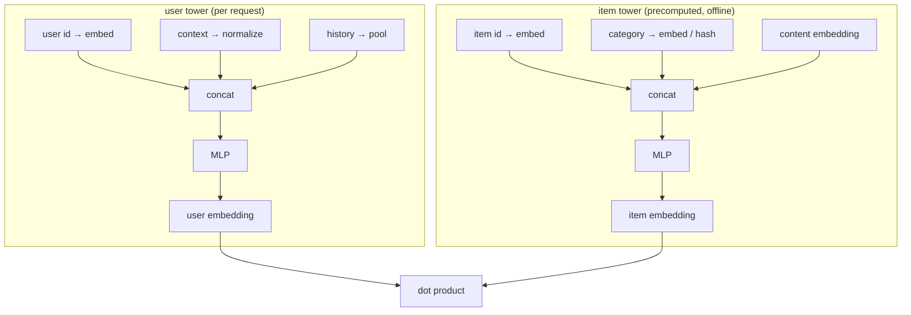

A two-tower model is only as good as what each tower reads. The architecture
fixes the shape (a user encoder, an item encoder, a dot product), but the inputs
are a design problem: a user is not a single id, it is an id plus a country, a
device, a list of recently-clicked items, an account age. This lesson is about
turning that heterogeneous bundle into the fixed-width vector each tower consumes,
and the rule that decides which feature goes in which tower.

## What goes in which tower

The defining constraint of the two-tower design is that the towers cannot see
each other at scoring time: the item tower must produce an embedding that is
precomputed and indexed offline, with no knowledge of the query user, so retrieval
is a nearest-neighbor lookup. That forces a clean split.

- **User tower:** everything known about the request, the user id, their history,
  context (time, device, location). It runs once per request.
- **Item tower:** everything intrinsic to the item, its id, category, content
  embedding, age. It runs once per item, offline, and the result is cached.
- **Interaction features** (this user's past rating of this item's category) cannot
  go in either tower, because they depend on both sides. They belong to the ranking
  stage, which scores user-item *pairs* and is the subject of a later discipline.

Putting a cross feature in a tower silently breaks the precompute: the item
embedding would change per user, and the offline index would be wrong.

## Three feature types, three encodings

Each raw field becomes vector input through one of three paths.

**Categorical (id-like).** A user id, item id, or country maps through an
**embedding lookup**: an integer index selects a row of a learned table. The table
is the bulk of the parameters, one row per category value.

**High-cardinality categorical.** When the value space is huge or open (search
queries, raw URLs, long-tail ids), a dedicated row per value is infeasible, so the
**hashing trick** maps the value into a fixed number of buckets $B$ with a hash
function $h(\cdot) \bmod B$, and the bucket indexes a smaller table<FN n="1" />.
Collisions are accepted as noise; the table size $B$ trades memory against collision
rate, the subject of the next lesson.

**Dense numeric.** Counts, ages, and scores are real numbers. They are normalized
(standardized, or bucketized into quantiles and embedded) and concatenated, never
fed raw, since an unnormalized count in the thousands would dominate the gradient.

The tower then concatenates the per-field vectors and passes them through an MLP to
the final embedding, so the towers learn interactions *within* a side while keeping
the two sides separable.



## Pooling a variable-length history

A user's clicked-item history has variable length, but the tower needs a fixed
width. The standard reduction is **mean pooling** the embeddings of the history
items (sum pooling normalized by count), which is permutation-invariant and
length-stable. It discards order, which the sequential models of a later lesson
recover; for a retrieval tower, a pooled bag of recent items is a strong, cheap
summary of taste<FN n="2" />.

## The torch shape

```python-static
import torch
import torch.nn as nn

class UserTower(nn.Module):
    def __init__(self, n_users, n_ctx, n_items, d=32, hidden=64, out=32):
        super().__init__()
        self.user_emb = nn.Embedding(n_users, d)
        self.ctx_emb = nn.Embedding(n_ctx, d)        # e.g. device bucket
        self.item_emb = nn.Embedding(n_items, d)     # shared with history pooling
        self.mlp = nn.Sequential(
            nn.Linear(3 * d, hidden), nn.ReLU(), nn.Linear(hidden, out)
        )

    def forward(self, user_id, ctx_id, history_ids, history_mask):
        u = self.user_emb(user_id)
        c = self.ctx_emb(ctx_id)
        # mean-pool the variable-length history with a mask
        h = self.item_emb(history_ids)                       # (B, L, d)
        h = (h * history_mask.unsqueeze(-1)).sum(1)
        h = h / history_mask.sum(1, keepdim=True).clamp(min=1)
        return self.mlp(torch.cat([u, c, h], dim=-1))        # (B, out)
```

The user tower reads an id, a context bucket, and a masked mean of history, then
projects to the shared embedding space; the item tower mirrors it with intrinsic
fields only.

## Check it on arrays

```python
import numpy as np

# Mean-pooling a masked, variable-length history (numpy version of the tower step)
rng = np.random.default_rng(0)
B, L, d = 4, 5, 8
item_emb = rng.normal(size=(B, L, d))            # history item embeddings
mask = np.array([[1,1,1,0,0],
                 [1,1,1,1,1],
                 [1,0,0,0,0],
                 [1,1,0,0,0]], dtype=float)        # variable lengths

pooled = (item_emb * mask[..., None]).sum(1) / mask.sum(1, keepdims=True).clip(min=1)

# Pooling is invariant to the order of the unmasked history items
perm = item_emb.copy()
perm[1] = perm[1][[4,3,2,1,0]]                     # reverse row 1's history
pooled_perm = (perm * mask[..., None]).sum(1) / mask.sum(1, keepdims=True).clip(min=1)
assert np.allclose(pooled[1], pooled_perm[1])      # order does not change the mean

# A user with one history item pools to exactly that item's embedding
assert np.allclose(pooled[2], item_emb[2, 0])
print("pooled shape:", pooled.shape, "| order-invariant and length-stable")
```

Masked mean pooling collapses any history length to one vector, ignores order, and
reduces to the single item when only one is present, the three properties a tower
needs from its history summary.

## Exercises

**Exercise 1.** A teammate proposes adding "number of times this user clicked this
item's brand in the last week" as a feature in the item tower. Explain why this
breaks the two-tower precompute, and where the feature belongs instead.

<details>
<summary>Solution</summary>

**Step 1.** The feature depends on both the user (who clicked) and the item's brand,
so it is an interaction feature, not intrinsic to the item.

**Step 2.** The item tower's output must be computable offline without a user, so
its embedding can be indexed once and reused for every query. A feature that varies
per user would make the item embedding user-dependent, defeating the precompute.

**Step 3.** The feature belongs to the **ranking stage**, which scores user-item
pairs after retrieval and is allowed to read cross features.

</details>

**Exercise 2.** A categorical field has $50{,}000$ possible values but you allocate
a hash table of $B = 10{,}000$ buckets. Assuming a uniform hash, what is the
expected number of distinct values colliding into one bucket, and name one cost of
that collision.

<details>
<summary>Solution</summary>

**Step 1.** With $50{,}000$ values spread uniformly over $10{,}000$ buckets, each
bucket holds $50{,}000 / 10{,}000 = 5$ distinct values in expectation.

**Step 2.** Those five values share one embedding row, so the model cannot
distinguish them; their gradients are averaged into the same parameters.

**Step 3.** The cost is lost resolution: two genuinely different values that
collide are forced to the same representation, which adds noise to the affected
predictions. Larger $B$ reduces it at the cost of memory.

</details>

**Exercise 3 (code).** Mean pooling weights every history item equally. Implement
*recency-weighted* pooling where the most recent item gets the largest weight (use
weights proportional to position), and verify it differs from the plain mean when
the history items are not identical.

<details>
<summary>Solution</summary>

```python
import numpy as np

rng = np.random.default_rng(1)
L, d = 5, 8
hist = rng.normal(size=(L, d))            # ordered oldest -> newest

plain = hist.mean(0)
w = np.arange(1, L + 1, dtype=float)      # 1..L, newest largest
w = w / w.sum()
recency = (hist * w[:, None]).sum(0)

assert not np.allclose(plain, recency)    # weighting changes the summary
# Recency pooling leans toward the newest item more than the mean does
assert np.linalg.norm(recency - hist[-1]) < np.linalg.norm(plain - hist[-1])
print("recency-weighted pooling shifts the summary toward recent items")
```

Weighting by position pulls the pooled vector toward the most recent item, a cheap
way to inject order back into a bag-of-history tower without a full sequence model.

</details>

The next lesson zooms into the embedding tables these towers depend on: how to
size them, how the hashing trick controls memory, and what collisions cost.

<Footnotes>
  <FNItem n="1">**Weinberger, K., Dasgupta, A., Langford, J., Smola, A., & Attenberg, J.** (2009). "Feature hashing for large scale multitask learning". *ICML*. [doi:10.1145/1553374.1553516](https://doi.org/10.1145/1553374.1553516). The hashing trick for high-cardinality categorical features.</FNItem>
  <FNItem n="2">**Covington, P., Adams, J., & Sargin, E.** (2016). "Deep neural networks for YouTube recommendations". *RecSys*. [doi:10.1145/2959100.2959190](https://doi.org/10.1145/2959100.2959190). Tower features, history pooling, and the retrieval/ranking split in production.</FNItem>
</Footnotes>
