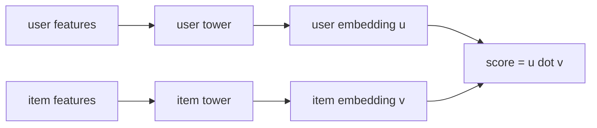

Matrix factorization gives each user and item one fixed embedding from the
interaction matrix alone. **Two-tower models** generalize MF by computing
the embeddings with **neural networks** that consume features (user
demographics, item content, context)<FN n="1" />. The dot-product scoring rule survives,
which is what lets two-tower models scale to billion-item catalogs through
approximate nearest-neighbor retrieval.

## The architecture

Two independent **towers** (encoders), one for users and one for items, each
producing a $k$-dimensional embedding:

$$
\mathbf{u}_u = f_\phi(\text{user features}), \qquad \mathbf{v}_i = g_\theta(\text{item features}).
$$

The score is the dot product (or cosine):

$$
s(u, i) = \mathbf{u}_u^\top \mathbf{v}_i.
$$

Two key design choices flow from this:

- **Independence at scoring time.** The user tower depends only on user
  features, the item tower only on item features. The interaction happens
  only through the dot product at the end. This means item embeddings can
  be **precomputed** and indexed; at serving time, only the user embedding
  is computed online, and retrieval is a dot-product search.
- **Cold-start fix.** Because the towers consume *features*, a brand-new
  item with no interactions can still get an embedding from its content
  features. MF cannot do this without retraining.

## Training

Pose retrieval as a classification problem: for each observed (user, item)
positive pair, sample $K$ random items as in-batch negatives and minimize
softmax cross-entropy:

$$
L = -\log \frac{\exp(\mathbf{u}_u^\top \mathbf{v}_{i^+})}{\sum_{j \in \text{batch}}\exp(\mathbf{u}_u^\top \mathbf{v}_j)}.
$$

In-batch negatives are nearly free (the items already in the batch). Each
batch has many positives, each providing implicit negatives via the other
items. Practitioners add explicit **hard negatives** (items that look like
positives but are not) to focus learning on confusable cases.

## Approximate nearest neighbor at serving time

Two-tower models meet ANN at retrieval:

1. **Offline**: encode every item to $\mathbf{v}_i$, build an HNSW or IVF
   index over $\{\mathbf{v}_i\}$.
2. **Online**: encode the user to $\mathbf{u}_u$, ANN-search the item index
   for top-$N$ matches.

This is why dot-product (or cosine) is non-negotiable: ANN indices over
arbitrary score functions do not exist at production scale, but for
dot-product they do. The C8 lessons cover the index structures.

## Why "two-tower" and not "one big network"

A cross-feature model (concatenate user and item, pass through one network)
would be more expressive but cannot precompute item embeddings<FN n="2" />: every
(user, item) pair needs a forward pass at serving time. For a catalog of
millions of items per query, this is too slow.

The cost gap is concrete. For a catalog of $M = 10^6$ items, the
cross-feature model needs one forward pass per (user, item) pair, so
$10^6$ network evaluations per query. The two-tower model runs the user
tower once, then searches a precomputed index: an HNSW graph reaches the
top matches in a few hundred distance comparisons, scaling like $\log M$
rather than $M$ ($\log_2 10^6 \approx 20$). Even brute-force scoring against
the precomputed item embeddings is $M$ cheap dot products, not $M$ full
forward passes. The dot-product score is what makes the index possible, so
it is non-negotiable.

Two-tower is the design that gives you neural expressiveness in the towers
*and* sub-linear retrieval via ANN at serving time. It is the dominant
architecture for industrial-scale recommendation **retrieval** (the first
stage that narrows millions of items to thousands; a downstream **ranker**
then scores the survivors with richer cross-features).

## Extensions

- **Multi-task** towers train on multiple objectives (click, dwell, like)
  simultaneously, sharing the user and item representations.
- **Sequence models in the user tower** (next lesson) consume the user's
  recent history rather than static features.
- **Calibration heads** map dot-product scores to probabilities for
  downstream ranking.



## Check it on arrays

```python
import numpy as np

rng = np.random.default_rng(0)

# Synthetic data: user features -> latent preference; item features -> latent properties
n_users, n_items, d_feat, k = 200, 100, 8, 4
U_feat = rng.normal(size=(n_users, d_feat))
I_feat = rng.normal(size=(n_items, d_feat))

# True interaction = dot product of low-dimensional projections (linear two-tower)
W_user_true = rng.normal(size=(d_feat, k))
W_item_true = rng.normal(size=(d_feat, k))
U_emb_true = U_feat @ W_user_true
I_emb_true = I_feat @ W_item_true
scores_true = U_emb_true @ I_emb_true.T
# Positive interactions: top-3 items per user
positives = np.argsort(-scores_true, axis=1)[:, :3]

def two_tower_train(U_feat, I_feat, positives, k=4, lr=0.1, epochs=200, n_neg=8):
    W_u = rng.normal(scale=0.1, size=(U_feat.shape[1], k))
    W_i = rng.normal(scale=0.1, size=(I_feat.shape[1], k))
    n_u, n_i = U_feat.shape[0], I_feat.shape[0]
    for _ in range(epochs):
        # Sample random user-positive-negatives triplets
        u = rng.integers(0, n_u)
        i_pos = int(positives[u, rng.integers(0, positives.shape[1])])
        i_negs = rng.integers(0, n_i, size=n_neg)
        u_emb = U_feat[u] @ W_u
        v_pos = I_feat[i_pos] @ W_i
        v_negs = I_feat[i_negs] @ W_i                   # (n_neg, k)
        # Softmax over (pos, negs)
        logits = np.array([u_emb @ v_pos] + list(v_negs @ u_emb))
        logits -= logits.max()
        p = np.exp(logits); p /= p.sum()
        # Softmax CE gradient: delta = p - one_hot(target)
        target = np.zeros_like(p); target[0] = 1
        delta = p - target                              # (1 + n_neg,)
        v_all = np.vstack([v_pos[None, :], v_negs])     # (1+n_neg, k)
        # Gradient wrt W_u: U_feat[u] outer (sum_j delta_j * v_j)
        grad_Wu = np.outer(U_feat[u], delta @ v_all)
        # Gradient wrt W_i: sum_j delta_j * I_feat[item_j] outer u_emb
        items = [i_pos] + list(i_negs)
        grad_Wi = np.zeros_like(W_i)
        for j, item in enumerate(items):
            grad_Wi += np.outer(I_feat[item], delta[j] * u_emb)
        W_u -= lr * grad_Wu / (n_neg + 1)
        W_i -= lr * grad_Wi / (n_neg + 1)
    return W_u, W_i

W_u_hat, W_i_hat = two_tower_train(U_feat, I_feat, positives, k=4, epochs=2000)

U_emb = U_feat @ W_u_hat
I_emb = I_feat @ W_i_hat
scores_hat = U_emb @ I_emb.T

# Recall@10: how often are the true positives in the top-10 predicted?
top10 = np.argsort(-scores_hat, axis=1)[:, :10]
recall = []
for u in range(n_users):
    hits = len(set(positives[u]).intersection(top10[u]))
    recall.append(hits / 3)
print(f"recall@10 over users: mean={np.mean(recall):.3f}, std={np.std(recall):.3f}")
```

The learned two-tower model recovers most true positives in the top-10.

## Exercises

**Exercise 1.** A query batch has one user embedding $\mathbf{u} = (1, 2)$ and
three candidate item embeddings: the positive $\mathbf{v}^+ = (1, 1)$ and two
in-batch negatives $\mathbf{v}_1 = (2, 0)$, $\mathbf{v}_2 = (0, -1)$. Compute the
in-batch softmax cross-entropy loss
$L = -\log \frac{\exp(\mathbf{u}^\top \mathbf{v}^+)}{\sum_j \exp(\mathbf{u}^\top \mathbf{v}_j)}$.

<details>
<summary>Solution</summary>

**Step 1.** Score each candidate by the dot product:
$\mathbf{u}^\top \mathbf{v}^+ = 1\cdot1 + 2\cdot1 = 3$,
$\mathbf{u}^\top \mathbf{v}_1 = 1\cdot2 + 2\cdot0 = 2$,
$\mathbf{u}^\top \mathbf{v}_2 = 1\cdot0 + 2\cdot(-1) = -2$.

**Step 2.** Exponentiate: $e^{3} \approx 20.086$, $e^{2} \approx 7.389$,
$e^{-2} \approx 0.135$. The denominator is
$20.086 + 7.389 + 0.135 = 27.610$.

**Step 3.** The softmax probability of the positive is
$20.086 / 27.610 \approx 0.7275$, so

$$
L = -\log(0.7275) \approx 0.318.
$$

The positive outscores both negatives, so the probability mass on it is high and
the loss is small.

</details>

**Exercise 2.** A catalog has $M = 10^6$ items. A cross-feature model needs one
forward pass per (user, item) pair; a two-tower model runs the user tower once
and then searches an HNSW index whose work scales like $\log_2 M$ distance
comparisons. Compare the per-query work of the two designs, and explain why the
dot-product score is the load-bearing assumption.

<details>
<summary>Solution</summary>

**Step 1.** The cross-feature model evaluates the network once per candidate, so
a single query costs $M = 10^6$ forward passes; the score of a (user, item) pair
cannot be reused because the network mixes both inputs.

**Step 2.** The two-tower model computes the user embedding with one forward
pass, then traverses the index. With $\log_2 10^6 \approx 20$, the HNSW search
reaches the top matches in on the order of a few hundred distance comparisons,
each a cheap $k$-dimensional dot product, not a full network evaluation. Even
brute-force scoring against precomputed item vectors is $M$ cheap dot products
rather than $M$ forward passes.

**Step 3.** The index only works because the score factorizes as
$\mathbf{u}^\top \mathbf{v}$: item embeddings can be precomputed independently of
the query, and dot-product (or cosine) is exactly the geometry ANN structures
index. An arbitrary cross-feature score has no such structure, so it cannot be
precomputed or indexed, which is why the dot-product form is non-negotiable for
retrieval.

</details>

**Exercise 3 (code).** Implement in-batch softmax retrieval scoring: given a
batch of user embeddings and item embeddings where item $j$ is the true positive
for user $j$, compute the in-batch cross-entropy loss, then verify that
sharpening the embeddings (scaling them up) lowers the loss when the positives
are already the top match.

<details>
<summary>Solution</summary>

```python
import numpy as np

rng = np.random.default_rng(0)

B, k = 12, 16
# Near-orthogonal users (mostly along distinct axes), item j a noisy copy of user j
U = np.eye(B, k) + 0.1 * rng.normal(size=(B, k))
V = U + 0.05 * rng.normal(size=(B, k))

def in_batch_loss(U, V):
    logits = U @ V.T                                 # (B, B): row u, col item
    logits -= logits.max(axis=1, keepdims=True)
    logp = logits - np.log(np.exp(logits).sum(axis=1, keepdims=True))
    return -np.mean(np.diag(logp))                   # positives on the diagonal

# Confirm the diagonal is already the argmax (positives are top match)
assert np.all(np.argmax(U @ V.T, axis=1) == np.arange(B))

loss_base = in_batch_loss(U, V)
loss_sharp = in_batch_loss(2.0 * U, 2.0 * V)         # scale up -> sharper softmax

assert loss_sharp < loss_base
print(f"loss: base {loss_base:.4f} -> sharpened {loss_sharp:.4f}")
```

When the positive is already the highest-scoring candidate, scaling the
embeddings sharpens the softmax onto it and drives the in-batch loss down, which
is the pressure training puts on the towers.

</details>

The next lesson takes the user tower further by consuming sequences instead of
static features.

<Footnotes>
  <FNItem n="1">**Covington, P., Adams, J., & Sargin, E.** (2016). "Deep neural networks for YouTube recommendations". *RecSys*. [doi:10.1145/2959100.2959190](https://doi.org/10.1145/2959100.2959190). The two-stage retrieval/ranking split and the neural candidate-generation tower.</FNItem>
  <FNItem n="2">**He, X., Liao, L., Zhang, H., Nie, L., Hu, X., & Chua, T.-S.** (2017). "Neural collaborative filtering". *WWW*. [arXiv:1708.05031](https://arxiv.org/abs/1708.05031). Replacing the MF dot product with learned neural interaction functions.</FNItem>
</Footnotes>
