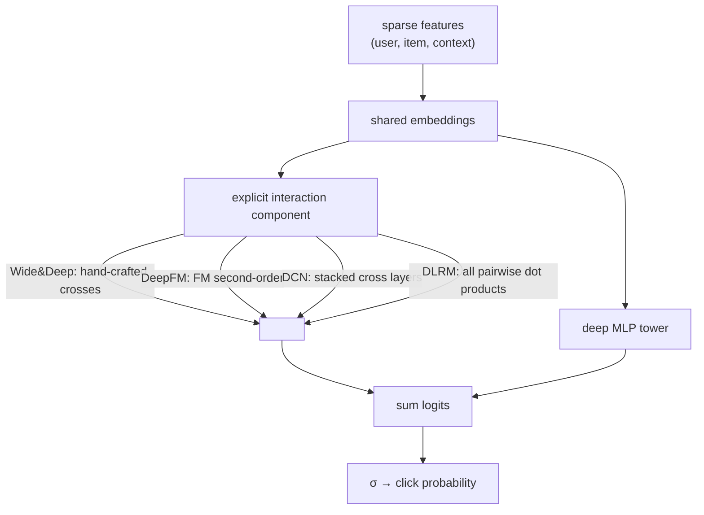

A linear CTR model cannot represent feature interactions: the effect of "user from
Brazil" and the effect of "item is a football jersey" add, but the *combination* is
worth far more than the sum, and a linear model has no term for it. The family of
deep CTR architectures is a set of answers to one question: how do you get a model
to learn high-order feature crosses automatically, instead of hand-engineering every
one? Each named model (Wide&Deep, DeepFM, DCN, DLRM) is a different way to combine an
explicit cross component with a deep network.

## Why crosses need their own component

A plain MLP over embeddings can in principle approximate any interaction, but in
practice it learns *bounded-degree* crosses inefficiently: representing an explicit
multiplicative interaction $x_i x_j$ with ReLU layers takes many units and a lot of
data. CTR features are sparse and the useful crosses are often low-order
(feature-pair conjunctions), so a dedicated component that forms crosses *explicitly*
is far more sample-efficient than hoping an MLP discovers them. The architectures
below all pair such a component with a deep tower.

## The four architectures

- **Wide & Deep** runs a wide linear model (on hand-crafted cross features, the
  "memorization" path) alongside a deep MLP on embeddings (the "generalization"
  path), and sums their logits<FN n="1" />. The wide part memorizes frequent
  feature conjunctions seen in training; the deep part generalizes to unseen ones.
- **DeepFM** replaces the hand-crafted wide part with a **factorization machine**, so
  the second-order crosses are learned automatically through factorized embeddings
  (the FM lesson), and shares those embeddings with a parallel deep MLP<FN n="2" />.
  It removes Wide&Deep's manual feature engineering.
- **DCN (Deep & Cross Network)** stacks explicit **cross layers** that compute
  $\mathbf{x}_{l+1} = \mathbf{x}_0 \mathbf{x}_l^\top \mathbf{w}_l + \mathbf{b}_l + \mathbf{x}_l$,
  each layer raising the interaction degree by one, so $L$ layers produce up to
  degree-$(L{+}1)$ crosses with few parameters, alongside a deep tower.
- **DLRM** (Facebook's reference design) embeds every categorical feature, computes
  **all pairwise dot products** among the embeddings and the processed dense
  features, then feeds the interactions through a top MLP. It is the FM idea made
  explicit and dense, engineered for throughput on recommendation hardware.

They differ in *how* crosses are formed (manual, factorized, stacked, dotted) but
share the template: an explicit interaction component plus a deep component,
combined into one logit trained with the pointwise cross-entropy of the previous
lessons.



## The DeepFM shape

```python-static
import torch
import torch.nn as nn

class DeepFM(nn.Module):
    def __init__(self, field_dims, d=16, hidden=(64, 32)):
        super().__init__()
        self.embeds = nn.ModuleList([nn.Embedding(n, d) for n in field_dims])
        self.linear = nn.ModuleList([nn.Embedding(n, 1) for n in field_dims])
        layers, in_dim = [], d * len(field_dims)
        for h in hidden:
            layers += [nn.Linear(in_dim, h), nn.ReLU()]; in_dim = h
        layers += [nn.Linear(in_dim, 1)]
        self.mlp = nn.Sequential(*layers)

    def forward(self, x):                                  # x: (B, num_fields) indices
        embs = torch.stack([e(x[:, f]) for f, e in enumerate(self.embeds)], 1)  # (B,F,d)
        # FM second-order term via the linear-time identity
        s = embs.sum(1)
        fm = 0.5 * (s.pow(2) - embs.pow(2).sum(1)).sum(1, keepdim=True)
        lin = sum(l(x[:, f]) for f, l in enumerate(self.linear))               # (B,1)
        deep = self.mlp(embs.flatten(1))                                       # (B,1)
        return torch.sigmoid(lin + fm + deep).squeeze(1)
```

The FM term and the deep MLP share the same embeddings and their logits add, so one
model learns explicit second-order crosses and free-form deep interactions at once.

## Check it on arrays

```python
import numpy as np

rng = np.random.default_rng(0)

# XOR-like target: click iff exactly one of two binary features is on.
# This is NOT linearly separable; it needs the cross term x1*x2.
N = 4000
x1 = rng.integers(0, 2, N).astype(float)
x2 = rng.integers(0, 2, N).astype(float)
y = (x1 != x2).astype(float)                       # XOR

def fit_logistic(X, y, epochs=400, lr=0.3):
    w = np.zeros(X.shape[1])
    for _ in range(epochs):
        p = 1 / (1 + np.exp(-(X @ w)))
        w -= lr * (X.T @ (p - y)) / len(y)
    return w

def acc(X, w, y):
    return ((1 / (1 + np.exp(-(X @ w))) > 0.5) == y).mean()

bias = np.ones((N, 1))
X_lin = np.c_[bias, x1, x2]                         # linear features only
X_cross = np.c_[bias, x1, x2, x1 * x2]              # add the explicit cross

w_lin = fit_logistic(X_lin, y)
w_cross = fit_logistic(X_cross, y)
print(f"linear-only accuracy : {acc(X_lin, w_lin, y):.3f}")
print(f"with cross term       : {acc(X_cross, w_cross, y):.3f}")
# The cross term is necessary: linear cannot exceed chance on XOR, cross solves it
assert acc(X_cross, w_cross, y) > acc(X_lin, w_lin, y) + 0.2
```

The linear model is stuck near chance because XOR has no linear decision boundary,
while adding the single explicit cross feature $x_1 x_2$ makes it perfectly
separable, which is exactly the work the FM, cross, and dot-product components do
automatically across thousands of feature pairs.

## Exercises

**Exercise 1.** In Wide&Deep, which path (wide or deep) is responsible for
memorizing that the specific conjunction "installed app A and impression app B"
predicts a click, and which generalizes to a never-seen app pair? Explain.

<details>
<summary>Solution</summary>

**Step 1.** The **wide** linear path takes hand-crafted cross features (like the
app-A-and-app-B conjunction) and assigns each a weight, memorizing exact
combinations seen in training.

**Step 2.** The **deep** path embeds the apps and passes them through an MLP, so it
can score a pair it never saw by interpolating in embedding space.

**Step 3.** Memorization is the wide path (exact, seen combinations), generalization
is the deep path (smooth, unseen combinations); summing their logits gets both.

</details>

**Exercise 2.** A DCN cross layer computes
$\mathbf{x}_{l+1} = \mathbf{x}_0\mathbf{x}_l^\top\mathbf{w}_l + \mathbf{b}_l + \mathbf{x}_l$.
Argue that with $\mathbf{x}_0$ containing degree-1 features, $L$ stacked cross layers
can represent interactions up to degree $L + 1$.

<details>
<summary>Solution</summary>

**Step 1.** $\mathbf{x}_1$ multiplies $\mathbf{x}_0$ (degree 1) by a scalar formed
from $\mathbf{x}_0^\top\mathbf{w}$ (degree 1), producing degree-2 terms (plus the
residual $\mathbf{x}_0$).

**Step 2.** Inductively, $\mathbf{x}_l$ contains terms up to degree $l + 1$;
multiplying by $\mathbf{x}_0$ (degree 1) in the next layer raises the maximum degree
by one to $l + 2$.

**Step 3.** After $L$ layers the highest-degree term is degree $L + 1$, so the
explicit cross depth is controlled by the number of stacked layers, with each layer
adding one degree at the cost of one weight vector.

</details>

**Exercise 3 (code).** Show that even a single hidden-layer MLP can solve XOR (unlike
the linear model), confirming that crosses can also be learned implicitly, just less
directly than with an explicit cross term.

<details>
<summary>Solution</summary>

```python
import numpy as np

rng = np.random.default_rng(0)
N = 2000
x1 = rng.integers(0, 2, N).astype(float)
x2 = rng.integers(0, 2, N).astype(float)
X = np.c_[x1, x2]; y = (x1 != x2).astype(float)

# 1-hidden-layer MLP (2->4->1) trained by manual backprop
H = 4
W1 = rng.normal(scale=1.0, size=(2, H)); b1 = np.zeros(H)
W2 = rng.normal(scale=1.0, size=(H, 1)); b2 = np.zeros(1)
lr = 0.5
for _ in range(3000):
    z1 = X @ W1 + b1; a1 = np.tanh(z1)
    p = 1 / (1 + np.exp(-(a1 @ W2 + b2))).ravel()
    g = (p - y)[:, None] / N
    W2 -= lr * a1.T @ g; b2 -= lr * g.sum(0)
    da1 = (g @ W2.T) * (1 - a1**2)
    W1 -= lr * X.T @ da1; b1 -= lr * da1.sum(0)

acc = ((p > 0.5) == y).mean()
print(f"MLP XOR accuracy: {acc:.3f}")
assert acc > 0.95
```

The hidden layer lets the MLP build the nonlinear boundary XOR needs, so crosses can
be learned implicitly; the explicit-cross components just make it cheaper and more
reliable on sparse data.

</details>

The next lesson turns to the features these rankers consume, the cross-, context-,
and freshness signals that the ranking stage is uniquely allowed to read.

<Footnotes>
  <FNItem n="1">**Cheng, H.-T., Koc, L., Harmsen, J., et al.** (2016). "Wide & Deep learning for recommender systems". *DLRS workshop, RecSys*. [arXiv:1606.07792](https://arxiv.org/abs/1606.07792). The memorization-plus-generalization architecture.</FNItem>
  <FNItem n="2">**Guo, H., Tang, R., Ye, Y., Li, Z., & He, X.** (2017). "DeepFM: a factorization-machine based neural network for CTR prediction". *IJCAI*. [arXiv:1703.04247](https://arxiv.org/abs/1703.04247). Shared-embedding FM-plus-deep model. See also Wang et al. (2021), "DCN V2", and Naumov et al. (2019), "DLRM" ([arXiv:1906.00091](https://arxiv.org/abs/1906.00091)).</FNItem>
</Footnotes>
