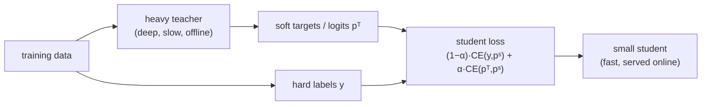

The best ranking model is often too slow to serve. A deep cross network with large
embeddings and an ensemble on top might score a candidate set accurately but blow the
latency budget, and ranking runs on every request. Knowledge distillation resolves
the tension: train the heavy **teacher** offline, then train a small fast **student**
to mimic the teacher's outputs, and serve the student. The student inherits much of
the teacher's quality at a fraction of the cost, because it learns from the teacher's
rich soft predictions rather than from raw labels alone.

## Soft targets carry more than hard labels

A hard label says only "clicked" or "not clicked", one bit per example. The teacher's
predicted probability says "clicked, and I was $0.92$ sure", and across examples those
probabilities encode the teacher's learned structure, which items are similar, where
the decision boundary is soft. Distillation trains the student to match the teacher's
**soft targets** $p^T$ rather than (or alongside) the hard labels $y$, minimizing

$$
\mathcal{L} = (1-\alpha)\,\text{CE}(y, p^S) + \alpha\,\text{CE}(p^T, p^S),
$$

where $p^S$ is the student's prediction and $\alpha$ trades the two terms. The teacher
term gives the student a dense, low-noise signal on every example, including the
abundant negatives where the hard label is just $0$ but the teacher's probability still
distinguishes "obviously irrelevant" from "nearly relevant"<FN n="1" />.

## Temperature

For classification distillation a **temperature** $\tau$ softens the teacher's
distribution before matching, $p^T_\tau = \text{softmax}(z^T/\tau)$, exposing the
relative scores among non-top classes that a sharp softmax hides. For binary CTR the
analogous move is to distill on the teacher's **logit** (its pre-sigmoid score), which
preserves the full ordering information and avoids saturating near $0$ and $1$. Matching
logits is the common recipe for ranking distillation, since ranking only needs the
order the logits encode.

## Why the student beats training on labels alone

A student trained directly on the noisy hard labels has to re-learn the structure from
scratch with one bit per example; a student trained on the teacher's soft predictions
is handed the structure the teacher already extracted from far more data and compute.
With limited student capacity or limited fresh data, the distilled student lands closer
to the teacher's function than a same-sized model trained on labels, which is the whole
point: serve a cheap model that behaves like an expensive one.

## Ranking-specific distillation

Beyond matching pointwise scores, ranking distillation can transfer the teacher's
*ordering*: train the student so its ranking of a candidate list agrees with the
teacher's, using the teacher's top items as positives (sometimes called ranking
distillation)<FN n="2" />. This focuses the student's capacity on getting the order
right, which is what the metric rewards, rather than on matching probabilities the
serving system never reads as probabilities.



## Check it on arrays

```python
import numpy as np

rng = np.random.default_rng(0)
d = 6

# Teacher is a fixed linear scorer the student is capable of representing.
w_teacher = rng.normal(size=d)

# Limited training data; hard labels are NOISY samples of the teacher probability.
N = 60
X = rng.normal(size=(N, d))
teacher_logit = X @ w_teacher
teacher_p = 1 / (1 + np.exp(-teacher_logit))
y_hard = (rng.random(N) < teacher_p).astype(float)        # one noisy bit each

# Student A: fit to hard labels (logistic regression)
wA = np.zeros(d); lr = 0.2
for _ in range(2000):
    p = 1 / (1 + np.exp(-(X @ wA)))
    wA -= lr * (X.T @ (p - y_hard)) / N

# Student B: distill on the teacher's logits (least squares to the soft signal)
wB = np.linalg.lstsq(X, teacher_logit, rcond=None)[0]

err_hard = np.linalg.norm(wA - w_teacher)
err_distill = np.linalg.norm(wB - w_teacher)
print(f"||w_student - w_teacher||  hard labels: {err_hard:.3f}")
print(f"||w_student - w_teacher||  distilled  : {err_distill:.3f}")
# The distilled student recovers the teacher far more closely than the label-trained one
assert err_distill < err_hard
```

The student trained on noisy hard labels only approximates the teacher, while the one
distilled on the teacher's logits recovers it almost exactly, because the soft target
is the clean function rather than one noisy sample of it.

## Exercises

**Exercise 1.** A distillation loss is
$\mathcal{L} = (1-\alpha)\text{CE}(y, p^S) + \alpha\text{CE}(p^T, p^S)$. State what
$\alpha = 0$ and $\alpha = 1$ each reduce to, and what intermediate $\alpha$ buys.

<details>
<summary>Solution</summary>

**Step 1.** $\alpha = 0$ drops the teacher term, leaving $\text{CE}(y, p^S)$: ordinary
training on hard labels.

**Step 2.** $\alpha = 1$ drops the label term, leaving $\text{CE}(p^T, p^S)$: pure
mimicry of the teacher, ignoring ground truth.

**Step 3.** Intermediate $\alpha$ blends both: the teacher's dense soft signal guides
the student while the true labels keep it anchored to reality, useful when the teacher
is good but imperfect.

</details>

**Exercise 2.** For binary CTR distillation, explain why matching the teacher's logit
is often preferred over matching its probability.

<details>
<summary>Solution</summary>

**Step 1.** The sigmoid saturates: probabilities near $0$ or $1$ compress large logit
differences into tiny probability differences, so matching probabilities loses
information about confident predictions.

**Step 2.** The logit is the pre-sigmoid score and preserves the full range and the
ordering of candidates, which is what ranking actually consumes.

**Step 3.** Matching logits gives the student a richer, non-saturated target and
directly transfers the ordering, so it is the common recipe for ranking distillation.

</details>

**Exercise 3 (code).** Verify the value of soft targets shrinks as labels get less
noisy: regenerate the teacher data with many examples (low label noise per the law of
large numbers when averaged) and show the gap between the hard-label and distilled
students narrows compared to the small-data case.

<details>
<summary>Solution</summary>

```python
import numpy as np

rng = np.random.default_rng(1)
d = 6
w_teacher = rng.normal(size=d)

def gap(N):
    X = rng.normal(size=(N, d))
    logit = X @ w_teacher
    y = (rng.random(N) < 1 / (1 + np.exp(-logit))).astype(float)
    wA = np.zeros(d); lr = 0.2
    for _ in range(2000):
        p = 1 / (1 + np.exp(-(X @ wA)))
        wA -= lr * (X.T @ (p - y)) / N
    wB = np.linalg.lstsq(X, logit, rcond=None)[0]
    return np.linalg.norm(wA - w_teacher), np.linalg.norm(wB - w_teacher)

hard_small, dist_small = gap(60)
hard_big, dist_big = gap(5000)
print(f"small data: hard {hard_small:.3f} vs distilled {dist_small:.3f}")
print(f"big data  : hard {hard_big:.3f} vs distilled {dist_big:.3f}")
# Distillation helps most when data is scarce; the gap shrinks with abundant data
assert (hard_small - dist_small) > (hard_big - dist_big)
```

With abundant data the hard-label student recovers the teacher well on its own, so the
distillation advantage narrows; distillation pays off most exactly where the student
has limited fresh data, which is the production setting.

</details>

This closes ranking and learning-to-rank. The next discipline steps back from
modeling to ask how any of these rankers is actually measured, the offline and online
evaluation that decides whether a change ships.

<Footnotes>
  <FNItem n="1">**Hinton, G., Vinyals, O., & Dean, J.** (2015). "Distilling the knowledge in a neural network". *NeurIPS Deep Learning Workshop*. [arXiv:1503.02531](https://arxiv.org/abs/1503.02531). Soft targets, temperature, and the combined distillation loss.</FNItem>
  <FNItem n="2">**Tang, J., & Wang, K.** (2018). "Ranking distillation: learning compact ranking models with high performance for recommender system". *KDD*. [arXiv:1809.07428](https://arxiv.org/abs/1809.07428). Transferring the teacher's ordering to a small served ranker.</FNItem>
</Footnotes>
