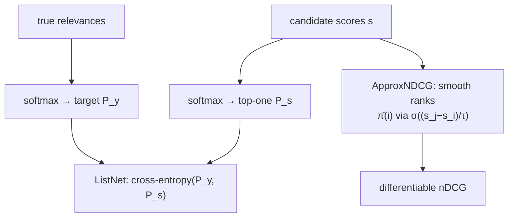

Pairwise ranking decomposes a list into independent pairs, but a recommendation is
consumed as a whole ranked list, and the metric that scores it, nDCG, depends on the
entire arrangement and the positions, not on isolated pairs. Listwise ranking
optimizes that list-level objective directly. The obstacle is that ranking metrics
are piecewise-constant in the scores (a tiny score change either swaps two items or
does nothing), so they have no usable gradient; the listwise methods are different
answers to making the objective differentiable.

## The metric: DCG and nDCG

For a ranked list, **discounted cumulative gain** sums each item's relevance
discounted by its position, so items lower down count for less:

$$
\text{DCG@}k = \sum_{r=1}^{k} \frac{2^{\text{rel}_r} - 1}{\log_2(r + 1)},
$$

where $\text{rel}_r$ is the relevance of the item at rank $r$ and the $\log_2(r+1)$
in the denominator is the position discount (rank 1 divides by $1$, rank 2 by
$\log_2 3 \approx 1.585$, and so on). The $2^{\text{rel}} - 1$ gain rewards highly
relevant items super-linearly. **Normalized DCG** divides by the ideal DCG (the DCG
of the perfect ordering) so the metric lands in $[0, 1]$:

$$
\text{nDCG@}k = \frac{\text{DCG@}k}{\text{IDCG@}k}.
$$

Normalization makes nDCG comparable across queries with different numbers of relevant
items, which is why it is the default ranking metric.

## ListNet: top-one probability

ListNet turns the scores into a probability distribution over which item is ranked
first, using a softmax, and matches it to the distribution implied by the true
relevances<FN n="1" />. The top-one probability of item $i$ under scores $s$ is

$$
P_s(i) = \frac{\exp(s_i)}{\sum_j \exp(s_j)},
$$

and the loss is the cross-entropy between the score-induced distribution $P_s$ and
the relevance-induced distribution $P_y$ (the same softmax applied to the true
relevances):

$$
\mathcal{L}_{\text{ListNet}} = -\sum_i P_y(i)\,\log P_s(i).
$$

This is smooth in the scores and pushes the softmax mass toward the items that
should rank first. It is the listwise analogue of cross-entropy: instead of a single
correct class, the target is a whole distribution reflecting graded relevance.

## ApproxNDCG: differentiate the metric itself

ListNet optimizes a proxy; **ApproxNDCG** optimizes a smooth approximation of nDCG
directly<FN n="2" />. The non-differentiable part of nDCG is the *rank* of each item,
which is a sum of indicators $\mathbb{1}[s_j > s_i]$. ApproxNDCG replaces each
hard indicator with a sigmoid of the score difference,

$$
\hat\pi(i) = 1 + \sum_{j \ne i} \sigma\!\big(-(s_i - s_j)/\tau\big),
$$

a smooth, differentiable approximation of item $i$'s rank with temperature $\tau$
controlling the sharpness. Plugging $\hat\pi$ into the DCG discount gives a
differentiable nDCG that can be maximized by gradient ascent, optimizing the metric
without a surrogate.

## When listwise is worth it

Listwise losses use the full list structure, so they tend to edge out pairwise on
nDCG, especially near the top of the list. The cost is computation (a softmax or a
pairwise rank approximation over the whole candidate list per training example) and
sensitivity to list construction. In practice LambdaRank-style pairwise gradients
weighted by $\Delta$nDCG capture most of the listwise benefit at lower cost, so
listwise methods are chosen when the last increment of top-of-list quality justifies
the expense.



## Check it on arrays

```python
import numpy as np

def dcg(rels):
    rels = np.asarray(rels, dtype=float)
    discounts = 1.0 / np.log2(np.arange(2, len(rels) + 2))
    return ((2**rels - 1) * discounts).sum()

def ndcg(rels):
    ideal = dcg(sorted(rels, reverse=True))
    return dcg(rels) / ideal if ideal > 0 else 0.0

# A list whose items have relevances 3,2,3,0,1 in the order the model ranked them
ranked = [3, 2, 3, 0, 1]
print(f"nDCG of model order: {ndcg(ranked):.3f}")
# Perfect order scores nDCG = 1; a worse order scores lower
assert np.isclose(ndcg(sorted(ranked, reverse=True)), 1.0)
assert ndcg(ranked) < 1.0

# ListNet top-one loss decreases as predicted scores align with relevances
rng = np.random.default_rng(0)
rel = np.array([3.0, 1.0, 2.0, 0.0])
def softmax(z): z = z - z.max(); e = np.exp(z); return e / e.sum()
target = softmax(rel)

def listnet_loss(scores):
    return -(target * np.log(softmax(scores))).sum()

aligned = np.array([3.0, 1.0, 2.0, 0.0])          # scores match relevance order
misordered = np.array([0.0, 3.0, 1.0, 2.0])       # scores fight relevance
print(f"ListNet loss aligned   : {listnet_loss(aligned):.3f}")
print(f"ListNet loss misordered: {listnet_loss(misordered):.3f}")
assert listnet_loss(aligned) < listnet_loss(misordered)
```

The perfect ordering scores nDCG $= 1$ and any worse arrangement scores less, while
the ListNet loss is smaller when the predicted scores agree with the relevances,
which is the differentiable signal the model follows.

## Exercises

**Exercise 1.** Compute DCG@3 for a ranked list with relevances $(3, 0, 2)$ using
$\text{gain} = 2^{\text{rel}} - 1$ and discount $1/\log_2(r+1)$.

<details>
<summary>Solution</summary>

**Step 1.** Gains: $2^3 - 1 = 7$, $2^0 - 1 = 0$, $2^2 - 1 = 3$.

**Step 2.** Discounts: rank 1 is $1/\log_2 2 = 1$, rank 2 is $1/\log_2 3 \approx
0.631$, rank 3 is $1/\log_2 4 = 0.5$.

**Step 3.** $\text{DCG@3} = 7\cdot 1 + 0\cdot 0.631 + 3\cdot 0.5 = 7 + 0 + 1.5 = 8.5$.

</details>

**Exercise 2.** Using the list from Exercise 1, compute IDCG@3 (the DCG of the ideal
ordering) and then nDCG@3.

<details>
<summary>Solution</summary>

**Step 1.** The ideal order sorts relevances descending: $(3, 2, 0)$.

**Step 2.** IDCG $= 7\cdot 1 + 3\cdot 0.631 + 0\cdot 0.5 = 7 + 1.893 = 8.893$.

**Step 3.** $\text{nDCG@3} = 8.5 / 8.893 \approx 0.956$. The model's order is close
to ideal because it placed the most relevant item first; only the rank-2 and rank-3
items are swapped relative to ideal.

</details>

**Exercise 3 (code).** Implement the ApproxNDCG smooth rank
$\hat\pi(i) = 1 + \sum_{j\ne i}\sigma(-(s_i - s_j)/\tau)$ and verify that as the
temperature $\tau \to 0$ it converges to the true integer rank.

<details>
<summary>Solution</summary>

```python
import numpy as np

scores = np.array([2.0, 0.5, 1.0, -1.0])

def soft_rank(s, tau):
    diff = s[:, None] - s[None, :]                 # s_i - s_j
    sig = 1 / (1 + np.exp(diff / tau))             # sigma(-(s_i - s_j)/tau)
    np.fill_diagonal(sig, 0.0)
    return 1 + sig.sum(1)

true_rank = 1 + (scores[None, :] > scores[:, None]).sum(1)   # integer ranks
approx = soft_rank(scores, tau=0.01)
print("true ranks :", true_rank)
print("approx ranks:", np.round(approx, 2))
assert np.allclose(approx, true_rank, atol=1e-2)
```

At a small temperature each sigmoid becomes a hard step, so the smooth rank matches
the integer rank, recovering true nDCG while staying differentiable for any
$\tau > 0$.

</details>

The next lesson scales the ranking model up to the deep architectures that dominate
industrial CTR prediction, where explicit feature crosses do the heavy lifting.

<Footnotes>
  <FNItem n="1">**Cao, Z., Qin, T., Liu, T.-Y., Tsai, M.-F., & Li, H.** (2007). "Learning to rank: from pairwise approach to listwise approach" (ListNet). *ICML*. [doi:10.1145/1273496.1273513](https://doi.org/10.1145/1273496.1273513). The top-one probability listwise loss.</FNItem>
  <FNItem n="2">**Qin, T., Liu, T.-Y., & Li, H.** (2010). "A general approximation framework for direct optimization of information retrieval measures" (ApproxNDCG). *Information Retrieval*, 13(4), 375-397. [doi:10.1007/s10791-009-9124-x](https://doi.org/10.1007/s10791-009-9124-x). Smooth rank approximation for differentiable nDCG.</FNItem>
</Footnotes>
