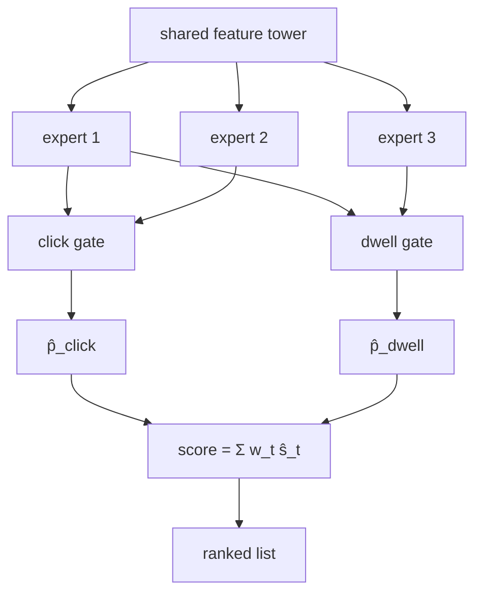

A recommender is rarely optimizing one thing. A shopping feed cares about clicks
*and* purchases *and* return visits; a video feed cares about clicks *and* watch
time *and* not promoting clickbait. These objectives are correlated but not
identical, and a model trained on clicks alone will happily rank a clickbait
thumbnail above a video people actually finish. Multi-task ranking predicts several
objectives jointly, and multi-objective ranking combines them into one decision. The
two halves are distinct: how to *predict* many labels, and how to *trade* them off.

## Multi-task prediction: sharing a model

The labels (click, conversion, dwell) share most of their structure, the same user,
item, and context features drive all of them, so training a separate model per task
wastes data and serving budget. Multi-task learning shares a model across tasks with
task-specific heads.

- **Shared-bottom** runs one shared feature tower, then $T$ small per-task heads on
  top of the shared representation. It is parameter-efficient but forces all tasks to
  agree on one representation, which hurts when tasks conflict (negative transfer).
- **MMoE (Multi-gate Mixture-of-Experts)** replaces the single shared bottom with
  several **expert** sub-networks and gives each task a **gate** that learns a
  task-specific weighting over the experts<FN n="1" />. Tasks that align share
  experts; tasks that conflict route to different ones. This relaxes the
  shared-bottom's all-or-nothing sharing and is the standard industrial choice.

Each head outputs its own probability ($\hat p_{\text{click}}$, $\hat p_{\text{conv}}$,
$\hat{\text{dwell}}$), trained with its own loss; the total loss is a weighted sum of
the per-task losses.

## Multi-objective decision: combining the predictions

Prediction gives several numbers per candidate; ranking needs one. The standard
combiner is a **weighted product or sum** of the task scores. A common multiplicative
form for a video feed is

$$
\text{score} = \hat p_{\text{click}} \cdot \hat{\text{dwell}}^{\,\beta} \cdot (\dots),
$$

and a common additive (scalarized) form is

$$
\text{score} = \sum_{t} w_t\, \hat s_t, \qquad \sum_t w_t = 1.
$$

The weights $w_t$ encode the business trade-off: more weight on conversions ranks
high-purchase items up at the cost of some clicks, and vice versa. There is no
objectively correct $w$; it is a product decision, and different points of $w$ trace
out a **Pareto frontier** where improving one objective costs another. The weights are
usually tuned by online experiment against guardrail metrics, not learned, because
the trade-off is a value judgment the model cannot make.

## The conflict is real

If clicks and conversions were perfectly aligned, the weighting would not matter. They
are not: clickbait maximizes clicks and minimizes conversions, so the weight genuinely
moves the ranking. The point of measuring multiple objectives is precisely to catch
the items that win one and lose another, and the weighted combination is where the
organization decides how much of each it wants.



## Check it on arrays

```python
import numpy as np

rng = np.random.default_rng(0)
n = 500

# Per-item predicted click and conversion rates that partly conflict:
# some high-click items convert poorly (clickbait), some convert well but click less.
pclick = rng.beta(2, 5, n)
pconv = np.clip(0.5 * (1 - pclick) + 0.1 * rng.normal(size=n), 0, 1)   # anti-correlated-ish

def top_k_objectives(w_conv, k=20):
    score = (1 - w_conv) * pclick + w_conv * pconv
    top = np.argsort(-score)[:k]
    return pclick[top].mean(), pconv[top].mean()

# As we shift weight toward conversions, the top-k expected conversion rises and
# the top-k expected click rate falls: a Pareto trade-off.
click_lo, conv_lo = top_k_objectives(w_conv=0.0)     # pure click ranking
click_hi, conv_hi = top_k_objectives(w_conv=1.0)     # pure conversion ranking
print(f"click-weighted top-k:  click={click_lo:.3f}  conv={conv_lo:.3f}")
print(f"conv-weighted  top-k:  click={click_hi:.3f}  conv={conv_hi:.3f}")
assert conv_hi > conv_lo            # weighting toward conversions raises conversions
assert click_lo > click_hi          # at the cost of clicks
```

Moving weight from clicks to conversions raises the expected conversion rate of the
top items and lowers their click rate, which is the trade-off the weights exist to
control; no single weighting wins on both axes.

## Exercises

**Exercise 1.** A scalarized score is $w\,\hat p_{\text{click}} + (1-w)\,\hat p_{\text{conv}}$.
Item A has $(\hat p_{\text{click}}, \hat p_{\text{conv}}) = (0.8, 0.1)$ and item B has
$(0.3, 0.5)$. Find the value of $w$ at which the two items tie.

<details>
<summary>Solution</summary>

**Step 1.** Set the scores equal: $0.8w + 0.1(1-w) = 0.3w + 0.5(1-w)$.

**Step 2.** Expand: $0.8w + 0.1 - 0.1w = 0.3w + 0.5 - 0.5w$, so
$0.7w + 0.1 = -0.2w + 0.5$.

**Step 3.** $0.9w = 0.4$, giving $w = 4/9 \approx 0.444$. For $w > 0.444$ the
high-click item A ranks first; for $w < 0.444$ the high-conversion item B does.

</details>

**Exercise 2.** Explain why MMoE can outperform a shared-bottom model when two tasks
conflict, in terms of the gates and experts.

<details>
<summary>Solution</summary>

**Step 1.** A shared-bottom model forces both tasks through one representation, so an
update that helps one task can hurt the other (negative transfer).

**Step 2.** MMoE has several experts and a per-task gate; each task's gate learns to
weight the experts differently, so conflicting tasks can route to largely separate
experts.

**Step 3.** Aligned tasks still share experts (keeping the data-efficiency of
sharing), while conflicting tasks specialize, so MMoE captures the benefit of sharing
without forcing a single compromised representation.

</details>

**Exercise 3 (code).** Trace the Pareto frontier: sweep the conversion weight from $0$
to $1$ and verify that the top-k expected click rate is monotonically non-increasing
as the weight shifts toward conversions.

<details>
<summary>Solution</summary>

```python
import numpy as np

rng = np.random.default_rng(0)
n = 800
pclick = rng.beta(2, 5, n)
pconv = np.clip(0.5 * (1 - pclick) + 0.1 * rng.normal(size=n), 0, 1)

def top_click(w_conv, k=20):
    score = (1 - w_conv) * pclick + w_conv * pconv
    return pclick[np.argsort(-score)[:k]].mean()

ws = np.linspace(0, 1, 11)
clicks = [top_click(w) for w in ws]
print("w_conv :", [round(w,1) for w in ws])
print("top-click:", [round(c,3) for c in clicks])
# Shifting weight toward conversions never raises the top-k click rate
assert all(clicks[i] >= clicks[i+1] - 1e-9 for i in range(len(clicks)-1))
```

The top-k click rate falls monotonically as the weight moves toward conversions,
tracing one axis of the Pareto frontier the product team chooses a point on.

</details>

The next lesson confronts the serving cost of these rich rankers: distilling a heavy
model into a fast one that meets the latency budget.

<Footnotes>
  <FNItem n="1">**Ma, J., Zhao, Z., Yi, X., Chen, J., Hong, L., & Chi, E. H.** (2018). "Modeling task relationships in multi-task learning with multi-gate mixture-of-experts" (MMoE). *KDD*. [doi:10.1145/3219819.3220007](https://doi.org/10.1145/3219819.3220007). Per-task gating over shared experts.</FNItem>
  <FNItem n="2">**Zhao, Z., Hong, L., Wei, L., et al.** (2019). "Recommending what video to watch next: a multitask ranking system". *RecSys*. [doi:10.1145/3298689.3346997](https://doi.org/10.1145/3298689.3346997). Multi-objective ranking with MMoE and weighted score combination in production.</FNItem>
</Footnotes>
