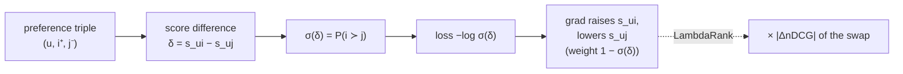

A pointwise model predicts each item's click probability and hopes the ordering
falls out. But the thing a recommender is judged on is the *ordering*, not the
absolute probabilities, and a model can have poor probability estimates yet rank
perfectly, or good probabilities yet rank badly when the relevant items cluster in a
narrow band. Pairwise ranking optimizes the comparison directly: for every pair of a
preferred and a non-preferred item, push the preferred one's score higher. This
matches the objective to the metric.

## Bayesian Personalized Ranking

BPR is the canonical pairwise objective for implicit feedback<FN n="1" />. The data
is a set of triples $(u, i, j)$ where user $u$ engaged with item $i$ (positive) but
not item $j$ (negative). BPR maximizes the probability that the model scores the
positive above the negative, modeled with a logistic on the score difference:

$$
P(i \succ_u j) = \sigma\big(s_{u,i} - s_{u,j}\big), \qquad \sigma(z) = \frac{1}{1 + e^{-z}},
$$

where $s_{u,i}$ is the model's score for item $i$. The training objective is the
negative log-likelihood over all observed preference pairs, plus regularization:

$$
\mathcal{L}_{\text{BPR}} = -\sum_{(u,i,j)} \log \sigma\big(s_{u,i} - s_{u,j}\big) + \lambda\lVert\Theta\rVert^2.
$$

The model only ever sees the *difference* $s_{u,i} - s_{u,j}$, so it never has to
commit to an absolute scale; it learns relative order, which is exactly what gets
evaluated.

## The gradient pushes the pair apart

Let $\delta = s_{u,i} - s_{u,j}$. The derivative of $-\log\sigma(\delta)$ with
respect to $\delta$ is $-(1 - \sigma(\delta)) = \sigma(\delta) - 1$, which is
negative, so gradient descent *increases* $\delta$: it raises the positive's score
and lowers the negative's. The magnitude is $1 - \sigma(\delta)$, large when the pair
is currently mis-ordered ($\delta < 0$, so $\sigma(\delta) < 0.5$) and small when the
pair is already well-separated. Like the pointwise residual, the gradient
concentrates on the pairs the model still gets wrong, but here "wrong" means
mis-*ranked*, not mis-classified.

## RankNet and LambdaRank

RankNet is the same logistic-on-score-difference loss applied to graded relevance
with a neural scorer<FN n="2" />. Its successor **LambdaRank** makes a crucial
observation: the gradient of a pairwise loss treats all mis-ordered pairs equally,
but swapping two items near the top of the list changes nDCG far more than swapping
two near the bottom. LambdaRank multiplies each pair's gradient (the "lambda") by the
**change in nDCG** that swapping that pair would cause,

$$
\lambda_{ij} = \big(\sigma(s_j - s_i)\big)\cdot \big|\Delta\text{nDCG}_{ij}\big|,
$$

so the model spends its effort where it moves the metric most. This bridges pairwise
training and listwise evaluation without ever writing down a listwise loss, and
LambdaMART (LambdaRank gradients on gradient-boosted trees) was the dominant
learning-to-rank method for years.

## Why pairwise optimizes AUC

The fraction of correctly-ordered positive-negative pairs is exactly AUC, so a loss
that penalizes every mis-ordered pair is a smooth surrogate for AUC. Minimizing
$\mathcal{L}_{\text{BPR}}$ drives up the number of correctly-ordered pairs, which is
why pairwise models tend to win on ranking metrics over pointwise models trained on
the same data.



## Check it on arrays

```python
import numpy as np

rng = np.random.default_rng(0)
d = 8

# A user vector and item embeddings; positives align with the user, negatives do not
u = rng.normal(size=d)
n_items = 200
V = rng.normal(size=(n_items, d))
true_score = V @ u
pos_items = np.argsort(-true_score)[:20]          # items the user prefers
neg_items = np.argsort(true_score)[:80]           # items the user does not

# Learn an item-scoring vector w by BPR (start from zero, see if it recovers order)
w = np.zeros(d); lr = 0.05
for step in range(3000):
    i = pos_items[rng.integers(len(pos_items))]
    j = neg_items[rng.integers(len(neg_items))]
    delta = (V[i] - V[j]) @ w
    g = 1 - 1 / (1 + np.exp(-delta))              # 1 - sigma(delta)
    w += lr * g * (V[i] - V[j])                    # raise positive, lower negative

# Pairwise accuracy: fraction of (pos, neg) pairs the learned scores order correctly
s = V @ w
pa = (s[pos_items][:, None] > s[neg_items][None, :]).mean()
print(f"pairwise accuracy after BPR: {pa:.3f}")
assert pa > 0.9                                    # learns the preference order
```

Starting from no knowledge, the BPR updates separate the user's preferred items from
the rest, reaching high pairwise accuracy, which is the AUC the objective implicitly
maximizes.

## Exercises

**Exercise 1.** For a preference pair the model currently scores the positive at
$s_i = 0.5$ and the negative at $s_j = 1.5$ (a mis-ordering). Compute
$\sigma(s_i - s_j)$ and the gradient magnitude $1 - \sigma(s_i - s_j)$, and say
whether the update is large or small.

<details>
<summary>Solution</summary>

**Step 1.** $\delta = s_i - s_j = 0.5 - 1.5 = -1.0$, so $\sigma(-1) \approx 0.269$.

**Step 2.** Gradient magnitude $1 - \sigma(\delta) = 1 - 0.269 = 0.731$.

**Step 3.** The pair is mis-ordered ($\delta < 0$), so $\sigma(\delta) < 0.5$ and the
gradient is large ($0.731$), pushing hard to raise the positive and lower the
negative. Well-ordered pairs ($\delta \gg 0$) get a near-zero update.

</details>

**Exercise 2.** Explain why LambdaRank multiplies each pair's gradient by
$|\Delta\text{nDCG}|$, with reference to where in the list a swap matters most.

<details>
<summary>Solution</summary>

**Step 1.** nDCG discounts gains by position (logarithmically), so an item at rank 1
contributes much more than one at rank 50.

**Step 2.** Swapping two items near the top therefore changes nDCG a lot, while
swapping two near the bottom barely moves it, even though a plain pairwise loss
treats both swaps identically.

**Step 3.** Multiplying by $|\Delta\text{nDCG}|$ scales each pair's gradient by how
much fixing it would improve the metric, so the model prioritizes ordering the top of
the list correctly, where users actually look.

</details>

**Exercise 3 (code).** Compare pointwise and pairwise on the same data: fit a
pointwise logistic model (regress scores on binary labels) and a BPR model, and
verify the BPR model achieves at least as high pairwise accuracy on the preference
pairs.

<details>
<summary>Solution</summary>

```python
import numpy as np

rng = np.random.default_rng(2)
d, n = 8, 200
u = rng.normal(size=d)
V = rng.normal(size=(n, d))
ts = V @ u
pos = np.argsort(-ts)[:20]; neg = np.argsort(ts)[:80]

# Pointwise: logistic regression of label (pos=1, neg=0) on item features
idx = np.concatenate([pos, neg]); y = np.r_[np.ones(20), np.zeros(80)]
wp = np.zeros(d); lr = 0.1
for _ in range(500):
    p = 1 / (1 + np.exp(-(V[idx] @ wp)))
    wp -= lr * (V[idx].T @ (p - y)) / len(idx)

# Pairwise BPR
wb = np.zeros(d)
for _ in range(3000):
    i = pos[rng.integers(len(pos))]; j = neg[rng.integers(len(neg))]
    delta = (V[i] - V[j]) @ wb
    wb += 0.05 * (1 - 1/(1+np.exp(-delta))) * (V[i] - V[j])

def pacc(w):
    s = V @ w
    return (s[pos][:, None] > s[neg][None, :]).mean()

print(f"pointwise pairwise-acc: {pacc(wp):.3f}   BPR pairwise-acc: {pacc(wb):.3f}")
assert pacc(wb) >= pacc(wp) - 0.02
```

Both learn the order well on this clean data, with BPR matching or beating the
pointwise model on the pairwise metric it directly optimizes.

</details>

The next lesson goes one step further, optimizing the whole ranked list at once with
listwise losses and a differentiable surrogate for nDCG.

<Footnotes>
  <FNItem n="1">**Rendle, S., Freudenthaler, C., Gantner, Z., & Schmidt-Thieme, L.** (2009). "BPR: Bayesian personalized ranking from implicit feedback". *UAI*. [arXiv:1205.2618](https://arxiv.org/abs/1205.2618). The pairwise objective for implicit-feedback recommendation.</FNItem>
  <FNItem n="2">**Burges, C. J. C.** (2010). "From RankNet to LambdaRank to LambdaMART: an overview". Microsoft Research technical report MSR-TR-2010-82. [https://www.microsoft.com/en-us/research/publication/from-ranknet-to-lambdarank-to-lambdamart-an-overview/](https://www.microsoft.com/en-us/research/publication/from-ranknet-to-lambdarank-to-lambdamart-an-overview/). RankNet's pairwise loss and the LambdaRank nDCG-weighted gradient.</FNItem>
</Footnotes>
