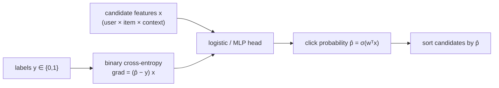

The simplest way to rank a candidate set is to predict, for each item on its own,
the probability the user will engage, then sort by that probability. This is
**pointwise** ranking: it turns ranking into a per-item binary classification, the
click-through-rate (CTR) prediction problem, and ignores that the items will
ultimately be compared<FN n="1" />. It is the workhorse of industrial ranking because it is
simple to train, scales trivially, and reuses every tool from supervised
classification.

## The model

Each candidate is a feature vector $\mathbf{x}$ built from the user, the item, and
the context (the ranking stage may use cross features the retrieval towers could
not). A pointwise model predicts the engagement probability with a logistic head,

$$
\hat p = \sigma(\mathbf{w}^\top \mathbf{x} + b), \qquad \sigma(z) = \frac{1}{1 + e^{-z}},
$$

and is trained on labeled impressions $(\mathbf{x}, y)$ with $y \in \{0, 1\}$ (clicked
or not) by minimizing the **binary cross-entropy**

$$
\mathcal{L} = -\frac{1}{N}\sum_{n=1}^N \big[\, y_n \log \hat p_n + (1 - y_n)\log(1 - \hat p_n)\,\big].
$$

At serving time the candidates are scored, sorted by $\hat p$, and the top few
returned. Replacing the linear logit with an MLP gives a deep pointwise model; the
loss and the per-item framing are unchanged.

## The gradient is the prediction error

Binary cross-entropy with a logistic head has a gradient that makes the training
signal transparent. For one example,

$$
\frac{\partial \mathcal{L}}{\partial \mathbf{w}} = (\hat p - y)\,\mathbf{x}.
$$

The update is proportional to the **residual** $\hat p - y$: an item predicted at
$0.9$ that was clicked ($y = 1$) gets a small correction, while one predicted at
$0.9$ that was not clicked gets a large one. The model spends its capacity on the
examples it is currently wrong about, which is the standard logistic-regression
behavior applied to clicks.

## The class-imbalance problem

Engagement is rare: most impressions are not clicked, so $y = 1$ is a small minority,
often a few percent. Trained naively, the model can drive the loss down by predicting
a low probability for everything, since it is right most of the time<FN n="2" />. Two standard
corrections keep it honest:

- **Class weighting** scales the loss of positive examples up (or downsamples
  negatives), so the rare positives are not drowned out.
- **Calibration** matters because the raw probabilities feed downstream decisions
  (expected value, blending with other scores); a model trained on downsampled
  negatives must have its probabilities rescaled back to the true base rate, the
  recalibration covered in the evaluation pillar.

For *ranking* alone the absolute calibration is less critical, since sorting is
invariant to monotonic rescaling, but CTR scores are usually consumed as
probabilities elsewhere, so calibration is kept.

## Evaluating the ranker

A pointwise CTR model is judged two ways. As a classifier, by **AUC** (the
probability it scores a random positive above a random negative), which is exactly
a ranking quality: AUC is the fraction of positive-negative pairs ordered
correctly. As a ranker, by the position-aware metrics (nDCG) of the next lessons.
AUC is the natural pointwise objective's natural evaluation, which is why it is the
first number reported for a CTR model.



## Check it on arrays

```python
import numpy as np

rng = np.random.default_rng(0)
N, d = 4000, 6

# Synthetic CTR data: a true weight vector drives click probability
w_true = rng.normal(size=d)
X = rng.normal(size=(N, d))
logits = X @ w_true - 1.5                      # offset -> rare positives (imbalance)
p = 1 / (1 + np.exp(-logits))
y = (rng.random(N) < p).astype(float)
print(f"positive rate: {y.mean():.3f}")        # imbalanced

# Train logistic regression by gradient descent on binary cross-entropy
w = np.zeros(d); b = 0.0; lr = 0.3
for _ in range(600):
    z = X @ w + b
    phat = 1 / (1 + np.exp(-z))
    err = phat - y                              # residual = gradient signal
    w -= lr * (X.T @ err) / N
    b -= lr * err.mean()

# AUC = fraction of (positive, negative) pairs ranked correctly
def auc(scores, labels):
    pos = scores[labels == 1]; neg = scores[labels == 0]
    return (pos[:, None] > neg[None, :]).mean()

scores = X @ w + b
print(f"train AUC: {auc(scores, y):.3f}")
# Clicks are stochastic (y ~ Bernoulli(p)), so AUC is capped below 1; well above 0.5
# means the model ranks clicked items above non-clicked ones.
assert auc(scores, y) > 0.7
```

The model recovers the click structure and reaches a high AUC, meaning it usually
scores a clicked item above a non-clicked one, which is precisely the pairwise
ordering the next lesson optimizes directly instead of as a by-product.

## Exercises

**Exercise 1.** For a logistic CTR model, an item has features giving logit
$z = 1.0$. Compute the predicted click probability. If the item was *not* clicked
($y = 0$), give the residual $\hat p - y$ that drives the gradient.

<details>
<summary>Solution</summary>

**Step 1.** $\hat p = \sigma(1.0) = \frac{1}{1 + e^{-1}} \approx \frac{1}{1.368}
\approx 0.731$.

**Step 2.** With $y = 0$, the residual is $\hat p - y = 0.731 - 0 = 0.731$.

**Step 3.** The large positive residual means the model over-predicted engagement
and the gradient $(\hat p - y)\mathbf{x}$ pushes the weights to lower this item's
score, in proportion to its features.

</details>

**Exercise 2.** Explain why a CTR model trained by downsampling negatives produces
probabilities that are too high, and state the direction of the recalibration
needed.

<details>
<summary>Solution</summary>

**Step 1.** Downsampling removes negatives, so the training set has a higher
positive rate than reality; the model learns that inflated base rate.

**Step 2.** Its predicted probabilities are therefore systematically too high
relative to the true (un-downsampled) click rate.

**Step 3.** The recalibration must shift probabilities *down* toward the true base
rate; the standard formula $p_{\text{cal}} = \frac{p}{p + (1-p)/r}$ with downsampling
rate $r$ corrects the logit by $\log r$. Ranking order is unaffected, but any
downstream use of the probability needs this correction.

</details>

**Exercise 3 (code).** Show that AUC is rank-based: take a trained model's scores,
apply any strictly increasing transformation (for example squaring after shifting
to be positive, or multiplying by a positive constant), and verify the AUC is
unchanged.

<details>
<summary>Solution</summary>

```python
import numpy as np

rng = np.random.default_rng(1)
scores = rng.normal(size=500)
labels = (rng.random(500) < 1 / (1 + np.exp(-scores))).astype(int)

def auc(s, y):
    pos = s[y == 1]; neg = s[y == 0]
    return (pos[:, None] > neg[None, :]).mean()

base = auc(scores, labels)
scaled = auc(3.0 * scores + 7.0, labels)        # affine, increasing
warped = auc(np.exp(scores), labels)            # strictly increasing
assert np.isclose(base, scaled) and np.isclose(base, warped)
print(f"AUC invariant under monotonic transforms: {base:.3f}")
```

AUC depends only on the order of the scores, so any strictly increasing transform
leaves it fixed, which is why a pointwise model that is poorly calibrated can still
rank perfectly.

</details>

The next lesson stops predicting absolute click probabilities and optimizes the
comparison directly, learning from pairs of items which one the user prefers.

<Footnotes>
  <FNItem n="1">**Richardson, M., Dominowska, E., & Ragno, R.** (2007). "Predicting clicks: estimating the click-through rate for new ads". *WWW*. [doi:10.1145/1242572.1242643](https://doi.org/10.1145/1242572.1242643). Logistic CTR prediction as the pointwise ranking objective.</FNItem>
  <FNItem n="2">**McMahan, H. B., Holt, G., Sculley, D., et al.** (2013). "Ad click prediction: a view from the trenches". *KDD*. [doi:10.1145/2487575.2488200](https://doi.org/10.1145/2487575.2488200). Large-scale logistic CTR, calibration, and class imbalance in production.</FNItem>
</Footnotes>
