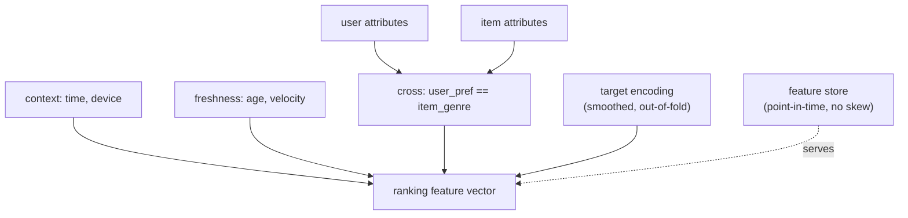

The ranking stage's advantage over retrieval is that it scores user-item *pairs*, so
it can read features that depend on both sides at once. Those cross and context
features are usually where most of a ranker's accuracy comes from: the model
architecture matters, but a well-built "does this item's category match what this
user clicked yesterday" feature often moves the metric more than a deeper network.
This lesson is about the feature types unique to ranking and the encodings that make
them usable.

## Cross features: the ranking-only signal

A **cross feature** combines a user attribute and an item attribute into one signal
the towers could not compute, because each tower sees only its own side. The
canonical example is a *match* indicator: "user's preferred genre equals item's
genre". The label often depends on exactly this conjunction, a user clicks an item
when it matches their interest, which no single-side feature captures. Forming the
cross explicitly hands the model the interaction instead of asking it to rediscover
it from raw ids<FN n="2" />.

Cross features are the reason the ranking stage exists downstream of retrieval: they
require both the query and the candidate, so they cannot live in a precomputed item
embedding. They are computed online, per candidate, which is affordable only because
ranking sees a few hundred items, not the whole catalog.

## Context and freshness

Two more families depend on the request, not just the user and item.

- **Context features** describe the moment: time of day, day of week, device,
  surface, whether it is a cold session. The same user wants different things on a
  phone at midnight than on a desktop at noon, and context features let the ranker
  condition on it.
- **Freshness features** describe the item's age and trajectory: hours since upload,
  recent engagement velocity, whether it is trending. Recommendation is time-sensitive
  in a way most ML is not, and a freshness signal lets the ranker prefer rising
  content over stale content of equal historical quality.

## Encoding high-cardinality categoricals: target encoding

Item ids, creator ids, and search queries have millions of values, too many for a
one-hot or even a comfortable embedding for the rare tail. **Target encoding**
replaces a category value with a smoothed estimate of its historical label rate<FN n="1" />,

$$
\text{enc}(c) = \frac{n_c\,\bar y_c + \alpha\,\bar y}{n_c + \alpha},
$$

where $\bar y_c$ is the mean label for category $c$, $n_c$ its count, $\bar y$ the
global mean, and $\alpha$ a smoothing pseudo-count, the same damping seen in the
popularity baseline. This turns a sparse id into one dense, informative number. The
hazard is **target leakage**: computing $\bar y_c$ on the same rows you train on lets
the label leak into its own feature, so target encoding must be computed out-of-fold
(or from a strictly earlier time window), which is exactly what a feature store's
point-in-time joins enforce.

## Features come from the feature store

All of these features must be available identically at training and serving time,
or the model sees one distribution offline and another online, the **training/serving
skew** that silently degrades a launched model. The feature store solves this by
serving the same feature definitions to both, with point-in-time correctness so a
training example only ever sees feature values that were known *before* the label
occurred. Ranking feature engineering is therefore as much a data-pipeline problem as
a modeling one.



## Check it on arrays

```python
import numpy as np

rng = np.random.default_rng(0)
N = 4000

# Each impression: user has a preferred genre, item has a genre (4 genres).
user_pref = rng.integers(0, 4, N)
item_genre = rng.integers(0, 4, N)
match = (user_pref == item_genre).astype(float)        # the cross feature

# Click depends on the MATCH, not on either side alone
p = 1 / (1 + np.exp(-(2.5 * match - 1.0)))
y = (rng.random(N) < p).astype(float)

# One-hot each side separately (no cross), vs adding the match cross feature
def onehot(a, k=4):
    o = np.zeros((len(a), k)); o[np.arange(len(a)), a] = 1; return o
bias = np.ones((N, 1))
X_no = np.c_[bias, onehot(user_pref), onehot(item_genre)]   # sides only
X_cross = np.c_[X_no, match]                                 # add the cross

def fit(X, y, epochs=400, lr=0.3):
    w = np.zeros(X.shape[1])
    for _ in range(epochs):
        p = 1 / (1 + np.exp(-(X @ w)))
        w -= lr * (X.T @ (p - y)) / len(y)
    return w

def auc(X, w, y):
    s = X @ w; pos = s[y == 1]; neg = s[y == 0]
    return (pos[:, None] > neg[None, :]).mean()

w_no, w_cross = fit(X_no, y), fit(X_cross, y)
print(f"AUC without cross: {auc(X_no, w_no, y):.3f}")
print(f"AUC with cross   : {auc(X_cross, w_cross, y):.3f}")
assert auc(X_cross, w_cross, y) > auc(X_no, w_no, y) + 0.1
```

The per-side one-hot features carry no information about the match, so the model is
near chance; adding the single cross feature that compares the two sides lets it
predict the click, the gain that ranking features are built to capture.

## Exercises

**Exercise 1.** A category value has appeared $n_c = 4$ times with mean label
$\bar y_c = 1.0$; the global mean label is $\bar y = 0.2$. Compute its target
encoding with smoothing $\alpha = 10$, and explain why the smoothing is needed.

<details>
<summary>Solution</summary>

**Step 1.** $\text{enc}(c) = \frac{4 \cdot 1.0 + 10 \cdot 0.2}{4 + 10} =
\frac{4 + 2}{14} = \frac{6}{14} \approx 0.429$.

**Step 2.** The raw rate $\bar y_c = 1.0$ is based on only four examples and is
almost certainly an overestimate; smoothing pulls it toward the global $0.2$.

**Step 3.** Without smoothing, rare categories get extreme, unreliable encodings
(here $1.0$ from four samples) that overfit; the pseudo-count $\alpha$ trusts the
category's own rate only once it has enough data, the damping logic from the
popularity baseline.

</details>

**Exercise 2.** Explain target leakage in target encoding and why computing the
encoding out-of-fold (or from an earlier time window) prevents it.

<details>
<summary>Solution</summary>

**Step 1.** If $\bar y_c$ is computed over the same rows used to train, each row's
own label is included in the encoding of its category, so the feature partly *is* the
label.

**Step 2.** The model then appears to perform well in training because the feature
leaks the answer, but at serving time the current label is unknown, so the leaked
signal disappears and online performance collapses.

**Step 3.** Computing the encoding out-of-fold (each fold encoded from the others) or
from strictly earlier data ensures a row's encoding never sees its own label, so the
feature carries only genuinely-prior information, which point-in-time feature stores
enforce automatically.

</details>

**Exercise 3 (code).** Add a freshness feature: give items an age and make recent
items more likely to be clicked, then verify a model with the age feature achieves
higher AUC than one without.

<details>
<summary>Solution</summary>

```python
import numpy as np

rng = np.random.default_rng(1)
N = 4000
age = rng.uniform(0, 48, N)                      # hours since upload
# Click probability decays with age (fresher items clicked more)
p = 1 / (1 + np.exp(-(1.5 - 0.08 * age)))
y = (rng.random(N) < p).astype(float)

bias = np.ones((N, 1))
X_no = bias                                       # intercept only
X_age = np.c_[bias, (age - age.mean()) / age.std()]   # normalized age

def fit(X, y, epochs=400, lr=0.3):
    w = np.zeros(X.shape[1])
    for _ in range(epochs):
        pr = 1 / (1 + np.exp(-(X @ w)))
        w -= lr * (X.T @ (pr - y)) / len(y)
    return w
def auc(X, w, y):
    s = X @ w; pos = s[y == 1]; neg = s[y == 0]
    return (pos[:, None] > neg[None, :]).mean() if len(pos) and len(neg) else 0.5

print(f"AUC no freshness : {auc(X_no, fit(X_no,y), y):.3f}")
print(f"AUC with age     : {auc(X_age, fit(X_age,y), y):.3f}")
assert auc(X_age, fit(X_age, y), y) > 0.6
```

The age feature, normalized so its scale does not swamp the gradient, lets the ranker
prefer fresh items, raising AUC above the no-signal baseline of $0.5$.

</details>

The next lesson lets the ranker optimize several objectives at once, clicks,
conversions, and dwell, rather than a single engagement label.

<Footnotes>
  <FNItem n="1">**Micci-Barreca, D.** (2001). "A preprocessing scheme for high-cardinality categorical attributes in classification and prediction problems". *ACM SIGKDD Explorations*, 3(1), 27-32. [doi:10.1145/507533.507538](https://doi.org/10.1145/507533.507538). Smoothed target (impact) encoding.</FNItem>
  <FNItem n="2">**Cheng, H.-T., Koc, L., Harmsen, J., et al.** (2016). "Wide & Deep learning for recommender systems". *DLRS workshop, RecSys*. [arXiv:1606.07792](https://arxiv.org/abs/1606.07792). Cross-product feature transformations for the ranking model.</FNItem>
</Footnotes>
