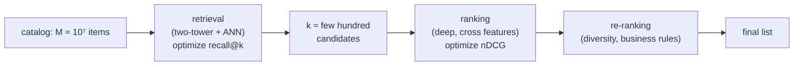

A recommender cannot score every item for every request. With ten million items
and a few hundred milliseconds of budget, running a rich model over the whole
catalog is impossible, but running a cheap model over the whole catalog throws
away accuracy. The resolution is to use both, in stages: a cheap model narrows the
catalog to a few hundred candidates, then an expensive model ranks only those. This
funnel is the backbone architecture of every large-scale recommender, and this
lesson is about why the split exists and what each stage optimizes.

## The cost problem

Let the catalog have $M$ items, and suppose the accurate ranking model costs $c_r$
per item to evaluate while the retrieval model costs $c_g \ll c_r$. Scoring the
whole catalog with the ranker costs $M c_r$, which is infeasible at $M = 10^7$. The
two-stage funnel instead retrieves $k \ll M$ candidates with the cheap model
($M c_g$) and ranks only those ($k c_r$), for a total

$$
M c_g + k c_r \ \ll\ M c_r.
$$

The retrieval model is cheap because it is a **two-tower dot product** backed by an
approximate-nearest-neighbor index, so it never explicitly scores most items: the
index returns the top $k$ in sublinear time. The ranker is expensive because it
reads cross features and runs a deep network, but it only ever sees $k$ items.

## Different stages optimize different things

The two stages are not the same model at different sizes; they have different jobs.

- **Retrieval** optimizes **recall@k**: did the few hundred candidates *contain*
  the items the user will engage with? Order within the candidate set does not
  matter, only membership. A retrieval model that misses a good item dooms it, since
  no later stage can recover what was never retrieved.
- **Ranking** optimizes **ordering** (nDCG and friends): given that the good items
  are present, put them at the top. Ranking is judged on the precise arrangement of
  the candidates it was handed.

This division of labor is why retrieval can use a coarse, separable model (it only
needs membership) while ranking can be rich and slow (it only sees a short list).
Many production systems add a third **re-ranking** stage that applies business
logic, diversity, and freshness to the ranked top, the subject of a later
discipline.

## The recall ceiling

The funnel's accuracy is capped by retrieval. If a relevant item is not among the
$k$ candidates, the ranker cannot rank it, so the system's best possible
performance is bounded by retrieval recall@k. This makes the choice of $k$ a direct
trade: larger $k$ raises the recall ceiling but costs more ranking compute. Tuning
$k$ is tuning where the funnel narrows, and it is set by measuring recall@k of the
retrieval stage against the latency budget of the ranking stage.



## Check it on arrays

```python
import numpy as np

rng = np.random.default_rng(0)
M, k = 100_000, 200           # catalog size, candidates kept
c_g, c_r = 1.0, 500.0         # per-item cost: retrieval cheap, ranking expensive

# Cost of ranking the whole catalog vs the two-stage funnel
full_cost = M * c_r
funnel_cost = M * c_g + k * c_r
print(f"full-catalog ranking cost: {full_cost:,.0f}")
print(f"two-stage funnel cost    : {funnel_cost:,.0f}")
assert funnel_cost < full_cost / 100      # funnel is >100x cheaper here

# The funnel's accuracy is capped by retrieval recall@k.
# Simulate: each item has a true relevance; retrieval ranks by a noisy proxy.
n_items = 5000
true_rel = rng.normal(size=n_items)
retrieval_score = true_rel + rng.normal(scale=1.0, size=n_items)   # noisy proxy
topk = np.argsort(-retrieval_score)[:k]

# The 10 most-relevant items: how many did retrieval keep? (recall ceiling)
gold = set(np.argsort(-true_rel)[:10])
recall_at_k = len(gold & set(topk.tolist())) / len(gold)
print(f"retrieval recall@{k} of the top-10 relevant: {recall_at_k:.2f}")
# A perfect ranker on the retrieved set cannot exceed this recall ceiling
assert recall_at_k <= 1.0 and recall_at_k > 0.0
```

The funnel is two orders of magnitude cheaper than ranking the whole catalog, and
the recall@k number is the hard ceiling on everything downstream: items retrieval
drops are gone for good.

## Exercises

**Exercise 1.** A catalog has $M = 5\times10^6$ items. Retrieval costs $1$ unit per
item and ranking costs $800$ units per item. Compute the cost of ranking the whole
catalog versus a funnel that keeps $k = 300$ candidates, and the speedup.

<details>
<summary>Solution</summary>

**Step 1.** Full-catalog ranking: $5\times10^6 \cdot 800 = 4\times10^9$ units.

**Step 2.** Funnel: retrieval $5\times10^6 \cdot 1 = 5\times10^6$ plus ranking
$300 \cdot 800 = 2.4\times10^5$, totaling $\approx 5.24\times10^6$ units.

**Step 3.** Speedup $\approx 4\times10^9 / 5.24\times10^6 \approx 763\times$. The
funnel is dominated by the cheap retrieval pass over the catalog; ranking $300$
items is negligible.

</details>

**Exercise 2.** Retrieval achieves recall@200 of $0.85$ for a query. What is the
maximum fraction of relevant items the full system can place in its final list, and
why can a better ranker not exceed it?

<details>
<summary>Solution</summary>

**Step 1.** Recall@200 of $0.85$ means $15\%$ of the relevant items are not among
the $200$ candidates.

**Step 2.** The ranker only ever sees the $200$ candidates, so it can rank at most
the $85\%$ that were retrieved; the missing $15\%$ are unreachable.

**Step 3.** The system's relevant-item coverage is capped at $0.85$. Improving the
ranker reorders the retrieved set but cannot recover items retrieval dropped, which
is why retrieval recall is the first thing to fix when the funnel underperforms.

</details>

**Exercise 3 (code).** Show the recall/cost trade in $k$: for a fixed noisy
retrieval proxy, compute recall@k of the top-20 relevant items at several $k$ and
verify recall is non-decreasing in $k$ while ranking cost grows linearly.

<details>
<summary>Solution</summary>

```python
import numpy as np

rng = np.random.default_rng(0)
n_items = 8000
true_rel = rng.normal(size=n_items)
proxy = true_rel + rng.normal(scale=1.0, size=n_items)
order = np.argsort(-proxy)
gold = set(np.argsort(-true_rel)[:20])

ks = [50, 100, 200, 400, 800]
recalls = [len(gold & set(order[:k].tolist())) / len(gold) for k in ks]
costs = [k * 500 for k in ks]                # ranking cost grows linearly in k

print("k     :", ks)
print("recall:", [round(r, 2) for r in recalls])
assert all(recalls[i] <= recalls[i+1] for i in range(len(recalls)-1))   # monotone
assert all(costs[i] < costs[i+1] for i in range(len(costs)-1))          # linear
```

Recall climbs as the candidate set widens but with diminishing returns, while
ranking cost rises linearly, so $k$ is chosen where the recall curve flattens
against the latency budget.

</details>

The next lesson opens the ranking stage with the simplest scorer, a pointwise click
model that predicts each candidate's engagement probability independently.

<Footnotes>
  <FNItem n="1">**Covington, P., Adams, J., & Sargin, E.** (2016). "Deep neural networks for YouTube recommendations". *RecSys*. [doi:10.1145/2959100.2959190](https://doi.org/10.1145/2959100.2959190). The candidate-generation and ranking two-stage architecture in production.</FNItem>
  <FNItem n="2">**Eksombatchai, C., Jindal, P., Liu, J. Z., et al.** (2018). "Pixie: a system for recommending 3+ billion items to 200+ million users in real-time". *WWW*. [doi:10.1145/3178876.3186183](https://doi.org/10.1145/3178876.3186183). Retrieval at web scale feeding a ranking stage under latency limits.</FNItem>
</Footnotes>
