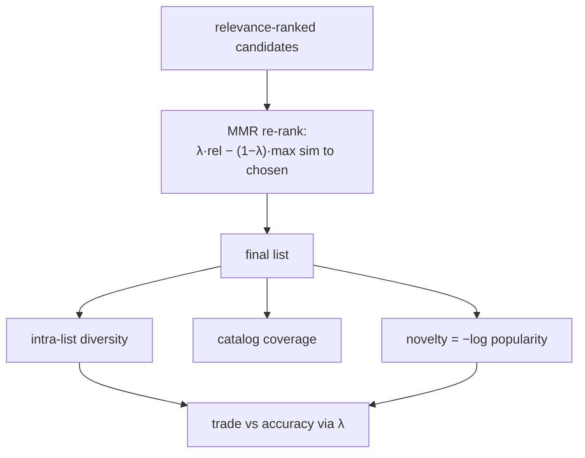

A recommender optimized purely for relevance tends to produce a list that is correct
and useless: ten near-identical items, all safe, all things the user has obviously
seen before. Accuracy metrics reward this, because each item individually scores high,
but the *list* fails the user, who wanted a screen of varied options, some discovery,
maybe a pleasant surprise. The beyond-accuracy metrics measure those list-level
qualities that relevance ignores, and they often trade against accuracy, which is the
central tension of recommendation.

## Diversity: how different are the items from each other

**Intra-list diversity** measures how dissimilar the items in a single recommendation
list are, usually as the average pairwise distance:

$$
\text{Diversity} = \frac{1}{|L|(|L|-1)}\sum_{i \in L}\sum_{j \in L,\ j \ne i} \big(1 - \text{sim}(i, j)\big),
$$

where $\text{sim}(i, j)$ is an item-item similarity (content or embedding cosine) and
$L$ is the list. A list of ten copies of the same item has diversity $0$; a list of
ten unrelated items approaches $1$. Low diversity is what a relevance-only ranker
drifts toward, because the highest-scoring items are usually similar to each other.

## Coverage: how much of the catalog is reachable

**Catalog coverage** is the fraction of all items that ever appear in *anyone's*
recommendations:

$$
\text{Coverage} = \frac{|\{\text{items recommended to at least one user}\}|}{|\{\text{all items}\}|}.
$$

A system with high accuracy but low coverage recommends the same popular head to
everyone and never surfaces the long tail, which starves new and niche items of the
exposure they need to ever accumulate signal (the cold-start feedback loop). Coverage
is a system-health metric, measured across users, not per list.

## Novelty and serendipity

**Novelty** rewards recommending items the user is unlikely to have already
discovered, typically by the negative log popularity of the recommended items: a
blockbuster everyone knows has low novelty, an obscure item high novelty.

$$
\text{Novelty}(i) = -\log_2 \big(\text{popularity}(i)\big).
$$

**Serendipity** is the hardest to pin down: a recommendation that is both *relevant*
and *unexpected*, something the user would not have found themselves but is glad to
see. It is usually approximated as relevance minus what a trivial (popularity or
obvious-similarity) baseline would have recommended, rewarding the relevant items the
obvious model misses.

## The accuracy trade-off and re-ranking

These metrics generally fight accuracy: the most relevant list is often the least
diverse and the least novel. The standard remedy is **re-ranking** the relevance-ranked
candidates to inject diversity, the classic tool being **maximal marginal relevance**
(MMR), which greedily picks the next item to maximize a blend of relevance and
dissimilarity to what is already chosen<FN n="1" />:

$$
\text{MMR} = \arg\max_{i \notin S}\ \Big[\lambda\, \text{rel}(i) - (1-\lambda)\max_{j \in S}\text{sim}(i, j)\Big],
$$

where $S$ is the set already selected and $\lambda$ tunes the relevance-diversity
balance. Tuning $\lambda$ trades a little relevance for a more varied list, a choice
the product makes deliberately rather than letting the accuracy metric make it by
default.



## Check it on arrays

```python
import numpy as np

rng = np.random.default_rng(0)
n_items, d = 30, 8
emb = rng.normal(size=(n_items, d))
emb /= np.linalg.norm(emb, axis=1, keepdims=True)
rel = rng.uniform(0, 1, n_items)                  # relevance score per item

def sim(i, j):
    return float(emb[i] @ emb[j])

def intra_list_diversity(items):
    pairs = [(1 - sim(i, j)) for a, i in enumerate(items) for j in items[a+1:]]
    return np.mean(pairs)

# Top-k by pure relevance vs MMR re-ranking
def mmr(cands, k, lam):
    chosen = []
    pool = list(cands)
    while len(chosen) < k and pool:
        def score(i):
            div = max((sim(i, j) for j in chosen), default=0.0)
            return lam * rel[i] - (1 - lam) * div
        nxt = max(pool, key=score)
        chosen.append(nxt); pool.remove(nxt)
    return chosen

cands = list(np.argsort(-rel))
pure = cands[:10]
diverse = mmr(cands, 10, lam=0.5)

div_pure = intra_list_diversity(pure)
div_mmr = intra_list_diversity(diverse)
print(f"diversity  pure-relevance: {div_pure:.3f}")
print(f"diversity  MMR (λ=0.5)   : {div_mmr:.3f}")
# MMR raises intra-list diversity relative to the pure-relevance list
assert div_mmr > div_pure
```

MMR builds a list that is more varied than the relevance-only top-10, paying a little
relevance for items that are less redundant with what is already shown.

## Exercises

**Exercise 1.** Item A has popularity (interaction fraction) $0.5$ and item B has
$0.01$. Compute the novelty $-\log_2(\text{popularity})$ of each, and say which the
novelty metric prefers to recommend.

<details>
<summary>Solution</summary>

**Step 1.** Novelty of A: $-\log_2(0.5) = 1$ bit.

**Step 2.** Novelty of B: $-\log_2(0.01) = \log_2(100) \approx 6.64$ bits.

**Step 3.** The novelty metric prefers item B (about $6.6$ vs $1$): the rarer item is
more likely to be something the user has not already encountered, which is what
novelty rewards.

</details>

**Exercise 2.** A list of five items has all pairwise similarities equal to $0.9$.
Compute its intra-list diversity, and state what changes if one item is replaced by
one with similarity $0.1$ to the others.

<details>
<summary>Solution</summary>

**Step 1.** Every pair contributes $1 - 0.9 = 0.1$, and the average of identical
values is $0.1$, so diversity $= 0.1$ (a near-duplicate list).

**Step 2.** Replacing one item creates four new pairs at similarity $0.1$ (distance
$0.9$) while the remaining $\binom{4}{2} = 6$ pairs stay at distance $0.1$.

**Step 3.** New diversity $= (4 \cdot 0.9 + 6 \cdot 0.1)/10 = (3.6 + 0.6)/10 = 0.42$,
a large jump: one dissimilar item substantially raises list diversity, which is the
lever MMR pulls.

</details>

**Exercise 3 (code).** Sweep the MMR $\lambda$ from $0$ (pure diversity) to $1$ (pure
relevance) and verify that the list's total relevance is non-decreasing in $\lambda$
while its diversity is non-increasing, tracing the accuracy-diversity trade-off.

<details>
<summary>Solution</summary>

```python
import numpy as np

rng = np.random.default_rng(0)
n, d = 30, 8
emb = rng.normal(size=(n, d)); emb /= np.linalg.norm(emb, axis=1, keepdims=True)
rel = rng.uniform(0, 1, n)
def sim(i, j): return float(emb[i] @ emb[j])

def mmr(k, lam):
    chosen, pool = [], list(np.argsort(-rel))
    while len(chosen) < k and pool:
        nxt = max(pool, key=lambda i: lam*rel[i] - (1-lam)*max((sim(i,j) for j in chosen), default=0.0))
        chosen.append(nxt); pool.remove(nxt)
    return chosen
def div(items):
    return np.mean([1 - sim(i, j) for a, i in enumerate(items) for j in items[a+1:]])

lams = [0.0, 0.25, 0.5, 0.75, 1.0]
totrel = [rel[mmr(10, l)].sum() for l in lams]
divs = [div(mmr(10, l)) for l in lams]
print("relevance:", [round(r, 2) for r in totrel])
print("diversity:", [round(v, 2) for v in divs])
# Endpoints bound the frontier: pure relevance (λ=1) maximizes total relevance,
# pure diversity (λ=0) maximizes the list's diversity.
assert totrel[-1] > totrel[0]
assert divs[0] > divs[-1]
```

The $\lambda = 1$ end maximizes total relevance and the $\lambda = 0$ end maximizes
diversity, so sweeping $\lambda$ traces a frontier the product picks a point on rather
than defaulting to the relevance-only corner. (MMR is greedy, so the curve between the
endpoints is not perfectly monotone, but the trade-off direction is clear.)

</details>

The next lesson turns to how any of these metrics is computed honestly offline, where
a careless train/test split can leak the future and inflate every number.

<Footnotes>
  <FNItem n="1">**Carbonell, J., & Goldstein, J.** (1998). "The use of MMR, diversity-based reranking for reordering documents and producing summaries". *SIGIR*. [doi:10.1145/290941.291025](https://doi.org/10.1145/290941.291025). Maximal marginal relevance.</FNItem>
  <FNItem n="2">**Castells, P., Hurley, N. J., & Vargas, S.** (2015). "Novelty and diversity in recommender systems". In *Recommender Systems Handbook* (2nd ed.), Springer, 881-918. [doi:10.1007/978-1-4899-7637-6_26](https://doi.org/10.1007/978-1-4899-7637-6_26). Formal definitions of diversity, novelty, coverage, and serendipity.</FNItem>
</Footnotes>
