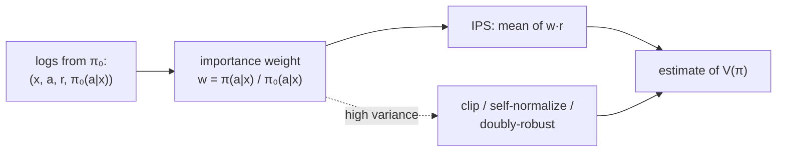

A logged dataset records what the *deployed* recommender showed and how users
responded, but the question you want to answer is about a *different* recommender:
what would the new policy have earned if it had been live? You cannot read that off the
logs directly, because the new policy would have shown different items, for which you
have no feedback. This is the off-policy, or counterfactual, evaluation problem, and
its core tool is the same inverse-propensity weighting used to debias observational
causal estimates.

## The setup: logging policy and target policy

The logs were generated by a **logging policy** $\pi_0$ that, for a context $x$ (the
user and request), showed action $a$ (an item or list) with probability
$\pi_0(a \mid x)$, and observed reward $r$ (a click, a purchase). You want the
**value** of a **target policy** $\pi$, the expected reward if $\pi$ were deployed:

$$
V(\pi) = \mathbb{E}_{x}\,\mathbb{E}_{a \sim \pi(\cdot \mid x)}\big[\,r(x, a)\,\big].
$$

The obstacle is that the sum is over actions $\pi$ would take, but the logged rewards
are for the actions $\pi_0$ took. Naively averaging the logged rewards estimates
$V(\pi_0)$, the policy you already have, not $V(\pi)$.

## Inverse-propensity scoring

The fix re-weights each logged example by how much more (or less) likely the target
policy was to take the action the logging policy actually took<FN n="1" />:

$$
\hat V_{\text{IPS}}(\pi) = \frac{1}{n}\sum_{k=1}^n \frac{\pi(a_k \mid x_k)}{\pi_0(a_k \mid x_k)}\, r_k.
$$

The weight $w_k = \pi(a_k \mid x_k)/\pi_0(a_k \mid x_k)$ is the **importance ratio**.
An action the target policy favors but the logger rarely showed is up-weighted; an
action the target policy would avoid is down-weighted toward zero. The estimator is
**unbiased** for $V(\pi)$: in expectation the importance weights convert the logging
distribution into the target distribution.

**Why it is unbiased (one line).** Taking expectations over $a \sim \pi_0$, the weight
cancels the logging probability and supplies the target probability:
$\mathbb{E}_{a\sim\pi_0}\big[\frac{\pi(a|x)}{\pi_0(a|x)} r\big] = \sum_a \pi_0(a|x)\frac{\pi(a|x)}{\pi_0(a|x)} r(x,a) = \sum_a \pi(a|x) r(x,a)$,
which is exactly the inner expectation in $V(\pi)$.

## Two requirements and the variance problem

IPS is unbiased only under two conditions. **Known propensities:** $\pi_0(a \mid x)$
must be recorded at logging time; a deterministic logger ($\pi_0 \in \{0, 1\}$) makes
the ratio undefined for actions it never took, which is why production loggers inject
randomization (the exploration of the bandit lesson) precisely so off-policy
evaluation is possible later. **Common support:** every action $\pi$ might take must
have had nonzero logging probability, or its reward is unobservable.

The practical weakness is **variance**: when $\pi$ and $\pi_0$ differ a lot, a few
examples get enormous weights and dominate the estimate, so it is unbiased but noisy.
The standard remedies are **clipping** (cap each weight at some $M$, trading a little
bias for much less variance), **self-normalization** (divide by the sum of weights
instead of $n$), and the **doubly-robust** estimator that combines IPS with a reward
model so it stays accurate if *either* the propensities or the model are right<FN n="2" />.



## Check it on arrays

```python
import numpy as np

rng = np.random.default_rng(0)
n_actions = 5
# True expected reward per action (unknown to the estimator)
true_reward = np.array([0.1, 0.2, 0.3, 0.4, 0.5])

# Logging policy pi_0 (stochastic, known) and a target policy pi we want to evaluate
pi_0 = np.array([0.4, 0.3, 0.15, 0.1, 0.05])      # favors low-reward actions
pi = np.array([0.05, 0.1, 0.15, 0.3, 0.4])        # favors high-reward actions

# True value of the target policy (what we are trying to recover)
V_true = (pi * true_reward).sum()

# Generate logs from pi_0 and apply IPS
N = 200_000
a = rng.choice(n_actions, size=N, p=pi_0)
r = (rng.random(N) < true_reward[a]).astype(float)   # Bernoulli reward
w = pi[a] / pi_0[a]                                   # importance weights
V_ips = (w * r).mean()

# Naive log average estimates V(pi_0), NOT V(pi)
V_naive = r.mean()
V_logging = (pi_0 * true_reward).sum()

print(f"true V(pi)         : {V_true:.4f}")
print(f"IPS estimate of V(pi): {V_ips:.4f}")
print(f"naive log average  : {V_naive:.4f}  (estimates V(pi_0) = {V_logging:.4f})")
assert abs(V_ips - V_true) < 0.01          # IPS recovers the target policy's value
assert abs(V_naive - V_logging) < 0.01     # naive average is the logging policy's value
```

The IPS estimate, built only from logs the logging policy produced, recovers the target
policy's true value, while the naive average of logged rewards estimates the value of
the policy that did the logging, a different and wrong number.

## Exercises

**Exercise 1.** A logged example has logging probability $\pi_0(a \mid x) = 0.2$, target
probability $\pi(a \mid x) = 0.6$, and reward $r = 1$. Compute its IPS contribution.
What does a weight greater than $1$ mean?

<details>
<summary>Solution</summary>

**Step 1.** Importance weight: $w = \pi/\pi_0 = 0.6/0.2 = 3$.

**Step 2.** IPS contribution: $w \cdot r = 3 \cdot 1 = 3$.

**Step 3.** A weight above $1$ means the target policy would take this action *more*
often than the logger did, so this example is up-weighted to represent the extra mass
the target policy puts on it, the re-weighting that converts the logging distribution
into the target distribution.

</details>

**Exercise 2.** A logging policy is deterministic: it always shows the single
top-scored item ($\pi_0(a \mid x) = 1$ for that item, $0$ for all others). Explain why
IPS cannot evaluate a target policy that would sometimes show a different item.

<details>
<summary>Solution</summary>

**Step 1.** For any item the logger never showed, $\pi_0(a \mid x) = 0$, so the
importance weight $\pi(a \mid x)/\pi_0(a \mid x)$ divides by zero and is undefined.

**Step 2.** There is simply no logged reward for those items, because they were never
shown, so their contribution to $V(\pi)$ is unobservable, the common-support failure.

**Step 3.** This is why loggers add randomization (exploration): a stochastic
$\pi_0 > 0$ on alternative items is what makes off-policy evaluation of those items
possible later.

</details>

**Exercise 3 (code).** Demonstrate the variance cost: make the target policy very
different from the logger (so some weights are large), and show that clipping the
weights at a cap reduces the estimate's variance across repeated samples, at the cost
of a small bias.

<details>
<summary>Solution</summary>

```python
import numpy as np

rng = np.random.default_rng(0)
true_reward = np.array([0.1, 0.2, 0.3, 0.4, 0.5])
pi_0 = np.array([0.6, 0.2, 0.1, 0.06, 0.04])     # logger far from target
pi = np.array([0.02, 0.03, 0.05, 0.3, 0.6])

def estimate(N, clip=None):
    a = rng.choice(5, size=N, p=pi_0)
    r = (rng.random(N) < true_reward[a]).astype(float)
    w = pi[a] / pi_0[a]
    if clip is not None:
        w = np.minimum(w, clip)
    return (w * r).mean()

raw = np.array([estimate(2000) for _ in range(200)])
clipped = np.array([estimate(2000, clip=5.0) for _ in range(200)])
print(f"raw IPS     std: {raw.std():.4f}")
print(f"clipped IPS std: {clipped.std():.4f}")
assert clipped.std() < raw.std()                  # clipping cuts variance
```

Clipping the importance weights caps the influence of any single high-weight example,
shrinking the estimator's variance markedly; the small bias it introduces is usually a
worthwhile trade when the policies differ enough to make raw IPS unusably noisy.

</details>

The next lesson confronts the gap that remains even after careful offline and online
evaluation: why a model that wins offline can still fail online, and how the feedback
loop creates it.

<Footnotes>
  <FNItem n="1">**Bottou, L., Peters, J., Quiñonero-Candela, J., et al.** (2013). "Counterfactual reasoning and learning systems: the example of computational advertising". *JMLR*, 14, 3207-3260. [https://jmlr.org/papers/v14/bottou13a.html](https://jmlr.org/papers/v14/bottou13a.html). Inverse-propensity off-policy evaluation for logged interaction data.</FNItem>
  <FNItem n="2">**Dudík, M., Langford, J., & Li, L.** (2011). "Doubly robust policy evaluation and learning". *ICML*. [arXiv:1103.4601](https://arxiv.org/abs/1103.4601). The doubly-robust estimator combining IPS with a reward model.</FNItem>
</Footnotes>
