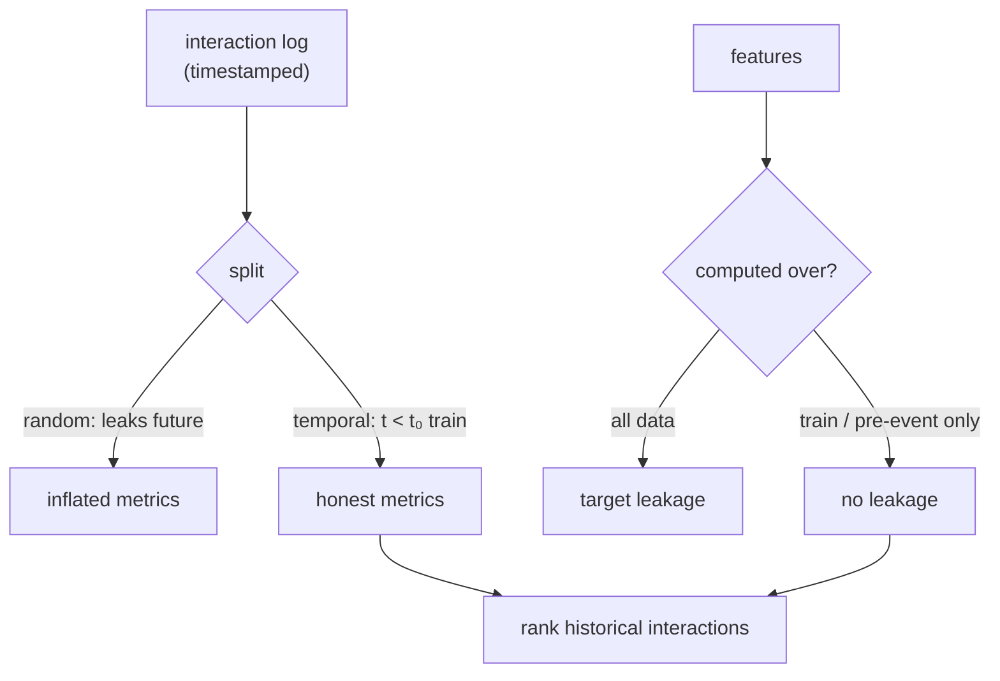

Offline evaluation is where a model change is judged before it ever reaches a user,
and it is unusually easy to get wrong in recommendation. The data has a time
structure and a feedback structure that a naive random split ignores, and ignoring
them inflates every metric: the model looks great offline and disappoints online. This
lesson is about constructing splits that do not let the model see information it would
not have at serving time.

## The cardinal rule: do not predict the past from the future

At serving time a recommender knows only what happened *before* the request. An
honest offline split must respect that arrow of time. A **random** train/test split
violates it: a user's interaction from January can land in the test set while their
March interaction lands in training, so the model trains on the user's future to
predict their past. The fix is a **temporal split**: train on everything before a cut
time $t_0$, test on everything after. Every test prediction then uses only
information that genuinely predates it, exactly the serving condition.

For per-user evaluation the analogue is **leave-one-out by time**: hold out each
user's single most recent interaction as the test item and train on the rest, so the
model predicts the next action from the prior history, the real task.

## Target leakage through features

Even with a correct split, features can leak the label. The classic case is any
statistic computed over the **whole dataset**: an item's average rating, a
target-encoded category, a normalization constant. If that statistic includes the
test rows, then a test item's own label has leaked into its feature, and the model
scores well offline by reading an answer it will not have online. Every aggregate
feature must be computed from the training partition only (or from data strictly
prior to each example), which is precisely what a feature store's point-in-time joins
enforce.

## Sampled metrics and their distortion

Computing a ranking metric over the full catalog per user is expensive, so a common
shortcut ranks each held-out positive against a *sample* of negatives (say $100$
random items) and reports the metric on that small list. This **sampled evaluation**
is convenient but biased: the metric on $100$ sampled negatives does not preserve the
ordering of models that the full-catalog metric would give, and it can reverse which
of two models looks better<FN n="1" />. Sampled metrics are acceptable for rough
iteration but the final comparison should use full-catalog ranking or a known
correction.

## What offline can and cannot tell you

A correct offline split estimates how a model ranks *historical* interactions, which
is necessary but not sufficient: it cannot observe how users would respond to
recommendations the logging policy never showed them, the counterfactual gap the next
lessons address. Offline evaluation filters out clearly worse models cheaply; the
survivors still need an online test before they ship.



## Check it on arrays

```python
import numpy as np

rng = np.random.default_rng(0)
n_items, N = 300, 3000            # ~10 interactions per item
base = rng.uniform(0.1, 0.7, n_items)             # each item's true click rate
item = rng.integers(0, n_items, N)
y = (rng.random(N) < base[item]).astype(float)

perm = rng.permutation(N); cut = int(0.8 * N)
train, test = perm[:cut], perm[cut:]

def item_rate(rows):
    r = np.full(n_items, y[train].mean())          # fallback = global train mean
    for i in range(n_items):
        m = rows[item[rows] == i]
        if len(m):
            r[i] = y[m].mean()
    return r

honest = item_rate(train)                          # feature from TRAIN only (correct)
leaky = item_rate(np.arange(N))                    # feature from ALL rows (leaks test)

def auc(score, lab):
    pos, neg = score[lab == 1], score[lab == 0]
    return (pos[:, None] > neg[None, :]).mean()

auc_honest = auc(honest[item[test]], y[test])
auc_leaky = auc(leaky[item[test]], y[test])
print(f"honest (train-only feature) test AUC: {auc_honest:.3f}")
print(f"leaky  (all-data feature)   test AUC: {auc_leaky:.3f}")
# Computing the item-rate feature over all data leaks the test labels and inflates AUC
assert auc_leaky > auc_honest + 0.05
```

The only difference between the two runs is whether the item-rate feature was computed
over the training rows or over all rows; including the test rows leaks each test
label into its own feature and inflates the AUC, the silent failure a careful split
prevents.

## Exercises

**Exercise 1.** A team reports that their new recommender achieves nDCG $0.92$ offline
but no lift in an A/B test. Their evaluation used a uniformly random train/test split
on a year of interaction logs. Name the likely flaw and the fix.

<details>
<summary>Solution</summary>

**Step 1.** A random split mixes time, so each user's future interactions can appear
in training, letting the model exploit information it would not have at serving time.

**Step 2.** The offline nDCG is inflated by this temporal leakage, so it does not
predict online behavior, which is why the A/B test shows no lift.

**Step 3.** The fix is a temporal split (train on data before a cut time, test on data
after) or leave-one-out by time, so every offline prediction uses only past
information, matching the serving condition.

</details>

**Exercise 2.** Explain why target-encoding an item by its average label is safe under
a temporal split only if the encoding is computed from data strictly before each
example's timestamp.

<details>
<summary>Solution</summary>

**Step 1.** Target encoding replaces an item with its mean label; if that mean
includes the example's own (future) label, the feature partly is the label.

**Step 2.** Under a temporal split the test labels are after $t_0$, so encoding from
train-only data (before $t_0$) keeps them out, but encoding an *individual* training
example from later training rows still leaks within the training set.

**Step 3.** Computing each example's encoding only from data strictly before its
timestamp guarantees no example ever sees its own or any future label, which is the
point-in-time correctness a feature store provides.

</details>

**Exercise 3 (code).** Show sampled evaluation can mislead: rank a held-out positive
against the full catalog versus against a small random sample of negatives, and verify
the hit-rate@10 measured on the sample overstates the full-catalog hit-rate@10.

<details>
<summary>Solution</summary>

```python
import numpy as np

rng = np.random.default_rng(0)
n_items = 2000
scores = rng.normal(size=n_items)          # model scores for one user's items
# The held-out positive sits just outside the full-catalog top 10 (rank ~101)
positive = int(np.argsort(-scores)[100])

# Full-catalog hit@10: is the positive among the top 10 of ALL items?
full_rank = (scores > scores[positive]).sum() + 1
full_hit = float(full_rank <= 10)

# Sampled hit@10: rank the positive against 100 random negatives only
trials = 2000; hits = 0
for _ in range(trials):
    negs = rng.choice([i for i in range(n_items) if i != positive], 99, replace=False)
    cand = np.append(negs, positive)
    rank = (scores[cand] > scores[positive]).sum() + 1
    hits += rank <= 10
sampled_hit = hits / trials

print(f"full-catalog hit@10: {full_hit:.0f}   sampled hit@10: {sampled_hit:.3f}")
assert sampled_hit > full_hit
```

Ranking against only $99$ negatives makes it far easier for the positive to reach the
top $10$, so the sampled hit-rate is optimistic relative to the full-catalog truth,
which is why final comparisons avoid sampled metrics.

</details>

The next lesson moves from offline estimates to the gold standard, the online A/B test
that measures real user response, with the recsys-specific traps that distort it.

<Footnotes>
  <FNItem n="1">**Krichene, W., & Rendle, S.** (2020). "On sampled metrics for item recommendation". *KDD*. [doi:10.1145/3394486.3403226](https://doi.org/10.1145/3394486.3403226). How sampled ranking metrics distort model comparisons.</FNItem>
  <FNItem n="2">**Meng, Z., McCreadie, R., Macdonald, C., & Ounis, I.** (2020). "Exploring data splitting strategies for the evaluation of recommendation models". *RecSys*. [doi:10.1145/3383313.3412218](https://doi.org/10.1145/3383313.3412218). Temporal versus random splits and leave-one-out in recommendation.</FNItem>
</Footnotes>
