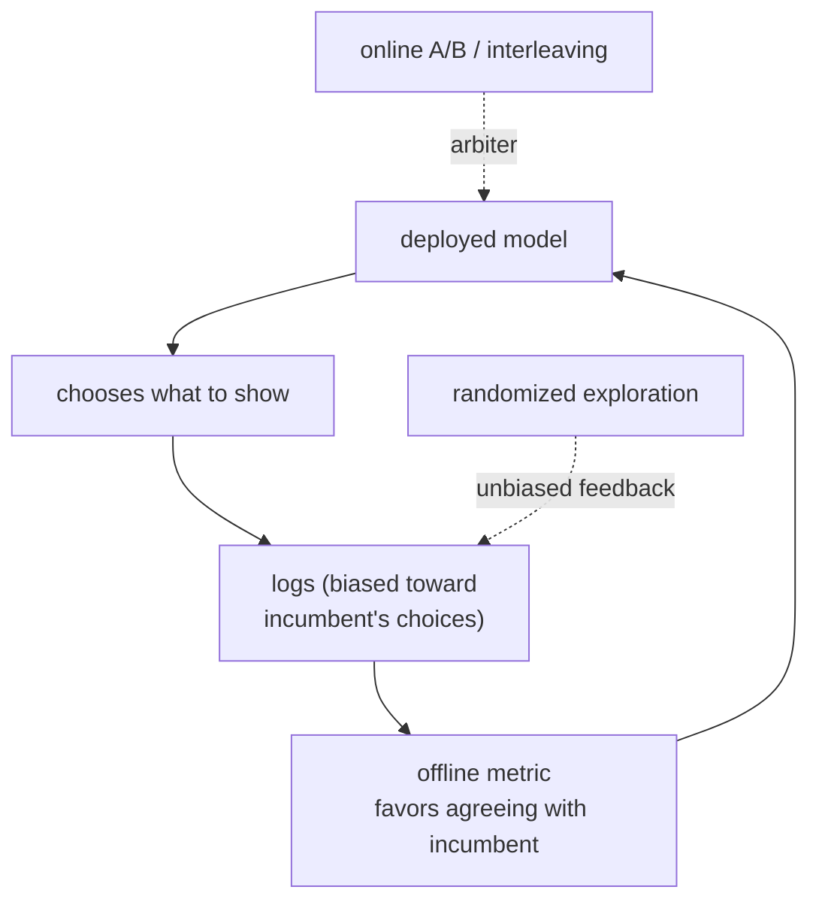

A recurring frustration in recommendation is the model that wins decisively offline
and then shows no lift, or a loss, in the A/B test. This is not usually a bug in the
experiment; it is the **offline-online gap**, and it has a structural cause. The
offline data was produced by the system already in production, so it carries that
system's biases, and a metric computed on it rewards agreeing with the incumbent
rather than being genuinely better. Understanding the gap is what keeps a team from
shipping offline mirages.

## The feedback loop

A deployed recommender does not passively observe data; it *chooses* what users see,
and those choices become the next training set. An item the system ranks high gets
shown, accumulates interactions, and looks even better next time; an item it ranks low
is shown rarely, never accumulates evidence, and stays buried regardless of its true
quality. The data is a closed loop, where the model's past decisions shape the
feedback used to evaluate its future decisions. The result is **exposure bias**: the
logs over-represent what the incumbent liked, so they cannot fairly judge a policy
that would have made different choices.

## Why offline favors the incumbent

An offline metric is computed on logged interactions, which are concentrated on the
items the logging policy showed. A new model that mostly agrees with the incumbent
scores well, because the test labels exist for exactly those items. A new model that
would surface different items has little logged feedback for them, so its genuinely
good but unshown picks earn no offline credit, or are scored on a biased sample. The
offline metric therefore has a built-in bias *toward the policy that generated the
data*, which is why a bolder, actually-better model can look worse offline and only
reveal its value online, where it gets to make and be judged on its own choices.

The counterfactual estimators of the previous lesson (inverse-propensity weighting)
correct for this when propensities are logged, which is the principled fix; the gap is
worst precisely when the logger was deterministic and no propensities were recorded.

## Distribution shift over time

Even without the loop, the world moves. Tastes drift, the catalog turns over, trends
rise and fade. A model validated on last quarter's logs is evaluated on a distribution
that no longer matches the one it will serve, so offline performance is an estimate of
the past, not the present. Temporal validation (the previous discipline) reduces this
but cannot eliminate it; the residual is part of the gap.

## Closing the loop

The gap is managed, not eliminated, by feeding online truth back into the offline
process. Inject **randomized exploration** so the logs contain unbiased feedback on
items the model would not otherwise show (the same randomization that makes
off-policy evaluation valid). Trust **online A/B and interleaving** as the arbiter when
offline and online disagree. And treat offline metrics as a *filter* that removes
clearly worse models cheaply, never as the final verdict. The discipline is to know
which signal to believe: when a careful online test contradicts a strong offline
number, the online test is right.



## Check it on arrays

```python
import numpy as np

def rank_corr(a, b):
    ra, rb = np.argsort(np.argsort(a)), np.argsort(np.argsort(b))
    return np.corrcoef(ra, rb)[0, 1]

rng = np.random.default_rng(0)
n = 50
quality = rng.uniform(0.1, 0.6, n)                # true item quality (unknown)

# Warm up with one noisy impression each, then run two exposure regimes.
imp = np.ones(n); clk = (rng.random(n) < quality).astype(float)
impO, clkO = imp.copy(), clk.copy()
K = 10
for _ in range(80):
    # CLOSED loop: greedily show only the current top-K (feedback loop)
    top = np.argsort(-(clk / imp))[:K]
    for i in top:
        imp[i] += 1; clk[i] += rng.random() < quality[i]
    # OPEN loop: show K uniformly random items (exploration)
    for i in rng.choice(n, K, replace=False):
        impO[i] += 1; clkO[i] += rng.random() < quality[i]

closed_corr = rank_corr(clk / imp, quality)
open_corr = rank_corr(clkO / impO, quality)
print(f"closed-loop estimate vs true quality: {closed_corr:.3f}")
print(f"open-loop  estimate vs true quality: {open_corr:.3f}")
# The feedback loop starves unlucky-but-good items, wrecking the quality estimate;
# exploration recovers the true ordering.
assert open_corr > closed_corr + 0.2
```

Under the greedy feedback loop, items that drew an unlucky first impression are never
shown again and their quality estimate stays frozen and wrong, so the closed-loop
estimate barely tracks true quality; uniform exploration keeps measuring every item and
recovers the ordering, which is why randomized logging is the antidote to the gap.

## Exercises

**Exercise 1.** A new ranker scores $+8\%$ nDCG offline on logs from the current
production model but is flat in an A/B test. Give the most likely structural reason and
one diagnostic you would run.

<details>
<summary>Solution</summary>

**Step 1.** The offline logs were generated by the production model, so they
over-represent the items it showed; the new ranker's $+8\%$ may reflect agreeing with
the incumbent on those items rather than genuine improvement (exposure bias).

**Step 2.** A diagnostic: check how often the new ranker's top items were actually
shown (and thus have feedback) in the logs; if it scores well only on
heavily-logged items and its novel picks are unmeasured, the offline win is an
artifact of coverage.

**Step 3.** The fix is to evaluate with inverse-propensity weighting on randomized-
exploration logs, or to trust the A/B test as the arbiter, which here says no real
lift.

</details>

**Exercise 2.** Explain why injecting a small fraction of randomized exploration into a
production recommender improves not just immediate learning but the validity of future
offline evaluation.

<details>
<summary>Solution</summary>

**Step 1.** Randomized exploration shows items the greedy policy would not, so the logs
gain unbiased feedback on items outside the incumbent's choices.

**Step 2.** This breaks the closed loop's exposure bias: the logs now cover the action
space more evenly, so a new policy's different picks have observed outcomes to be
evaluated on.

**Step 3.** It also records nonzero propensities for those actions, which is the
precondition for unbiased inverse-propensity off-policy evaluation, so future offline
estimates of new policies become valid rather than incumbent-biased.

</details>

**Exercise 3 (code).** Quantify the starvation: in the closed-loop simulation, count
how many items received *no* extra impressions beyond the warmup, and verify that
some high-quality items are among the starved (their true quality exceeds the median).

<details>
<summary>Solution</summary>

```python
import numpy as np

rng = np.random.default_rng(0)
n = 50
quality = rng.uniform(0.1, 0.6, n)
imp = np.ones(n); clk = (rng.random(n) < quality).astype(float)
K = 10
for _ in range(80):
    top = np.argsort(-(clk / imp))[:K]
    for i in top:
        imp[i] += 1; clk[i] += rng.random() < quality[i]

starved = np.where(imp == 1)[0]                   # never shown after warmup
good_starved = starved[quality[starved] > np.median(quality)]
print(f"starved items: {len(starved)} of {n}")
print(f"high-quality items among the starved: {len(good_starved)}")
assert len(starved) > 0 and len(good_starved) > 0
```

A large share of the catalog is never shown again after the warmup, and some of those
starved items are above-median quality, exactly the good recommendations the closed
loop can never discover without exploration.

</details>

This closes evaluation and experimentation. The next discipline examines a different
consequence of the same feedback loop: the biases and fairness problems that exposure
imbalance creates, and how to correct them.

<Footnotes>
  <FNItem n="1">**Chaney, A. J. B., Stewart, B. M., & Engelhardt, B. E.** (2018). "How algorithmic confounding in recommendation systems increases homogeneity and decreases utility". *RecSys*. [arXiv:1710.11214](https://arxiv.org/abs/1710.11214). The closed feedback loop and its degradation of recommendation quality.</FNItem>
  <FNItem n="2">**Gilotte, A., Calauzènes, C., Nedelec, T., Abraham, A., & Dollé, S.** (2018). "Offline A/B testing for recommender systems". *WSDM*. [arXiv:1801.07030](https://arxiv.org/abs/1801.07030). Reconciling offline counterfactual estimates with online experiments.</FNItem>
</Footnotes>
