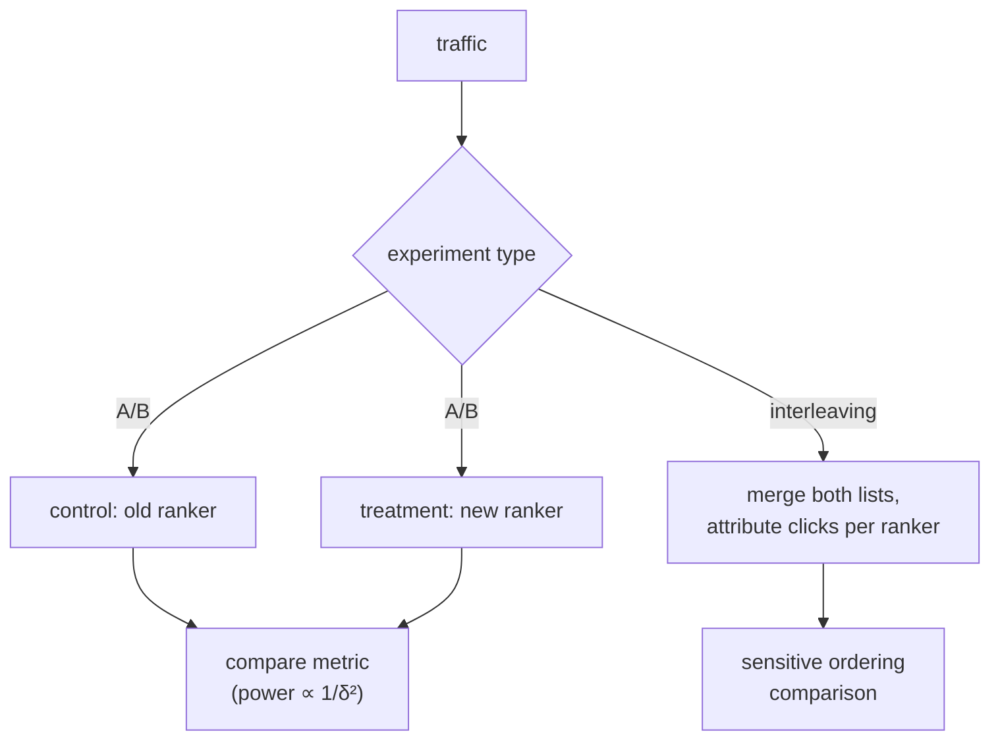

Offline metrics filter out bad models cheaply, but they cannot tell you how users will
actually respond to recommendations the old system never showed. Only an online
experiment can. The A/B test is the gold standard: split traffic, serve the new
ranker to one group and the old to another, and compare a real outcome like
click-through or conversion. The mechanics are standard statistics; what makes
recommendation A/B testing distinctive is a set of traps, interference, novelty
effects, and underpowered comparisons, that can make a real win look flat or a flat
change look like a win.

## The test and its power

Split users randomly into control (A, old model) and treatment (B, new model), measure
a metric per user, and test whether the difference is larger than noise. For a rate
metric like CTR with control rate $p$ and a minimum effect you care to detect $\delta$
(the **minimum detectable effect**), the per-group sample size is approximately

$$
n \approx \frac{2\,p(1-p)\,(z_{\alpha/2} + z_{\beta})^2}{\delta^2},
$$

where $z_{\alpha/2}$ and $z_\beta$ are the normal quantiles for the significance level
$\alpha$ and power $1 - \beta$. The formula's message is the trap: small effects need
*quadratically* more traffic. Detecting a $0.1\%$ absolute CTR lift takes a hundred
times the users of a $1\%$ lift, which is why recommendation experiments often run for
weeks and why an underpowered test that "shows no significant difference" may simply
lack the traffic to see a real one.

## Interference: the SUTVA violation

Standard A/B analysis assumes a user's outcome depends only on their own treatment
(the stable-unit-treatment-value assumption). Recommendation routinely breaks it.
**Interference** arises when treating one user affects another: in a marketplace, if
treatment users buy more of a limited-stock item, control users see it sell out;
in a social feed, treatment users who engage more generate content that control users
then see. The randomization is at the user level but the effect leaks across users, so
the measured difference is biased. The mitigation is **cluster randomization** (split by
isolated communities or markets rather than individuals) so that interference stays
within a treatment arm.

## Novelty and primacy effects

A new recommender often shows an inflated lift in its first days simply because it is
*different*: users click the unfamiliar items out of curiosity (the **novelty
effect**), or are briefly confused by a changed layout (the **primacy effect**). Both
fade. An experiment read too early captures the transient, not the steady state, so
recommendation A/B tests run long enough for these to decay and report the converged
effect, not the launch spike.

## Interleaving: more sensitive, when it applies

When the question is purely "which ranker orders items better", **interleaving** is far
more sensitive than a between-user A/B test. Instead of giving each user one ranker, it
merges both rankers' lists into one and attributes each click to whichever ranker
contributed that item<FN n="1" />. Because every user sees both rankers, the comparison
removes between-user variance and reaches significance with one to two orders of
magnitude less traffic. Its limit is scope: interleaving compares *orderings* of the
same candidates, so it cannot measure whole-experience changes (a new UI, a different
candidate source) that an A/B test handles.



## Check it on arrays

```python
import numpy as np

# Sample size for a two-proportion test (normal approximation)
def sample_size(p, mde, alpha=0.05, power=0.8):
    from math import sqrt
    z_a = 1.959964               # z_{alpha/2} for alpha=0.05 (two-sided)
    z_b = 0.841621               # z for power=0.80
    return 2 * p * (1 - p) * (z_a + z_b) ** 2 / mde ** 2

p = 0.10
print(f"n per group for 1.0% absolute lift: {sample_size(p, 0.010):,.0f}")
print(f"n per group for 0.1% absolute lift: {sample_size(p, 0.001):,.0f}")
# A 10x smaller effect needs 100x the traffic (quadratic in 1/delta)
assert np.isclose(sample_size(p, 0.001) / sample_size(p, 0.010), 100.0)

# Simulate one A/B test detecting a true lift via a two-proportion z-test
rng = np.random.default_rng(0)
n = 40_000
a = rng.random(n) < 0.10                       # control CTR 10%
b = rng.random(n) < 0.11                       # treatment CTR 11% (true lift)
pa, pb = a.mean(), b.mean()
pooled = (a.sum() + b.sum()) / (2 * n)
se = np.sqrt(pooled * (1 - pooled) * (2 / n))
z = (pb - pa) / se
print(f"control {pa:.3f}  treatment {pb:.3f}  z = {z:.2f}")
assert abs(z) > 1.96                            # significant at alpha=0.05
```

The sample-size formula shows the quadratic cost of small effects, and the simulated
test, sized large enough, detects the true $1\%$ lift at the $0.05$ level; a test a
tenth the size would often miss it.

## Exercises

**Exercise 1.** A control CTR is $p = 0.2$ and you want to detect a $1\%$ absolute lift
($\delta = 0.01$) at $\alpha = 0.05$, power $0.8$ (so $z_{\alpha/2} + z_\beta \approx
2.8$). Estimate the per-group sample size.

<details>
<summary>Solution</summary>

**Step 1.** $p(1-p) = 0.2 \cdot 0.8 = 0.16$.

**Step 2.** Numerator: $2 \cdot 0.16 \cdot 2.8^2 = 0.32 \cdot 7.84 = 2.5088$.

**Step 3.** Divide by $\delta^2 = 0.0001$: $n \approx 2.5088 / 0.0001 = 25{,}088$ per
group. Roughly $25$k users per arm to detect a one-point lift, growing $100\times$ if
the lift you care about is ten times smaller.

</details>

**Exercise 2.** A marketplace runs a user-randomized A/B test of a recommender that
pushes a few scarce items harder. Explain how interference biases the measured
treatment effect and what randomization unit fixes it.

<details>
<summary>Solution</summary>

**Step 1.** Treatment users buy more of the scarce items, depleting stock that control
users would otherwise have bought, so control's outcome is depressed by treatment's
behavior.

**Step 2.** The measured treatment-minus-control difference is inflated, because part
of the gap is control being harmed rather than treatment being helped, a violation of
the no-interference assumption.

**Step 3.** Cluster randomization (assigning whole isolated markets or regions to one
arm) keeps the interference within an arm, so the between-arm comparison is unbiased,
at the cost of fewer independent units and thus less power.

</details>

**Exercise 3 (code).** Demonstrate interleaving's sensitivity: simulate that ranker B
wins a per-query coin flip with probability $0.55$ (a modest edge), and show that the
sign test over queries reaches significance with far fewer samples than a
between-group comparison of noisy per-user metrics would.

<details>
<summary>Solution</summary>

```python
import numpy as np

rng = np.random.default_rng(0)
n = 2000
# Interleaving: each query attributes its click to A or B; B wins with p=0.55
b_wins = rng.random(n) < 0.55
wins, total = b_wins.sum(), n
# Sign test (normal approx): is the win fraction > 0.5?
phat = wins / total
z = (phat - 0.5) / np.sqrt(0.25 / total)
print(f"B win fraction: {phat:.3f}  z = {z:.2f}  (n = {n} queries)")
assert z > 1.96                                  # significant with only 2000 queries
```

A $55/45$ ordering edge is detected from just $2{,}000$ interleaved queries because
every query compares both rankers directly, whereas a between-user A/B test of noisy
CTR would need far more users to resolve the same edge.

</details>

The next lesson handles the case where the experiment cannot be run yet: estimating a
new policy's value from logged data alone, with counterfactual evaluation.

<Footnotes>
  <FNItem n="1">**Chapelle, O., Joachims, T., Radlinski, F., & Yue, Y.** (2012). "Large-scale validation and analysis of interleaved search evaluation". *ACM TOIS*, 30(1). [doi:10.1145/2094072.2094078](https://doi.org/10.1145/2094072.2094078). Interleaving and its sensitivity advantage over A/B testing.</FNItem>
  <FNItem n="2">**Kohavi, R., Tang, D., & Xu, Y.** (2020). *Trustworthy Online Controlled Experiments*. Cambridge University Press. [doi:10.1017/9781108653985](https://doi.org/10.1017/9781108653985). Power, novelty effects, interference, and pitfalls of online experiments.</FNItem>
</Footnotes>
