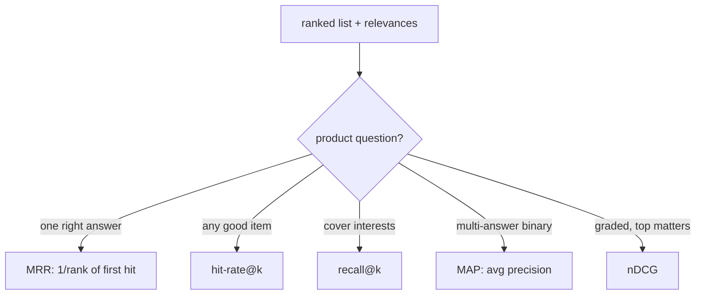

A recommender is judged on a ranked list, and the family of ranking metrics each
answers a slightly different question: did we retrieve the good items at all, did we
put them near the top, how far down is the first good one. Picking the wrong metric
optimizes the wrong product. A metric built for "find the one right answer" is wrong
for a feed meant to fill a whole screen, and vice versa. This lesson defines the
common metrics and matches each to the product it fits.

## Recall@k and hit-rate: did we retrieve it

The coarsest question is membership. **Recall@k** is the fraction of a user's
relevant items that appear in the top $k$:

$$
\text{Recall@}k = \frac{|\{\text{relevant}\} \cap \{\text{top-}k\}|}{|\{\text{relevant}\}|}.
$$

**Hit-rate@k** is its all-or-nothing cousin: $1$ if *any* relevant item is in the top
$k$, else $0$, averaged over users. Hit-rate suits the "did we surface at least one
good thing" question; recall suits "how much of what they want did we cover". Neither
cares about order within the top $k$, so they are the natural metrics for the
**retrieval** stage, whose job is membership.

## MRR: where is the first good one

**Mean reciprocal rank** measures how early the first relevant item appears. For a
single query, if the first relevant item is at rank $r$, the reciprocal rank is
$1/r$; MRR averages it over queries:

$$
\text{MRR} = \frac{1}{|Q|}\sum_{q \in Q} \frac{1}{r_q}.
$$

A first relevant item at rank 1 scores $1$, at rank 2 scores $0.5$, at rank 10 scores
$0.1$. MRR fits **single-answer** tasks: a "did you mean" suggestion, a question with
one correct result, an autocomplete. It ignores everything after the first hit, so it
is wrong for a feed where many items matter.

## MAP: precision across all relevant items

**Mean average precision** extends precision to a ranked list with several relevant
items. The **average precision** for one query averages the precision@k computed at
each rank where a relevant item appears:

$$
\text{AP} = \frac{1}{|\{\text{relevant}\}|}\sum_{r:\ \text{rel}_r = 1} \text{Precision@}r,
$$

and MAP averages AP over queries. AP rewards putting relevant items high *and* not
burying later ones, so it suits **multi-answer retrieval** with binary relevance,
classic information-retrieval territory<FN n="2" />.

## nDCG: graded relevance with position discount

When relevance is graded (a 5-star rating, a strong-vs-weak signal), **nDCG** is the
metric, defined in the listwise-ranking lesson: a position-discounted, gain-weighted
sum normalized by the ideal ordering<FN n="1" />. It is the most general of the five, handling
graded labels and position together, which is why it is the default for ranking
evaluation. The cost is that it needs graded relevance to show its advantage; on
binary labels it largely agrees with MAP.

## Matching metric to product

| Product shape | Metric |
|---|---|
| One correct answer (autocomplete, "did you mean") | MRR |
| Surface at least one good item | Hit-rate@k |
| Cover the user's interests (retrieval recall) | Recall@k |
| Multi-answer, binary relevance | MAP |
| Graded relevance, top matters most (ranking) | nDCG |

The discipline's rule: choose the metric whose question is the product's question,
then optimize that, since a model tuned for MRR will look worse on recall and that is
correct, not a bug.



## Check it on arrays

```python
import numpy as np

# A ranked list of items with binary relevance (1 = relevant), in ranked order
ranked = np.array([0, 1, 0, 1, 1, 0])     # relevant at ranks 2, 4, 5

def recall_at_k(rel, k, n_relevant):
    return rel[:k].sum() / n_relevant

def hit_rate_at_k(rel, k):
    return float(rel[:k].any())

def mrr(rel):
    hits = np.where(rel == 1)[0]
    return 1.0 / (hits[0] + 1) if len(hits) else 0.0     # rank is 1-based

def average_precision(rel):
    hits = np.where(rel == 1)[0]
    if len(hits) == 0:
        return 0.0
    precs = [rel[: r + 1].sum() / (r + 1) for r in hits]  # precision@(each hit)
    return np.mean(precs)

n_rel = ranked.sum()
print(f"recall@3 : {recall_at_k(ranked, 3, n_rel):.3f}")
print(f"hit@3    : {hit_rate_at_k(ranked, 3):.3f}")
print(f"MRR      : {mrr(ranked):.3f}")            # first hit at rank 2 -> 0.5
print(f"MAP (AP) : {average_precision(ranked):.3f}")

assert np.isclose(mrr(ranked), 0.5)               # first relevant is at rank 2
assert np.isclose(recall_at_k(ranked, 3, n_rel), 1/3)   # 1 of 3 relevant in top 3
```

The same ranked list gets different scores from each metric because each asks a
different question; MRR cares only that the first hit is at rank 2, while recall@3
sees only one of the three relevant items in the top three.

## Exercises

**Exercise 1.** A query's ranked list has relevant items at ranks $2$ and $5$ (the
rest irrelevant). Compute MRR for this single query and the average precision.

<details>
<summary>Solution</summary>

**Step 1.** MRR: the first relevant item is at rank $2$, so the reciprocal rank is
$1/2 = 0.5$.

**Step 2.** Average precision averages precision@k at each relevant rank. At rank $2$:
$1$ relevant of $2 = 0.5$. At rank $5$: $2$ relevant of $5 = 0.4$.

**Step 3.** $\text{AP} = (0.5 + 0.4)/2 = 0.45$. AP is lower than the rank-2 precision
because the second relevant item sits at rank $5$, dragging the average down.

</details>

**Exercise 2.** A product team wants to evaluate an autocomplete that should put the
single intended query first. Which metric fits, and why is recall@10 a poor choice
here?

<details>
<summary>Solution</summary>

**Step 1.** There is exactly one correct answer, and its position matters most, so
**MRR** is the fit: it rewards placing the intended query at rank 1 and decays
sharply with position.

**Step 2.** Recall@10 only checks whether the correct query is somewhere in the top
$10$, scoring rank 1 and rank 10 identically.

**Step 3.** For autocomplete the difference between rank 1 and rank 10 is the entire
user experience, which recall@10 ignores but MRR captures, so recall@10 would call a
bad ordering good.

</details>

**Exercise 3 (code).** Implement nDCG@k for graded relevance and verify that for the
*binary* list in the worked example it equals the binary-gain DCG normalized by the
ideal, and that a better ordering scores higher.

<details>
<summary>Solution</summary>

```python
import numpy as np

def dcg_at_k(rels, k):
    rels = np.asarray(rels, dtype=float)[:k]
    disc = 1.0 / np.log2(np.arange(2, len(rels) + 2))
    return ((2**rels - 1) * disc).sum()

def ndcg_at_k(rels, k):
    ideal = dcg_at_k(sorted(rels, reverse=True), k)
    return dcg_at_k(rels, k) / ideal if ideal > 0 else 0.0

model = [0, 1, 0, 1, 1, 0]
better = [1, 1, 1, 0, 0, 0]                 # all relevant pushed to the top
print(f"nDCG@6 model : {ndcg_at_k(model, 6):.3f}")
print(f"nDCG@6 better: {ndcg_at_k(better, 6):.3f}")
assert ndcg_at_k(better, 6) > ndcg_at_k(model, 6)
assert np.isclose(ndcg_at_k(better, 6), 1.0)   # better == ideal ordering here
```

The ordering that lifts every relevant item to the top achieves nDCG $= 1$ (it is the
ideal order), and the model's interleaved order scores below it, confirming nDCG
rewards getting relevant items high.

</details>

The next lesson goes beyond relevance entirely, measuring the diversity, coverage,
and novelty that a list optimized purely for accuracy tends to destroy.

<Footnotes>
  <FNItem n="1">**Järvelin, K., & Kekäläinen, J.** (2002). "Cumulated gain-based evaluation of IR techniques". *ACM TOIS*, 20(4), 422-446. [doi:10.1145/582415.582418](https://doi.org/10.1145/582415.582418). The DCG and nDCG metrics.</FNItem>
  <FNItem n="2">**Manning, C. D., Raghavan, P., & Schütze, H.** (2008). *Introduction to Information Retrieval*, Ch. 8. Cambridge University Press. [https://nlp.stanford.edu/IR-book/](https://nlp.stanford.edu/IR-book/). Precision@k, MAP, and MRR definitions.</FNItem>
</Footnotes>
