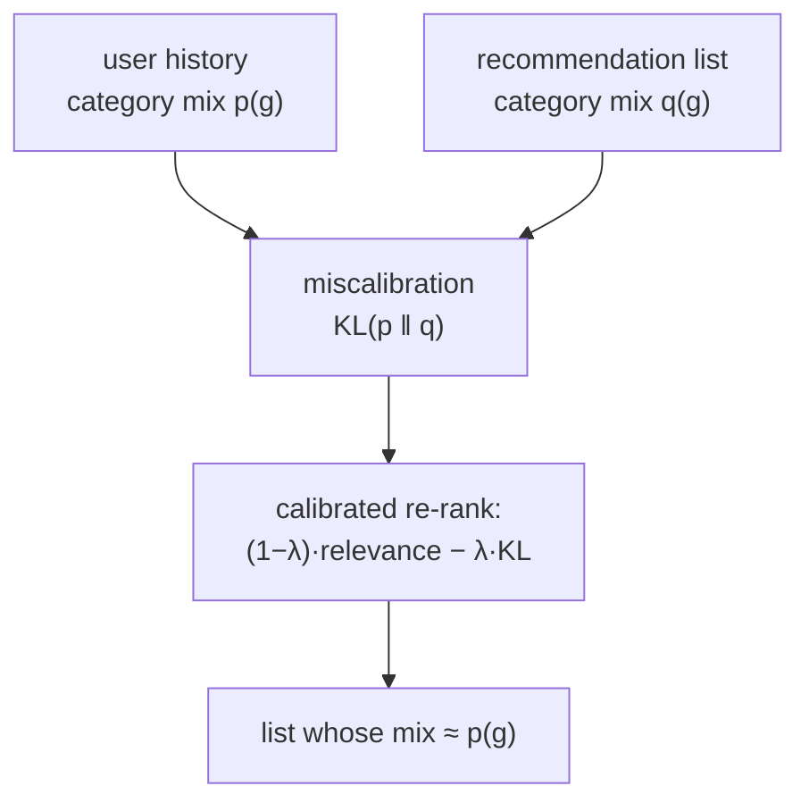

A user who watches $70\%$ documentaries and $30\%$ comedies is poorly served by a list
that is $100\%$ documentaries, even if each documentary is individually well-predicted.
Optimizing relevance per item tends to collapse a list onto the user's single strongest
interest, erasing the minority tastes that are still genuinely theirs. **Calibrated
recommendation** asks that the *proportions* in the recommendation list reflect the
proportions in the user's history, a distinct notion from the per-item probability
calibration of the evaluation pillar, and the fix for the interest-collapse that
engagement optimization causes<FN n="1" />.

## Two meanings of calibration

The word covers two related ideas, and keeping them apart matters.

- **Score calibration** (the evaluation-pillar sense): a predicted probability of
  $0.3$ should correspond to a $30\%$ empirical rate. This is about the *numbers* a
  model outputs being trustworthy as probabilities<FN n="2" />.
- **Distributional calibration** (this lesson): the *mix* of categories in the
  recommendation list should match the mix in the user's history. A user who is $70/30$
  across two genres should see roughly $70/30$, not $100/0$.

Both are calibration in the sense of "matching reality", but the first is about a single
score and the second about a whole list's composition.

## Measuring miscalibration

Let $p(g \mid u)$ be the proportion of category $g$ in user $u$'s history, and
$q(g \mid u)$ the proportion of category $g$ in the recommendation list. The mismatch is
the **KL divergence** of the recommended distribution from the history distribution:

$$
C(u) = \text{KL}\big(p \,\|\, q\big) = \sum_g p(g \mid u)\,\log \frac{p(g \mid u)}{q(g \mid u)}.
$$

A perfectly calibrated list has $q = p$ and $C(u) = 0$; a list that collapses onto one
category drives some $q(g)$ toward zero, sending the KL high. (A small smoothing of $q$
keeps the log finite, since a recommended category can legitimately be absent.) Lower
$C(u)$ means the list's composition better reflects the user's actual breadth of taste.

## Calibrated re-ranking

The fix re-ranks the relevance-scored candidates to lower $C(u)$ while keeping relevance
high, the now-familiar constrained trade. Steck's formulation maximizes a combination of
total relevance and calibration<FN n="1" />:

$$
\text{maximize}\quad (1 - \lambda)\sum_{i \in L} \text{rel}(i) \ -\ \lambda\, C(u, L),
$$

over lists $L$, where $C(u, L)$ is the miscalibration of list $L$ and $\lambda$ tunes the
balance. A greedy algorithm builds the list one item at a time, at each step adding the
candidate that best improves this objective, which naturally pulls in a minority-category
item once the list has over-filled on the majority. The relevance cost of restoring
calibration is typically small, because the minority-category items the user likes are
usually still reasonably relevant.



## Check it on arrays

```python
import numpy as np

rng = np.random.default_rng(0)
n = 60
# Two categories; the user's history is 70% category 0, 30% category 1.
cat = (rng.random(n) < 0.4).astype(int)            # ~40% are category 1 in the catalog
rel = rng.uniform(0, 1, n)
rel[cat == 0] += 0.4                                # category-0 items score higher
p_hist = np.array([0.7, 0.3])                       # user's taste proportions

def kl_miscalibration(items, eps=0.01):
    q = np.array([(cat[items] == g).mean() for g in (0, 1)])
    q = (1 - eps) * q + eps * p_hist                # smooth so log is finite
    return float((p_hist * np.log(p_hist / q)).sum())

# Greedy by relevance collapses onto the higher-scoring category 0
greedy = list(np.argsort(-rel)[:10])

# Calibrated greedy: add the item maximizing (1-λ)rel - λ·KL of the growing list
def calibrated(k=10, lam=0.6):
    chosen, pool = [], list(np.argsort(-rel))
    while len(chosen) < k:
        best, best_score = None, -1e9
        for it in pool:
            s = (1 - lam) * rel[it] - lam * kl_miscalibration(chosen + [it])
            if s > best_score:
                best, best_score = it, s
        chosen.append(best); pool.remove(best)
    return chosen

cal = calibrated()
print(f"greedy     miscalibration KL: {kl_miscalibration(greedy):.3f}")
print(f"calibrated miscalibration KL: {kl_miscalibration(cal):.3f}")
# Calibrated re-rank lowers the KL between list mix and history mix
assert kl_miscalibration(cal) < kl_miscalibration(greedy)
```

The relevance-only list collapses onto the higher-scoring category and diverges from the
user's $70/30$ taste, while the calibrated re-rank restores a list whose category mix
tracks the history, at a small cost in per-item relevance.

## Exercises

**Exercise 1.** A user's history is $60\%$ category A, $40\%$ category B. A recommendation
list is $90\%$ A, $10\%$ B. Compute the KL divergence $\text{KL}(p \,\|\, q)$ using
natural logs.

<details>
<summary>Solution</summary>

**Step 1.** $p = (0.6, 0.4)$, $q = (0.9, 0.1)$. KL $= 0.6\ln(0.6/0.9) + 0.4\ln(0.4/0.1)$.

**Step 2.** First term: $0.6\ln(0.667) = 0.6\cdot(-0.405) = -0.243$. Second term:
$0.4\ln(4) = 0.4\cdot 1.386 = 0.554$.

**Step 3.** $\text{KL} = -0.243 + 0.554 = 0.311$ nats. The positive divergence reflects
the list over-representing A and under-representing B relative to the user's taste.

</details>

**Exercise 2.** Distinguish score calibration from distributional calibration, and give a
recommender that is perfectly score-calibrated yet badly distribution-miscalibrated.

<details>
<summary>Solution</summary>

**Step 1.** Score calibration means each predicted probability matches its empirical
rate; distributional calibration means the list's category proportions match the user's
history proportions.

**Step 2.** A recommender can predict every item's click probability perfectly (score-
calibrated) and still build a list entirely from the user's single favorite category.

**Step 3.** That list is score-calibrated (the probabilities are all correct) but
distribution-miscalibrated (it is $100\%$ one category for a user with mixed tastes), so
the two properties are independent and both worth checking.

</details>

**Exercise 3 (code).** Sweep the calibration weight $\lambda$ and verify the trade-off:
as $\lambda$ rises, the list's miscalibration KL falls while its total relevance does not
increase.

<details>
<summary>Solution</summary>

```python
import numpy as np

rng = np.random.default_rng(0)
n = 60
cat = (rng.random(n) < 0.4).astype(int)
rel = rng.uniform(0, 1, n); rel[cat == 0] += 0.4
p_hist = np.array([0.7, 0.3])

def kl(items, eps=0.01):
    q = np.array([(cat[items] == g).mean() for g in (0, 1)])
    q = (1 - eps) * q + eps * p_hist
    return float((p_hist * np.log(p_hist / q)).sum())

def calibrated(lam, k=10):
    chosen, pool = [], list(np.argsort(-rel))
    while len(chosen) < k:
        best = max(pool, key=lambda it: (1-lam)*rel[it] - lam*kl(chosen+[it]))
        chosen.append(best); pool.remove(best)
    return chosen

lams = [0.0, 0.3, 0.6, 0.9]
kls = [kl(calibrated(l)) for l in lams]
rels = [rel[calibrated(l)].sum() for l in lams]
print("KL :", [round(k, 3) for k in kls])
print("rel:", [round(r, 2) for r in rels])
assert kls[-1] < kls[0]            # more calibration weight -> lower miscalibration
assert rels[-1] <= rels[0] + 1e-9  # at the cost of (no gain in) relevance
```

Raising $\lambda$ steadily lowers the miscalibration while total relevance does not
improve, the characteristic trade where calibration is bought with a little relevance,
the product choosing $\lambda$ to fit how much taste-faithfulness it wants.

</details>

This closes fairness, bias, and trust. The next discipline leaves modeling behind for
the systems that serve these recommenders in production: the funnel, the feature store,
the ANN index, and the monitoring that keeps them honest.

<Footnotes>
  <FNItem n="1">**Steck, H.** (2018). "Calibrated recommendations". *RecSys*. [doi:10.1145/3240323.3240372](https://doi.org/10.1145/3240323.3240372). KL-based calibration of recommendation category proportions and the re-ranking fix.</FNItem>
  <FNItem n="2">**Guo, C., Pleiss, G., Sun, Y., & Weinberger, K. Q.** (2017). "On calibration of modern neural networks". *ICML*. [arXiv:1706.04599](https://arxiv.org/abs/1706.04599). Score calibration and its measurement, the per-prediction sense.</FNItem>
</Footnotes>
