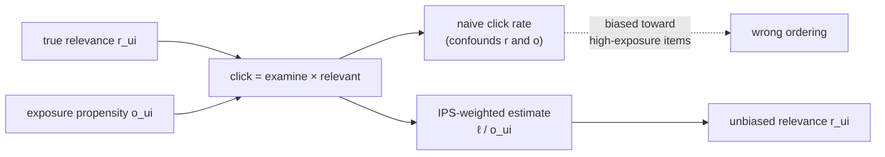

Implicit feedback has a silent flaw: you only observe clicks on items you *showed*. An
item never recommended has no clicks, but that is not evidence it is bad, only evidence
it was never seen. Treating "no click" as "not relevant" confuses two very different
things, and because what gets shown is decided by the recommender itself, the missing
data is **missing not at random** (MNAR). This lesson makes the bias precise and shows
the propensity correction that removes it, the same inverse-weighting idea behind
off-policy evaluation, here applied to learning from clicks.

## Clicks factor into examination and relevance

A click happens only if the user both *saw* the item and *liked* it. The standard
model factors the click probability into an **examination** term and a **relevance**
term<FN n="1" />:

$$
P(\text{click} \mid u, i) = \underbrace{P(\text{examine} \mid u, i)}_{o_{ui}} \cdot \underbrace{P(\text{relevant} \mid u, i)}_{r_{ui}},
$$

where $o_{ui}$ (the examination or exposure propensity) is the probability the item was
seen, and $r_{ui}$ is the true relevance you actually want. The trouble is that the
observed click rate estimates the *product*, not $r_{ui}$. An item with high relevance
but low exposure (rarely shown, so rarely examined) gets few clicks and looks bad; a
mediocre item shown constantly racks up clicks. Naive learning from clicks therefore
confounds relevance with exposure.

## Why "no click" is not "irrelevant"

The MNAR structure is the crux. The items with missing feedback are not a random sample;
they are precisely the items the recommender chose not to show, which correlates with
the recommender's (possibly wrong) beliefs about relevance. So the missingness depends
on the very quantity being estimated, and ignoring it bakes the recommender's existing
biases into its training data. This is why a model trained naively on implicit feedback
tends to confirm its own prior choices rather than discover better ones.

## The propensity correction

If the exposure propensity $o_{ui}$ is known (logged, or estimated), the fix is to
weight each observed interaction by its inverse, an **inverse-propensity-scored** loss
that recovers an unbiased estimate of the relevance-based objective<FN n="2" />:

$$
\hat{\mathcal{L}}_{\text{IPS}} = \frac{1}{N}\sum_{(u,i):\ \text{shown}} \frac{\ell(\hat r_{ui}, c_{ui})}{o_{ui}},
$$

where $c_{ui}$ is the observed click and $\ell$ the per-example loss. Dividing by
$o_{ui}$ up-weights the rarely-examined interactions that the raw counts under-represent,
so an item that was relevant but seldom shown contributes as much as its true relevance
warrants. The propensities themselves come from a position/exposure model or from the
randomization the system injects (the same exploration that enables off-policy
evaluation).



## Check it on arrays

```python
import numpy as np

rng = np.random.default_rng(0)
n_items = 300
true_rel = rng.uniform(0, 1, n_items)              # what we want to recover

# Exposure propensity is correlated with the OLD system's bias, not relevance:
# some relevant items are rarely examined (low o), so their clicks are suppressed.
exposure = rng.uniform(0.05, 1.0, n_items)

N = 200_000
i = rng.integers(0, n_items, N)
examined = rng.random(N) < exposure[i]
clicked = examined & (rng.random(N) < true_rel[i])

# Naive estimate: click rate per item (confounds relevance with exposure)
clicks = np.bincount(i[clicked], minlength=n_items)
shows = np.bincount(i, minlength=n_items)
naive = clicks / np.maximum(shows, 1)

# IPS estimate: divide each item's click rate by its exposure propensity
ips = naive / exposure

def rank_corr(a, b):
    ra, rb = np.argsort(np.argsort(a)), np.argsort(np.argsort(b))
    return np.corrcoef(ra, rb)[0, 1]

print(f"naive vs true rel rank corr: {rank_corr(naive, true_rel):.3f}")
print(f"IPS   vs true rel rank corr: {rank_corr(ips, true_rel):.3f}")
# Correcting by exposure recovers the true relevance ordering far better
assert rank_corr(ips, true_rel) > rank_corr(naive, true_rel)
```

The naive click rate ranks items by a blend of relevance and exposure, so its ordering
is distorted; dividing by the exposure propensity strips out the examination term and
recovers an ordering that tracks true relevance.

## Exercises

**Exercise 1.** An item has true relevance $r = 0.6$ and exposure propensity $o = 0.2$.
Compute its expected click rate, and the IPS-corrected estimate you would recover from
that click rate.

<details>
<summary>Solution</summary>

**Step 1.** Expected click rate $= o \cdot r = 0.2 \cdot 0.6 = 0.12$.

**Step 2.** The naive click rate ($0.12$) badly understates the relevance ($0.6$)
because the item is rarely examined.

**Step 3.** IPS divides by the propensity: $0.12 / 0.2 = 0.6$, recovering the true
relevance. The correction restores the under-exposed item to its rightful score.

</details>

**Exercise 2.** Explain why "the user did not click item $i$" cannot be treated as a
clean negative label, in terms of the examination-relevance factorization.

<details>
<summary>Solution</summary>

**Step 1.** No click can mean the user examined the item and found it irrelevant, or
that the user never examined it at all (it was not shown, or shown below the fold).

**Step 2.** The factorization $P(\text{click}) = o_{ui}\, r_{ui}$ shows a zero click
arises whenever $o_{ui} = 0$ regardless of $r_{ui}$, so a non-click confounds low
exposure with low relevance.

**Step 3.** Treating every non-click as a negative therefore mislabels relevant-but-
unexamined items as irrelevant, which is exactly the MNAR bias; propensity weighting (or
modeling examination) is needed to separate the two causes.

</details>

**Exercise 3 (code).** Show the bias grows with exposure skew: compare the naive-vs-true
rank correlation when exposure is nearly uniform versus highly skewed, and verify the
naive estimate degrades as exposure becomes more uneven.

<details>
<summary>Solution</summary>

```python
import numpy as np

def naive_corr(skew_low, seed=0):
    rng = np.random.default_rng(seed)
    n = 300
    true_rel = rng.uniform(0, 1, n)
    exposure = rng.uniform(skew_low, 1.0, n)         # smaller low = more skew
    N = 200_000
    i = rng.integers(0, n, N)
    clicked = (rng.random(N) < exposure[i]) & (rng.random(N) < true_rel[i])
    naive = np.bincount(i[clicked], minlength=n) / np.maximum(np.bincount(i, minlength=n), 1)
    ra, rb = np.argsort(np.argsort(naive)), np.argsort(np.argsort(true_rel))
    return np.corrcoef(ra, rb)[0, 1]

near_uniform = naive_corr(skew_low=0.8)              # exposure in [0.8, 1.0]
highly_skewed = naive_corr(skew_low=0.02)            # exposure in [0.02, 1.0]
print(f"naive corr  near-uniform exposure: {near_uniform:.3f}")
print(f"naive corr  highly-skewed exposure: {highly_skewed:.3f}")
assert near_uniform > highly_skewed
```

When exposure is nearly uniform the click rate tracks relevance well, but as exposure
becomes uneven the naive estimate confounds the two more severely, so the case for
propensity correction grows with the skew the recommender itself creates.

</details>

The next lesson specializes this to the dominant exposure signal in a ranked list,
position, and the inverse-propensity weighting that makes learning-to-rank unbiased.

<Footnotes>
  <FNItem n="1">**Chuklin, A., Markov, I., & de Rijke, M.** (2015). *Click Models for Web Search*. Morgan & Claypool. [doi:10.2200/S00654ED1V01Y201507ICR043](https://doi.org/10.2200/S00654ED1V01Y201507ICR043). The examination-relevance factorization of clicks.</FNItem>
  <FNItem n="2">**Schnabel, T., Swaminathan, A., Singh, A., Chandak, N., & Joachims, T.** (2016). "Recommendations as treatments: debiasing learning and evaluation". *ICML*. [arXiv:1602.05352](https://arxiv.org/abs/1602.05352). Propensity-scored learning and evaluation under MNAR feedback.</FNItem>
</Footnotes>
