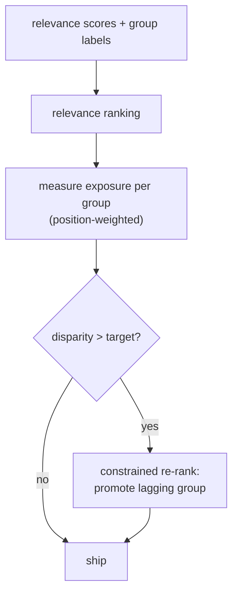

A recommender allocates a scarce resource, user attention, and that allocation has
stakeholders beyond the user. The creators, sellers, and publishers whose items are
ranked depend on exposure for their livelihood, and small ranking differences compound
into large differences in who gets seen. Fairness in recommendation asks whether that
allocation is acceptable, and the answer depends on whose fairness you mean: the
**consumers** receiving recommendations or the **providers** whose items are
recommended. This lesson defines the main notions and the exposure constraints that
enforce them.

## Two sides, two fairnesses

- **Consumer (user) fairness** asks whether different groups of *users* get
  comparable recommendation quality. A system that recommends well to one demographic
  and poorly to another is unfair to its users even if every individual ranking is
  internally sensible.
- **Provider (item) fairness** asks whether different groups of *items or creators* get
  comparable *exposure* relative to their merit. A system that funnels nearly all
  attention to one group of providers starves the others regardless of their quality.

The two can conflict, and a system optimizing only relevance addresses neither, which
is why fairness is an explicit objective layered on top, not an emergent property.

## Exposure, and why position makes it unequal

The resource being allocated is **exposure**, and because examination decays steeply
with rank (the position-bias lesson), exposure is wildly unequal: rank 1 might receive
several times the attention of rank 5. So even a tiny relevance edge that consistently
places one group's items slightly higher translates into a large, compounding exposure
gap. **Exposure-based fairness** measures the attention each group receives, weighted
by position, and compares it to a target.

Two common targets:

- **Demographic parity of exposure:** each group gets exposure proportional to its
  share of the catalog, regardless of relevance. Simple, but it can over-expose
  low-quality items.
- **Equity of exposure (merit-based):** each group gets exposure proportional to its
  *relevance*, so groups are treated equally per unit of merit<FN n="1" />. This is
  usually the fairer target: it does not demand equal outcomes, only that equal merit
  earns equal exposure.

## Enforcing it: constrained re-ranking

Given relevance scores and group labels, a fairness constraint re-ranks to meet an
exposure target while sacrificing as little relevance as possible. The clean
formulation is a constrained optimization: maximize expected relevance of the ranking
subject to a bound on the exposure disparity between groups<FN n="2" />. In practice a
greedy re-ranker works well: walk down the ranking and, when a group is falling behind
its exposure target, promote its next-best item. The relevance cost of meeting a modest
fairness target is usually small, the same accuracy-versus-objective trade as diversity
and debiasing.



## Check it on arrays

```python
import numpy as np

rng = np.random.default_rng(0)
n = 40
# Two provider groups; group 1 items happen to score slightly lower on average,
# so a pure-relevance ranking under-exposes them.
group = rng.integers(0, 2, n)
rel = rng.uniform(0, 1, n) - 0.15 * group            # group 1 penalized in score

# Position weight (exposure) decays with rank
def exposure_by_group(order, k=20):
    w = 1.0 / np.log2(np.arange(2, k + 2))            # position weights
    top = order[:k]
    exp = np.zeros(2)
    for pos, item in enumerate(top):
        exp[group[item]] += w[pos]
    return exp / exp.sum()

# Pure relevance ranking
rel_order = np.argsort(-rel)
exp_rel = exposure_by_group(rel_order)

# Greedy fairness re-rank toward demographic parity (each group ~ its catalog share)
target = np.array([(group == 0).mean(), (group == 1).mean()])
def fair_rerank(k=20):
    chosen, pool = [], list(np.argsort(-rel))
    w = 1.0 / np.log2(np.arange(2, k + 2))
    got = np.zeros(2)
    for pos in range(k):
        total = got.sum() + 1e-9
        # promote the group most behind its target share of exposure so far
        behind = target - got / total
        g = int(np.argmax(behind))
        cand = next((it for it in pool if group[it] == g), pool[0])
        chosen.append(cand); pool.remove(cand); got[group[cand]] += w[pos]
    return chosen

exp_fair = exposure_by_group(fair_rerank())
print(f"catalog share group1     : {target[1]:.3f}")
print(f"exposure group1 relevance: {exp_rel[1]:.3f}")
print(f"exposure group1 fair      : {exp_fair[1]:.3f}")
# Fair re-rank brings group 1's exposure closer to its catalog share
assert abs(exp_fair[1] - target[1]) < abs(exp_rel[1] - target[1])
```

The relevance-only ranking under-exposes the lower-scoring group relative to its share
of the catalog, and the constrained re-rank pulls that group's exposure back toward
parity, the exposure gap that pure relevance silently produces.

## Exercises

**Exercise 1.** Group 1 makes up $40\%$ of the catalog but receives $15\%$ of
position-weighted exposure under the relevance ranking. State which fairness notion is
violated under a demographic-parity target, and the direction the re-rank must move.

<details>
<summary>Solution</summary>

**Step 1.** Demographic parity of exposure targets exposure equal to catalog share, so
group 1 should receive about $40\%$ of exposure.

**Step 2.** It receives only $15\%$, far below its $40\%$ share, so demographic-parity
exposure fairness is violated against group 1.

**Step 3.** The re-rank must *increase* group 1's exposure (promote its items to higher,
more-examined positions) until its share approaches $40\%$, accepting some relevance
loss to do so.

</details>

**Exercise 2.** Contrast demographic parity of exposure with equity (merit-based)
exposure, and give a case where demographic parity is the worse choice.

<details>
<summary>Solution</summary>

**Step 1.** Demographic parity gives each group exposure proportional to its catalog
share regardless of quality; equity gives exposure proportional to relevance, so equal
merit earns equal exposure.

**Step 2.** If one group's items are genuinely far less relevant to users, demographic
parity forces exposure onto low-quality items, hurting users while not reflecting any
real merit difference.

**Step 3.** In that case equity is better: it does not penalize a group for low merit
nor reward it with undeserved exposure, only guarantees that relevance is converted to
exposure at the same rate for both groups.

</details>

**Exercise 3 (code).** Measure the relevance cost of fairness: compute the total
relevance of the top-20 under the pure-relevance ranking and under the fair re-rank, and
verify the fair list sacrifices some relevance to reduce the exposure gap.

<details>
<summary>Solution</summary>

```python
import numpy as np

rng = np.random.default_rng(0)
n = 40
group = rng.integers(0, 2, n)
rel = rng.uniform(0, 1, n) - 0.15 * group
target = np.array([(group == 0).mean(), (group == 1).mean()])

rel_order = np.argsort(-rel)
def fair_rerank(k=20):
    chosen, pool = [], list(np.argsort(-rel)); got = np.zeros(2)
    w = 1.0 / np.log2(np.arange(2, k + 2))
    for pos in range(k):
        behind = target - got / (got.sum() + 1e-9)
        g = int(np.argmax(behind))
        cand = next((it for it in pool if group[it] == g), pool[0])
        chosen.append(cand); pool.remove(cand); got[group[cand]] += w[pos]
    return chosen

rel_top = rel[rel_order[:20]].sum()
fair_top = rel[fair_rerank()].sum()
print(f"top-20 relevance  pure: {rel_top:.2f}   fair: {fair_top:.2f}")
assert fair_top <= rel_top
```

The fair ranking's total relevance is at most the relevance-optimal ranking's, since the
relevance ranking maximizes it by definition; the gap is the price paid for closing the
exposure disparity, a price the product weighs against the fairness gain.

</details>

The next lesson follows the consumer side of these dynamics into filter bubbles, where
the feedback loop narrows a user's world rather than a provider's exposure.

<Footnotes>
  <FNItem n="1">**Singh, A., & Joachims, T.** (2018). "Fairness of exposure in rankings". *KDD*. [arXiv:1802.07281](https://arxiv.org/abs/1802.07281). Merit-based exposure fairness and constrained ranking.</FNItem>
  <FNItem n="2">**Biega, A. J., Gummadi, K. P., & Weikum, G.** (2018). "Equity of attention: amortizing individual fairness in rankings". *SIGIR*. [arXiv:1805.01788](https://arxiv.org/abs/1805.01788). Amortized exposure fairness across a sequence of rankings.</FNItem>
</Footnotes>
