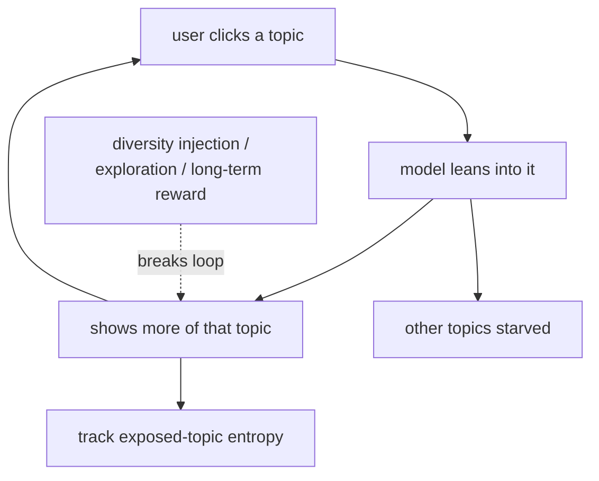

The same feedback loop that concentrates exposure on popular items can, on the consumer
side, concentrate a *user's* world. A recommender that always shows more of what you
just engaged with narrows your exposure over time: each click is read as a vote for that
topic, the next list leans further into it, and the topics you never happened to click
fade out entirely. The result is a **filter bubble**, a self-reinforcing narrowing of
what a user sees. This lesson is about why short-term engagement optimization produces
it and what intervention keeps a user's exposure broad.

## How engagement-optimization narrows exposure

A recommender maximizing immediate engagement faces a simple incentive: the safest way
to get a click now is to show something very close to what the user just engaged with.
Doing that repeatedly has a dynamic consequence the per-step objective ignores. The
user's engagement history concentrates on a few topics, the model reads that
concentration as the user's entire interest, and topics with weak early signal are
never shown again, so they can never recover signal. The mechanism is identical to the
item-starvation of the offline-online lesson, applied to a single user's topic
distribution: greedy exploitation starves the unlucky options.

This matters even on pure engagement terms. A user shown only one narrow slice
habituates, their engagement on that slice decays, and the system has no fresh material
to offer because it pruned everything else. Short-term optimal and long-term optimal
diverge, which is the recurring theme of recommendation dynamics.

## Measuring the bubble

The bubble is a loss of diversity in what a user is *exposed* to over time, distinct
from the intra-list diversity of a single recommendation. A natural measure is the
**entropy** of a user's exposed-topic distribution: high entropy means broad exposure,
low entropy a concentrated bubble. Tracking this entropy over time shows whether the
system is narrowing users, and comparing it across cohorts reveals whether an
intervention is working<FN n="1" />.

## Keeping exposure healthy

The interventions echo the exploration and diversity tools from earlier disciplines,
now aimed at the user's long-run experience rather than a single list.

- **Diversity injection:** reserve a fraction of each list for items outside the user's
  dominant topics (the MMR re-rank, or an explicit topic quota), keeping a channel open
  for interests the greedy model would prune.
- **Exploration:** occasionally show uncertain items to keep measuring interests the
  user has not recently expressed, breaking the starvation loop.
- **Long-term objectives:** optimize for retention or satisfaction over a horizon rather
  than the next click, so the model values keeping a user's world open. This is the
  bridge to the long-term and serving disciplines, where the reward is delayed.

The tension is real and not fully resolvable: some narrowing is the user genuinely
having focused tastes, and forcing diversity on someone who wants depth is its own
failure. The goal is to prevent the *runaway* loop, not to mandate breadth.



## Check it on arrays

```python
import numpy as np

def entropy(counts):
    p = counts / counts.sum()
    p = p[p > 0]
    return -(p * np.log2(p)).sum()

rng = np.random.default_rng(0)
T = 6                                            # topics
affinity = rng.uniform(0.3, 0.7, T)              # the user genuinely likes all of them

def simulate(diversify):
    eng = np.ones(T)                             # engagement history per topic
    for _ in range(40):
        est = eng / eng.sum()
        shown = rng.choice(T, 3, replace=False) if diversify else np.argsort(-est)[:3]
        for t in shown:
            if rng.random() < affinity[t]:
                eng[t] += 1
    return entropy(eng)

h_greedy = simulate(diversify=False)
h_diverse = simulate(diversify=True)
print(f"max possible entropy : {np.log2(T):.3f}")
print(f"greedy exposure entropy   : {h_greedy:.3f}")
print(f"diversified exposure entropy: {h_diverse:.3f}")
# Greedy engagement-optimization narrows the user's exposed topics (lower entropy)
assert h_diverse > h_greedy
```

The greedy recommender concentrates the user's engagement on a few topics and collapses
the exposure entropy, while injecting variety keeps it near the maximum, the difference
between a filter bubble and a broad experience even though the user genuinely likes all
the topics.

## Exercises

**Exercise 1.** A user is exposed to four topics with proportions $(0.7, 0.2, 0.1, 0.0)$
under a greedy recommender. Compute the exposure entropy (in bits) and compare it to the
maximum possible for four topics.

<details>
<summary>Solution</summary>

**Step 1.** Entropy $= -\sum p \log_2 p$ over nonzero terms: $-(0.7\log_2 0.7 + 0.2\log_2 0.2
+ 0.1\log_2 0.1)$.

**Step 2.** $0.7\log_2 0.7 \approx -0.360$, $0.2\log_2 0.2 \approx -0.464$,
$0.1\log_2 0.1 \approx -0.332$; summing the negatives gives $H \approx 1.157$ bits.

**Step 3.** The maximum for four topics is $\log_2 4 = 2$ bits (uniform exposure). At
$1.157$ bits the user is well below the maximum and one topic is never shown, the
signature of a narrowing bubble.

</details>

**Exercise 2.** Explain why optimizing strictly for the next click can be worse for
long-term engagement than reserving some slots for diversity, in terms of the feedback
loop.

<details>
<summary>Solution</summary>

**Step 1.** The next-click-optimal choice is usually something very near the user's last
engagement, so repeated greedy choices concentrate exposure on a shrinking set of topics.

**Step 2.** Concentrated exposure leads to habituation (declining engagement on the
over-shown slice) while the pruned topics never get the exposure they would need to
re-enter the candidate pool, so the system runs out of fresh, engaging material.

**Step 3.** Reserving diversity slots keeps measuring and supplying other interests, so
long-term engagement is sustained; the short-term cost of a few exploratory slots buys
a non-collapsing experience.

</details>

**Exercise 3 (code).** Track the bubble forming: record the exposure entropy after each
round under the greedy recommender and verify it trends downward over time.

<details>
<summary>Solution</summary>

```python
import numpy as np

def entropy(counts):
    p = counts / counts.sum(); p = p[p > 0]
    return -(p * np.log2(p)).sum()

rng = np.random.default_rng(0)
T = 6
affinity = rng.uniform(0.3, 0.7, T)
eng = np.ones(T)
trace = []
for _ in range(40):
    shown = np.argsort(-(eng / eng.sum()))[:3]        # greedy
    for t in shown:
        if rng.random() < affinity[t]:
            eng[t] += 1
    trace.append(entropy(eng))

early = np.mean(trace[:5]); late = np.mean(trace[-5:])
print(f"exposure entropy early: {early:.3f}  late: {late:.3f}")
assert late < early
```

The exposure entropy falls as the greedy loop runs, quantifying the bubble tightening
round by round; an intervention is judged by whether it flattens or reverses this curve.

</details>

The next lesson turns to a subtler trust property: calibration, ensuring the proportions
in a recommendation reflect the user's actual mix of tastes rather than collapsing onto
their single favorite<FN n="2" />.

<Footnotes>
  <FNItem n="1">**Nguyen, T. T., Hui, P.-M., Harper, F. M., Terveen, L., & Konstan, J. A.** (2014). "Exploring the filter bubble: the effect of using recommender systems on content diversity". *WWW*. [doi:10.1145/2566486.2568012](https://doi.org/10.1145/2566486.2568012). Empirical measurement of recommendation-driven narrowing.</FNItem>
  <FNItem n="2">**Steck, H.** (2018). "Calibrated recommendations". *RecSys*. [doi:10.1145/3240323.3240372](https://doi.org/10.1145/3240323.3240372). How engagement optimization collapses a user's interest mix, and a calibration fix.</FNItem>
</Footnotes>
