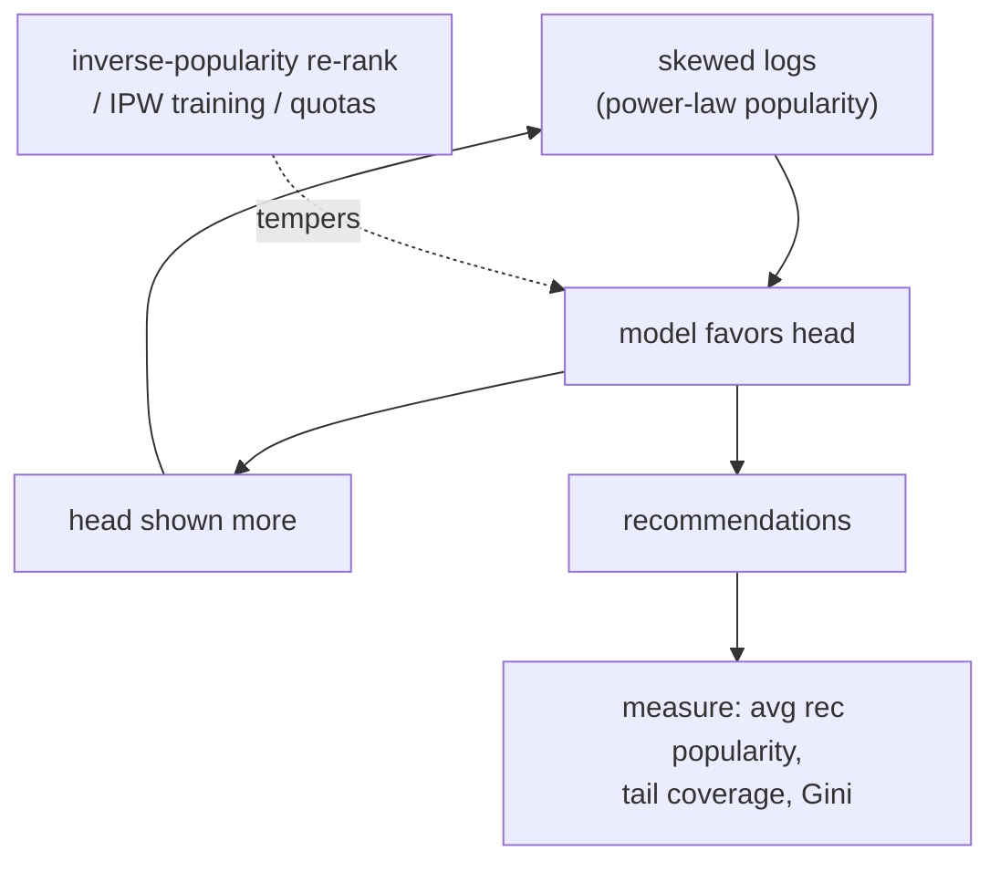

The popularity baseline was a friend in the foundations: a strong, robust thing to
beat. Here it is the antagonist. A recommender trained on interaction logs inherits the
catalog's popularity skew, learns to favor already-popular items, shows them more, and
so generates even more interactions for them, a loop that concentrates exposure on a
shrinking head and starves the long tail. This **popularity bias** degrades both
fairness (niche items and their creators never get a chance) and quality (users get
bland, predictable lists), and it is the default behavior unless explicitly countered.

## Where the bias comes from

Interaction counts follow a steep power law: a small head of items absorbs most of the
engagement. A model fit to maximize predicted engagement sees that the head items have
the most positive labels, so it ranks them high, which is locally correct but globally
self-reinforcing. Three compounding sources:

- **Data skew:** the training logs already over-represent popular items, so the model
  learns their patterns better and is more confident about them.
- **Exposure feedback:** ranking a popular item high shows it more, generating more
  interactions, which the next training round reads as even stronger evidence (the
  closed loop of the previous discipline).
- **Objective alignment:** maximizing average engagement *is* maximizing for the head,
  because that is where the engagement mass is, so the model is doing exactly what it
  was asked, just not what the product wants.

## Measuring it

Popularity bias shows up as a mismatch between the popularity distribution of
*recommendations* and of the catalog. Two common measurements:

- **Average recommended popularity:** the mean popularity of recommended items,
  compared to the catalog mean. A biased recommender's number is far higher.
- **Long-tail coverage / Gini:** the share of recommendations going to tail items, or
  the Gini coefficient of exposure across items. High concentration (Gini near $1$)
  means a few items get almost all the exposure.

A useful diagnostic is to plot recommended-item popularity against catalog popularity:
an unbiased system tracks the diagonal, a biased one bows sharply toward the head.

## Tempering it

The corrections trade a little measured accuracy for a healthier distribution.

- **Re-ranking by inverse popularity:** down-weight an item's score by a function of
  its popularity (for example divide by $\text{pop}(i)^\beta$), so tail items get a
  boost proportional to how buried they are<FN n="1" />.
- **Inverse-propensity training:** weight each training example by the inverse of its
  item's exposure propensity, so the loss stops being dominated by head items (the
  unbiased-learning idea formalized in the next lessons).
- **Exposure constraints / quotas:** guarantee a minimum share of tail items in each
  list, a blunt but reliable floor.

The right strength is a product decision, like the diversity $\lambda$: too much
de-biasing tanks short-term engagement, too little entrenches the head.



## Check it on arrays

```python
import numpy as np

rng = np.random.default_rng(0)
n_items = 500
# Power-law popularity: a few head items dominate
pop = (1.0 / (1 + np.arange(n_items))) ** 1.2
pop /= pop.sum()
# True per-item quality is roughly uniform and only weakly tied to popularity
quality = rng.uniform(0, 1, n_items)

# A naive recommender scores by quality * popularity (engagement-maximizing),
# so its top-K is dominated by the head.
naive_score = quality * pop
# A debiased recommender divides out popularity^beta
beta = 0.8
debiased_score = quality / pop**beta

def avg_pop_of_topk(score, k=20):
    top = np.argsort(-score)[:k]
    return pop[top].mean()

catalog_mean_pop = pop.mean()
print(f"catalog mean popularity : {catalog_mean_pop:.5f}")
print(f"naive top-20 mean pop   : {avg_pop_of_topk(naive_score):.5f}")
print(f"debiased top-20 mean pop: {avg_pop_of_topk(debiased_score):.5f}")
# Debiasing pulls recommended popularity down toward (and below) the catalog mean
assert avg_pop_of_topk(naive_score) > avg_pop_of_topk(debiased_score)
```

The naive recommender's top items are far more popular than the catalog average,
because multiplying by popularity rewards the head; dividing by popularity reverses the
pull and surfaces high-quality tail items the naive list never reaches.

## Exercises

**Exercise 1.** Item A has popularity $0.04$ and item B has popularity $0.001$, and both
have quality score $0.5$. Under an inverse-popularity re-rank dividing by
$\text{pop}^{0.5}$, compute each item's adjusted score and say which now ranks higher.

<details>
<summary>Solution</summary>

**Step 1.** Item A: $0.5 / \sqrt{0.04} = 0.5 / 0.2 = 2.5$.

**Step 2.** Item B: $0.5 / \sqrt{0.001} = 0.5 / 0.0316 \approx 15.8$.

**Step 3.** Item B now ranks far higher ($15.8$ vs $2.5$): the inverse-popularity
weight boosts the much rarer item, surfacing the tail item that equal quality would
otherwise leave buried under the popular one.

</details>

**Exercise 2.** Explain how exposure feedback turns a one-time popularity advantage into
a permanent one, and which measurement (avg recommended popularity vs Gini of exposure)
best captures the resulting concentration.

<details>
<summary>Solution</summary>

**Step 1.** Ranking a popular item high shows it more, which generates more
interactions, which the next training round reads as stronger evidence of quality, so
the item is ranked even higher, a self-reinforcing loop.

**Step 2.** The advantage compounds each cycle, so a small initial edge becomes
dominance regardless of the item's true relative quality.

**Step 3.** The **Gini coefficient of exposure** best captures it: it measures how
unequally total exposure is distributed across items, rising toward $1$ as a few items
capture almost all of it, whereas average recommended popularity reports a level but
not the concentration.

</details>

**Exercise 3 (code).** Compute the Gini coefficient of exposure for the naive and
debiased recommenders by assigning each item the exposure it would get if every user
saw that recommender's top-20, and verify the debiased system has a lower (more equal)
Gini.

<details>
<summary>Solution</summary>

```python
import numpy as np

rng = np.random.default_rng(0)
n_items = 500
pop = (1.0 / (1 + np.arange(n_items))) ** 1.2; pop /= pop.sum()
quality = rng.uniform(0, 1, n_items)

def gini(x):
    x = np.sort(x); n = len(x); idx = np.arange(1, n + 1)
    return (2 * (idx * x).sum()) / (n * x.sum()) - (n + 1) / n

# Exposure = count of users whose top-20 includes the item; simulate per-user
# noisy scores so different users get slightly different lists.
def exposure(base_score):
    exp = np.zeros(n_items)
    for _ in range(300):
        s = base_score * np.exp(rng.normal(scale=0.3, size=n_items))
        for i in np.argsort(-s)[:20]:
            exp[i] += 1
    return exp

g_naive = gini(exposure(quality * pop) + 1e-9)
g_deb = gini(exposure(quality / pop**0.8) + 1e-9)
print(f"Gini naive: {g_naive:.3f}   debiased: {g_deb:.3f}")
assert g_deb < g_naive
```

The naive recommender concentrates exposure on the head (high Gini), while the
debiased one spreads exposure across more items (lower Gini), the quantitative signature
of a healthier popularity distribution.

</details>

The next lesson digs beneath popularity into the more general exposure and selection
bias that makes any estimate of item quality from clicks systematically wrong.

<Footnotes>
  <FNItem n="1">**Abdollahpouri, H., Burke, R., & Mobasher, B.** (2017). "Controlling popularity bias in learning-to-rank recommendation". *RecSys*. [doi:10.1145/3109859.3109912](https://doi.org/10.1145/3109859.3109912). Re-ranking and regularization against popularity bias.</FNItem>
  <FNItem n="2">**Steck, H.** (2011). "Item popularity and recommendation accuracy". *RecSys*. [doi:10.1145/2043932.2043957](https://doi.org/10.1145/2043932.2043957). How popularity skews both training and evaluation.</FNItem>
</Footnotes>
