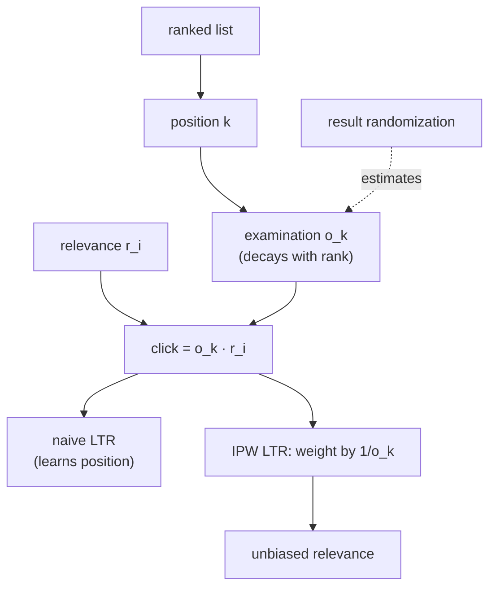

The strongest exposure signal in a ranked list is position itself. Users examine the
top of a list far more than the bottom, so an item at rank 1 collects clicks an
identical item at rank 10 never would, purely because of where it sat. A model trained
naively on these clicks learns that "being at the top" predicts clicks, which is
circular: it ranks high whatever was already ranked high. **Position bias** is the most
important special case of exposure bias, and because the propensity depends only on
rank, it is also the most tractable to correct.

## The position-based propensity

Under the **examination hypothesis**, a user clicks an item only if they examine its
position and find it relevant, and the examination probability depends on the
*position* $k$, not the item<FN n="1" />:

$$
P(\text{click} \mid i, k) = o_k \cdot r_i,
$$

where $o_k$ is the examination probability at rank $k$ (the position propensity) and
$r_i$ the item's relevance. Empirically $o_k$ decays steeply with rank: rank 1 might be
examined with probability near $1$, rank 10 with probability $0.2$. Because $o_k$
factors out the item, it can be estimated once and reused, which is what makes position
debiasing practical at scale.

## Unbiased learning-to-rank

The naive ranking loss sums each clicked item's loss equally, so items shown at the top
(high $o_k$) dominate. Weighting each click by the inverse of its position propensity
gives the **unbiased learning-to-rank** objective<FN n="2" />:

$$
\hat{\mathcal{L}}_{\text{IPW}} = \sum_{(i, k):\ \text{clicked}} \frac{\Delta(i)}{o_k},
$$

where $\Delta(i)$ is the item's contribution to the ranking metric. A click at rank 10
(low $o_k$) is up-weighted because it overcame a low examination probability, so it is
strong evidence of relevance; a click at rank 1 is discounted because the position did
most of the work. In expectation the weighting removes the position term, leaving an
objective driven by true relevance.

## Estimating the propensities

The correction needs $o_k$, and the gold-standard way to get it is **result
randomization**: occasionally shuffle the ranking (or swap pairs of positions) so the
same items appear at different ranks, and the click-rate differences across positions
reveal $o_k$ directly, with relevance held fixed by the randomization. Because
randomizing the live ranking costs engagement, cheaper alternatives estimate $o_k$ from
naturally-occurring rank variation (**intervention harvesting**) or jointly with
relevance via an EM-style click model, trading a little rigor for no exploration cost.



## Check it on arrays

```python
import numpy as np

rng = np.random.default_rng(0)
n_items = 200
true_rel = rng.uniform(0, 1, n_items)

def o_k(k):
    return 1.0 / (1 + 0.5 * k)                       # examination decays with rank

# A logging policy ranks items by a NOISY relevance proxy, so each item sits at a
# fixed position determined by that ranking. Position then confounds the click rate.
proxy = true_rel + rng.normal(scale=0.3, size=n_items)
pos_of = np.minimum(np.argsort(np.argsort(-proxy)), 9)   # 0 = top shelf, capped at 9

N = 400_000
item = rng.integers(0, n_items, N)
pos = pos_of[item]                                   # the item's logged position
clicked = (rng.random(N) < o_k(pos)) & (rng.random(N) < true_rel[item])
shows = np.bincount(item, minlength=n_items)

# Naive estimate: click rate per item, confounded with the position it was shown at
naive = np.bincount(item[clicked], minlength=n_items) / np.maximum(shows, 1)

# IPW estimate: each click contributes 1/o_k of its position, removing the bias
w = np.zeros(n_items)
np.add.at(w, item[clicked], 1.0 / o_k(pos[clicked]))
ipw = w / np.maximum(shows, 1)

def rank_corr(a, b):
    ra, rb = np.argsort(np.argsort(a)), np.argsort(np.argsort(b))
    return np.corrcoef(ra, rb)[0, 1]

print(f"naive vs true rel corr: {rank_corr(naive, true_rel):.3f}")
print(f"IPW   vs true rel corr: {rank_corr(ipw, true_rel):.3f}")
# Dividing out the position propensity recovers relevance more faithfully than the
# position-confounded raw click rate.
assert rank_corr(ipw, true_rel) > rank_corr(naive, true_rel)
```

The naive click rate is pulled by the position each item was shown at, so it confounds
relevance with examination; the IPW estimate, which up-weights the hard-won clicks from
low positions and discounts the easy clicks from the top, recovers an ordering that
tracks true relevance more faithfully.

## Exercises

**Exercise 1.** Two items are equally relevant. Item A is shown at rank 1 with
examination $o_1 = 1.0$; item B at rank 8 with $o_8 = 0.2$. If both have relevance
$r = 0.5$, compute each one's expected click rate, and the IPW-corrected relevance
estimate from those click rates.

<details>
<summary>Solution</summary>

**Step 1.** Click rates: A is $1.0 \cdot 0.5 = 0.5$; B is $0.2 \cdot 0.5 = 0.1$.

**Step 2.** Naively, A looks five times as relevant as B, purely from position.

**Step 3.** IPW divides by the position propensity: A gives $0.5 / 1.0 = 0.5$, B gives
$0.1 / 0.2 = 0.5$. Both recover the same true relevance, removing the position
advantage A enjoyed.

</details>

**Exercise 2.** Explain why result randomization (occasionally swapping the positions of
items) lets you estimate the examination curve $o_k$ without knowing the items'
relevances.

<details>
<summary>Solution</summary>

**Step 1.** When the same item is shown at different positions across impressions, its
relevance $r_i$ is held fixed while only the position changes.

**Step 2.** The ratio of its click rate at rank $k$ to its click rate at rank $1$ is
then $o_k \cdot r_i / (o_1 \cdot r_i) = o_k / o_1$, so the relevance cancels.

**Step 3.** Averaging these ratios across many items yields the examination curve $o_k$
(relative to $o_1$) with no need to know any item's relevance, which is why randomization
is the gold standard for propensity estimation.

</details>

**Exercise 3 (code).** Confirm the cancellation: simulate one item shown equally at all
ranks $0$ through $9$, and verify that the ratio of its per-rank click rate to its
rank-0 click rate recovers the examination curve $o_k / o_0$.

<details>
<summary>Solution</summary>

```python
import numpy as np

rng = np.random.default_rng(0)
def o_k(k): return 1.0 / (1 + 0.5 * k)
r_item = 0.4                                          # one item's fixed relevance
N_per_rank = 200_000
ratios = []
base_rate = None
for k in range(10):
    clicked = (rng.random(N_per_rank) < o_k(k)) & (rng.random(N_per_rank) < r_item)
    rate = clicked.mean()
    if k == 0:
        base_rate = rate
    ratios.append(rate / base_rate)

true_curve = [o_k(k) / o_k(0) for k in range(10)]
print("recovered o_k/o_0:", [round(r, 2) for r in ratios])
print("true      o_k/o_0:", [round(c, 2) for c in true_curve])
assert np.allclose(ratios, true_curve, atol=0.05)
```

The per-rank click ratios match the examination curve because the item's relevance
cancels in the ratio, demonstrating how randomization isolates position propensity from
relevance.

</details>

The next lesson broadens from debiasing a single ranking to fairness across the people
and providers a recommender allocates exposure to.

<Footnotes>
  <FNItem n="1">**Craswell, N., Zoeter, O., Taylor, M., & Ramsey, B.** (2008). "An experimental comparison of click position-bias models". *WSDM*. [doi:10.1145/1341531.1341545](https://doi.org/10.1145/1341531.1341545). The examination hypothesis and position-based click models.</FNItem>
  <FNItem n="2">**Joachims, T., Swaminathan, A., & Schnabel, T.** (2017). "Unbiased learning-to-rank with biased feedback". *WSDM*. [arXiv:1608.04468](https://arxiv.org/abs/1608.04468). Inverse-propensity-weighted LTR and propensity estimation via randomization.</FNItem>
</Footnotes>
