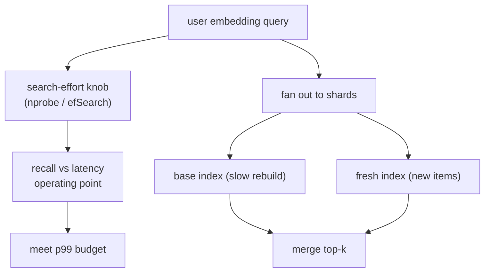

Two-tower retrieval reduces to one operation at serving time: given a user embedding,
find the nearest item embeddings. The index structures for this (HNSW, IVF) are covered
in pillar C; this lesson is about *serving* them, where the question is not "how does
the index work" but "how do I hit a p99 latency target at a given recall, on a refreshing
catalog". The defining property of approximate search is a tunable knob that trades
recall for speed, and operating an ANN index well is operating that knob.

## The recall-latency knob

Every ANN index exposes a search-effort parameter that trades accuracy for speed. In
**IVF** (inverted file with coarse clusters) it is `nprobe`, the number of clusters to
search: searching one cluster is fast but may miss neighbors in adjacent clusters, while
searching more clusters raises recall and latency. In **HNSW** (the small-world graph) it
is `efSearch`, the size of the candidate frontier kept during the greedy traversal:
larger `efSearch` explores more of the graph, finding more true neighbors at more cost.

The relationship is the operating curve: recall rises with search effort but with
diminishing returns, while latency rises roughly linearly. Serving means picking the
point on this curve that meets the recall the funnel needs at the latency the budget
allows, then holding it under load.

## Tail latency is the target

The metric that matters is not average latency but **p99** (the 99th percentile): the
slowest 1% of requests, because at scale that 1% is a large number of real users, and a
recommendation that arrives too late is a recommendation not shown. ANN serving is tuned
and load-tested against the tail, which behaves worse than the mean: a cluster that
happens to be large, a graph region that needs more hops, or a garbage-collection pause
all stretch the tail. Headroom that looks generous on the average can be exhausted at
p99.

## Keeping the index fresh

The catalog changes: items are added, removed, and re-embedded as the model retrains.
An index serving stale embeddings retrieves stale results, but rebuilding a
billion-vector index is expensive and cannot run per item. The standard pattern is a
**two-tier** index: a large, periodically-rebuilt base index plus a small, frequently-
updated index for new and changed items, with queries hitting both and merging. New
items appear quickly in the small tier; the base tier is rebuilt on a slower cadence.
This is the retrieval-side analogue of the feature store's freshness budget.

## Sharding and memory

A large index does not fit on one machine, so it is **sharded** across many, each holding
a slice of the catalog; a query fans out to all shards and merges the top results.
Sharding adds a fan-out cost (the query is only as fast as its slowest shard, again a
tail concern) and a memory cost (each shard holds its vectors in RAM for speed). Quantizing
the stored vectors (product quantization, the C-pillar technique) shrinks the memory per
shard, trading a little recall for fitting more vectors per machine.



## Check it on arrays

```python
import numpy as np

rng = np.random.default_rng(0)
n_items, d = 5000, 16
items = rng.normal(size=(n_items, d))
query = rng.normal(size=d)

# True nearest neighbors (exact, slow): the gold standard
true_top = set(np.argsort(-(items @ query))[:10])

# IVF-style approximate search: partition into clusters, search only `nprobe` of them
n_clusters = 50
centroids = items[rng.choice(n_items, n_clusters, replace=False)]
assign = np.argmin(((items[:, None] - centroids[None]) ** 2).sum(-1), axis=1)

def ann_search(nprobe):
    cluster_order = np.argsort(-(centroids @ query))     # most promising clusters first
    probed = set(cluster_order[:nprobe])
    cand = np.where(np.isin(assign, list(probed)))[0]
    top = cand[np.argsort(-(items[cand] @ query))[:10]]
    recall = len(set(top.tolist()) & true_top) / 10
    return recall, len(cand)                              # candidates scored ~ latency

for nprobe in [1, 3, 10, 30]:
    recall, scanned = ann_search(nprobe)
    print(f"nprobe={nprobe:>2}  recall@10={recall:.2f}  items scanned={scanned}")

# More clusters probed -> higher recall and more work (latency)
r1, c1 = ann_search(1)
r30, c30 = ann_search(30)
assert r30 >= r1 and c30 > c1
```

Searching a single cluster is fast but misses neighbors that fell into others, so recall
is low; raising `nprobe` scans more items and recovers more true neighbors, the
recall-latency trade every ANN deployment is tuned along.

## Exercises

**Exercise 1.** An IVF index with $1000$ clusters holds $10^8$ vectors evenly. Estimate
how many vectors are scanned at `nprobe = 1` versus `nprobe = 20`, and the rough latency
ratio.

<details>
<summary>Solution</summary>

**Step 1.** With $10^8$ vectors over $1000$ clusters, each cluster holds about
$10^8 / 1000 = 10^5$ vectors.

**Step 2.** `nprobe = 1` scans $\approx 10^5$ vectors; `nprobe = 20` scans
$\approx 20 \times 10^5 = 2\times10^6$.

**Step 3.** Latency scales roughly with vectors scanned, so `nprobe = 20` is about
$20\times$ slower than `nprobe = 1`, buying higher recall; the operating point balances
this against the budget.

</details>

**Exercise 2.** Explain why ANN serving is tuned against p99 latency rather than mean
latency, and give one cause of a stretched tail.

<details>
<summary>Solution</summary>

**Step 1.** At scale, the slowest 1% of requests still affects a large absolute number
of users, and a late recommendation is effectively a missing one, so the tail is the
user-visible metric.

**Step 2.** The mean can look healthy while the p99 is far worse, because latency
distributions are right-skewed.

**Step 3.** A cause of a stretched tail: an unusually large IVF cluster (or a graph
region needing extra hops) makes some queries scan more, and with sharding the query
waits on its slowest shard, so any one slow shard stretches the whole request's tail.

</details>

**Exercise 3 (code).** Demonstrate the freshness gap: add a batch of new items to the
catalog but not to the index, and verify that querying only the stale index misses the
new items even when they are the true nearest neighbors.

<details>
<summary>Solution</summary>

```python
import numpy as np

rng = np.random.default_rng(0)
d = 16
base = rng.normal(size=(1000, d))               # indexed items
query = rng.normal(size=d)

# New items added to the catalog but NOT yet in the index; some are near the query
new_items = query + 0.05 * rng.normal(size=(5, d))   # very close to the query

# Stale index only knows base items
stale_top = np.argsort(-(base @ query))[:10]
stale_best = (base[stale_top] @ query).max()

# A fresh tier holding the new items would surface them (they score higher)
new_best = (new_items @ query).max()
assert new_best > stale_best          # new items are the true nearest neighbors
print(f"best score stale index: {stale_best:.2f}   best new item: {new_best:.2f}")
print("the stale index misses the closer new items -> need a fresh tier")
```

The newly-added items are closer to the query than anything in the stale index, but a
query hitting only the base index never sees them; a frequently-updated fresh tier is
what closes this gap without rebuilding the whole index.

</details>

The next lesson handles the features that feed these queries in real time, computed from
the live session as the request arrives.

<Footnotes>
  <FNItem n="1">**Johnson, J., Douze, M., & Jégou, H.** (2021). "Billion-scale similarity search with GPUs" (FAISS). *IEEE Transactions on Big Data*, 7(3), 535-547. [arXiv:1702.08734](https://arxiv.org/abs/1702.08734). IVF, quantization, and the recall-latency trade in production ANN.</FNItem>
  <FNItem n="2">**Malkov, Y. A., & Yashunin, D. A.** (2020). "Efficient and robust approximate nearest neighbor search using hierarchical navigable small world graphs" (HNSW). *IEEE TPAMI*, 42(4), 824-836. [arXiv:1603.09320](https://arxiv.org/abs/1603.09320). The efSearch recall-latency knob.</FNItem>
</Footnotes>
