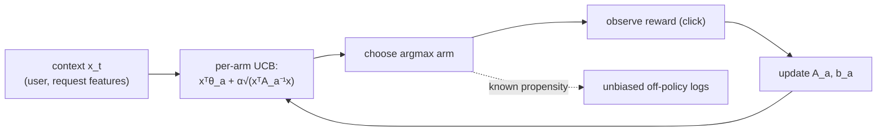

A batch-trained recommender learns from yesterday and serves today, a slow loop that
cannot react within a session and cannot evaluate items it never shows. A **contextual
bandit** closes the loop: it chooses a recommendation, observes the immediate reward, and
updates right away, balancing showing what currently looks best (exploitation) against
trying uncertain options to learn (exploration). The bandit lesson in pillar H built the
non-contextual version; here the choice depends on a **context** (the user and request
features), which is exactly the recommendation setting, and the exploration it injects is
also what makes the logs unbiased for the off-policy evaluation of earlier lessons.

## From bandit to contextual bandit

A plain multi-armed bandit picks among arms with unknown reward rates. A **contextual**
bandit sees a feature vector $\mathbf{x}$ (the user and context) before choosing, and the
reward of each arm depends on $\mathbf{x}$. The model for arm $a$ is usually linear: its
expected reward is $\mathbf{x}^\top \boldsymbol{\theta}_a$ for a learned weight vector
$\boldsymbol{\theta}_a$. This is recommendation as online learning: each request is a
context, each candidate item (or item-list) is an arm, and the click is the reward.

## LinUCB: optimism under uncertainty

**LinUCB** chooses the arm with the highest *upper confidence bound* on its reward,
adding to the predicted reward a bonus that grows with the model's uncertainty about that
arm in this context<FN n="1" />:

$$
a_t = \arg\max_a\ \underbrace{\mathbf{x}_t^\top \hat{\boldsymbol{\theta}}_a}_{\text{predicted reward}} + \alpha\,\underbrace{\sqrt{\mathbf{x}_t^\top A_a^{-1}\mathbf{x}_t}}_{\text{uncertainty bonus}},
$$

where $A_a = \sum \mathbf{x}\mathbf{x}^\top + I$ accumulates the contexts arm $a$ has been
tried in, $\hat{\boldsymbol{\theta}}_a = A_a^{-1}\mathbf{b}_a$ is its ridge-regression
estimate, and $\alpha$ tunes how much to explore. The bonus is large for arms tried in few
similar contexts (high uncertainty) and shrinks as evidence accumulates, so LinUCB
explores arms it is unsure about and exploits arms it has pinned down, automatically
trading the two. **Thompson sampling** is the Bayesian alternative: sample
$\boldsymbol{\theta}_a$ from each arm's posterior and pick the argmax, exploring in
proportion to posterior uncertainty.

## Why exploration is structurally necessary

Without exploration a recommender only ever learns about items it already favors, so a
genuinely good item that started with an unlucky estimate is never shown again and never
corrected, the starvation of the offline-online lesson. The bandit's exploration breaks
that loop, and it has a second payoff: the randomization gives every shown item a known,
nonzero propensity, which is the precondition for the unbiased off-policy evaluation and
debiased learning of the earlier disciplines. Exploration is not just for the bandit's own
learning; it is what makes the whole system's logs trustworthy.

## The production realities

A live bandit needs the real-time feature path (the context must be current), it needs the
reward to arrive quickly enough to update (delayed conversions complicate the loop), and
it needs guardrails so a high-variance exploration choice does not tank a high-value
request. In practice exploration is often capped (a small fraction of traffic, or
exploration only among already-decent candidates) so the cost of learning stays bounded,
the engineering tradeoffs production contextual-bandit systems are built around<FN n="2" />.
The bandit is the online-learning idea of the previous lesson, made decision-aware: it does
not just track a target, it chooses what to show in order to learn.



## Check it on arrays

```python
import numpy as np

rng = np.random.default_rng(0)
d, n_arms, T = 4, 5, 1500
theta = rng.normal(size=(n_arms, d))            # true per-arm reward weights (unknown)
alpha = 1.0

A = [np.eye(d) for _ in range(n_arms)]          # LinUCB state per arm
b = [np.zeros(d) for _ in range(n_arms)]
reward_linucb = 0.0
reward_random = 0.0

for t in range(T):
    x = rng.normal(size=d)
    # LinUCB: pick the arm with the highest upper confidence bound
    ucb = []
    for a in range(n_arms):
        A_inv = np.linalg.inv(A[a])
        theta_hat = A_inv @ b[a]
        ucb.append(theta_hat @ x + alpha * np.sqrt(x @ A_inv @ x))
    a_star = int(np.argmax(ucb))
    r = x @ theta[a_star] + rng.normal(scale=0.1)
    A[a_star] += np.outer(x, x); b[a_star] += r * x
    reward_linucb += r
    # Baseline: choose an arm uniformly at random (pure exploration, no learning)
    reward_random += x @ theta[rng.integers(n_arms)] + rng.normal(scale=0.1)

print(f"LinUCB total reward : {reward_linucb:.1f}")
print(f"random total reward : {reward_random:.1f}")
# LinUCB learns which arm fits each context and far outperforms random choice
assert reward_linucb > reward_random
```

LinUCB starts uncertain and explores, but as it accumulates evidence its per-arm
estimates sharpen and it routes each context to the arm that suits it, accumulating far
more reward than random selection, all while keeping enough exploration to maintain
unbiased logs.

## Exercises

**Exercise 1.** In the LinUCB score $\mathbf{x}^\top\hat{\boldsymbol{\theta}}_a +
\alpha\sqrt{\mathbf{x}^\top A_a^{-1}\mathbf{x}}$, describe what happens to the uncertainty
bonus for an arm as it is tried in many contexts similar to $\mathbf{x}$, and the effect on
exploration.

<details>
<summary>Solution</summary>

**Step 1.** Trying the arm accumulates $\mathbf{x}\mathbf{x}^\top$ terms into $A_a$, so
$A_a$ grows and $A_a^{-1}$ shrinks in the directions of those contexts.

**Step 2.** The bonus $\sqrt{\mathbf{x}^\top A_a^{-1}\mathbf{x}}$ therefore decreases for
contexts similar to the ones already seen, since the model is now confident there.

**Step 3.** With a small bonus the arm is chosen only when its *predicted* reward is
genuinely high, so exploration of that arm fades as evidence accumulates and the bandit
shifts toward exploitation, the automatic explore-then-exploit behavior.

</details>

**Exercise 2.** Explain the dual role of the bandit's exploration: for the bandit's own
learning, and for the validity of the system's logged data.

<details>
<summary>Solution</summary>

**Step 1.** For learning, exploration shows uncertain arms so the bandit gathers the
feedback needed to correct unlucky early estimates, preventing the starvation of
never-shown good items.

**Step 2.** For the logs, exploration gives each shown item a known nonzero selection
probability (propensity), rather than the deterministic choices a greedy policy would make.

**Step 3.** Those known propensities are exactly the precondition for unbiased
inverse-propensity off-policy evaluation and debiased learning, so the same exploration
that helps the bandit also makes every downstream offline analysis trustworthy.

</details>

**Exercise 3 (code).** Show exploration matters: run a purely greedy contextual learner
(the LinUCB rule with $\alpha = 0$, no uncertainty bonus) and verify it accumulates less
reward than LinUCB with $\alpha = 1$ because it stops exploring.

<details>
<summary>Solution</summary>

```python
import numpy as np

def run(alpha, seed=0):
    rng = np.random.default_rng(seed)
    d, n_arms, T = 4, 5, 1500
    theta = rng.normal(size=(n_arms, d))
    A = [np.eye(d) for _ in range(n_arms)]; b = [np.zeros(d) for _ in range(n_arms)]
    total = 0.0
    for t in range(T):
        x = rng.normal(size=d)
        scores = []
        for a in range(n_arms):
            A_inv = np.linalg.inv(A[a]); th = A_inv @ b[a]
            scores.append(th @ x + alpha * np.sqrt(x @ A_inv @ x))
        a_star = int(np.argmax(scores))
        r = x @ theta[a_star] + rng.normal(scale=0.1)
        A[a_star] += np.outer(x, x); b[a_star] += r * x
        total += r
    return total

greedy = run(alpha=0.0)
linucb = run(alpha=1.0)
print(f"greedy (alpha=0): {greedy:.1f}   LinUCB (alpha=1): {linucb:.1f}")
assert linucb > greedy
```

The greedy learner commits early to whichever arm looked best from little data and stops
exploring, so it can lock onto a suboptimal arm; LinUCB's uncertainty bonus keeps it
trying under-explored arms long enough to find the better fit, earning more reward.

</details>

This closes production systems and serving. The final discipline surveys the research
frontier: contrastive, causal, generative, and LLM-based recommenders that recombine the
rest of the tree into what recommendation is becoming.

<Footnotes>
  <FNItem n="1">**Li, L., Chu, W., Langford, J., & Schapire, R. E.** (2010). "A contextual-bandit approach to personalized news article recommendation" (LinUCB). *WWW*. [arXiv:1003.0146](https://arxiv.org/abs/1003.0146). The LinUCB algorithm for contextual recommendation.</FNItem>
  <FNItem n="2">**Agarwal, A., Bird, S., Cozowicz, M., et al.** (2016). "Making contextual decisions with low technical debt" (the Decision Service). *Microsoft Research*. [arXiv:1606.03966](https://arxiv.org/abs/1606.03966). Production contextual-bandit systems with logged-propensity exploration.</FNItem>
</Footnotes>
