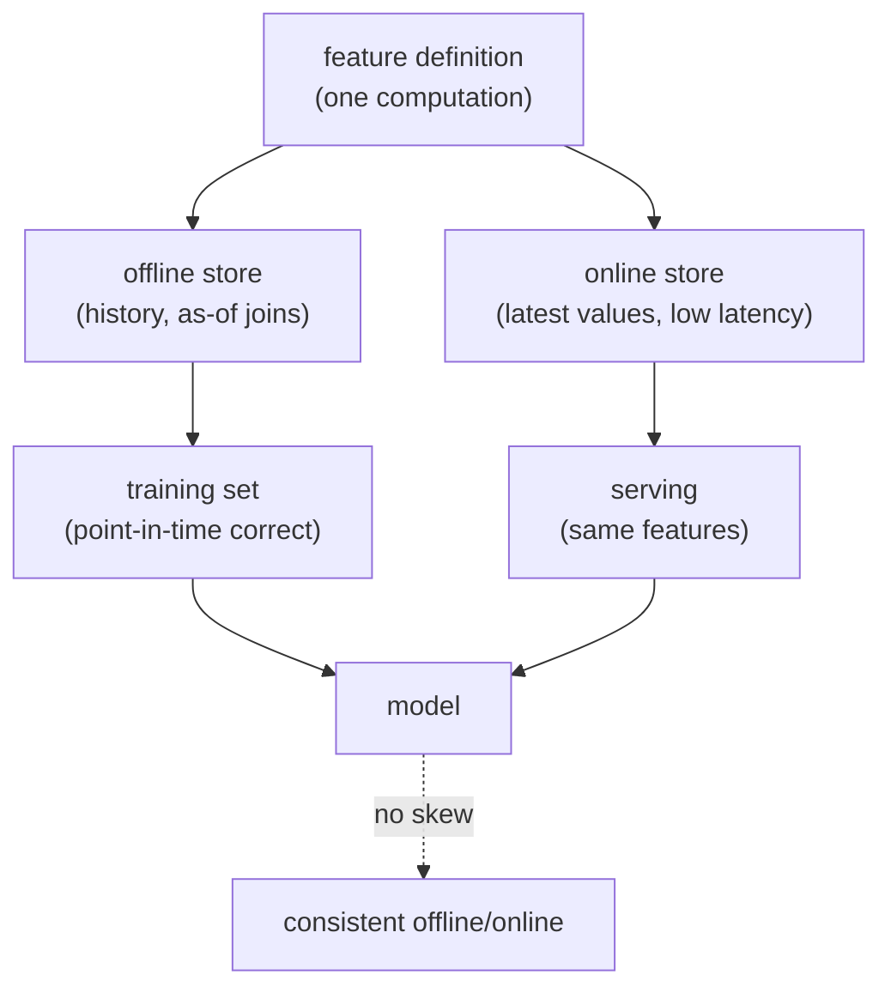

A recommender's features come from many places: a user's click history, an item's
rolling popularity, a creator's recent engagement. The same feature must be computed
identically when training offline and when serving online, or the model sees one world
in training and another in production, the **training/serving skew** that silently
degrades a launched model. The feature store is the shared system that guarantees this
consistency, and its hardest job is **point-in-time correctness**: making sure a
training example only ever sees feature values that were known *before* its label.

## Two stores, one definition

A feature store has an **offline** side (a columnar warehouse holding the full history,
used to build training sets) and an **online** side (a low-latency key-value store
holding the latest values, queried at serving time). The non-negotiable requirement is
that both are populated from the *same* feature definition, so "user's 7-day click
count" means the same computation in both. When they diverge, even subtly (a different
window boundary, a different null handling), the model trained offline behaves
differently online, and the gap is invisible until the metrics disappoint.

## Point-in-time correctness

The subtle failure is temporal. A feature like "item's average rating" changes over
time, so a training example labeled at time $t$ must use the feature value *as of* $t$,
not the value computed now (which includes data from after $t$, including the label's
own effect). Joining a label to the *latest* feature value leaks the future; the
correct join is a **point-in-time (as-of) join** that, for each label at time $t$,
selects the feature value from the most recent update strictly before $t$.

This is the exact mechanism behind the target-leakage warnings of the ranking-features
and offline-eval lessons. The feature store enforces it structurally: feature values
are stored with their valid-from timestamps, and the training-set builder does an as-of
join so no example can see a value that did not yet exist. Getting this right is the
difference between an offline metric that predicts production and one that lies.

## Freshness and the staleness budget

The online store reflects the world with some lag: a feature updated by a batch job
every hour is up to an hour stale at serving time. Each feature has a **staleness
budget**, how out-of-date it may be before it hurts, and the budget dictates the update
mechanism: slow-moving features (a user's long-term genre affinity) tolerate daily
batch updates, while fast-moving ones (the current session's clicks) need streaming
updates, the subject of the next lesson. Matching update frequency to the staleness
budget is a cost decision: fresher is more expensive.



## Check it on arrays

```python
import numpy as np

# An item's "avg rating" feature updated over time (valid_from, value)
updates = [(0, 3.0), (5, 3.5), (9, 4.2)]      # (timestamp, feature value)

def as_of(t):
    # Point-in-time: the most recent update STRICTLY before t
    valid = [v for (ts, v) in updates if ts < t]
    return valid[-1] if valid else None

def latest():
    return updates[-1][1]                      # the leaky "current value" join

# A training label occurs at time t=7
label_time = 7
correct = as_of(label_time)                   # value known at t=7 -> the t=5 update
leaky = latest()                              # value from t=9, AFTER the label

print(f"point-in-time feature at t=7: {correct}")
print(f"latest-value (leaky) feature: {leaky}")
# The as-of join uses only pre-label information; the latest-value join leaks the future
assert correct == 3.5
assert leaky == 4.2 and leaky != correct
```

The as-of join returns the value that existed at the label's timestamp, while the
latest-value join returns a value updated after the label, leaking information the model
would never have at serving time, which is exactly the skew the feature store exists to
prevent.

## Exercises

**Exercise 1.** A feature has updates at timestamps $\{0, 4, 8, 12\}$ with values
$\{1.0, 1.5, 2.0, 2.5\}$. A training example is labeled at time $t = 10$. Which value
does a point-in-time join select, and which would a latest-value join wrongly use?

<details>
<summary>Solution</summary>

**Step 1.** The point-in-time join selects the most recent update strictly before
$t = 10$, which is the update at $t = 8$ with value $2.0$.

**Step 2.** A latest-value join would use the update at $t = 12$ with value $2.5$.

**Step 3.** The $t = 12$ value did not exist at the label's time $t = 10$, so using it
leaks future information; the correct, leakage-free value is $2.0$.

</details>

**Exercise 2.** Explain why serving a model with a feature definition that differs even
slightly from the one used in training degrades production performance, and name the
phenomenon.

<details>
<summary>Solution</summary>

**Step 1.** The model learned the relationship between the *training* feature
definition and the label; at serving time a different definition produces values from a
different distribution.

**Step 2.** The model applies its learned weights to inputs that no longer mean what
they meant in training, so its predictions are systematically off, even though no code
threw an error.

**Step 3.** This is training/serving skew, and it is silent (no crash, just degraded
metrics), which is why a feature store enforces a single shared definition for both
paths.

</details>

**Exercise 3 (code).** Implement an as-of join for a batch of labels: given a list of
feature updates and several label timestamps, return the correct point-in-time value for
each label and assert none of them equals a value from a later update.

<details>
<summary>Solution</summary>

```python
import numpy as np

updates = [(0, 10.0), (3, 12.0), (7, 9.0), (11, 15.0)]
ts = np.array([u[0] for u in updates]); vals = np.array([u[1] for u in updates])

def as_of(t):
    earlier = np.where(ts < t)[0]
    return vals[earlier[-1]] if len(earlier) else np.nan

labels = [2, 5, 8, 12]
picked = [as_of(t) for t in labels]
print("labels:", labels)
print("as-of :", picked)
# Each picked value comes from an update strictly before its label
for t, v in zip(labels, picked):
    future_vals = vals[ts >= t]
    assert v not in future_vals
print("no future leakage")
```

Each label receives the feature value valid at its own timestamp, and the assertion
confirms none picked up a value from a later update, the property a point-in-time join
guarantees across a whole training batch.

</details>

The next lesson handles the features that cannot wait for a batch job: the session and
context signals computed in real time as the request arrives.

<Footnotes>
  <FNItem n="1">**Bernardi, L., Mavridis, T., & Estevez, P.** (2019). "150 successful machine learning models: 6 lessons learned at Booking.com". *KDD*. [doi:10.1145/3292500.3330744](https://doi.org/10.1145/3292500.3330744). Training/serving skew and feature consistency in production ML.</FNItem>
  <FNItem n="2">**Orr, L., Sanyal, A., Ling, X., et al.** (2021). "Managing ML pipelines: feature stores and the coming wave of embedding ecosystems". *VLDB*. [arXiv:2108.05053](https://arxiv.org/abs/2108.05053). Feature store architecture, point-in-time correctness, and online/offline parity.</FNItem>
</Footnotes>
