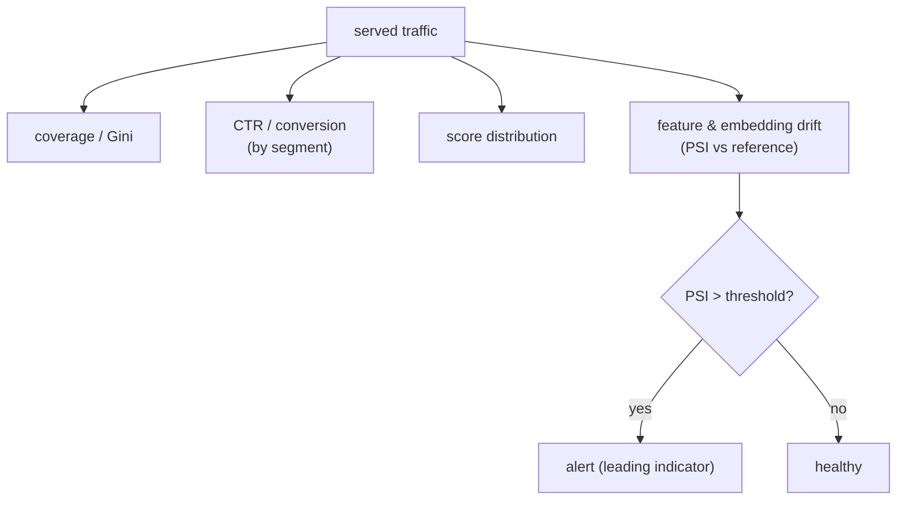

A deployed recommender fails quietly. There is no exception when a feature pipeline
starts emitting nulls, when a retrained model collapses coverage onto the head, or when
the input distribution drifts away from what the model learned; engagement just sags, and
by the time someone notices in a business dashboard, the damage has run for days.
Monitoring is the instrumentation that catches these before users do. This lesson covers
what to watch (model health, not just system health) and how to turn a drifting
distribution into an alert.

## System health is necessary but not sufficient

The usual service metrics, latency, error rate, throughput, are monitored as for any
service, and a serving outage shows up there. But a recommender can be perfectly healthy
as a *service* (fast, no errors) while being broken as a *model*: serving stale
embeddings, collapsing diversity, or mispredicting because its inputs drifted. Model
monitoring is a separate layer watching the *quality* of what is served, not just whether
it is served<FN n="2" />.

## What to watch

- **Coverage and concentration:** the fraction of the catalog being recommended, and the
  Gini of exposure. A sudden coverage drop or concentration spike means the model has
  collapsed onto a narrow set, often after a bad retrain.
- **Engagement metrics:** CTR, conversion, dwell, tracked continuously and segmented (by
  surface, by user cohort), so a regression in one segment is not hidden by a healthy
  average.
- **Prediction distribution:** the distribution of the model's output scores. A shift in
  the score histogram (everything suddenly scored high, or bimodal) signals a model or
  feature problem before it shows in engagement.
- **Feature and embedding drift:** the input feature distributions and the embedding-space
  statistics, compared against a reference window. Drift here is the leading indicator,
  it precedes the engagement drop.

## Quantifying drift: PSI

The standard summary of how much a distribution has shifted is the **population stability
index** (PSI), which compares a current distribution to a reference across bins<FN n="1" />:

$$
\text{PSI} = \sum_{b} \big(p^{\text{cur}}_b - p^{\text{ref}}_b\big)\,\ln\frac{p^{\text{cur}}_b}{p^{\text{ref}}_b},
$$

where $p^{\text{ref}}_b$ and $p^{\text{cur}}_b$ are the fractions of the reference and
current populations in bin $b$. PSI is symmetric and zero when the distributions match.
The convention is rule-of-thumb thresholds: below $0.1$ is stable, $0.1$ to $0.25$ is
moderate drift worth investigating, and above $0.25$ is significant drift that usually
warrants action. Computing PSI on each input feature and on the prediction scores turns
"the distribution moved" into a single number an alert can fire on.

## Alerting without crying wolf

An alert that fires constantly gets ignored, so thresholds are set with the metric's
normal variance in mind, and alerts are tied to *actionable* degradations (a sustained
PSI breach, a coverage collapse, a segment regression beyond noise) rather than every
wiggle. The goal is the leading indicator: catch the feature drift or score shift in the
hours before it becomes an engagement loss, while keeping the signal-to-noise high enough
that the alert is believed.



## Check it on arrays

```python
import numpy as np

def psi(ref, cur, bins=10, eps=1e-4):
    edges = np.quantile(ref, np.linspace(0, 1, bins + 1))
    edges[0], edges[-1] = -np.inf, np.inf
    p_ref = np.histogram(ref, edges)[0] / len(ref) + eps
    p_cur = np.histogram(cur, edges)[0] / len(cur) + eps
    return float(((p_cur - p_ref) * np.log(p_cur / p_ref)).sum())

rng = np.random.default_rng(0)
reference = rng.normal(0, 1, 50_000)              # training-time feature distribution

# No drift: a fresh sample from the same distribution
no_drift = rng.normal(0, 1, 50_000)
# Drift: the feature distribution has shifted and widened
drifted = rng.normal(0.8, 1.4, 50_000)

psi_stable = psi(reference, no_drift)
psi_drift = psi(reference, drifted)
print(f"PSI no-drift: {psi_stable:.4f}  (stable < 0.1)")
print(f"PSI drift   : {psi_drift:.4f}  (alert > 0.25)")

THRESHOLD = 0.25
assert psi_stable < 0.1                            # same distribution -> low PSI
assert psi_drift > THRESHOLD                       # shifted distribution -> fires alert
```

PSI is near zero when the current feature distribution matches the reference and rises
well past the alert threshold when the distribution shifts, turning "the inputs drifted"
into a single monitorable number that fires before the engagement metrics fall.

## Exercises

**Exercise 1.** A feature's reference distribution puts $\{0.5, 0.3, 0.2\}$ of its mass in
three bins; the current distribution puts $\{0.3, 0.3, 0.4\}$. Compute the PSI and
classify the drift by the rule-of-thumb thresholds.

<details>
<summary>Solution</summary>

**Step 1.** Bin 1: $(0.3 - 0.5)\ln(0.3/0.5) = (-0.2)(-0.511) = 0.102$.

**Step 2.** Bin 2: $(0.3 - 0.3)\ln(1) = 0$. Bin 3: $(0.4 - 0.2)\ln(0.4/0.2) =
(0.2)(0.693) = 0.139$.

**Step 3.** PSI $= 0.102 + 0 + 0.139 = 0.241$, which falls in the $0.1$ to $0.25$
moderate-drift band, worth investigating but just below the significant-drift threshold.

</details>

**Exercise 2.** Give an example of a recommender that is healthy on system metrics
(latency, error rate) yet broken on model metrics, and name the model metric that would
catch it.

<details>
<summary>Solution</summary>

**Step 1.** After a bad retrain, the model collapses onto the top few hundred popular
items, recommending them to everyone.

**Step 2.** Latency and error rate are unaffected (it serves fast and without errors), so
system monitoring shows green.

**Step 3.** The **coverage / Gini** metric catches it: catalog coverage drops sharply and
the Gini of exposure spikes toward $1$, flagging the collapse that system metrics miss.

</details>

**Exercise 3 (code).** Show PSI rises monotonically with the size of a distribution shift:
compute PSI against a fixed reference for several mean shifts and verify it increases with
the shift magnitude.

<details>
<summary>Solution</summary>

```python
import numpy as np

def psi(ref, cur, bins=10, eps=1e-4):
    edges = np.quantile(ref, np.linspace(0, 1, bins + 1))
    edges[0], edges[-1] = -np.inf, np.inf
    p_ref = np.histogram(ref, edges)[0] / len(ref) + eps
    p_cur = np.histogram(cur, edges)[0] / len(cur) + eps
    return float(((p_cur - p_ref) * np.log(p_cur / p_ref)).sum())

rng = np.random.default_rng(0)
ref = rng.normal(0, 1, 50_000)
shifts = [0.0, 0.25, 0.5, 1.0]
psis = [psi(ref, rng.normal(s, 1, 50_000)) for s in shifts]
print("shift:", shifts)
print("PSI  :", [round(p, 3) for p in psis])
assert all(psis[i] <= psis[i+1] + 1e-6 for i in range(len(psis)-1))
```

PSI grows with the mean shift, so a larger drift produces a larger value, which is what
lets a single threshold separate normal fluctuation from a genuine distribution change.

</details>

The next lesson closes the discipline with the production form of exploration: contextual
bandits that learn online which recommendations work for which contexts.

<Footnotes>
  <FNItem n="1">**Wu, J., et al.** (2010). "Population stability index and its application in credit scoring and model monitoring". Industry standard metric; see also **Yurdakul, B.** (2018). "Statistical properties of population stability index". *PhD dissertation, Western Michigan University*. [https://scholarworks.wmich.edu/dissertations/3208/](https://scholarworks.wmich.edu/dissertations/3208/). Definition and thresholds of PSI for distribution-shift monitoring.</FNItem>
  <FNItem n="2">**Breck, E., Cai, S., Nielsen, E., Salib, M., & Sculley, D.** (2017). "The ML test score: a rubric for ML production readiness and technical debt reduction". *IEEE Big Data*. [doi:10.1109/BigData.2017.8258038](https://doi.org/10.1109/BigData.2017.8258038). Monitoring practices for production ML, including feature and prediction distributions.</FNItem>
</Footnotes>
