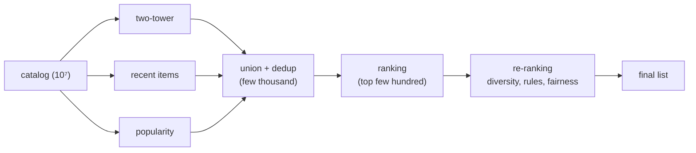

The retrieval-versus-ranking lesson justified splitting scoring into a cheap and an
expensive stage. A production system assembles more than two: several retrieval
*sources* feed one ranking stage, which feeds a re-ranking stage that applies the
business logic relevance alone cannot express. This lesson is about the full funnel as a
serving system, how the stages compose, where each one's latency budget goes, and why
the multi-source front end matters.

## Multiple retrieval sources

A single retrieval model has blind spots, so production systems run several candidate
generators in parallel and union their results. A two-tower model contributes
personalized embedding matches; a recent-items source contributes freshness; a
popularity source contributes a safe floor; a graph or co-visitation source contributes
collaborative signal. Each returns a few hundred candidates, the union is deduplicated,
and the ranking stage scores the pool. The point of multiple sources is **coverage**:
the recall ceiling of the funnel is set by the union, so a source that catches what the
others miss raises the whole system's reachable quality.

## The three stages and their budgets

- **Retrieval** turns millions of items into a few thousand candidates, cheaply (a dot
  product plus an ANN lookup per source). It optimizes recall and runs in a few
  milliseconds.
- **Ranking** scores the few thousand with a rich model reading cross features, and
  keeps the top few hundred. It optimizes ordering (nDCG) and is the most expensive
  per-item stage, so the candidate count entering it is the main latency lever.
- **Re-ranking** adjusts the top few hundred for things a pointwise relevance score
  ignores: diversity, freshness, fairness, business rules (do not show two items from
  the same seller adjacently, respect a sponsored-content quota). It optimizes the
  *list*, operating on a small set where list-level computation is affordable.

The total latency is the sum across stages, and the budget is spent where the work is:
ranking dominates, so the funnel is tuned by choosing how many candidates each stage
passes downstream.

## Why the order is fixed

The stages are strictly narrowing and strictly increasing in cost-per-item, and that
ordering is forced. You cannot re-rank for diversity before ranking, because diversity
operates on the ranked top; you cannot rank before retrieval, because ranking the whole
catalog is the cost the funnel exists to avoid. Each stage hands the next a set small
enough for the next stage's richer computation to be affordable, which is the single
invariant that makes the whole pipeline serveable.



## Check it on arrays

```python
import numpy as np

# Funnel sizing: candidates and per-item cost (microseconds) at each stage
sources = {"two_tower": 400, "recent": 200, "popularity": 100}
overlap = 100                      # items returned by more than one source
n_ranked = 500                     # ranking keeps top 500 of the union
n_final = 20

union = sum(sources.values()) - overlap
cost_us = {"retrieval": 2, "ranking": 120, "rerank": 300}

retrieval_ms = sum(sources.values()) * cost_us["retrieval"] / 1000
ranking_ms = union * cost_us["ranking"] / 1000
rerank_ms = n_final * cost_us["rerank"] / 1000     # rerank operates on a small set
total_ms = retrieval_ms + ranking_ms + rerank_ms

print(f"union candidate pool: {union}")
print(f"retrieval {retrieval_ms:.2f} ms | ranking {ranking_ms:.2f} ms | "
      f"rerank {rerank_ms:.2f} ms")
print(f"total latency: {total_ms:.2f} ms")
# Ranking dominates the budget, so the candidate count into ranking is the key lever
assert ranking_ms > retrieval_ms and ranking_ms > rerank_ms
# Halving the ranked pool roughly halves the ranking cost
ranking_half = (union // 2) * cost_us["ranking"] / 1000
assert ranking_half < ranking_ms
```

The latency breakdown shows ranking consuming most of the budget, so the funnel is
tuned by controlling how many candidates reach the ranking stage, the lever that trades
the recall of a wider pool against the cost of scoring it.

## Exercises

**Exercise 1.** Three retrieval sources return $300$, $200$, and $150$ candidates, with
$80$ items appearing in more than one source. How many distinct candidates does the
ranking stage receive?

<details>
<summary>Solution</summary>

**Step 1.** The raw total is $300 + 200 + 150 = 650$.

**Step 2.** The $80$ duplicated items are counted more than once, so subtract the
overlap: $650 - 80 = 570$.

**Step 3.** The ranking stage receives $570$ distinct candidates after deduplication.
Deduplication matters because ranking cost is per distinct candidate, so counting
duplicates would overstate both the pool and the latency.

</details>

**Exercise 2.** Explain why diversity re-ranking must come after ranking rather than
before, and why ranking must come after retrieval.

<details>
<summary>Solution</summary>

**Step 1.** Diversity re-ranking operates on the ordered top of the list (it removes
near-duplicates among the best items), which only exists after ranking has produced an
order, so it cannot run first.

**Step 2.** Ranking reads expensive cross features and must run on a small set; running
it before retrieval would mean scoring the whole catalog, the exact cost the funnel
avoids.

**Step 3.** The stages are forced into the order retrieval then ranking then
re-ranking, each narrowing the set enough for the next stage's richer, costlier
computation to be affordable.

</details>

**Exercise 3 (code).** Show the recall benefit of multiple sources: give each of two
sources a different blind spot (each misses a disjoint set of relevant items) and verify
the union's recall exceeds either source alone.

<details>
<summary>Solution</summary>

```python
import numpy as np

rng = np.random.default_rng(0)
relevant = set(range(20))                       # the 20 truly relevant items
# Source A catches relevant items with even ids; source B catches odd ids; each
# also catches some shared ones.
src_a = {i for i in relevant if i % 2 == 0} | {0, 1, 2}
src_b = {i for i in relevant if i % 2 == 1} | {0, 1, 2}

rec_a = len(src_a & relevant) / len(relevant)
rec_b = len(src_b & relevant) / len(relevant)
rec_union = len((src_a | src_b) & relevant) / len(relevant)
print(f"recall A: {rec_a:.2f}  recall B: {rec_b:.2f}  recall union: {rec_union:.2f}")
assert rec_union > max(rec_a, rec_b)
```

Each source alone covers only about half the relevant items, but their union covers
nearly all, because each catches what the other misses; this coverage gain is the whole
reason for running multiple retrieval sources.

</details>

The next lesson goes inside the funnel's data dependency: the feature store that serves
every stage consistent, point-in-time-correct features at training and serving time.

<Footnotes>
  <FNItem n="1">**Covington, P., Adams, J., & Sargin, E.** (2016). "Deep neural networks for YouTube recommendations". *RecSys*. [doi:10.1145/2959100.2959190](https://doi.org/10.1145/2959100.2959190). The candidate-generation-then-ranking funnel and multi-source retrieval.</FNItem>
  <FNItem n="2">**Wilhelm, M., Ramanathan, A., Bonomo, A., et al.** (2018). "Practical diversified recommendations on YouTube with determinantal point processes". *CIKM*. [doi:10.1145/3269206.3272018](https://doi.org/10.1145/3269206.3272018). The re-ranking stage for diversity in a production funnel.</FNItem>
</Footnotes>
