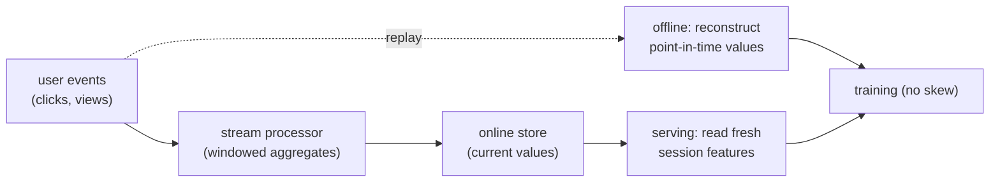

Some features cannot wait for a batch job. What a user clicked five seconds ago is the
strongest signal for what they want next, but a feature pipeline that refreshes hourly
would serve it as if those five seconds never happened. **Real-time features** are
computed from the live event stream as the request arrives, and they are what let a
recommender respond *within* a session rather than to yesterday's behavior. This lesson
is about which features need to be real-time, how they are computed, and the cost of
getting their freshness wrong.

## Which features must be fresh

Match the update frequency to how fast the signal changes (the staleness budget of the
previous lesson). Three rough tiers:

- **Batch (hours to days):** slow-moving aggregates, a user's long-term genre affinity,
  an item's lifetime popularity. An hour of staleness is invisible.
- **Streaming (seconds to minutes):** session counts, "items viewed this visit", an
  item's engagement velocity in the last few minutes. Stale by an hour, these are wrong.
- **Request-time (milliseconds):** features that depend on the request itself, the
  current time, device, the exact sequence of clicks so far in this session. These are
  computed when the request is served, from state held in a fast store.

The cost rises sharply with freshness, so the engineering discipline is to push only the
genuinely fast-moving signals into the expensive real-time path.

## How real-time features are computed

The architecture is a **streaming pipeline**: user events (clicks, views, add-to-carts)
flow into a stream processor that maintains running aggregates per user and per item in
a low-latency store. A windowed count like "items clicked in the last 10 minutes" is
maintained incrementally as events arrive and expire, so the value is always current when
the serving path reads it. The same definition must still match the offline training
computation (the point-in-time correctness of the feature store), which is why streaming
features are the hardest to keep skew-free: the offline pipeline has to *replay* the
stream to reconstruct what each value was at each historical moment.

## The cost of staleness

A stale feature is not just slightly worse; for a fast-moving signal it can be actively
misleading. If a user just switched from browsing shoes to browsing laptops, a session-
intent feature lagging by ten minutes still says "shoes", so the recommender keeps
pushing shoes precisely when the user moved on. The staleness turns the strongest signal
into noise. The quantitative version: prediction quality degrades with the lag between
the feature's timestamp and the request, and that degradation is steep exactly for the
features worth computing in real time.



## Check it on arrays

```python
import numpy as np

rng = np.random.default_rng(0)
T = 600                                          # seconds in a session

# The user's intent shifts partway through the session (shoes -> laptops).
# A "session intent" feature should track it; a stale feature lags by `lag` seconds.
intent = np.where(np.arange(T) < 300, 0.0, 1.0)  # 0 = shoes, 1 = laptops

def feature_with_lag(lag):
    f = np.zeros(T)
    f[lag:] = intent[:T - lag]                    # value is `lag` seconds old
    return f

# Reward of a recommendation = how well the feature matches the CURRENT intent
def mean_match(feat):
    return 1 - np.abs(feat - intent).mean()       # 1 = perfect, 0 = always wrong

fresh = feature_with_lag(0)
stale = feature_with_lag(120)                     # 2 minutes stale

print(f"fresh feature match: {mean_match(fresh):.3f}")
print(f"stale feature match: {mean_match(stale):.3f}")
# A fresh session feature tracks the intent shift; a stale one mispredicts around it
assert mean_match(fresh) > mean_match(stale)
```

The fresh feature follows the user's mid-session shift immediately, while the two-minute-
stale feature keeps reporting the old intent across the change, mispredicting exactly
when the user's behavior turned, which is why session signals justify the real-time path.

## Exercises

**Exercise 1.** Classify each feature into batch, streaming, or request-time: (a) the
user's all-time favorite category, (b) the number of items added to cart in this
session, (c) the current hour of day. Justify each.

<details>
<summary>Solution</summary>

**Step 1.** (a) All-time favorite category changes slowly over a user's whole history,
so an hourly or daily **batch** update is fine.

**Step 2.** (b) Cart adds in the current session change every few seconds and are
meaningless if stale, so this is a **streaming** feature maintained as events arrive.

**Step 3.** (c) The current hour depends only on the request moment and needs no history,
so it is computed at **request time** from the request timestamp.

</details>

**Exercise 2.** Explain why streaming features are the hardest to keep free of
training/serving skew, referencing how the offline value must be reconstructed.

<details>
<summary>Solution</summary>

**Step 1.** At serving time a streaming feature is the current value of a running
aggregate; for training, each historical example needs the value the aggregate had at
*that* example's moment.

**Step 2.** Reconstructing those historical values requires replaying the event stream
and recomputing the windowed aggregate as of each past timestamp, which must match the
online computation exactly (same window, same expiry, same ordering).

**Step 3.** Any discrepancy between the online running aggregate and the offline replay
produces skew, and because the logic is stateful and time-dependent, matching them is
far harder than for a static batch feature.

</details>

**Exercise 3 (code).** Show the degradation grows with lag: compute the feature-intent
match across a range of staleness lags and verify the match decreases as lag increases
across the intent shift.

<details>
<summary>Solution</summary>

```python
import numpy as np

T = 600
intent = np.where(np.arange(T) < 300, 0.0, 1.0)

def match(lag):
    f = np.zeros(T); f[lag:] = intent[:T - lag]
    return 1 - np.abs(f - intent).mean()

lags = [0, 30, 60, 120, 240]
matches = [match(l) for l in lags]
print("lag     :", lags)
print("match   :", [round(m, 3) for m in matches])
assert all(matches[i] >= matches[i+1] for i in range(len(matches)-1))
```

The match falls monotonically as the feature gets staler, because a larger lag carries
the pre-shift value further past the moment the intent changed, quantifying why
fast-moving signals demand a short staleness budget.

</details>

The next lesson turns to keeping the model itself current: how often to retrain and when
to update online instead of in batch.

<Footnotes>
  <FNItem n="1">**Akidau, T., Bradshaw, R., Chambers, C., et al.** (2015). "The Dataflow model: a practical approach to balancing correctness, latency, and cost in massive-scale, unbounded, out-of-order data processing". *VLDB*. [doi:10.14778/2824032.2824076](https://doi.org/10.14778/2824032.2824076). Windowed streaming aggregation underlying real-time features.</FNItem>
  <FNItem n="2">**Chang, S., Zhang, Y., Tang, J., et al.** (2017). "Streaming recommender systems". *WWW*. [arXiv:1607.06182](https://arxiv.org/abs/1607.06182). Incorporating real-time user feedback into recommendation.</FNItem>
</Footnotes>
