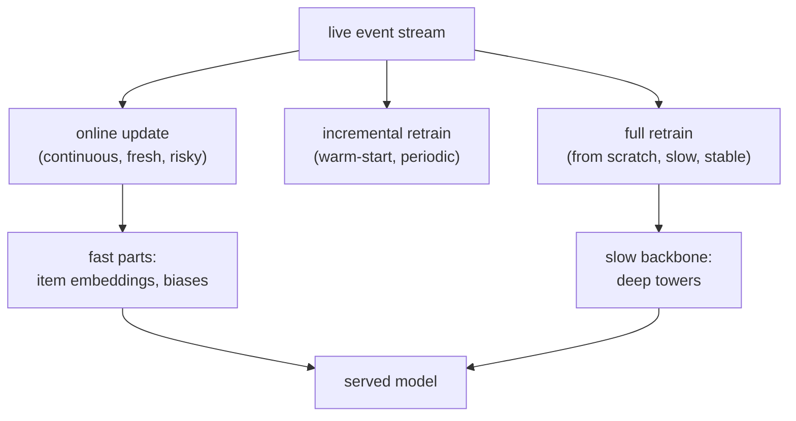

A recommender's world moves: new items arrive, trends shift, user tastes drift. A model
frozen at its training snapshot decays as the world diverges from the data it learned,
so it must be refreshed. The question is *how often* and *how*: retrain the whole model
nightly, update it continuously from the live stream, or something between. The answer
depends on how fast the relevant distribution drifts, and getting it wrong means either
a stale model serving yesterday's world or an unstable one chasing noise.

## Why a frozen model decays

The training data is a snapshot of a distribution that keeps changing. Three drivers in
recommendation specifically:

- **New entities:** items and users that did not exist at training time have no learned
  embedding, so a frozen model cannot represent them (the cold-start problem, now as an
  operational fact).
- **Concept drift:** what predicts engagement changes (a feature's meaning shifts, a
  trend rises), so the learned weights become miscalibrated<FN n="2" />.
- **Catalog turnover:** items are added and retired, so the relevant item set itself
  moves.

The faster these move for a given product, the shorter the model's useful shelf life,
and the staler a fixed retraining cadence allows it to become between refreshes.

## The cadence spectrum

- **Periodic full retrain (hours to days):** rebuild the model from scratch on a fresh
  window of data. Simple, reproducible, and easy to validate before shipping, but the
  model is as stale as the interval, and full retrains are expensive.
- **Incremental / warm-start retrain:** start from the current model's weights and
  continue training on recent data, far cheaper than from scratch and able to run more
  often, at the cost of accumulating drift in the warm-started state.
- **Online learning:** update the model continuously from the event stream, one mini-
  batch at a time, so it tracks the current distribution closely. It is the most current
  and the least stable: a burst of anomalous traffic can move the model immediately, and
  there is no clean offline snapshot to validate before it serves.

A common production split keeps the heavy backbone (the deep towers) on a slow full-
retrain cadence while updating fast-moving parts (item embeddings, popularity, biases)
online, getting freshness where it matters without the instability of moving everything<FN n="1" />.

## The freshness-stability trade

Online learning tracks a moving target better than a stale batch model, which is its
whole point, but the same responsiveness makes it vulnerable to noise and feedback
loops. The mitigations are familiar: validate continuously (the experiment-tracking and
monitoring tooling), cap how fast any one update can move the model, and keep the
randomized exploration that prevents the online model from collapsing into its own
feedback loop. Online learning is freshness bought with vigilance.



## Check it on arrays

```python
import numpy as np

rng = np.random.default_rng(0)
d, T = 4, 4000

w_online = np.zeros(d)
w_batch = None
err_online = err_batch = 0.0
for t in range(T):
    # The true relationship DRIFTS over time (one coordinate oscillates slowly)
    w_true = np.array([np.sin(t / 500), 1.0, -0.5, 0.3])
    x = rng.normal(size=d)
    y = x @ w_true + rng.normal(scale=0.1)

    if w_batch is None or t == 1000:        # "batch" model frozen at t=1000
        w_batch = w_online.copy()

    err_online += (x @ w_online - y) ** 2   # online model predicts, then updates
    err_batch += (x @ w_batch - y) ** 2     # stale batch model predicts, no update
    w_online += 0.05 * (y - x @ w_online) * x   # online SGD step

print(f"online   mean squared error: {err_online / T:.3f}")
print(f"stale-batch mean squared error: {err_batch / T:.3f}")
# The online model tracks the drifting target; the frozen batch model falls behind
assert err_online / T < err_batch / T
```

The online model continuously corrects toward the drifting target and keeps its error
low, while the batch model frozen at one point in time falls further behind as the world
moves away from its snapshot, the freshness advantage that justifies online updates for
fast-moving signals.

## Exercises

**Exercise 1.** Product A's catalog and trends turn over within hours (a news feed);
product B's are stable over months (a classic-film library). Recommend a retraining
cadence for each and justify it.

<details>
<summary>Solution</summary>

**Step 1.** Product A drifts within hours, so a daily retrain would serve a badly stale
model most of the day; it needs frequent incremental or online updates (minutes to
hours).

**Step 2.** Product B is stable over months, so frequent retraining chases noise for no
benefit; a weekly or even monthly full retrain suffices.

**Step 3.** The cadence matches the drift rate: fast-moving products pay for freshness,
slow-moving ones save cost with infrequent retrains, which is the staleness-budget logic
applied to the model itself.

</details>

**Exercise 2.** Explain why many systems update item embeddings online but retrain the
deep towers only periodically.

<details>
<summary>Solution</summary>

**Step 1.** Item embeddings move fast (new items, shifting popularity) and are cheap to
update, so online updates keep them fresh where freshness pays off most.

**Step 2.** The deep towers encode slower-changing structure, are expensive to retrain,
and are riskier to move continuously (a bad online update to the backbone affects every
prediction), so a stable periodic retrain with offline validation is safer.

**Step 3.** Splitting the cadence gets freshness on the fast-moving parts without
exposing the whole model to the instability of online learning, the common production
compromise.

</details>

**Exercise 3 (code).** Show the trade's other edge: add a burst of anomalous data (a few
mislabeled examples) mid-stream and verify the online model's error spikes right after,
while a frozen model is unaffected, illustrating online learning's vulnerability to
noise.

<details>
<summary>Solution</summary>

```python
import numpy as np

rng = np.random.default_rng(0)
d, T = 4, 2000
w_true = np.array([1.0, -1.0, 0.5, 0.2])
w = np.zeros(d)
errs = []
for t in range(T):
    x = rng.normal(size=d)
    if 1000 <= t < 1020:
        y = -(x @ w_true)                 # 20 anomalous, sign-flipped labels
    else:
        y = x @ w_true + rng.normal(scale=0.1)
    errs.append((x @ w - y) ** 2)
    w += 0.1 * (y - x @ w) * x            # online update absorbs the anomaly

before = np.mean(errs[980:1000])
during = np.mean(errs[1000:1040])
print(f"error before anomaly: {before:.3f}   right after: {during:.3f}")
assert during > before
```

The anomalous burst moves the online model immediately, spiking its error on the
following clean examples; a frozen model would have ignored the burst entirely, which is
the stability the online path trades away for freshness.

</details>

The next lesson sets the end-to-end latency budget these models must serve within, and
the caching and batching that defend it.

<Footnotes>
  <FNItem n="1">**Hazelwood, K., Bird, S., Brooks, D., et al.** (2018). "Applied machine learning at Facebook: a datacenter infrastructure perspective". *HPCA*. [doi:10.1109/HPCA.2018.00059](https://doi.org/10.1109/HPCA.2018.00059). Retraining cadence and the freshness-cost trade for production recommenders.</FNItem>
  <FNItem n="2">**Gama, J., Žliobaitė, I., Bifet, A., Pechenizkiy, M., & Bouchachia, A.** (2014). "A survey on concept drift adaptation". *ACM Computing Surveys*, 46(4). [doi:10.1145/2523813](https://doi.org/10.1145/2523813). Concept drift and online adaptation strategies.</FNItem>
</Footnotes>
