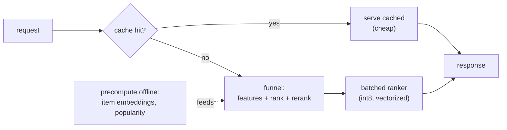

A recommendation that arrives after the page has rendered is a recommendation not shown.
The whole funnel, retrieval, ranking, re-ranking, plus feature fetches and network hops,
must complete inside a budget measured in tens of milliseconds. This lesson treats
latency as a budget to be allocated and defended: where the time goes, and the standard
techniques (caching, batching, quantization, precomputation) that buy it back.

## The latency budget is a sum

End-to-end latency is the sum of every step on the critical path: fetch user features,
encode the user tower, run each retrieval source, merge, fetch candidate features, run
the ranker, re-rank, serialize. Each has a budget, and they add up, so the discipline is
to know the breakdown and attack the largest term. The ranker usually dominates (it
scores hundreds of candidates with a deep model), the feature fetches are next (network
round-trips to the online store), and retrieval is cheap. A budget that balances on the
average can still blow the **p99**, so each step is held to a tail target, not a mean.

## Caching: do not recompute what has not changed

Much of the work repeats across requests and can be cached:

- **Item embeddings** are computed offline and cached in the ANN index; the item tower
  never runs at request time (the two-tower precompute).
- **Popular results** for common contexts (a logged-out homepage, a trending shelf) are
  cached and served directly, skipping the funnel entirely for the heaviest-traffic
  requests.
- **Feature values** are cached in the online store rather than recomputed per request.

The payoff is the cache **hit rate**: a high hit rate means most requests pay a cheap
cache lookup instead of the full computation, so the *average* latency drops sharply
even though the cold-path latency is unchanged. The mean served latency is a weighted
average of the hit-path and miss-path costs.

## Batching and hardware

The ranker scores many candidates, which is naturally a **batch**: running the model
once over a batch of hundreds is far cheaper per item than hundreds of single
evaluations, because it amortizes fixed overheads and uses vectorized hardware (the same
reason GPU inference favors batches). The serving system assembles the candidate set into
one batched forward pass rather than looping.

**Quantization** shrinks both latency and memory: serving the model (and the embedding
tables) in int8 instead of float32 cuts memory traffic and uses faster integer kernels,
trading a small accuracy loss for a large throughput gain, the same technique that fits
the ANN index into RAM.

## Precompute everything you can

The cheapest request-time work is work done before the request. Item embeddings,
popularity scores, and slow-moving features are all precomputed and cached, leaving the
request path to do only the genuinely per-request work (encode this user, score these
candidates). Pushing computation off the critical path into offline jobs is the single
most effective latency lever, which is why the architecture is built around it.



## Check it on arrays

```python
import numpy as np

# Latency budget breakdown (milliseconds) on the cold path
steps = {"feature_fetch": 8, "user_encode": 3, "retrieval": 4,
         "ranking": 18, "rerank": 5, "serialize": 2}
cold_ms = sum(steps.values())
print(f"cold-path latency: {cold_ms} ms")
print(f"largest term: {max(steps, key=steps.get)} ({max(steps.values())} ms)")
# Ranking dominates the budget
assert max(steps, key=steps.get) == "ranking"

# Caching: a fraction `hit_rate` of requests serve a cheap cached result (1 ms)
def mean_latency(hit_rate, cold=cold_ms, hot=1.0):
    return hit_rate * hot + (1 - hit_rate) * cold

for hr in [0.0, 0.5, 0.9]:
    print(f"hit rate {hr:.0%}: mean latency {mean_latency(hr):.1f} ms")
# Higher cache hit rate lowers mean served latency
assert mean_latency(0.9) < mean_latency(0.5) < mean_latency(0.0)

# Quantization throughput gain: int8 vs float32 on the ranking step (~2x here)
ranking_int8 = steps["ranking"] / 2
assert ranking_int8 < steps["ranking"]
print(f"ranking float32 {steps['ranking']} ms -> int8 {ranking_int8:.1f} ms")
```

The breakdown identifies ranking as the term to attack, caching collapses the mean
latency toward the cheap hot path as the hit rate rises, and quantizing the ranker halves
its share, the three levers that keep the funnel inside its budget.

## Exercises

**Exercise 1.** A cold request costs $40$ ms and a cached request costs $2$ ms. If $80\%$
of requests hit the cache, what is the mean served latency, and what does the cache do to
the p99 if the slowest $1\%$ always miss?

<details>
<summary>Solution</summary>

**Step 1.** Mean $= 0.8 \cdot 2 + 0.2 \cdot 40 = 1.6 + 8.0 = 9.6$ ms.

**Step 2.** The mean drops from $40$ ms (no cache) to $9.6$ ms because most requests take
the cheap path.

**Step 3.** If the slowest $1\%$ always miss, the p99 is still the cold-path $40$ ms: the
cache improves the *average* but not the tail of the missing requests, which is why p99 is
defended separately (by attacking the cold path itself, not just adding cache).

</details>

**Exercise 2.** Explain why scoring $500$ candidates in one batched forward pass is
cheaper than $500$ single-item passes, and what hardware property this exploits.

<details>
<summary>Solution</summary>

**Step 1.** Each forward pass has fixed overheads (kernel launches, memory setup, weight
loading) that are paid once per call regardless of how many items it processes.

**Step 2.** A batched pass pays those overheads once for all $500$ items, while $500$
single passes pay them $500$ times.

**Step 3.** It exploits vectorized/parallel hardware (SIMD, GPU): the matrix multiply over
a batch keeps the compute units busy, whereas single items leave them idle between calls,
so throughput per item rises sharply with batch size.

</details>

**Exercise 3 (code).** Find the cache hit rate needed to meet a mean-latency target:
given a cold cost of $40$ ms and a hot cost of $2$ ms, compute the minimum hit rate that
brings mean latency under $10$ ms.

<details>
<summary>Solution</summary>

```python
import numpy as np

cold, hot, target = 40.0, 2.0, 10.0
# mean = h*hot + (1-h)*cold <= target  ->  h >= (cold - target) / (cold - hot)
h_min = (cold - target) / (cold - hot)
print(f"minimum hit rate: {h_min:.3f}")
mean_at_min = h_min * hot + (1 - h_min) * cold
assert np.isclose(mean_at_min, target)
assert 0 <= h_min <= 1
```

Solving the mean-latency equation for the hit rate gives the cache coverage the system
needs: about $79\%$ of requests must hit the cache to bring the mean under $10$ ms, a
concrete target the caching strategy is designed to hit.

</details>

The next lesson watches the served system for trouble: monitoring coverage, engagement,
and embedding drift, and alerting when the recommender degrades.

<Footnotes>
  <FNItem n="1">**Covington, P., Adams, J., & Sargin, E.** (2016). "Deep neural networks for YouTube recommendations". *RecSys*. [doi:10.1145/2959100.2959190](https://doi.org/10.1145/2959100.2959190). Precomputation and serving-time constraints in production recommendation.</FNItem>
  <FNItem n="2">**Gholami, A., Kim, S., Dong, Z., et al.** (2022). "A survey of quantization methods for efficient neural network inference". In *Low-Power Computer Vision*, Chapman & Hall. [arXiv:2103.13630](https://arxiv.org/abs/2103.13630). Int8 quantization for inference latency and memory.</FNItem>
</Footnotes>
