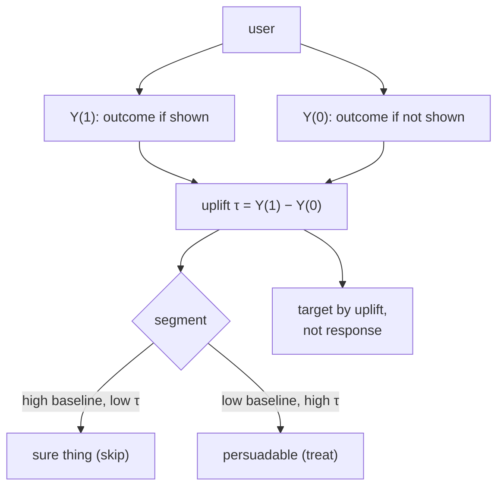

A standard recommender predicts $P(\text{click} \mid \text{shown})$, but the decision it
informs is causal: *should I show this item*. Those are different questions. An item a user
would have found and bought anyway gets a high predicted click, yet showing it changes
nothing; the recommendation slot is wasted. The quantity that actually matters is the
**uplift**, the increase in the outcome *caused* by showing the item, and estimating it
turns recommendation from a prediction problem into a causal one, built on the potential-
outcomes framework of pillar B.

## Response is not effect

Frame showing an item as a treatment. Each user has two potential outcomes: $Y(1)$, the
outcome if shown, and $Y(0)$, the outcome if not. The **uplift** (individual treatment
effect) is $\tau = Y(1) - Y(0)$. A standard response model estimates $P(Y = 1 \mid
\text{shown}) = \mathbb{E}[Y(1)]$, ignoring $Y(0)$ entirely. The two diverge whenever the
baseline $Y(0)$ is high: a user who would convert without the nudge has a high response but
near-zero uplift. Marketing has names for the segments, the **sure things** (high baseline,
low uplift), the **persuadables** (low baseline, high uplift, the only ones worth treating),
the **lost causes** (low both), and the **do-not-disturbs** (treatment *lowers* the
outcome). Targeting by response chases sure things; targeting by uplift finds persuadables<FN n="2" />.

## Why recommendation is causal

Beyond the targeting argument, the data itself demands causal treatment. The logs are
generated by a recommender that chose what to show based on predicted relevance, so
exposure is confounded with relevance, the MNAR structure of the bias lessons. Estimating
the effect of an intervention from such confounded observational data is exactly the
problem pillar B and pillar M solve: identify the effect under unconfoundedness, or use the
logged propensities to debias<FN n="1" />. Causal recommendation is where the off-policy evaluation,
inverse-propensity weighting, and uplift modeling of the rest of the tree converge on the
recommendation decision.

## Estimating uplift

Uplift needs both potential outcomes, but each user is only ever shown or not, never both,
so it is estimated across users. The standard estimators are the meta-learners of pillar M
applied here: a **T-learner** fits separate outcome models for the treated and control
groups and subtracts them; an **S-learner** fits one model with treatment as a feature; and
direct uplift methods optimize the treated-minus-control difference. The data ideally comes
from a system that randomized exposure (the bandit exploration of the previous discipline),
which makes the treated and control groups comparable and the uplift identified without
further assumptions.



## Check it on arrays

```python
import numpy as np

rng = np.random.default_rng(0)
n = 4000
# Each user: baseline conversion p0, and uplift (effect of being shown the item)
p0 = rng.uniform(0, 0.6, n)
uplift = rng.uniform(-0.1, 0.4, n)               # some negative (do-not-disturb)
p1 = np.clip(p0 + uplift, 0, 1)                  # conversion if shown

K = int(0.3 * n)                                 # budget: treat 30% of users
# Response policy targets highest predicted conversion-if-shown (p1)
response_target = np.argsort(-p1)[:K]
# Uplift policy targets highest treatment effect (p1 - p0)
uplift_target = np.argsort(-(p1 - p0))[:K]

# Realized INCREMENTAL conversions = sum of true uplift over the treated users
inc_response = uplift[response_target].sum()
inc_uplift = uplift[uplift_target].sum()
print(f"incremental conversions, response targeting: {inc_response:.1f}")
print(f"incremental conversions, uplift targeting  : {inc_uplift:.1f}")
# Targeting by uplift yields more incremental conversions for the same budget
assert inc_uplift > inc_response
```

Both policies treat the same number of users, but the response policy spends its budget on
sure things whose uplift is small, while the uplift policy concentrates on persuadables,
producing more conversions actually *caused* by the recommendation, the gain causal
targeting buys over correlation.

## Exercises

**Exercise 1.** A user has baseline conversion $P(Y(0)=1) = 0.7$ and shown-conversion
$P(Y(1)=1) = 0.75$. Compute the uplift and classify the segment. Why is this user a poor
use of a recommendation slot?

<details>
<summary>Solution</summary>

**Step 1.** Uplift $\tau = 0.75 - 0.70 = 0.05$.

**Step 2.** The baseline is high ($0.7$) and the uplift is small ($0.05$), so this is a
**sure thing**: the user converts with or without the recommendation.

**Step 3.** Showing the item changes the outcome by only $0.05$, so the slot produces
almost no incremental value; a persuadable with a $0.3$ uplift would have been a far better
use of the same slot.

</details>

**Exercise 2.** Explain why a response model trained on logged exposure data can give a
biased estimate of uplift, referencing confounding.

<details>
<summary>Solution</summary>

**Step 1.** The logs were generated by a recommender that chose to show items based on
predicted relevance, so which users were "treated" (shown) correlates with their likely
response.

**Step 2.** Treated and untreated users therefore differ systematically (the treated were
selected for high predicted relevance), so the naive treated-minus-untreated difference
mixes the treatment effect with that selection difference, confounding.

**Step 3.** Without randomization or a propensity correction, the estimated uplift is
biased; identifying the true effect requires randomized exposure or the inverse-propensity
debiasing of the causal toolkit.

</details>

**Exercise 3 (code).** Show the budget matters: at a small treatment budget, verify the
uplift policy's advantage over the response policy is largest, because the few persuadables
are exactly who it prioritizes.

<details>
<summary>Solution</summary>

```python
import numpy as np

rng = np.random.default_rng(0)
n = 4000
p0 = rng.uniform(0, 0.6, n)
uplift = rng.uniform(-0.1, 0.4, n)
p1 = np.clip(p0 + uplift, 0, 1)

def advantage(frac):
    K = int(frac * n)
    resp = uplift[np.argsort(-p1)[:K]].sum()
    upl = uplift[np.argsort(-(p1 - p0))[:K]].sum()
    return (upl - resp) / K                       # per-user incremental gain

small = advantage(0.1)
large = advantage(0.8)
print(f"per-user uplift advantage  small budget: {small:.4f}   large budget: {large:.4f}")
assert small > large
```

At a small budget the uplift policy spends every slot on a true persuadable while the
response policy wastes them on sure things, so the per-user advantage is largest; as the
budget grows toward treating everyone the two policies converge.

</details>

The next lesson moves to a structurally different paradigm: generating the recommended
item's identifier directly with a sequence model, rather than retrieving from an index.

<Footnotes>
  <FNItem n="1">**Wang, Y., Liang, D., Charlin, L., & Blei, D. M.** (2020). "Causal inference for recommender systems". *RecSys*. [doi:10.1145/3383313.3412225](https://doi.org/10.1145/3383313.3412225). Treating exposure as intervention and deconfounding recommendation.</FNItem>
  <FNItem n="2">**Gutierrez, P., & Gérardy, J.-Y.** (2017). "Causal inference and uplift modelling: a review of the literature". *PMLR International Conference on Predictive Applications and APIs*. [https://proceedings.mlr.press/v67/gutierrez17a.html](https://proceedings.mlr.press/v67/gutierrez17a.html). Uplift modeling, segments, and targeting by treatment effect.</FNItem>
</Footnotes>
