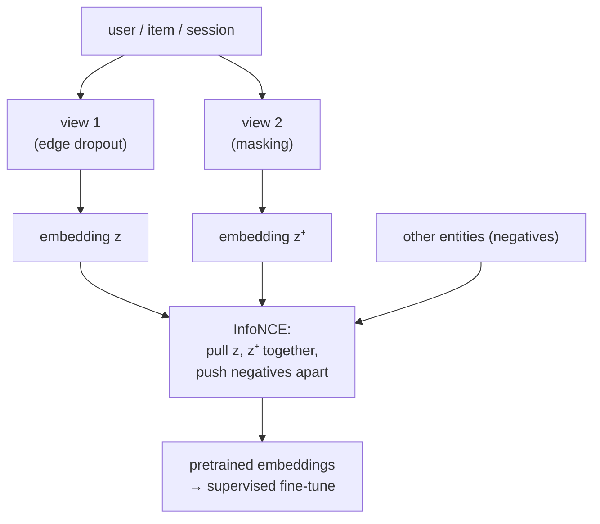

Recommendation data is sparse: most users interact with a tiny fraction of items, so the
supervised signal (the actual clicks) is thin, and the long tail of items barely appears.
Self-supervised contrastive learning attacks this by manufacturing a training signal from
the data's own structure, with no extra labels. The recipe from the broader SSL lesson,
pull two augmented views of the same thing together and push different things apart,
transfers directly to recommendation, where it pretrains embeddings that the sparse
supervised objective then refines<FN n="1" />.

## The contrastive recipe for recsys

Take a user's interaction set (or an item's, or a session). Create two **augmented
views** of it by random perturbation: drop a random subset of the interactions, mask some,
or sample two disjoint halves. The two views come from the same underlying entity, so they
should map to nearby embeddings; views from *different* entities should map apart. The
augmentations are the recsys-specific part: edge dropout on the user-item graph (drop
random interactions), node dropout, or feature masking each produce a valid alternate view
of the same user<FN n="2" />.

## The InfoNCE objective

The loss that enforces "same close, different apart" is **InfoNCE**. For an anchor
embedding $\mathbf{z}$ with its positive (the other view) $\mathbf{z}^+$ and a set of
negatives $\{\mathbf{z}^-_j\}$ (other entities in the batch), with a temperature $\tau$:

$$
\mathcal{L} = -\log \frac{\exp(\text{sim}(\mathbf{z}, \mathbf{z}^+)/\tau)}{\exp(\text{sim}(\mathbf{z}, \mathbf{z}^+)/\tau) + \sum_j \exp(\text{sim}(\mathbf{z}, \mathbf{z}^-_j)/\tau)},
$$

where $\text{sim}$ is cosine similarity. This is the in-batch softmax of the negative-
sampling lesson, now with the positive being an *augmented view of the anchor itself*
rather than a logged interaction. Minimizing it raises the anchor-positive similarity
relative to the anchor-negative similarities, so the loss is small exactly when the two
views of one entity are closer than that entity is to others.

## Why it helps the tail

The supervised objective learns little about a rarely-interacted item, because it appears
in few training pairs. The contrastive objective gives every item a dense signal: each
item generates its own positive pair from augmentation regardless of how often it was
interacted with, so tail items get a meaningful gradient. Contrastive pretraining followed
by supervised fine-tuning (the standard two-phase recipe) measurably improves long-tail and
cold-start performance, which is the payoff for sparse recommendation.



## Check it on arrays

```python
import numpy as np

def info_nce(anchor, positive, negatives, tau=0.2):
    def cos(a, b):
        return (a @ b) / (np.linalg.norm(a) * np.linalg.norm(b))
    pos = np.exp(cos(anchor, positive) / tau)
    negs = sum(np.exp(cos(anchor, n) / tau) for n in negatives)
    return -np.log(pos / (pos + negs))

rng = np.random.default_rng(0)
d = 16
anchor = rng.normal(size=d)
negatives = [rng.normal(size=d) for _ in range(8)]

# A GOOD positive is an augmented view close to the anchor; a BAD one is unrelated
good_positive = anchor + 0.1 * rng.normal(size=d)        # aligned view
bad_positive = rng.normal(size=d)                         # unrelated

loss_good = info_nce(anchor, good_positive, negatives)
loss_bad = info_nce(anchor, bad_positive, negatives)
print(f"InfoNCE loss, aligned positive  : {loss_good:.3f}")
print(f"InfoNCE loss, unrelated positive: {loss_bad:.3f}")
# The loss is small when the positive (augmented view) is close to the anchor
assert loss_good < loss_bad
```

The contrastive loss is low when the augmented view sits close to its anchor relative to
the negatives and high when it does not, so minimizing it across many augmented pairs is
what pulls each entity's views together and separates distinct entities, the structure
that pretrains useful embeddings without any labels.

## Exercises

**Exercise 1.** In InfoNCE, the anchor-positive cosine is $0.9$ and there are three
negatives with cosines $0.1, 0.2, 0.0$, at temperature $\tau = 1$. Compute the loss
$-\log\frac{e^{0.9}}{e^{0.9} + e^{0.1} + e^{0.2} + e^{0.0}}$.

<details>
<summary>Solution</summary>

**Step 1.** Numerator: $e^{0.9} \approx 2.460$.

**Step 2.** Denominator: $2.460 + e^{0.1} + e^{0.2} + e^{0.0} = 2.460 + 1.105 + 1.221 +
1.000 = 5.786$.

**Step 3.** Loss $= -\log(2.460 / 5.786) = -\log(0.425) \approx 0.855$. A higher
anchor-positive similarity relative to the negatives would shrink this loss toward zero.

</details>

**Exercise 2.** Explain why contrastive pretraining helps long-tail items more than the
supervised objective alone, in terms of how many training pairs each item participates in.

<details>
<summary>Solution</summary>

**Step 1.** The supervised objective trains on logged interactions, and a long-tail item
has very few, so it appears in few supervised pairs and receives little gradient.

**Step 2.** The contrastive objective generates a positive pair for *every* item by
augmenting its own representation, independent of interaction count, so even a one-
interaction item produces a full training signal.

**Step 3.** Tail items therefore get dense gradients from contrastive pretraining that
they never get from supervision alone, which is why the two-phase recipe improves
long-tail and cold-start quality.

</details>

**Exercise 3 (code).** Show that a better-aligned positive lowers the loss: hold the
negatives fixed and sweep the positive from nearly orthogonal to nearly identical to the
anchor, verifying the InfoNCE loss decreases as the anchor-positive similarity rises.

<details>
<summary>Solution</summary>

```python
import numpy as np

def info_nce(anchor, positive, negatives, tau=0.2):
    def cos(a, b): return (a @ b) / (np.linalg.norm(a) * np.linalg.norm(b))
    pos = np.exp(cos(anchor, positive) / tau)
    negs = sum(np.exp(cos(anchor, n) / tau) for n in negatives)
    return -np.log(pos / (pos + negs))

rng = np.random.default_rng(0)
d = 16
anchor = rng.normal(size=d); anchor /= np.linalg.norm(anchor)
ortho = rng.normal(size=d); ortho -= (ortho @ anchor) * anchor   # orthogonal direction
negatives = [rng.normal(size=d) for _ in range(8)]

# Blend the positive from orthogonal (alpha=0) toward the anchor (alpha=1)
losses = []
for alpha in [0.0, 0.3, 0.6, 0.9]:
    positive = alpha * anchor + (1 - alpha) * ortho
    losses.append(info_nce(anchor, positive, negatives))
print("loss vs positive alignment:", [round(l, 3) for l in losses])
assert all(losses[i] > losses[i + 1] for i in range(len(losses) - 1))
```

As the positive is pulled from orthogonal toward the anchor, its similarity rises and the
InfoNCE loss falls monotonically, which is the gradient signal that drives the two augmented
views of one entity together during training.

</details>

The next lesson reframes recommendation itself as a causal intervention, estimating the
effect of *showing* an item rather than the correlation of showing and clicking.

<Footnotes>
  <FNItem n="1">**Yao, T., Yi, X., Cheng, D. Z., et al.** (2021). "Self-supervised learning for large-scale item recommendations". *CIKM*. [arXiv:2007.12865](https://arxiv.org/abs/2007.12865). Contrastive SSL for two-tower item recommendation and long-tail gains.</FNItem>
  <FNItem n="2">**Wu, J., Wang, X., Feng, F., et al.** (2021). "Self-supervised graph learning for recommendation" (SGL). *SIGIR*. [arXiv:2010.10783](https://arxiv.org/abs/2010.10783). Graph augmentations (node/edge dropout) and InfoNCE for collaborative filtering.</FNItem>
</Footnotes>
