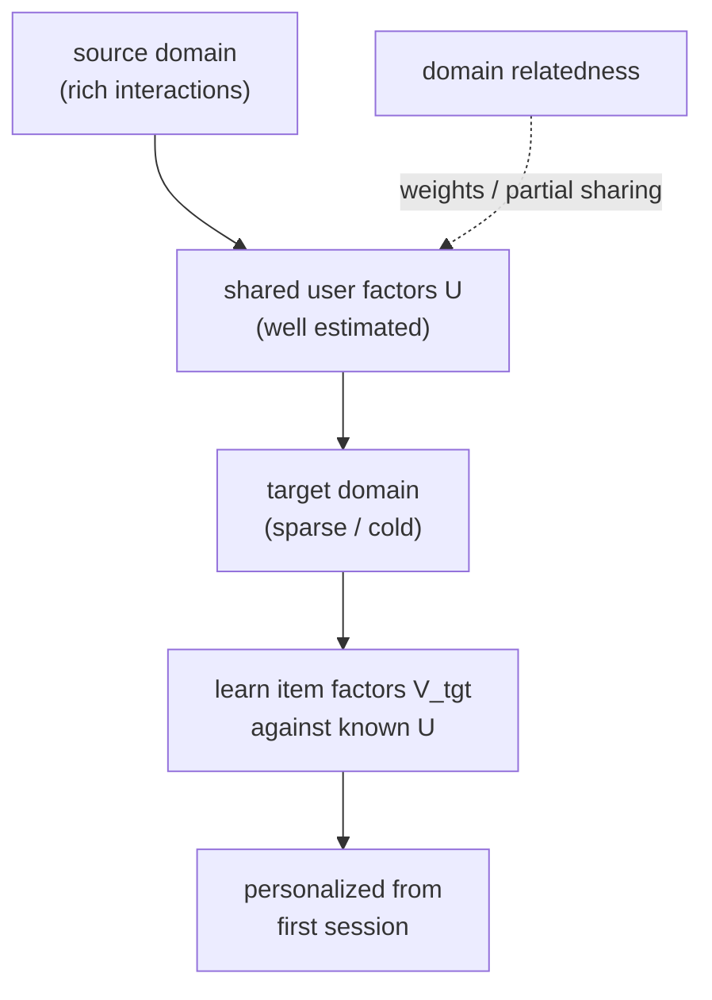

The hardest cold start is a whole new domain: a company launching a music service when it
only has data from its video service, or a marketplace entering a new country. There are no
interactions to learn from in the target domain, but there is rich data in a *source*
domain, and the same users (or the same kinds of items) appear in both. **Cross-domain
recommendation** transfers what was learned in the data-rich source to bootstrap the
data-poor target, turning an impossible cold start into a warm one. This closing lesson of
the pillar ties the embedding ideas of the whole track to the transfer that makes them
portable.

## What transfers: the shared factor

The transfer works when something is genuinely shared across domains. The most common bridge
is **shared users**: a user who exists in both the video and music domains has one underlying
taste, and the latent user factor learned from their abundant video interactions is a strong
prior for their music preferences. Formally, if the source ratings factor as
$R_{\text{src}} \approx U V_{\text{src}}^\top$ and the target as
$R_{\text{tgt}} \approx U V_{\text{tgt}}^\top$ with a **shared user matrix** $U$, then $U$
estimated from the rich source domain can be reused in the target, where only the item
factors $V_{\text{tgt}}$ must be learned from the target's sparse data. The user side, the
expensive part to estimate per person, comes for free from the source.

Other bridges exist when users are not shared: **shared items** (the same products sold on
two platforms), **shared features** (content embeddings that mean the same thing across
domains), or a learned **mapping** between the two domains' embedding spaces.

## Why it beats learning the target alone

In the target domain alone, a cold user has no interactions, so their user factor is
undefined and the recommender falls back to popularity. With transfer, that same user already
has a well-estimated factor from the source, so the recommender can personalize from the
first session in the new domain. The transfer converts the target's user cold-start into the
much easier problem of learning item factors against *known* user factors, which is a single
well-posed regression per item rather than a chicken-and-egg estimation of both sides from
nothing.

## Negative transfer

Transfer is not free of risk. When the domains are genuinely different (tastes that do not
carry over: a user's video habits may not predict their grocery preferences), forcing a
shared representation can *hurt* the target, **negative transfer**. The mitigations mirror
multi-task learning: share only the components that transfer (a partially-shared user factor
with a domain-specific part), weight the source's influence by how related the domains are,
or learn a mapping that adapts source embeddings to the target rather than reusing them raw.
The judgment of how much to share is the same accuracy trade seen throughout the pillar.



## Check it on arrays

```python
import numpy as np

rng = np.random.default_rng(0)
n_u, k = 200, 5
n_items_src, n_items_tgt = 100, 80

# One shared user taste U drives both domains; each domain has its own item factors.
U = rng.normal(size=(n_u, k))
V_src = rng.normal(size=(n_items_src, k))
V_tgt = rng.normal(size=(n_items_tgt, k))
R_src = U @ V_src.T + rng.normal(scale=0.1, size=(n_u, n_items_src))
R_tgt = U @ V_tgt.T                                   # target truth (for evaluation)

lam = 1.0
# 1. Estimate user factors from the RICH source domain (ridge per user)
U_hat = np.linalg.solve(V_src.T @ V_src + lam * np.eye(k), V_src.T @ R_src.T).T

# 2. In the target, observe only a few interactions per item; learn V_tgt against U_hat
obs = rng.random((n_u, n_items_tgt)) < 0.05
V_tgt_hat = np.zeros((n_items_tgt, k))
for j in range(n_items_tgt):
    users = np.where(obs[:, j])[0]
    if len(users) >= k:
        Uj, rj = U_hat[users], R_tgt[users, j]
        V_tgt_hat[j] = np.linalg.solve(Uj.T @ Uj + lam * np.eye(k), Uj.T @ rj)

pred_transfer = U_hat @ V_tgt_hat.T                  # transfer source user factors
pred_cold = rng.normal(size=(n_u, k)) @ V_tgt_hat.T  # no transfer: random user factors

def corr(P):
    return np.corrcoef(P.ravel(), R_tgt.ravel())[0, 1]

print(f"with transfer, target prediction corr: {corr(pred_transfer):.3f}")
print(f"no transfer (cold), target corr       : {corr(pred_cold):.3f}")
# Reusing source-learned user factors bootstraps the sparse target far above cold start
assert corr(pred_transfer) > corr(pred_cold) + 0.3
```

Reusing the user factors learned in the rich source domain lets the sparse target be
predicted accurately from the first interactions, while learning the target from scratch with
no transferred user knowledge tracks the truth no better than chance, the gap that makes
cross-domain transfer the answer to launching a cold platform.

## Exercises

**Exercise 1.** In the shared-factor model $R_{\text{src}} \approx U V_{\text{src}}^\top$ and
$R_{\text{tgt}} \approx U V_{\text{tgt}}^\top$, explain which matrix is transferred and why
that turns the target's cold start into a tractable problem.

<details>
<summary>Solution</summary>

**Step 1.** The shared user matrix $U$ is transferred: it is estimated from the rich source
domain and reused in the target.

**Step 2.** In the target, only the item factors $V_{\text{tgt}}$ remain unknown, and each
item's factor is a regression against the *known* user factors $U$.

**Step 3.** This avoids the chicken-and-egg problem of estimating both users and items from
nothing; with $U$ fixed, learning $V_{\text{tgt}}$ is a well-posed per-item ridge, so the
target personalizes immediately instead of falling back to popularity.

</details>

**Exercise 2.** Describe negative transfer and give a pair of domains where forcing a shared
user representation would likely cause it.

<details>
<summary>Solution</summary>

**Step 1.** Negative transfer is when reusing source knowledge *hurts* the target, because
the domains' underlying preferences do not carry over.

**Step 2.** Example: a user's horror-film taste in a video domain is forced onto a grocery
domain, where it has no bearing on which groceries they buy.

**Step 3.** The shared factor then injects irrelevant structure into the target, degrading
its predictions; the fix is to share only a partial user factor or to down-weight the
source's influence when the domains are weakly related.

</details>

**Exercise 3 (code).** Show transfer helps most when the target is sparsest: vary the target
observation rate and verify the transfer-versus-cold advantage shrinks as the target gains
its own data.

<details>
<summary>Solution</summary>

```python
import numpy as np

rng = np.random.default_rng(0)
n_u, k, n_src, n_tgt = 200, 5, 100, 80
U = rng.normal(size=(n_u, k))
V_src = rng.normal(size=(n_src, k)); V_tgt = rng.normal(size=(n_tgt, k))
R_src = U @ V_src.T + rng.normal(scale=0.1, size=(n_u, n_src))
R_tgt = U @ V_tgt.T
lam = 1.0
U_hat = np.linalg.solve(V_src.T @ V_src + lam*np.eye(k), V_src.T @ R_src.T).T

def corr_gap(rate):
    obs = rng.random((n_u, n_tgt)) < rate
    Vh = np.zeros((n_tgt, k))
    for j in range(n_tgt):
        u = np.where(obs[:, j])[0]
        if len(u) >= k:
            Vh[j] = np.linalg.solve(U_hat[u].T@U_hat[u]+lam*np.eye(k), U_hat[u].T@R_tgt[u, j])
    t = np.corrcoef((U_hat@Vh.T).ravel(), R_tgt.ravel())[0, 1]
    c = np.corrcoef((rng.normal(size=(n_u, k))@Vh.T).ravel(), R_tgt.ravel())[0, 1]
    return t - c

print(f"transfer advantage  sparse (5%): {corr_gap(0.05):.3f}")
print(f"transfer advantage  dense (60%): {corr_gap(0.60):.3f}")
assert corr_gap(0.05) > 0
```

When the target is sparse the transferred user factors carry the personalization the target
cannot yet learn, so the advantage is large; as the target accumulates its own data it could
estimate users directly, and the value of transferring from the source diminishes.

</details>

This completes the Recommender Systems pillar. From neighborhood collaborative filtering
through matrix factorization, deep retrieval, ranking, evaluation, debiasing, serving, and
the generative frontier, the same few ideas recur at every scale: represent users and items
as embeddings, separate cheap retrieval from rich ranking, measure honestly against the
feedback loop, and treat exposure as a resource to allocate. The frontier lessons here are
where the rest of the knowledge tree, contrastive learning, causal inference, transformers,
knowledge graphs, returns to reshape what a recommender can be.

<Footnotes>
  <FNItem n="1">**Zhu, F., Wang, Y., Chen, C., et al.** (2021). "Cross-domain recommendation: challenges, progress, and prospects". *IJCAI*. [arXiv:2103.01696](https://arxiv.org/abs/2103.01696). A survey of shared-factor and mapping-based cross-domain transfer.</FNItem>
  <FNItem n="2">**Pan, S. J., & Yang, Q.** (2010). "A survey on transfer learning". *IEEE TKDE*, 22(10), 1345-1359. [doi:10.1109/TKDE.2009.191](https://doi.org/10.1109/TKDE.2009.191). Transfer learning foundations and negative transfer.</FNItem>
</Footnotes>
