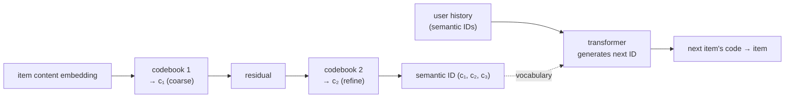

Every recommender so far retrieves: embed the query, search an index for nearby item
embeddings. Generative retrieval discards the index. A sequence model reads the user's
history and **generates the identifier of the next item directly**, token by token, the way
a language model generates words. For this to work the item identifier cannot be an
arbitrary integer; it must be a **semantic ID**, a short code whose structure reflects the
item's content, so that generating it is a meaningful prediction rather than memorizing a
lookup table. This lesson covers semantic IDs and the TIGER-style generative recommender
built on them<FN n="1" />.

## Why arbitrary item ids fail generative models

A random integer id carries no information: id $84{,}912$ and id $84{,}913$ are unrelated,
so a model asked to generate an id has nothing to generalize over and must memorize a huge,
unstructured vocabulary. The fix is to give items **structured codes** where nearby codes
mean similar items, so the model can generate a plausible code for a context it has not seen
exactly, the way it would for any structured output.

## Semantic IDs via residual quantization

A semantic ID is produced by **residual-quantizing** the item's content embedding into a
tuple of codewords<FN n="2" />. The procedure (RQ-VAE in practice) is hierarchical:

- **Level 1:** assign the embedding to its nearest centroid in a learned codebook; that
  centroid's index is the first codeword. It captures the coarse semantic category.
- **Level 2:** subtract the chosen centroid (the residual is what level 1 missed) and
  quantize the residual against a second codebook; that index is the second codeword. It
  refines within the category.
- Repeat for a few levels.

The result is a short tuple like $(c_1, c_2, c_3)$ where the first codeword groups items
into coarse semantic clusters and later codewords refine. Items with similar content share
a prefix, so the code space is organized by meaning, which is exactly what lets a sequence
model generate it.

## TIGER: generate the next item's code

With items represented as codeword tuples, recommendation becomes sequence generation. The
user's history is the sequence of their items' semantic IDs, and a transformer is trained
to autoregressively generate the codeword tuple of the next item, one codeword at a time,
like predicting the next tokens<FN n="1" />. At serving time the model generates a tuple and
maps it back to the item(s) with that code. The benefits are real: no separate ANN index to
maintain, natural generalization to new items (a new item gets a semantic ID from its
content and can be generated without ever appearing in training interactions), and the full
expressive power of a sequence model. The cost is generation latency and the risk of
generating a code no item holds, handled by mapping to the nearest valid code.



## Check it on arrays

```python
import numpy as np

rng = np.random.default_rng(0)
n_items, d = 400, 16
emb = rng.normal(size=(n_items, d))             # item content embeddings

def kmeans(X, k, iters=25):
    c = X[rng.choice(len(X), k, replace=False)].copy()
    for _ in range(iters):
        a = np.argmin(((X[:, None] - c[None]) ** 2).sum(-1), axis=1)
        for j in range(k):
            if (a == j).any():
                c[j] = X[a == j].mean(0)
    return c, np.argmin(((X[:, None] - c[None]) ** 2).sum(-1), axis=1)

# Residual quantization: level-1 codeword, then quantize the residual at level 2
c1, code1 = kmeans(emb, 8)
residual = emb - c1[code1]
c2, code2 = kmeans(residual, 8)
semantic_id = np.stack([code1, code2], axis=1)   # (n_items, 2) tuple per item

# Semantically similar items (near in embedding space) should share the first codeword
# more often than random pairs do.
def share_first(i, j):
    return semantic_id[i, 0] == semantic_id[j, 0]

# Near pairs: each item with its nearest neighbor
sims = emb @ emb.T
np.fill_diagonal(sims, -np.inf)
nn = sims.argmax(1)
near_share = np.mean([share_first(i, nn[i]) for i in range(n_items)])

rand_j = rng.integers(0, n_items, n_items)
rand_share = np.mean([share_first(i, rand_j[i]) for i in range(n_items)])

print(f"nearest-neighbor pairs sharing 1st codeword: {near_share:.3f}")
print(f"random pairs sharing 1st codeword          : {rand_share:.3f}")
assert near_share > rand_share
```

Items that are close in content space land in the same level-1 cluster far more often than
random pairs, so the first codeword encodes coarse semantics; this prefix structure is what
makes a generated code meaningful and lets the sequence model generalize over items.

## Exercises

**Exercise 1.** A semantic ID uses three levels with a codebook of size $256$ at each
level. How many distinct codes can it represent, and how does this compare to needing one
vocabulary token per item for a catalog of $10^7$ items?

<details>
<summary>Solution</summary>

**Step 1.** Three independent levels of $256$ give $256^3 = 16{,}777{,}216 \approx 1.7\times
10^7$ distinct codes.

**Step 2.** That exceeds the $10^7$ catalog, so the code space is large enough to assign
distinct (or near-distinct) codes to all items.

**Step 3.** Crucially, the model's *vocabulary* is only $3 \times 256 = 768$ tokens (the
codewords), versus $10^7$ tokens for one-token-per-item, so generation is over a tiny,
structured vocabulary instead of a giant flat one.

</details>

**Exercise 2.** Explain why a new item with no interaction history can still be recommended
by a TIGER-style generative model, whereas a model using arbitrary integer ids cannot.

<details>
<summary>Solution</summary>

**Step 1.** A new item's semantic ID is computed from its *content* embedding by the same
quantization, so it gets a meaningful code immediately, without any interactions.

**Step 2.** The generative model produces codewords, and it can generate the new item's code
because that code shares structure (a prefix) with codes it has seen, so the new item is
reachable through generalization.

**Step 3.** An arbitrary integer id carries no structure and would be an unseen vocabulary
token the model has no basis to generate, so content-free ids cannot be recommended until
they accumulate interactions, the cold-start a semantic ID sidesteps.

</details>

**Exercise 3 (code).** Show the refinement role of later codewords: among item pairs that
share the first codeword, verify that those also sharing the second codeword are closer in
embedding space on average than those differing in the second.

<details>
<summary>Solution</summary>

```python
import numpy as np

rng = np.random.default_rng(0)
n, d = 400, 16
emb = rng.normal(size=(n, d))
def kmeans(X, k, iters=25):
    c = X[rng.choice(len(X), k, replace=False)].copy()
    for _ in range(iters):
        a = np.argmin(((X[:, None] - c[None]) ** 2).sum(-1), axis=1)
        for j in range(k):
            if (a == j).any(): c[j] = X[a == j].mean(0)
    return c, np.argmin(((X[:, None] - c[None]) ** 2).sum(-1), axis=1)
c1, code1 = kmeans(emb, 8); resid = emb - c1[code1]; c2, code2 = kmeans(resid, 8)

same2, diff2 = [], []
for i in range(n):
    for j in range(i + 1, n):
        if code1[i] == code1[j]:                       # share first codeword
            dist = np.linalg.norm(emb[i] - emb[j])
            (same2 if code2[i] == code2[j] else diff2).append(dist)
print(f"mean dist, same 2nd codeword: {np.mean(same2):.2f}")
print(f"mean dist, diff 2nd codeword: {np.mean(diff2):.2f}")
assert np.mean(same2) < np.mean(diff2)
```

Within a first-codeword cluster, pairs that also share the second codeword are closer than
those that differ in it, confirming that later codewords refine the coarse grouping into
finer semantic neighborhoods.

</details>

The next lesson goes further still, using large language models themselves as the
recommender through their text understanding and in-context learning.

<Footnotes>
  <FNItem n="1">**Rajput, S., Mehta, N., Singh, A., et al.** (2023). "Recommender systems with generative retrieval" (TIGER). *NeurIPS*. [arXiv:2305.05065](https://arxiv.org/abs/2305.05065). Semantic IDs via RQ-VAE and autoregressive generation of the next item's code.</FNItem>
  <FNItem n="2">**Lee, D., Kim, C., Kim, S., Cho, M., & Han, W.-S.** (2022). "Autoregressive image generation using residual quantization" (RQ-VAE). *CVPR*. [arXiv:2203.01941](https://arxiv.org/abs/2203.01941). Residual quantization into hierarchical codeword tuples.</FNItem>
</Footnotes>
