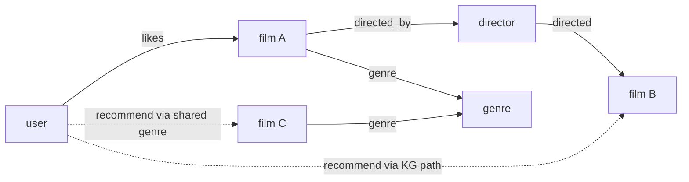

Interaction data is sparse, but items live inside a web of facts that is not: a film has a
director, a genre, actors, a studio; a product has a brand, a category, materials. A
**knowledge graph** encodes these facts as typed relations between entities, and connecting
the recommendation graph to it gives the model side information that fills the gaps the
interaction data leaves. A user who liked one film by a director can be recommended another
through the "directed by" relation even with no collaborative signal linking them. This
lesson covers how knowledge-graph embeddings encode those relations and how they enrich
recommendation<FN n="1" />.

## The knowledge graph and its triples

A knowledge graph is a set of **triples** $(h, r, t)$: a head entity $h$, a relation $r$, and
a tail entity $t$, read as "$h$ has relation $r$ to $t$". For recommendation the graph merges
two kinds of facts: interaction facts ($\text{user} \xrightarrow{\text{likes}} \text{item}$)
and knowledge facts ($\text{item} \xrightarrow{\text{directed\_by}} \text{person}$,
$\text{item} \xrightarrow{\text{genre}} \text{category}$). The interaction edges are sparse;
the knowledge edges are dense and shared across items, so paths through the knowledge graph
connect items that no interaction connects.

## TransE: relations as translations

The simplest knowledge-graph embedding, **TransE**, represents each entity and relation as a
vector and models a true triple as a *translation*: $h$ plus $r$ should land near
$t$<FN n="2" />. The scoring function is the negative distance,

$$
f(h, r, t) = -\lVert \mathbf{h} + \mathbf{r} - \mathbf{t}\rVert,
$$

so a true triple has $\mathbf{h} + \mathbf{r} \approx \mathbf{t}$ (high score, small
distance) and a false one does not. Training pushes true triples to satisfy the translation
and corrupted triples (true triple with a random head or tail) to violate it, via a margin
loss. The geometry is intuitive: the "directed_by" relation is one fixed vector that, added
to any film's embedding, points to its director, so relations become consistent directions
in entity space.

## How the graph enriches recommendation

With entities and relations embedded, knowledge-graph structure feeds recommendation in two
common ways. **Embedding enrichment** concatenates or fuses an item's KG embedding (which
encodes its director, genre, brand) into its recommendation embedding, so two items sharing a
director sit closer even without shared interactions, directly attacking sparsity and cold
start (a new item has no interactions but does have KG facts). **Path-based reasoning** uses
multi-hop paths through the graph (user likes film, film directed_by person, person directed
other_film) as explainable recommendation signals, which also gives a natural explanation
("because you liked another film by this director").



## Check it on arrays

```python
import numpy as np

rng = np.random.default_rng(0)
d = 8

# Build a tiny knowledge graph with TransE geometry: h + r ~ t for true triples.
n_entities = 30
ent = rng.normal(size=(n_entities, d))
rel_directed_by = rng.normal(size=d)             # the "directed_by" relation vector

# Make true triples hold: for each film, set its director so that film + r = director.
films = np.arange(0, 10)
directors = np.arange(10, 20)
for f, dr in zip(films, directors):
    ent[dr] = ent[f] + rel_directed_by           # film + relation = director (exact)

def score(h, r, t):
    return -np.linalg.norm(ent[h] + r - ent[t])  # TransE score (higher = better)

# For film 0, rank all candidate tails for "directed_by": the true director should win.
true_director = directors[0]
scores = np.array([score(films[0], rel_directed_by, t) for t in range(n_entities)])
predicted = scores.argmax()
print(f"true director entity: {true_director}   predicted tail: {predicted}")
assert predicted == true_director

# A film sharing a director with film 0 is reachable via the relation even with no
# direct interaction edge between the two films.
ent[directors[0]] = ent[films[0]] + rel_directed_by   # keep exact
film_b = 25
ent[film_b] = ent[directors[0]] - rel_directed_by     # film_b also directed_by director 0
# film_b + r should land on the same director as film 0 + r
assert np.allclose(ent[film_b] + rel_directed_by, ent[directors[0]])
print("film_b shares a director with film 0 via the KG relation")
```

The translation geometry makes "directed_by" a fixed direction, so adding it to a film's
embedding lands on its director, the true tail wins the ranking, and two films sharing that
director are linked through the relation even with no interaction edge between them, the
side information that fills sparse interaction data.

## Exercises

**Exercise 1.** In TransE, the "genre" relation vector is $\mathbf{r}$, a film embeds at
$\mathbf{h} = (1, 0)$, and its true genre embeds at $\mathbf{t} = (1, 1)$. What relation
vector $\mathbf{r}$ makes the triple exact, and where does a second film at $(3, 2)$ predict
its genre to be?

<details>
<summary>Solution</summary>

**Step 1.** Exact TransE requires $\mathbf{h} + \mathbf{r} = \mathbf{t}$, so
$\mathbf{r} = \mathbf{t} - \mathbf{h} = (1, 1) - (1, 0) = (0, 1)$.

**Step 2.** For the second film at $(3, 2)$, the predicted genre is
$\mathbf{h} + \mathbf{r} = (3, 2) + (0, 1) = (3, 3)$.

**Step 3.** The genre relation is the fixed direction $(0, 1)$, and applying it to any film
points to that film's genre embedding; the second film's genre is predicted at $(3, 3)$.

</details>

**Exercise 2.** Explain how a knowledge graph lets a recommender connect two items that no
user has co-interacted with, and why this helps cold start specifically.

<details>
<summary>Solution</summary>

**Step 1.** The two items may share a knowledge fact (same director, same brand), which is a
path through the graph even if no user interacted with both.

**Step 2.** Embedding that shared structure places the two items near each other regardless
of interactions, so liking one provides signal for the other.

**Step 3.** A cold item has no interactions but does have knowledge facts, so its KG
embedding positions it correctly from those facts alone, giving the recommender a basis to
surface it before any interaction data exists.

</details>

**Exercise 3 (code).** Build a small TransE knowledge graph with a "genre" relation, and
verify that ranking candidate genres for a film by the TransE score puts the true genre
first.

<details>
<summary>Solution</summary>

```python
import numpy as np

rng = np.random.default_rng(1)
d = 8
n = 25
ent = rng.normal(size=(n, d))
rel_genre = rng.normal(size=d)

films = np.arange(0, 8)
genres = np.arange(20, 25)
true_genre = {f: genres[f % len(genres)] for f in films}
for f in films:
    ent[true_genre[f]] = ent[f] + rel_genre        # enforce h + r = t

def score(h, t):
    return -np.linalg.norm(ent[h] + rel_genre - ent[t])

f = films[3]
ranking = sorted(range(n), key=lambda t: -score(f, t))
assert ranking[0] == true_genre[f]
print(f"film {f}: top-ranked genre {ranking[0]} == true genre {true_genre[f]}")
```

The TransE score ranks the true genre first because adding the genre relation to the film's
embedding lands exactly on it, demonstrating how relation-as-translation turns knowledge
facts into a usable recommendation signal.

</details>

The final lesson of the pillar closes the loop on cold start at the largest scale:
transferring learned representations across domains to bootstrap an entirely new platform.

<Footnotes>
  <FNItem n="1">**Wang, H., Zhang, F., Wang, J., et al.** (2018). "RippleNet: propagating user preferences on the knowledge graph for recommender systems". *CIKM*. [arXiv:1803.03467](https://arxiv.org/abs/1803.03467). Knowledge-graph-enhanced recommendation via preference propagation.</FNItem>
  <FNItem n="2">**Bordes, A., Usunier, N., Garcia-Durán, A., Weston, J., & Yakhnenko, O.** (2013). "Translating embeddings for modeling multi-relational data" (TransE). *NeurIPS*. [https://papers.nips.cc/paper/2013/hash/1cecc7a77928ca8133fa24680a88d2f9-Abstract.html](https://papers.nips.cc/paper/2013/hash/1cecc7a77928ca8133fa24680a88d2f9-Abstract.html). The translation-based knowledge-graph embedding.</FNItem>
</Footnotes>
