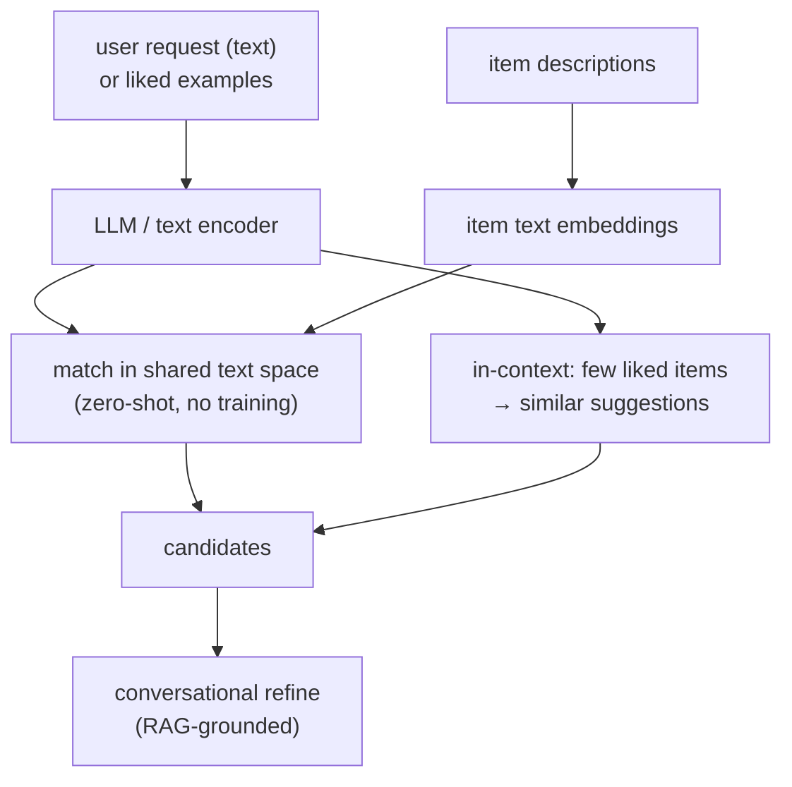

Large language models bring two things recommendation never had: a vast prior over how the
world's items relate, learned from text, and the ability to take a natural-language request
and reason about it. This lets an LLM recommend with no interaction history at all
(**zero-shot**), adapt from a few examples in the prompt (**few-shot**), and hold a
**conversation** that refines what the user wants. It does not replace the trained
recommenders of the rest of this pillar so much as add a complementary mode that excels
exactly where they are weakest: cold start, long-tail items, and expressing intent in words.

## Zero-shot recommendation from text

An LLM (or its embedding model) has read descriptions of essentially every kind of item, so
it can judge relevance without a single logged interaction. The simplest form embeds the
user's expressed interest and each item's text description into the same space and ranks by
similarity, a two-tower retrieval where the towers are a pretrained text encoder and no
training data is needed<FN n="1" />. Because the embedding space encodes world knowledge,
a brand-new item with only a text description is scored correctly, which is the cold-start
problem dissolved: the item is never cold to a model that has read about its kind.

## Few-shot and in-context learning

Given a handful of a user's liked items in the prompt, an LLM can recommend more in the same
vein without any fine-tuning, the in-context learning of pillar E applied to taste. The
prompt states the task ("the user liked these, suggest similar ones"), lists the examples,
and the model completes with recommendations. This adapts per user with zero training cost,
trading the precision of a model fit on millions of interactions for flexibility and
instant personalization from a few signals.

## Conversational recommendation

The mode LLMs uniquely enable is dialogue. A user says "something like the last one but
lighter", and the model updates its understanding and re-recommends, carrying context across
turns. Conversational recommendation handles preferences that are awkward to express through
clicks (constraints, comparisons, moods) and lets the user steer, which a one-shot ranked
list cannot. The system typically pairs the LLM with retrieval (RAG): the LLM interprets the
request and a retriever fetches candidate items, grounding the recommendation in the actual
catalog rather than the model's parametric memory, which prevents recommending items that do
not exist.

## The hybrid reality

LLM recommenders are strong on cold start, long tail, and intent expression, and weak on
exactly what trained recommenders are strong on: precise personalization from massive
behavioral data, and serving latency (an LLM forward pass is far slower than a dot product).
The production pattern is therefore hybrid: use the LLM for understanding, cold-start, and
conversation, and the trained funnel for the high-traffic, latency-critical, behavior-rich
path. The LLM's role is the substrate the next generation of recommenders is built on, not a
wholesale replacement.



## The retrieval-grounded prompt

```python-static
# Conversational, RAG-grounded recommendation with an LLM (pseudocode shape).
def recommend(user_request, history, catalog_retriever, llm):
    # 1. Retrieve real candidate items so the LLM cannot invent nonexistent ones
    candidates = catalog_retriever.search(user_request, k=50)
    # 2. Ground the LLM in the retrieved catalog items
    prompt = f"""The user said: "{user_request}".
Their recent likes: {history}.
Choose and rank the best matches from these real items:
{[c.title + ': ' + c.description for c in candidates]}
Return item ids in order, with a one-line reason each."""
    return llm.complete(prompt)        # output constrained to the retrieved ids
```

The retriever supplies real items and the LLM does the understanding and ranking, so the
recommendation is both grounded in the catalog and informed by the model's world knowledge
and the conversation.

## Check it on arrays

```python
import numpy as np

# Simulated text embeddings: each item lives near one of three "topic" directions,
# and a user's natural-language intent embeds near the topic they want. No training.
rng = np.random.default_rng(0)
d = 32
topics = rng.normal(size=(3, d))
topics /= np.linalg.norm(topics, axis=1, keepdims=True)

n_items = 60
item_topic = rng.integers(0, 3, n_items)
item_emb = topics[item_topic] + 0.25 * rng.normal(size=(n_items, d))
item_emb /= np.linalg.norm(item_emb, axis=1, keepdims=True)

# User expresses intent for topic 2 in words; the text encoder embeds it near topic 2
intent = topics[2] + 0.25 * rng.normal(size=d)
intent /= np.linalg.norm(intent)

scores = item_emb @ intent                       # cosine, no training
top = np.argsort(-scores)[:10]
frac_topic2 = (item_topic[top] == 2).mean()
print(f"fraction of zero-shot top-10 matching the requested topic: {frac_topic2:.2f}")
# Zero-shot text matching surfaces the right topic without any interaction data
assert frac_topic2 > 0.7
```

With no interaction history and no training, embedding the user's worded intent and the item
descriptions into a shared space and ranking by similarity surfaces the requested topic,
which is the zero-shot capability LLMs add for cold-start and intent-driven recommendation.

## Exercises

**Exercise 1.** A streaming service adds a documentary about a niche topic with zero views.
Explain why an LLM-based recommender can surface it to interested users immediately, while a
collaborative-filtering model cannot.

<details>
<summary>Solution</summary>

**Step 1.** Collaborative filtering relies on interaction patterns, and the new documentary
has none, so it has no learned embedding and no neighbors, the item cold-start.

**Step 2.** An LLM has read about the documentary's topic from text, so embedding its
description places it correctly in semantic space without any views.

**Step 3.** A user expressing interest in that topic (in words or via similar items) matches
the documentary's text embedding, so the LLM recommends it on day one, dissolving the
cold-start the collaborative model cannot handle.

</details>

**Exercise 2.** Why is retrieval (RAG) typically paired with an LLM recommender rather than
letting the LLM generate recommendations from its parametric memory alone?

<details>
<summary>Solution</summary>

**Step 1.** An LLM generating item names from memory can hallucinate items that do not exist
in the catalog, or recommend items the service does not carry.

**Step 2.** A retriever fetches real catalog items matching the request, so the LLM chooses
and ranks among items that are guaranteed to exist and be available.

**Step 3.** Grounding the LLM in retrieved items combines its understanding with the
catalog's ground truth, preventing nonexistent recommendations while keeping the LLM's
reasoning, the standard RAG pattern applied to recommendation.

</details>

**Exercise 3 (code).** Show few-shot adaptation: build a user profile by averaging the
embeddings of a few liked items (the in-context examples) and verify it ranks held-out items
of the same topic above items of other topics, with no training.

<details>
<summary>Solution</summary>

```python
import numpy as np

rng = np.random.default_rng(0)
d = 32
topics = rng.normal(size=(3, d)); topics /= np.linalg.norm(topics, axis=1, keepdims=True)
n = 90
item_topic = rng.integers(0, 3, n)
emb = topics[item_topic] + 0.25 * rng.normal(size=(n, d))
emb /= np.linalg.norm(emb, axis=1, keepdims=True)

liked = np.where(item_topic == 1)[0][:3]          # 3 in-context liked examples (topic 1)
profile = emb[liked].mean(0); profile /= np.linalg.norm(profile)

held = np.setdiff1d(np.arange(n), liked)
scores = emb[held] @ profile
top = held[np.argsort(-scores)[:10]]
assert (item_topic[top] == 1).mean() > 0.7
print(f"few-shot top-10 matching liked topic: {(item_topic[top] == 1).mean():.2f}")
```

Averaging a few liked items' embeddings forms a profile that ranks same-topic items highest
with no training step, the in-context adaptation an LLM performs from examples in the prompt.

</details>

The next lesson brings in another structured knowledge source, the knowledge graph, to
enrich recommendations where interaction data is thin.

<Footnotes>
  <FNItem n="1">**Hou, Y., Zhang, J., Lin, Z., et al.** (2024). "Large language models are zero-shot rankers for recommender systems". *ECIR*. [arXiv:2305.08845](https://arxiv.org/abs/2305.08845). Zero-shot and in-context LLM recommendation.</FNItem>
  <FNItem n="2">**Friedman, L., Ahuja, S., Allen, D., et al.** (2023). "Leveraging large language models in conversational recommender systems". *arXiv*. [arXiv:2305.07961](https://arxiv.org/abs/2305.07961). Retrieval-grounded conversational recommendation with LLMs.</FNItem>
</Footnotes>
